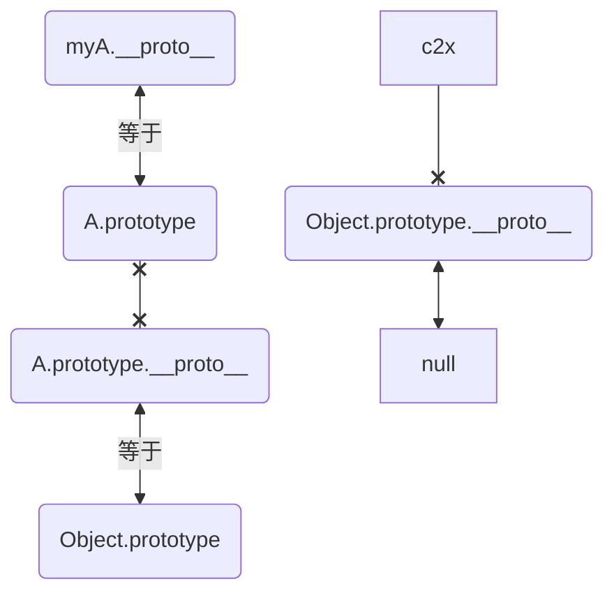
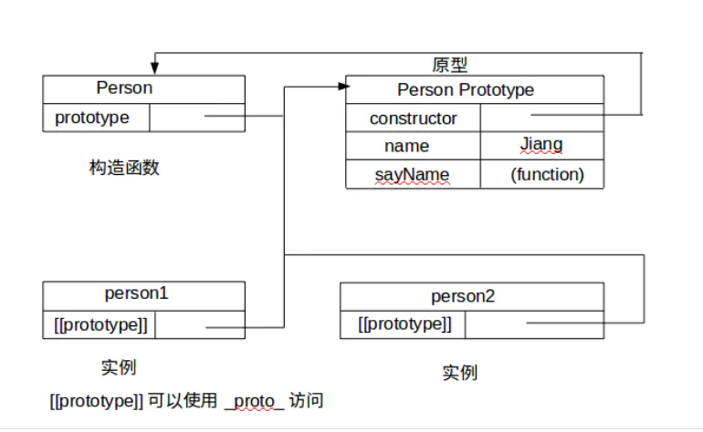
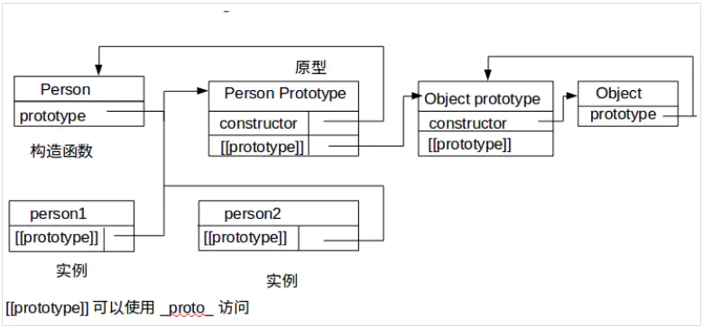

# 原型
* Object,Function都属于构造函数；
所有的构造函数是Function的实例，也就是说Function.prototype是所有构造函数的原型

* Object是Function的实例对象,Object是Function的实例对象，即:
```javaScript
Object.__proto__.constructor;
//结果：ƒ Function() { [native code] }
```

* Function.prototype是Object的实例对象:
```javaScript
Function.prototype.__proto__.constructor;
//结果：ƒ Object() { [native code] }
```
原型链的终点


不理解看这个例子：
```javaScript
function A() {}
A.prototype.aPrototype='test';

var myA = new A()
// A.prototype就是原型对象。原型对象也是对象，所以它也有proto属性，连接它的原型，
console.log("0-1.myA.aPrototype:", myA.aPrototype); // test,它去proto 找到了 aPrototype
console.log("0-2.aPrototype:", A.aPrototype); // undefined
console.log("0-3.prototype.aPrototype:", A.prototype.aPrototype); // test
console.log('1:',myA.prototype) // undefined
console.log('2:',A.prototype) // {aPrototype: 'test', constructor: ƒ}
console.log('3:',myA)
/*
A:{
    [[Prototype]]: {
                    aPrototype: "test",
                    constructor: ƒ A(),
                    [[Prototype]]: Object
                  }
  }
*/
// {}:A的原型的构造函数指向自己
console.log("a-1.prototype.constructor", A.prototype.constructor); // ƒ A()
console.log("a-2.是否等", A.prototype.constructor === A); // true

//步骤1：探究A.constructor 和 A.__proto__

console.log("3-A.constructor:", A.constructor); // ƒ Function() { [native code] } --->A 的构造函数是 Function

console.log("4-A.constructor.prototype:", A.constructor.prototype); // ƒ () { [native code] }

// 指向构造A的构造函数Function的原型对象，也就是指向Function.prototype
console.log("5-.__proto__:", A.__proto__); //ƒ () { [native code] }
console.log("6.是否等", A.__proto__ === A.constructor.prototype); // true //所以二者相等

//步骤2：探究 A.prototype 和 A.prototype.constructor
console.log("7.是否等", A.prototype === A.__proto__); // false 肯定不等，两个不是一个东西

console.log("2-1-myA.__proto__:", myA.__proto__);
console.log('2-2-是否:',myA.__proto__=== A.prototype) // true
console.log("8-1",A.prototype.__proto__)
console.log("Object", Object); // Object ƒ Object() { [native code] }
console.log("8-2",A.prototype.__proto__===Object.prototype) // true Object是一个构造函数
console.log("8-3",Object.prototype.__proto__) // null
```

## new做了什么?
```javaScript
function Test() { }
const objTest = new Test();
```
1. 创建一个空对象，然后设置新对象的constructor属性为构造函数的名称
2. 设置新对象的**proto**属性指向构造函数的prototype对象。
```javaScript
var objTest = {};  // 01.创建一个空对象
objTest.constructor = Test
objTest.__proto__ = Test.prototype
```

3. 使用新对象调用函数，函数中的this被指向新实例对象
Test.call(objTest)

4. 将初始化完毕的新对象地址，保存到等号左边的变量中
创建一个新的空的对象
把这个对象链接到原型对象上
这个对象被绑定为this
如果这个函数不返回任何东西，那么就会默认return this

总结：
1. 创建一个空对象，并且 this 变量引用该对象，同时还继承了该函数的原型。
2. 属性和方法被加入到 this 引用的对象中。
3. 新创建的对象由 this 所引用，并且最后隐式的返回this。

## 原型链
proto是任何对象都有的属性，proto会形成链条，当js引擎查找对象的属性时候，先查看对象本身是否有该属性，不存在就往原型链往上查找。


proto 和 prototype 的区别:
* proto 是一个对象的内置属性,指向的是当前对象的原型对象（请注意：prototype 是函数的内置属性，proto 是对象的内置属性）。

在大多数情况，proto 可以理解为 构造器的原型：
```javaScript
__proto__ === constructor.prototype
```

* prototype 每个函数都有一个 prototype (原型)属性，这个属性是一个指针，指向一个对象， 而这个对象的用途是包含可以由特定类型的所有实例共享的属性和方法，称为原型对象。
```
myA.__proto__ === A.prototype

prototype是“类”的原型，__proto__是对象的原型。
JS当然没有“类”，只有constructor。constructor就是当你new fn()时的那个“fn”。
当new的时候，产生的实例的__proto__指向fn.prototype，两者是同一个东西。

当试图访问一个对象的属性时，如果没有在该对象上找到，它还会搜寻该对象的原型(_proto_,即上面的[[Prototype]]:)， 以及该对象的原型的原型，依次层层向上搜索，直到找到一个名字匹配的属性或到达原型链的末尾。 ES5 的继承时通过 prototype 或构造函数机制来实现。
```

所有的 JS 函数都有一个 prototype 属性指向它的原型对象,里面包含很多值典型有:
```javaScript
- constructor: ƒ ()
- [[Prototype]]: Object 两个属性
```

参考：题目 2-3.原型链的终点 
或则：题1_1_prototype能否取到值.js 你就明白了
 


### 例子1
<font color="red" size=2>说明：函数的 prototype 属性指向了一个对象，这个对象正是调用该构造函数而创建的实例的原型,也就是这个例子中的 person1 和 person2 的原型。</font>

```javaScript
function Person(){};

Person.prototype.name = 'name';

const person1 = new Person();
const person2 = new Person();

console.log('1:',person1.name) // 1: name
console.log('2:',person2.name) // 2: name
console.log('3:',person2.prototype) // 3: undefined
console.log('4:',person1 instanceof Person) // 4: true

console.log('5:',Person.prototype) // 5: {name: 'name', constructor: ƒ}
console.log('6:',person1.constructor) // 6: ƒ Person(){}
```

### 例子2：
```javaScript
console.log("分割线==========> start");

// 简略代码: myA实例的原型指向构造函数的原型
function FnA() { }

FnA.prototype.aPrototype = "test";

const myA = new FnA();
console.log("1_是否:", myA.__proto__ === FnA.prototype); //true

// -FnA.prototype.constructor (A的原型的构造函数)指向自己
// -FnA 的原型内容
console.log("2-FnA.prototype:", FnA.prototype); // constructor: ƒ, 包括构造函数:而且构造函数是指向它自己,也就是ƒ FnA() {}
console.log("3-FnA.prototype.constructor", FnA.prototype.constructor); // ƒ FnA() {}:FnA的原型的构造函数是指向它自己,所以是点不完的

//-A的原型的原型指向 Object
console.log("4-FnA.prototype.__proto__:", FnA.prototype.__proto__);  // 指向Object:{}
console.log("5-是否等", FnA.prototype.__proto__ === Object.prototype);  // true

// -最终指向null
console.log(
  "6-FnA.prototype.__proto__.__proto__:",
  FnA.prototype.__proto__.__proto__
); // null，所以它就是前面所提到的尽头

console.log("分割线==========> end");
```

总结：


## 创建对象的几种方式
### 3-2.创建对象方式2：字面量,效率比较高
{}是字面量，可以立即求值，而new Object()本质上是方法（只不过这个方法是内置的）调用，既然是方法调用，就涉及到在proto链中遍历该方法，当找到该方法后，又会生产方法调用必须的堆栈信息，方法调用结束后，还要释放该堆栈

### 3-2.Object.create()
Object.create()方法创建一个新对象，使用现有的对象来提供新创建的对象的proto
```javaScript
const person = {
  isHuman: false,
  printIntroduction: function () {
    console.log(`My name is ${this.name}. Am I human? ${this.isHuman}`);
  },
};
const me = Object.create(person);
me.name = "Matthew";
me.isHuman = true;
me.printIntroduction();
```
具体三个步骤就是：
1. 创建一个对象
2. 继承指定父对象
3. 为新对象扩展新属性
```javaScript
// 自己实现一个Object.create()：
Object.myCreate = function (obj, properties)  {
  var F = function ()  {}
  F.prototype = obj
  if (properties) {
     Object.defineProperties(F, properties)
  }
  return new F()
}
Object.myCreate({}, {a: {value: 1}}) //{a: 1}
```

# instancof: 处理对象(person1)和函数的关系
instanceof 是一个二元运算符，如：A instanceof B. 其中，A 必须是一个合法的 JavaScript 对象，B 必须是一个合法的 JavaScript 函数 (function). 判断过程如下：
```
函数 B 在对象 A 的原型链 (prototype chain) 中被发现，

instanceof 返回 true，否则返回 false.
```

注意：instanceof 运算时会递归查找 L 的原型链，即 L.**proto**.**proto**.**proto**.**proto**...直到找到了或者找到顶层为止。

```javaScript
// 1.构造器Function的构造器是它自身
console.log(Function instanceof Object) // true
console.log(Object instanceof Function) // true

// 2.构造器Object的构造器是Function（由此可知所有构造器的constructor都指向Function）
console.log(Object.constructor === Function) // true

// 3.构造器Function的__proto__是一个特殊的匿名函数function() {}
console.log(Function.__proto__);  // function() {}

// 4.这个特殊的匿名函数的__proto__指向Object的prototype原型。
console.log(Function.__proto__.__proto__ === Object.prototype) // true

// 5.Object的__proto__指向Function的prototype，也就是上面③中所述的特殊匿名函数
console.log(Object.__proto__ === Function.prototype) // true

console.log(Function.prototype === Function.__proto__) // true
```

# 原型题目
## 2.题目
### 2021.7.15 面试重点
构造函数的 proto 指向什么?
答：指向构造A的构造函数Function的原型对象，也就是指向Function.prototype


### 2-2.构造函数的 prototype 指向什么?
答：{aPrototype: 'test', constructor: ƒ}

### 2-3.构造出来的myA __proto__指向谁？
答：A.prototype

### 2-3.A的原型的构造函数指向谁？
答： A.prototype.constructor === A
