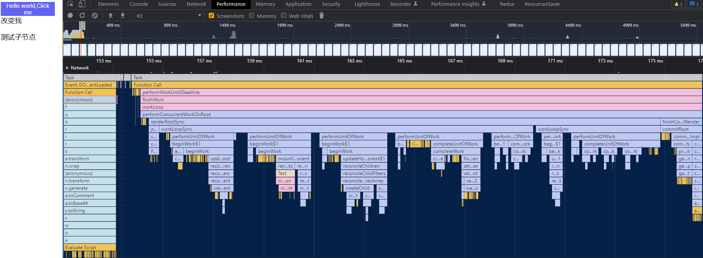
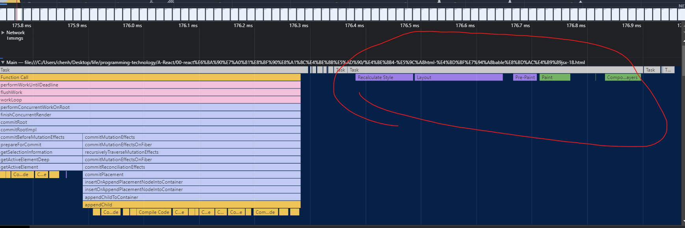
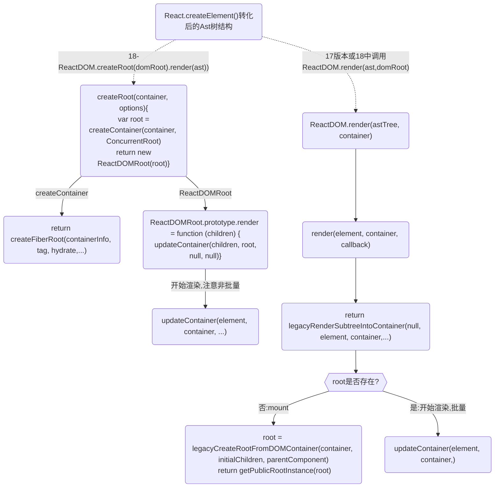
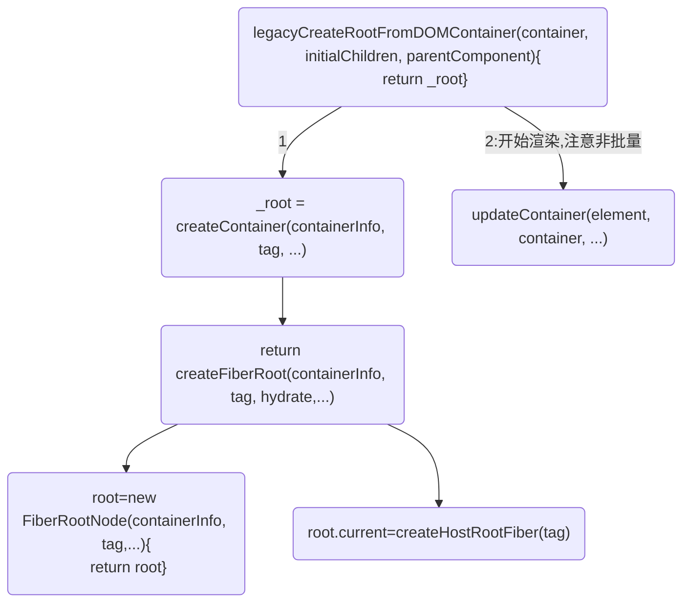
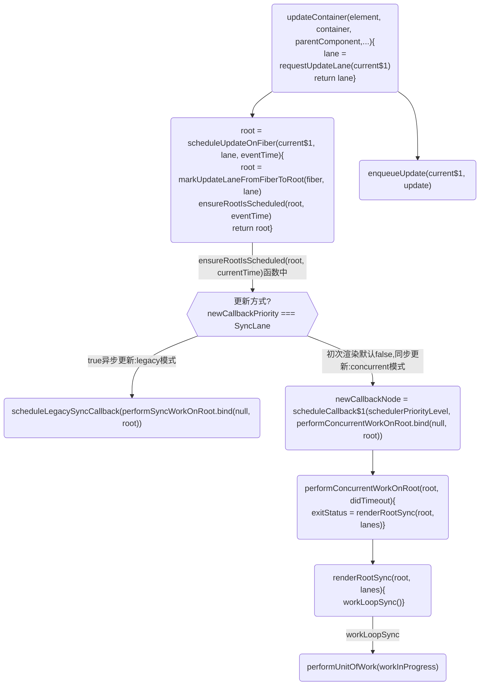
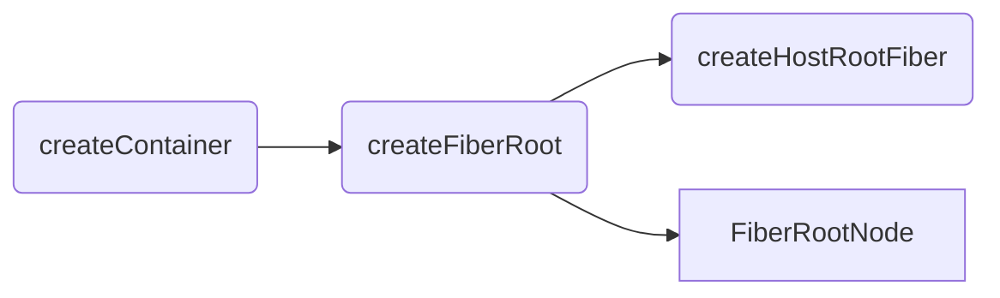
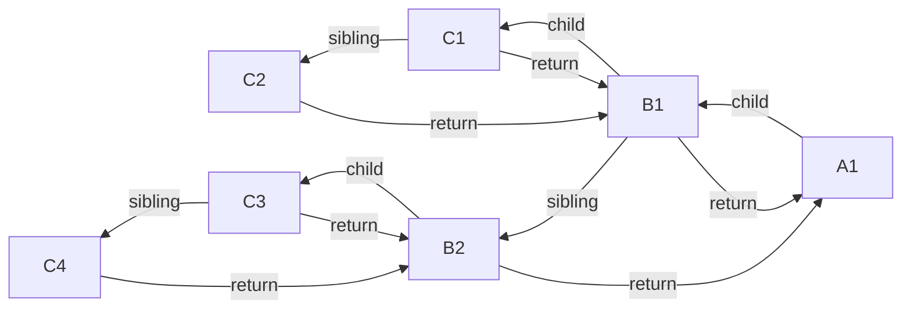
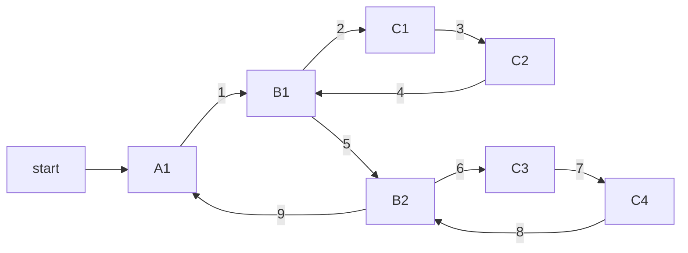
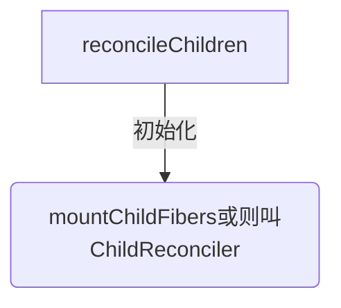

# 请你描述react的渲染
图例





# 流程图
## 程序入口


## 2.接上面的mount流程,注意 17或则在18中调用ReactDOM.render(ast,domRoot)的流程，如果在18中调用ReactDOM.createRoot(domRoot).render(Ast) 是不用走下面的流程的,18直接上面的流程图构建fiber和更新


## 3.重点：17/18版本 初始化/更新 渲染流程,接上面 updateContainer


# 基础
* react把每个fiber当成生成fiber最小单元,只要迭代所有fiber则到顶级Fiber时整颗FiberTree便生成了。
## workInProgress 内存中构建的树和双缓存
真实dom对应在内存中的Fiber节点形成Fiber树:current Fiber

workInProgress Fiber和current Fiber这两颗树的节点通过alternate相连.
```
performUnitOfWork 作用创建下一个 Fiber 节点，并赋值给 workInProgress，同时把 workInProgress 与已创建的 Fiber 节点连接起来构成 Fiber 树。

workInProgress fiber tree：内存中构建的树。
更新过程中构建的 new fiber tree

current fiber tree：正在视图层渲染的树。
old fiber tree，对应当前屏幕显示的内容，通过根节点 fiberRootNode 的 currrent 指针可以访问。
```

### 双缓存，以current tree为主，workInProgress tree为辅。
双缓冲机制是React管理更新工作的一种手段，也是提升用户体验的重要机制。

当React开始更新工作之后，会有两个fiber树，一个current树，是当前显示在页面上内容对应的fiber树。另一个是workInProgress树，它是依据current树深度优先遍历构建出来的新的fiber树，所有的更新最终都会体现在workInProgress树上。当更新未完成的时候，页面上始终展示current树对应的内容，当更新结束时（commit阶段的最后），页面内容对应的fiber树会由current树切换到workInProgress树，此时workInProgress树即成为新的current树。

最终commit阶段完成时，两棵树会进行切换。
在未更新完成时依旧展示旧内容，保持交互，当更新完成立即切换到新内容，这样可以做到新内容和旧内容无缝切换。

渲染流程中，先复用current树（rootFiber）的alternate 作为 workInProgress。
构建workInProgress Fiber发生在createWorkInProgress中，它能创建或者复用Fiber
```javaScript
  function createWorkInProgress(current, pendingProps) {
    var workInProgress = current.alternate;
    // 区分是在mount时还是在update时
    if (workInProgress === null) {
      // We use a double buffering pooling technique because we know that we'll
      // only ever need at most two versions of a tree. We pool the "other" unused
      // node that we're free to reuse. This is lazily created to avoid allocating
      // extra objects for things that are never updated. It also allow us to
      // reclaim the extra memory if needed.
      console.log('==createWorkInProgress-->,没有就创建一个')
      workInProgress = createFiber(current.tag, pendingProps, current.key, current.mode);
      workInProgress.elementType = current.elementType;
      workInProgress.type = current.type;
      workInProgress.stateNode = current.stateNode;

      {
        // DEV-only fields
        workInProgress._debugSource = current._debugSource;
        workInProgress._debugOwner = current._debugOwner;
        workInProgress._debugHookTypes = current._debugHookTypes;
      }
      console.log('==createWorkInProgress-->,workInProgress.alternate指定为current')
      workInProgress.alternate = current;
      current.alternate = workInProgress;
    } else {
      // 复用属性
      workInProgress.pendingProps = pendingProps; // Needed because Blocks store data on type.

      workInProgress.type = current.type; // We already have an alternate.
      // Reset the effect tag.

      workInProgress.flags = NoFlags; // The effects are no longer valid.

      workInProgress.subtreeFlags = NoFlags;
      workInProgress.deletions = null;

      {
        // We intentionally reset, rather than copy, actualDuration & actualStartTime.
        // This prevents time from endlessly accumulating in new commits.
        // This has the downside of resetting values for different priority renders,
        // But works for yielding (the common case) and should support resuming.
        workInProgress.actualDuration = 0;
        workInProgress.actualStartTime = -1;
      }
    } // Reset all effects except static ones.
    // Static effects are not specific to a render.


    workInProgress.flags = current.flags & StaticMask;
    // 复用属性
    workInProgress.childLanes = current.childLanes;
    workInProgress.lanes = current.lanes;
    workInProgress.child = current.child;
    workInProgress.memoizedProps = current.memoizedProps;
    workInProgress.memoizedState = current.memoizedState;
    workInProgress.updateQueue = current.updateQueue; // Clone the dependencies object. This is mutated during the render phase, so
    // it cannot be shared with the current fiber.

    var currentDependencies = current.dependencies;
    workInProgress.dependencies = currentDependencies === null ? null : {
      lanes: currentDependencies.lanes,
      firstContext: currentDependencies.firstContext
    }; // These will be overridden during the parent's reconciliation

    workInProgress.sibling = current.sibling;
    workInProgress.index = current.index;
    workInProgress.ref = current.ref;

    {
      workInProgress.selfBaseDuration = current.selfBaseDuration;
      workInProgress.treeBaseDuration = current.treeBaseDuration;
    }

    {
      workInProgress._debugNeedsRemount = current._debugNeedsRemount;

      switch (workInProgress.tag) {
        case IndeterminateComponent:
        case FunctionComponent:
        case SimpleMemoComponent:
          workInProgress.type = resolveFunctionForHotReloading(current.type);
          break;

        case ClassComponent:
          workInProgress.type = resolveClassForHotReloading(current.type);
          break;

        case ForwardRef:
          workInProgress.type = resolveForwardRefForHotReloading(current.type);
          break;
      }
    }

    return workInProgress;
  } // Used to reuse a Fiber for a second pass.
```

## 基础2：Diff
diff本质上是一些计算（遍历、比较），是可拆分的（算一半待会儿接着算） 

diff的过程，也就是effect的收集过程，此过程会找出所有节点的变更，如节点新增、删除、属性变更等，这些变更 react 统称为副作用（effect），随着所有的节点（工作单元）在帧空闲时间逐个执行完毕，最后产出的结果是effect list，从中可以知道哪些节点更新、哪些节点增加、哪些节点删除了。

diff 比较，就是在构建 workInProgress fiber tree 的过程中，判断 current fiber tree 中的 fiber node 是否可以被 workInProgress fiber tree 复用。

能被复用，意味在本次更新中，需要做: 组件的 update 以及 dom 节点的 move、update 等操作；

不可复用，则意味着需要做: 组件的 mount、unmount 以及 dom 节点的 insert、delete 等操作。

当更新完成以后，fiberRootNode 的 current 指针会指向 workInProgress fiber tree，作为下一次更新的 current fiber tree

最后，深度调和子节点，渲染视图
遍历fiber树，以workInProgress 作为最新的渲染树，即current Fiber 树。

# 一. 构建AST
## 流程1.  jsx语法糖的html结构是通过babel将结构解析转换为 ast 语法树结构
* react 18中：使用 babel将jsx代码转换为root.render()调用,此时就得到转化后的Ast树结构

* react17中 使用 babel将jsx代码转换为React.createElement()调用,此时就得到转化后的Ast树结构

## 转化测试:
https://www.babeljs.cn/repl

### 简单实例1:babel将jsx代码转换为React.createElement()调用
测试：https://www.babeljs.cn/repl
```jsx
// jsx
const element = <h1 style = {{"color": "red"}}>123
    <div>test</div>
</h1>

// babel 编译过后生成的代码
const element = /*#__PURE__*/React.createElement("h1", {
  style: {
    "color": "red"
  }
}, "123", /*#__PURE__*/React.createElement("div", null, "test"));
```

### 简单实例2:不使用bable
渲染代码：example-code\例-1-jsx-ast-r17.html
```html
<script>
const container = document.getElementById('root');
const element = React.createElement(
    'div',
    { className: 'red' },
    'Click Me'
)
console.log('createElement 转化后ast树的结构:', element)
ReactDOM.render(element, container)
/*
{
    $$typeof: Symbol(react.element)
    key: null
    props:
    children: "Click Me"
    className: "red"
    [[Prototype]]: Object
    ref: null
    type: "div"
    _owner: null
    _store: {validated: false}\
}
*/
</script>
```

### 简单实例3：使用bable
渲染代码：example-code\例4-在html-使用bable转义jsx.html
```html
<script type="text/babel">
  function Test() {
    return (
      <div className="red">Click Me</div>
    )
  }

  ReactDOM.render(<Test />, document.getElementById('root'))
</script>
```


## 流程2：入口：此时还不是fiber树,没有开启render阶段
```javaScript
<script type="text/babel">
  const root = ReactDOM.createRoot(document.getElementById('root'))
  root.render(<Test />);
</script>
```
```javaScript
function createRoot(container, options) {
  return new ReactDOMRoot(root);
}

ReactDOMHydrationRoot.prototype.render = ReactDOMRoot.prototype.render = function (children) {
    console.log('%c ==一切开始3:', 'color:red', 'ReactDOMRoot.prototype.render调用updateContainer()开启render阶段==', children);
    var root = this._internalRoot;
}
```

## 17版本的入口,和18不一样
这个是 17或则在18中调用ReactDOM.render(ast,domRoot)的流程，如果在18中调用ReactDOM.createRoot(domRoot).render(Ast) 是不用走下面的流程的,18直接流程图的流程构建fiber和更新


### legacyRenderSubtreeIntoContainer()
根据 container 是否存在 root 区分初始化/更新，创建或获取 fiberRoot;

Babel 会把 JSX 转译成一个名为 React.createElement() 函数调用,
因此legacyRenderSubtreeIntoContainer 中打印的children实际上是通过React.createElement()处理过的
```javaScript
// 从 container 取出 _reactRootContainer 作为 react 的一个根:
var maybeRoot = container._reactRootContainer;
```
检查 root 是否存在，如果存在就是 Update，如果不存在就是初始化。
```
A.若root不存在：
调用 legacyCreateRootFromDOMContainer(contaiber,forceHydrate) 初始化 root。
将 root 赋值给 container._reactRootContainer,取出 root 中的_internalRoot 作为 fiberRoot。

B.若 root 存在, 从 root 中取出 fiberRoot:
  root = maybeRoot;
调用 updateContainer(children,fiberRoot,parentComponent,callBack)
注意：这里 callBack 会通过 getPublicRootInstance() 递归找到 fiberRoot 上第一个非 HTMlElement 结点,并将 callback 绑定在它上边。
```

```javaScript
function render(element, container, callback) {
    return legacyRenderSubtreeIntoContainer(null, element, container, false, callback); 
}

/*
可以见到初始化阶段:legacyCreateRootFromDOMContainer 不批量调用 updateContainer

update阶段：直接调用 updateContainer
*/
function legacyRenderSubtreeIntoContainer(parentComponent, children, container, forceHydrate, callback) {
  if (!maybeRoot) {
    console.log('开始调用-->0-a0:初始化渲染')
    // Initial mount
    root = legacyCreateRootFromDOMContainer(container, children, parentComponent, callback, forceHydrate);
  } else {
    root = maybeRoot;

    if (typeof callback === 'function') {
      var originalCallback = callback;

      callback = function () {
        var instance = getPublicRootInstance(root);
        originalCallback.call(instance);
      };
    } // Update

    console.log('更新流程-->1-a1:即更新')
    updateContainer(children, root, parentComponent, callback);
  }

  return getPublicRootInstance(root);
}

// 第一次渲染
legacyCreateRootFromDOMContainer(){
      
  console.log('-->0-a,初始化渲染不执行批量更新,而是执行flushSync',)
  flushSync(function () {
    updateContainer(initialChildren, _root, parentComponent, callback);
  });
}
```


## 17版本：createFiberRoot 创建fiberRoot对象
最终创建了 fiberRoot 和 rootFiber：



# 二. 开启render
## 基础：两大阶段：render和commit
render阶段是在内存中构建一棵新的fiber树（称为workInProgress树）,构建过程是依照现有fiber树（current树）从root开始深度优先遍历再回溯到root的过程，`这个过程中每个fiber节点都会经历两个阶段：beginWork和completeWork。`


## render阶段：
* 1.beginWork阶段:将ast树转换为fiber 树。这些Fiber节点会被标记成带有‘Placement’的副作用，说明它们是新增的节点，需要被插入到真实节点中了
```
- 执行部分生命周期和render，得到最新的 children
- 向下遍历调和 children ，复用 oldFiber
- 打不同的副作用标签effectTag，比如类组件的生命周期，或者元素的增加，删除，更新。
```

* 2.completeWork阶段:生成实例
```
completeUnitOfWork 的流程是自下向上的

1.将effectTag 的 Fiber 节点保存到 effectList 的单向链表中。 在 commit 阶段，将不再需要遍历每一个 fiber ，只需要执行更新 effectList 就可以了。
2.处理组件的context，初始化元素标签，生成真实DOM，处理props，等
```

`render 阶段的工作可以分为递阶段和归阶段作用：`
* 其中递阶段会执行 beginWork()
* 归阶段会执行 completeWork()

正在构建Fiber树叫workInProgress Fiber，这两颗树的节点通过alternate相连.

真实dom对应在内存中的Fiber节点形成Fiber树，这颗Fiber树在react中叫current Fiber

组件的状态计算、diff的操作:通过 Diff 算法找出所有节点变更，例如节点新增、删除、属性变更等等, 获得需要更新的节点信息，以及render函数的执行，发生在beginWork阶段

effect链表的收集、被跳过的优先级的收集，发生在completeWork阶段。

render/reconciliation 协调阶段(可中断/异步)：

render 阶段：纯净且没有副作用，可能会被 React 暂停、终止或重新启动。

在 render 阶段，React 主要是在内存中做计算，明确 DOM 树的更新点；而 commit 阶段，则负责把 render 阶段生成的更新真正地执行掉。

在 render 阶段，一个庞大的更新任务被分解为了一个个的工作单元，这些工作单元有着不同的优先级，React 可以根据优先级的高低去实现工作单元的打断和恢复。

### render:任务调度
React fiber的构建的过程以每个fiber作为一个工作单元，进行工作循环，工作循环中每次处理一个任务（工作单元），处理完毕有一次喘息的机会：
```javaScript
while (nextUnitOfWork !== null && !shouldYieldToRenderer()) {
  nextUnitOfWork = performUnitOfWork(nextUnitOfWork);
}
```
shouldYieldToRenderer就是看时间用完了没，没用完的话继续处理下一个任务，用完了就结束，把时间控制权还给主线程，等下一次requestIdleCallback回调再接着做。但如果当前渲染执行很长一段时间后还未结束，那么就不再会喘息，而是一次性把剩余工作全部做完。
```javaScript
if (!isYieldy) {
  // Flush work without yielding
  while (nextUnitOfWork !== null) {
    nextUnitOfWork = performUnitOfWork(nextUnitOfWork);
  }
}
```
React Fiber的工作调度与浏览器的核心交互流程如下： 


## commit阶段:可以分为3个阶段：
在render阶段结束后，会进入commit阶段，该阶段不可中断,commit阶段的调度优先级采用的是最高优先级，以保证commit阶段同步执行不可被打断。

主要是去依据workInProgress树中有变化的那些节点（render阶段的completeWork过程收集到的effect链表）,去完成DOM操作，将更新应用到页面上，除此之外，还会异步调度useEffect以及同步执行useLayoutEffect。

相应的节点进行提交，渲染到页面上,在commit阶段就会操作真实节点，将它们插入到dom树中:
* 1.Before mutation 阶段（执行 DOM 操作前）；
    - 对于类组件，执行 getSnapshotBeforeUpdate 生命周期
    - 对于函数组件，异步调用 useEffect

* 2.mutation 阶段（执行 DOM 操作）；
    - 进行真实的 DOM 操作

* 3.layout 阶段（执行 DOM 操作后）
    - 对于类组件，会执行setState的callback
    - 对于函数组件，会执行useLayoutEffect

两个阶段区别：
render/reconciliation阶段的工作（diff）可以拆分，commit阶段的工作（patch）不可拆分
```
commit阶段的工作（patch）把本次更新中的所有DOM change应用到DOM树，是一连串的DOM操作。

DOM操作虽然看起来也可以拆分（按照change list一段一段做），但这样做一方面可能造成DOM实际状态与维护的内部状态不一致，另外还会影响体验。而且，一般场景下，DOM更新的耗时比起diff及生命周期函数耗时不算什么，拆分的意义不很大
```

`提示:接下来的流程开log会比较清晰`

<br />

## 2-1.render阶段开始: 第一次渲染中调用performConcurrentWorkOnRoot()
`调用 ReactDOMRoot.prototype.render() 开始render阶段`

18中初始化调用`performSyncWorkOnRoot()`或`performConcurrentWorkOnRoot()`的调用,这取决于本次更新是同步更新还是异步更新.

总结:
render 阶段开始于 performSyncWorkOnRoot 或 performConcurrentWorkOnRoot 方法的调用。前面有提到：这取决于本次更新是同步更新还是异步更新。
```javaScript
// performConcurrentWorkOnRoot 调用 renderRootSync -->workLoopSync
function performConcurrentWorkOnRoot(root, didTimeout) {
  var exitStatus = shouldTimeSlice ? renderRootConcurrent(root, lanes) : renderRootSync(root, lanes);
  return null;
}

// 第一次渲染走这个 renderRootSync --> renderRootSync -->workLoopSync
function renderRootSync(root, lanes) {
  do {
    try {
      console.log('renderRootSync--->', root);
      workLoopSync();
      break;
    } catch (thrownValue) {
      handleError(root, thrownValue);
    }
  } while (true);
}

function renderRootConcurrent(root, lanes) {
do {
  try {
    workLoopConcurrent();
    break;
  } catch (thrownValue) {
    handleError(root, thrownValue);
  }
} while (true);
}
```


## 2-2.渲染:workLoopSync()-->performUnitOfWork();workLoopConcurrent()和workLoopSync()区别

它们唯一的区别是是否调用shouldYield。如果当前浏览器帧没有剩余时间，shouldYield会中止循环，直到浏览器有空闲时间后再继续遍历。

workInProgress 代表当前已创建的 workInProgress fiber。
```javaScript
function workLoopConcurrent() {
  // Perform work until Scheduler asks us to yield
  while (workInProgress !== null && !shouldYield()) {
    performUnitOfWork(workInProgress);
  }
}

// 第一次渲染走这个
function workLoopSync() {
  // Already timed out, so perform work without checking if we need to yield.
  while (workInProgress !== null) {
    performUnitOfWork(workInProgress);
  }
}
```


<br />

# 三. render阶段1:beginWork

## 第一步:接上面:performUnitOfWork()-->beginWork()
`performUnitOfWork()`将触发对 beginWork 的调用，进而实现对新 Fiber 节点的创建。
若 beginWork 所创建的 Fiber 节点不为空，则 performUniOfWork 会用这个新的 Fiber 节点来更新 workInProgress 的值，为下一次循环做准备。

通过循环调用`performUnitOfWork()`来触发 beginWork，新的 Fiber 节点就会被不断地创建。当 workInProgress 终于为空时，说明没有新的节点可以创建了，也就意味着已经完成对整棵 Fiber 树的构建。
```
performUnitOfWork 作用创建下一个 Fiber 节点，并赋值给workInProgress，同时把 workInProgress 与已创建的 Fiber 节点连接起来构成 Fiber 树。
 ```

react把每个fiber当成生成fiber最小单元,只要迭代所有fiber则到顶级Fiber时整颗FiberTree便生成了。
```javascript
// performConcurrentWorkOnRoot会调用该方法
function workLoopConcurrent() {
  while (workInProgress !== null && !shouldYield()) {
    performUnitOfWork(workInProgress)
  }
}

// performSyncWorkOnRoot 会调用该方法,react 18 初始化调用这个
function workLoopSync() {
  while (workInProgress !== null) {
    performUnitOfWork(workInProgress)
  }
}
/*
它们唯一的区别是是否调用shouldYield。如果当前浏览器帧没有剩余时间，shouldYield会中止循环，直到浏览器有空闲时间后再继续遍历。

workInProgress代表当前已创建的 workInProgress fiber。
* */

function performUnitOfWork(unitOfWork) {
  workInProgressNums = workInProgressNums + 1
  // The current, flushed, state of this fiber is the alternate. Ideally
  // nothing should rely on this, but relying on it here means that we don't
  // need an additional field on the work in progress.
  var current = unitOfWork.alternate;
  setCurrentFiber(unitOfWork);
  var next;

  if ((unitOfWork.mode & ProfileMode) !== NoMode) {
    startProfilerTimer(unitOfWork);
    //对当前节点进行协调，如果存在子节点，则返回子节点的引用
    next = beginWork$1(current, unitOfWork, subtreeRenderLanes);
    stopProfilerTimerIfRunningAndRecordDelta(unitOfWork, true);
  } else {
    next = beginWork$1(current, unitOfWork, subtreeRenderLanes);
  }

  resetCurrentFiber();
  unitOfWork.memoizedProps = unitOfWork.pendingProps;

  //如果无子节点，则代表当前的child链表已经遍历完
  if (next === null) {
    // If this doesn't spawn new work, complete the current work.
    //此函数内部会帮我们找到下一个可执行的节点
    completeUnitOfWork(unitOfWork);
  } else {
    workInProgress = next;
  }

  ReactCurrentOwner$2.current = null;
}
```

## 第二步:探究beginWork()函数作用:传入当前 Fiber 节点，创建子 Fiber 节点
beginWork的主要功能就是处理当前遍历到的fiber，经过一番处理之后返回它的子fiber，一个一个地往外吐出fiber节点，那么workInProgress树也就会被一点一点地构建出来
> https://www.zhihu.com/column/c_1320765419813421056

首先从 rootFiber 开始向下深度优先遍历。为遍历到的每个 Fiber 节点调用beginWork方法。

* current：当前组件对应的 Fiber 节点在上一次更新时的 Fiber 节点，即 workInProgress.alternate；
* workInProgress：当前组件对应的 Fiber 节点；
* renderLanes：优先级相关，在讲解Scheduler时再讲解。

更新的时候它会以旧的fiber tree为蓝本，把每个fiber作为一个工作单元，自顶向下逐节点构造workInProgress tree（构建中的新fiber tree）, 深度优先遍历:
1. 从顶点开始遍历
2. 如果有子节点，先遍历子节点；
3. 如果没有子节点，则看有没有兄弟节点，有则遍历兄弟节点，并把effect向上归并
4. 如果没有兄弟节点，则看有没有父兄弟节点，有则遍历父兄弟节点
5. 如果没有都没有了，那么遍历结束


###  RootFiber结构遍历例子


遍历过程:



```javaScript
function beginWork(
  current: Fiber | null,
  workInProgress: Fiber,
  renderExpirationTime: ExpirationTime
): Fiber | null {
  // mount current !== null 为null,不走以下逻辑
  if (current !== null) {

  }

  switch (workInProgress.tag) {
    case IndeterminateComponent: 
      // ...省略
    case LazyComponent: 
      // ...省略
    case FunctionComponent: 
      // ...省略
    case ClassComponent: 
      // ...省略
    case HostRoot:
      // ...省略
    case HostComponent:
      // ...省略
    case HostText:
  }
}

/*
该方法会根据传入的 Fiber 节点创建子 Fiber 节点，并将这两个 Fiber 节点连接起来。
当遍历到叶子节点（即没有子组件的组件）时就会进入"归"阶段。
* */
```

那我们继续看看beginWork中是如何判断下一个工作单元的。
```javaScript
function performUnitOfWork(unitOfWork) {

  workInProgressNums = workInProgressNums + 1
  // The current, flushed, state of this fiber is the alternate. Ideally
  // nothing should rely on this, but relying on it here means that we don't
  // need an additional field on the work in progress.
  var current = unitOfWork.alternate;
  setCurrentFiber(unitOfWork);
  var next;

  if ((unitOfWork.mode & ProfileMode) !== NoMode) {
    startProfilerTimer(unitOfWork);
    //对当前节点进行协调，如果存在子节点，则返回子节点的引用
    next = beginWork$1(current, unitOfWork, subtreeRenderLanes);
    stopProfilerTimerIfRunningAndRecordDelta(unitOfWork, true);
  } else {
    next = beginWork$1(current, unitOfWork, subtreeRenderLanes);
  }

  resetCurrentFiber();
  unitOfWork.memoizedProps = unitOfWork.pendingProps;

  //如果无子节点，则代表当前的child链表已经遍历完
  if (next === null) {
    // If this doesn't spawn new work, complete the current work.
    //此函数内部会帮我们找到下一个可执行的节点
    console.log(`%c=无子节点，则代表当前的child链表已经遍历完,开启子组件链completeUnitOfWork`, 'color:black', { type: unitOfWork.type });
    completeUnitOfWork(unitOfWork);
  } else {
    workInProgress = next;
  }

  ReactCurrentOwner$2.current = null;
}

function getFiberName(unitOfWork) {
  if (unitOfWork === null) return null

  if (typeof unitOfWork.type === 'function') {
    var re = /function\s*(\w*)/i;
    var matches = re.exec(unitOfWork.type);
    // console.log('%c=getFiberName:', 'color:green', matches[1])
    return 'function ' + matches[1]
  } else {
    // console.log('%c=getFiberName:', 'color:green', unitOfWork.type)
    return unitOfWork.type
  }
}

function completeUnitOfWork(unitOfWork) {
  // Attempt to complete the current unit of work, then move to the next
  // sibling. If there are no more siblings, return to the parent fiber.
  var completedWork = unitOfWork;

  do {
    // The current, flushed, state of this fiber is the alternate. Ideally
    // nothing should rely on this, but relying on it here means that we don't
    // need an additional field on the work in progress.
    var current = completedWork.alternate;
    var returnFiber = completedWork.return; // Check if the work completed or if something threw.

    if ((completedWork.flags & Incomplete) === NoFlags) {
      setCurrentFiber(completedWork);
      var next = void 0;

      if ((completedWork.mode & ProfileMode) === NoMode) {
        // console.log(`%c=开始completeWork-1-${completedWork.type}`, 'color:black')
        console.log(`%c=开始completeWork-1-`, 'color:black', { getFiberName: getFiberName(completedWork) })
        next = completeWork(current, completedWork, subtreeRenderLanes);
      } else {
        console.log(`%c=开始completeWork-2`, 'color:black')
        startProfilerTimer(completedWork);
        next = completeWork(current, completedWork, subtreeRenderLanes); // Update render duration assuming we didn't error.

        stopProfilerTimerIfRunningAndRecordDelta(completedWork, false);
      }

      resetCurrentFiber();

      if (next !== null) {
        // Completing this fiber spawned new work. Work on that next.
        workInProgress = next;
        return;
      }
    } else {
      // This fiber did not complete because something threw. Pop values off
      // the stack without entering the complete phase. If this is a boundary,
      // capture values if possible.
      var _next = unwindWork(current, completedWork); // Because this fiber did not complete, don't reset its lanes.

      if (_next !== null) {
        // If completing this work spawned new work, do that next. We'll come
        // back here again.
        // Since we're restarting, remove anything that is not a host effect
        // from the effect tag.
        _next.flags &= HostEffectMask;
        workInProgress = _next;
        return;
      }

      if ((completedWork.mode & ProfileMode) !== NoMode) {
        // Record the render duration for the fiber that errored.
        stopProfilerTimerIfRunningAndRecordDelta(completedWork, false); // Include the time spent working on failed children before continuing.

        var actualDuration = completedWork.actualDuration;
        var child = completedWork.child;

        while (child !== null) {
          actualDuration += child.actualDuration;
          child = child.sibling;
        }

        completedWork.actualDuration = actualDuration;
      }

      if (returnFiber !== null) {
        // Mark the parent fiber as incomplete and clear its subtree flags.
        returnFiber.flags |= Incomplete;
        returnFiber.subtreeFlags = NoFlags;
        returnFiber.deletions = null;
      } else {
        // We've unwound all the way to the root.
        workInProgressRootExitStatus = RootDidNotComplete;
        workInProgress = null;
        return;
      }
    }

    //查看当前节点是否存在兄弟节点
    var siblingFiber = completedWork.sibling;

    if (siblingFiber !== null) {
      // If there is more work to do in this returnFiber, do that next.
      // 若存在，便把siblingFiber节点作为下一个工作单元，
      // 继续执行performUnitOfWork，执行当前节点并尝试遍历当前节点所在的child链表
      console.log(`%c=completeUnitOfWork--getFiberName:${getFiberName(completedWork)}存在兄弟节点,把siblingFiber:${getFiberName(siblingFiber)}节点作为下一个工作单元`, 'color:grey')
      console.log(`%c=siblingFiber:`, 'color:grey', siblingFiber)
      workInProgress = siblingFiber;
      return;
    } // Otherwise, return to the parent

    console.log(`%c=completeUnitOfWork-getFiberName:${getFiberName(completedWork)}不存在兄弟节点,则回溯到父节点:returnFiber:${getFiberName(returnFiber)},尝试查找父节点的兄弟节点`, 'color:grey')
    console.log(`%c=returnFiber:`, 'color:grey', { returnFiber })
    // 如果不存在兄弟节点，则回溯到父节点，尝试查找父节点的兄弟节点
    completedWork = returnFiber; // Update the next thing we're working on in case something throws.
    workInProgress = completedWork;
  } while (completedWork !== null); // We've reached the root.


  if (workInProgressRootExitStatus === RootInProgress) {
    workInProgressRootExitStatus = RootCompleted;
  }
}
```

```javaScript
function beginWork(current, workInProgress, renderLanes) {
  {
    if (workInProgress._debugNeedsRemount && current !== null) {
      console.log('%c=beginWork()===end 0', 'color:magenta')
      // This will restart the begin phase with a new fiber.
      console.log('%c=beginWork()调用 createFiberFromTypeAndProps(workInProgress.type, workInProgress,...)', 'color:yellow');
      return remountFiber(current, workInProgress, createFiberFromTypeAndProps(workInProgress.type, workInProgress.key, workInProgress.pendingProps, workInProgress._debugOwner || null, workInProgress.mode, workInProgress.lanes));
    }
  }

  console.log('%c=beginWork()===start1', 'color:magenta', { getFiberName: getFiberName(workInProgress), current, renderLanes, workInProgress })

  // update时：如果current存在可能存在优化路径，可以复用current（即上一次更新的Fiber节点）
  if (current !== null) {
    console.log('%c=beginWork()===update', 'color:magenta')
    // 通过一系列判断逻辑判断当前节点是否可复用，用didReceiveUpdate来标记，
    // 若可复用则走attemptEarlyBailoutIfNoScheduledUpdate。
    var oldProps = current.memoizedProps;
    var newProps = workInProgress.pendingProps;

    if (oldProps !== newProps || hasContextChanged() || ( // Force a re-render if the implementation changed due to hot reload:
      workInProgress.type !== current.type)) {
      // If props or context changed, mark the fiber as having performed work.
      // This may be unset if the props are determined to be equal later (memo).
      didReceiveUpdate = true;
    } else {
      // Neither props nor legacy context changes. Check if there's a pending
      // update or context change.
      var hasScheduledUpdateOrContext = checkScheduledUpdateOrContext(current, renderLanes);

      if (!hasScheduledUpdateOrContext && // If this is the second pass of an error or suspense boundary, there
        // may not be work scheduled on `current`, so we check for this flag.
        (workInProgress.flags & DidCapture) === NoFlags) {
        // No pending updates or context. Bail out now.
        didReceiveUpdate = false;
        console.log('%c=beginWork()end 1', 'color:magenta')
        // bailoutOnAlreadyFinishedWork=> cloneChildFibers 顾名思义，会直接克隆一个fiber节点并返回。
        return attemptEarlyBailoutIfNoScheduledUpdate(current, workInProgress, renderLanes);
      }

      if ((current.flags & ForceUpdateForLegacySuspense) !== NoFlags) {
        // This is a special case that only exists for legacy mode.
        // See https://github.com/facebook/react/pull/19216.
        didReceiveUpdate = true;
      } else {
        // An update was scheduled on this fiber, but there are no new props
        // nor legacy context. Set this to false. If an update queue or context
        // consumer produces a changed value, it will set this to true. Otherwise,
        // the component will assume the children have not changed and bail out.
        didReceiveUpdate = false;
      }
    }
  } else {
    didReceiveUpdate = false;

    if (getIsHydrating() && isForkedChild(workInProgress)) {
      // Check if this child belongs to a list of muliple children in
      // its parent.
      //
      // In a true multi-threaded implementation, we would render children on
      // parallel threads. This would represent the beginning of a new render
      // thread for this subtree.
      //
      // We only use this for id generation during hydration, which is why the
      // logic is located in this special branch.
      var slotIndex = workInProgress.index;
      var numberOfForks = getForksAtLevel();
      pushTreeId(workInProgress, numberOfForks, slotIndex);
    }
  } // Before entering the begin phase, clear pending update priority.
  // TODO: This assumes that we're about to evaluate the component and process
  // the update queue. However, there's an exception: SimpleMemoComponent
  // sometimes bails out later in the begin phase. This indicates that we should
  // move this assignment out of the common path and into each branch.


  workInProgress.lanes = NoLanes;

  switch (workInProgress.tag) {
    case IndeterminateComponent:
      {
        console.log('%c=beginWork()==end 2 mountIndeterminateComponent', 'color:magenta')
        return mountIndeterminateComponent(current, workInProgress, workInProgress.type, renderLanes);
      }

    case LazyComponent:
      {
        var elementType = workInProgress.elementType;
        console.log('%c=beginWork()=end 3 mountLazyComponent', 'color:magenta')
        return mountLazyComponent(current, workInProgress, elementType, renderLanes);
      }

    case FunctionComponent:
      {
        var Component = workInProgress.type;
        var unresolvedProps = workInProgress.pendingProps;
        var resolvedProps = workInProgress.elementType === Component ? unresolvedProps : resolveDefaultProps(Component, unresolvedProps);
        console.log('%c=beginWork()=end 4 updateFunctionComponent', 'color:magenta')
        return updateFunctionComponent(current, workInProgress, Component, resolvedProps, renderLanes);
      }

    case ClassComponent:
      {
        var _Component = workInProgress.type;
        var _unresolvedProps = workInProgress.pendingProps;

        var _resolvedProps = workInProgress.elementType === _Component ? _unresolvedProps : resolveDefaultProps(_Component, _unresolvedProps);
        console.log('%c=beginWork()=end 5 updateClassComponent', 'color:magenta')
        return updateClassComponent(current, workInProgress, _Component, _resolvedProps, renderLanes);
      }

    case HostRoot:
      console.log('%c=beginWork()=end 6 updateHostRoot', 'color:magenta')
      return updateHostRoot(current, workInProgress, renderLanes);

    case HostComponent:
      console.log(`%c=beginWork()=end 7 updateHostComponent$1,即原生 DOM 组件对应的 Fiber节点:`, 'color:magenta', { type: workInProgress.type })
      return updateHostComponent$1(current, workInProgress, renderLanes);

    case HostText:
      console.log('%c=beginWork()=end 8 updateHostText$1', 'color:magenta')
      return updateHostText$1(current, workInProgress);

    case SuspenseComponent:
      console.log('%c=beginWork()=end 9 updateSuspenseComponent', 'color:magenta')
      return updateSuspenseComponent(current, workInProgress, renderLanes);

    case HostPortal:
      console.log('%c=beginWork()=end 10 updatePortalComponent', 'color:magenta')
      return updatePortalComponent(current, workInProgress, renderLanes);

    case ForwardRef:
      {
        var type = workInProgress.type;
        var _unresolvedProps2 = workInProgress.pendingProps;

        var _resolvedProps2 = workInProgress.elementType === type ? _unresolvedProps2 : resolveDefaultProps(type, _unresolvedProps2);

        console.log('%c=beginWork()=end 11 updateForwardRef', 'color:magenta')
        return updateForwardRef(current, workInProgress, type, _resolvedProps2, renderLanes);
      }

    case Fragment:
      console.log('%c=beginWork()=end 12 updateFragment', 'color:magenta')
      return updateFragment(current, workInProgress, renderLanes);

    case Mode:
      console.log('%c=beginWork()=end 13 updateMode', 'color:magenta')
      return updateMode(current, workInProgress, renderLanes);

    case Profiler:
      console.log('%c=beginWork()=end 14 updateProfiler', 'color:magenta')
      return updateProfiler(current, workInProgress, renderLanes);

    case ContextProvider:
      console.log('%c=beginWork()=end 15 updateContextProvider', 'color:magenta')
      return updateContextProvider(current, workInProgress, renderLanes);

    case ContextConsumer:
      console.log('%c=beginWork()=end 16 updateContextConsumer', 'color:magenta')
      return updateContextConsumer(current, workInProgress, renderLanes);

    case MemoComponent:
      {
        var _type2 = workInProgress.type;
        var _unresolvedProps3 = workInProgress.pendingProps; // Resolve outer props first, then resolve inner props.

        var _resolvedProps3 = resolveDefaultProps(_type2, _unresolvedProps3);

        {
          if (workInProgress.type !== workInProgress.elementType) {
            var outerPropTypes = _type2.propTypes;

            if (outerPropTypes) {
              checkPropTypes(outerPropTypes, _resolvedProps3, // Resolved for outer only
                'prop', getComponentNameFromType(_type2));
            }
          }
        }

        _resolvedProps3 = resolveDefaultProps(_type2.type, _resolvedProps3);
        console.log('%c=beginWork()=end 17 updateMemoComponent', 'color:magenta')
        return updateMemoComponent(current, workInProgress, _type2, _resolvedProps3, renderLanes);
      }

    case SimpleMemoComponent:
      {
        console.log('%c=beginWork()=end 18 updateSimpleMemoComponent', 'color:magenta')
        return updateSimpleMemoComponent(current, workInProgress, workInProgress.type, workInProgress.pendingProps, renderLanes);
      }

    case IncompleteClassComponent:
      {
        var _Component2 = workInProgress.type;
        var _unresolvedProps4 = workInProgress.pendingProps;

        var _resolvedProps4 = workInProgress.elementType === _Component2 ? _unresolvedProps4 : resolveDefaultProps(_Component2, _unresolvedProps4);
        console.log('%c=beginWork()=end 19 mountIncompleteClassComponent', 'color:magenta')
        return mountIncompleteClassComponent(current, workInProgress, _Component2, _resolvedProps4, renderLanes);
      }

    case SuspenseListComponent:
      {
        console.log('%c=beginWork()=end 20 updateSuspenseListComponent', 'color:magenta')
        return updateSuspenseListComponent(current, workInProgress, renderLanes);
      }

    case ScopeComponent:
      {

        break;
      }

    case OffscreenComponent:
      {
        console.log('%c=beginWork()=end 21 updateOffscreenComponent', 'color:magenta')
        return updateOffscreenComponent(current, workInProgress, renderLanes);
      }
  }
  throw new Error("Unknown unit of work tag (" + workInProgress.tag + "). This error is likely caused by a bug in " + 'React. Please file an issue.');
}
```


## 第三步. Reconciliation,这个代码很长 1k
了解了遍历流程与任务调度方法之后，接下来就是就是我们熟知的Reconcilation阶段了（为了方便理解，这里不区分Diff和Reconcilation, 两者是同一个东西）。思路和 Fiber 重构之前差别不大，只不过这里不会再递归去比对、而且不会马上提交变更。

具体过程如下（以组件节点为例）：
1. 如果当前节点不需要更新，直接把子节点clone过来，跳到5；要更新的话打个tag
2. 更新当前节点状态（props, state, context等）
3. 调用shouldComponentUpdate()，false的话，跳到5
4. 调用render()获得新的子节点，并为子节点创建fiber（创建过程会尽量复用现有fiber，子节点增删也发生在这里）
5. 如果没有产生child fiber，该工作单元结束，把effect list归并到return，并把当前节点的sibling作为下一个工作单元；否则把child作为下一个工作单元
6. 如果没有剩余可用时间了，等到下一次主线程空闲时才开始下一个工作单元；否则，立即开始做
7. 如果没有下一个工作单元了（回到了workInProgress tree的根节点），第1阶段结束，进入pendingCommit状态

实际上是1-6的工作循环，7是出口，工作循环每次只做一件事，做完看要不要喘口气。工作循环结束时，workInProgress tree的根节点身上的effect list就是收集到的所有side effect（因为每做完一个都向上归并）

接以上代码：
对于我们常见的组件类型，如（FunctionComponent/ClassComponent/HostComponent），最终会进入 reconcileChildren 方法。

从该函数名就能看出这是Reconciler模块的核心部分。那么他究竟做了什么呢？
* 对于 mount 的组件，他会创建新的子 Fiber 节点；
* 对于 update 的组件，他会将当前组件与该组件在上次更新时对应的 Fiber 节点比较（也就是俗称的Diff 算法），将比较的结果生成新 Fiber 节点。

不论走哪个逻辑，最终他会生成新的子 Fiber 节点并赋值给workInProgress.child，作为本次 beginWork 返回值，并作为下次performUnitOfWork执行时workInProgress的传参。

mountChildFibers与reconcileChildFibers这两个方法的逻辑基本一致。唯一的区别是：reconcileChildFibers 会为生成的 Fiber 节点带上effectTag属性，而 mountChildFibers 不会。
```javaScript
var reconcileChildFibers = ChildReconciler(true);
var mountChildFibers = ChildReconciler(false);
function reconcileChildren(current, workInProgress, nextChildren, renderLanes) {
  if (current === null) {
    console.log('%c reconcileChildren mount', 'yellow');
    workInProgress.child = mountChildFibers(workInProgress, null, nextChildren, renderLanes);
  } else {
    console.log('%c reconcileChildren update', 'yellow');
    workInProgress.child = reconcileChildFibers(workInProgress, current.child, nextChildren, renderLanes);
  }
}

// 这个代码很长 1k
function ChildReconciler(shouldTrackSideEffects) {

}
```

流程开打印比较直观，画图太复杂：


# 四. render阶段2:completeWork
## render阶段2:completeWork
completeWork阶段处在beginWork之后，commit之前，起到的是一个承上启下的作用。它接收到的是经过diff后的fiber节点，然后他自己要将DOM节点和effectList都准备好。因为commit阶段是不能被打断的，所以充分准备有利于commit阶段做更少的工作。

每个fiber节点在更新/创建时都会经历两个阶段：beginWork和completeWork。
complete阶段workInProgress节点都是经过diff算法调和过的，也就意味着对于某个节点来说它fiber的形态已经基本确定了，但除此之外还有两点：
* 目前只有fiber形态变了，对于原生DOM组件（HostComponent）和文本节点（HostText）的fiber来说，对应的DOM节点（fiber.stateNode）并未变化。
* 经过Diff生成的新的workInProgress节点持有了flag(即effectTag)

workInProgress节点的completeWork阶段主要做的:
* 真实DOM节点的创建以及挂载
```
构建过程中，会自下而上将子节点的第一层第一层插入到当前节点。
更新过程中，会计算DOM节点的属性，一旦属性需要更新，会为DOM节点对应的workInProgress节点标记Update的effectTag
```
* effectList的收集
```
执行beginWork后会创建子 Fiber 节点，节点上可能存在effectTag。
```
* DOM属性的处理,次要理解
* 错误处理,次要理解

一旦workInProgress树的所有节点都完成complete，则说明workInProgress树已经构建完成，所有的更新工作已经做完，接下来这棵树会进入commit阶段
```javaScript
// 还是上面提到的performUnitOfWork()
function performUnitOfWork(unitOfWork) {
  // ...
  //如果无子节点，则代表当前的child链表已经遍历完
  if (next === null) {
    // If this doesn't spawn new work, complete the current work.
    //此函数内部会帮我们找到下一个可执行的节点
    console.log(`%c 无子节点，则代表当前的child链表已经遍历完,开启子组件链completeUnitOfWork:${unitOfWork.type}`, 'color:black');
    completeUnitOfWork(unitOfWork);
  } else {
    workInProgress = next;
  }
}

function completeUnitOfWork(unitOfWork) {
  var completedWork = unitOfWork;

  do {
    var current = completedWork.alternate;
    var returnFiber = completedWork.return; // Check if the work completed or if something threw.

    if ((completedWork.flags & Incomplete) === NoFlags) {
      setCurrentFiber(completedWork);
      var next = void 0;

      if ((completedWork.mode & ProfileMode) === NoMode) {
        console.log(`%c ==开始completeWork-1`, 'color:black')
        next = completeWork(current, completedWork, subtreeRenderLanes);
      } else {
        console.log(`%c ==开始completeWork-2`, 'color:black')
        startProfilerTimer(completedWork);
        next = completeWork(current, completedWork, subtreeRenderLanes); // Update render duration assuming we didn't error.

        stopProfilerTimerIfRunningAndRecordDelta(completedWork, false);
      }

      resetCurrentFiber();

      if (next !== null) {
        // Completing this fiber spawned new work. Work on that next.
        workInProgress = next;
        return;
      }
    }else{
      // ...
    }

    // 查看当前节点是否存在兄弟节点
    var siblingFiber = completedWork.sibling;
    if (siblingFiber !== null) {
      // If there is more work to do in this returnFiber, do that next.
      // 若存在，便把siblingFiber节点作为下一个工作单元，
      // 继续执行performUnitOfWork，执行当前节点并尝试遍历当前节点所在的child链表
      workInProgress = siblingFiber;
      return;
    }

    // 如果不存在兄弟节点，则回溯到父节点，尝试查找父节点的兄弟节点
    completedWork = returnFiber; // Update the next thing we're working on in case something throws.
    workInProgress = completedWork;
  } while (completedWork !== null); // We've reached the root.
}
```

###  正式进入completeWork
```javaScript
// 类似 beginWork，completeWork 也是针对不同 fiber.tag 调用不同的处理逻辑。
function completeWork(current, workInProgress, renderLanes) {
  const newProps = workInProgress.pendingProps;

  switch (workInProgress.tag) {
    case IndeterminateComponent:
    case LazyComponent:
    case SimpleMemoComponent:
    case FunctionComponent:
    case ForwardRef:
    case Fragment:
    case Mode:
    case Profiler:
    case ContextConsumer:
    case MemoComponent:
      return null;
    case ClassComponent: {
      // ...省略
      return null;
    }
    case HostRoot: {
      // ...省略
      updateHostContainer(workInProgress);
      return null;
    }
    case HostComponent: {
      // ...省略
      return null;
    }
}
```

重点关注页面渲染所必须的HostComponent（即原生 DOM 组件对应的 Fiber 节点）,

同时针对 HostComponent，判断update时我们还需要考虑 workInProgress.stateNode != null ?（即该 Fiber 节点是否存在对应的 DOM 节点）。

## 解析：在"归"阶段会调用completeWork处理 Fiber 节点
completeWork 将根据 workInProgress 节点的 tag 属性的不同，进入不同的 DOM 节点的创建、处理逻辑。

completeWork 内部有 3 个关键动作：
* 创建 DOM 节点（CreateInstance）
* 将 DOM 节点插入到 DOM 树中（AppendAllChildren）
* 为 DOM 节点设置属性（FinalizeInitialChildren）

当某个 Fiber 节点执行完completeWork，如果其存在兄弟 Fiber 节点（即fiber.sibling !== null），会进入其兄弟 Fiber 的"递"阶段。

如果不存在兄弟 Fiber，会进入父级 Fiber 的"归"阶段。

"递"和"归"阶段会交错执行直到"归"到 rootFiber。至此，协调阶段的工作就结束了。


### 3-2. render阶段之update时: fiber 双缓存 和 diff
在update diff 比较时： 就是在构建 workInProgress fiber tree 的过程中，
会根据新的状态形成的jsx（ClassComponent的render或者FuncComponent的返回值）和current Fiber对比形（diff算法）构建**workInProgress的Fiber树**。
```
判断 current fiber tree 中的 fiber node 是否可以被 workInProgress fiber tree 复用。

能被复用，意味在本次更新中，需要做:
组件的 update 以及 dom 节点的 move、update 等操作；

不可复用，则意味着需要做:
组件的 mount、unmount 以及 dom 节点的 insert、delete 等操作。
```

当更新完成以后，fiberRootNode 的 current 指针会指向 workInProgress fiber tree，作为下一次更新的 current fiber tree

# 五. commit 阶段

## 1.React的commit阶段是干什么的？简单来说，就是将DOM渲染到页面上
render 阶段全部工作完成。在 performSyncWorkOnRoot 函数中 fiberRootNode 被传递给 commitRoot 方法，开启commit 阶段工作流程。

commit 提交阶段(不可中断/同步)：将需要更新的节点一次过批量更新，对应早期版本的 patch 过程。


### commit 之入口scheduler去调度的是commitRootImpl，它是commit阶段的核心实现，整个commit阶段被划分成三个部分
commit阶段的入口是commitRoot函数，它会告知scheduler以立即执行的优先级去调度commit阶段的工作。

## 5-1. commit 阶段之before mutation阶段
1. before mutation阶段-执行DOM操作前,这个阶段 DOM 节点还没有被渲染到界面上去，过程中会触发 getSnapshotBeforeUpdate，也会处理 useEffect 钩子相关的调度逻辑。

### commit之 before mutation 阶段，会遍历 effectList，依次执行：
```
1. 处理 DOM 节点渲染/删除后的 autoFocus、blur 逻辑；
2. 调用getSnapshotBeforeUpdate 生命周期钩子；
3. 调度useEffect。

1. commitRootImpl是commit阶段主要函数，调用commitBeforeMutationEffects
2. commitBeforeMutationEffects主要功能是：执行commitBeforeMutationEffectOnFiber和通过flushPassiveEffects调度useEffect
3. commitBeforeMutationEffectOnFiber通过判断组件类型主要来执行类组件getSnapshotBeforeUpdate生命周期函数
```

## 5-2. commit 阶段之mutation阶段
2. mutation阶段-执行DOM操作
```
mutation 阶段，这个阶段负责 DOM 节点的渲染。在渲染过程中，会遍历 effectList，根据 flags（effectTag）的不同，执行不同的 DOM 操作
```

## 5-3. commit 阶段之layout阶段-执行DOM操作后
```
layout 阶段，这个阶段处理 DOM 渲染完毕之后的收尾逻辑。比如调用 componentDidMount/componentDidUpdate，
调用 useLayoutEffect 钩子函数的回调等。除了这些之外，它还会把 fiberRoot 的 current 指针指向 workInProgress Fiber 树。
```

## 扩展：useState 更新
```
react 合成事件中改变状态是异步的，出于减少 render 次数，react 会收集所有状态变更，然后比对优化，最后做一次变更
```

# 更新阶段
会根据新的状态形成的jsx（ClassComponent的render或者FuncComponent的返回值）和current Fiber对比形（diff算法）构建**workInProgress的Fiber树**

然后将fiberRoot的current指向workInProgress树，此时workInProgress就变成了current Fiber。

在update的时候，render阶段会根据最新的jsx和老的Fiber进行对比，生成新的Fiber。
这些Fiber会带有各种副作用，比如‘Deletion’、‘Update’、‘Placement’等，这一个对比的过程就是diff算法 ，在commit阶段会操作真实节点，执行相应的副作用。

diff ⽐较的是什么？ ⽐较的是 current fiber 和 vdom，⽐较之后⽣成 workInprogress Fiber
```
render阶段会根据最新的jsx生成的虚拟dom和current Fiber树进行对比，比较之后生成workinProgress Fiber(workinProgress Fiber树的alternate指向Current Fiber树的对应节点，这些Fiber会带有各种副作用，比如‘Deletion’、‘Update’、'Placement’等)这一对比过程就是diff算法
```

当workinProgress Fiber树构建完成，workInprogress 则成为了curent Fiber渲染到页面上