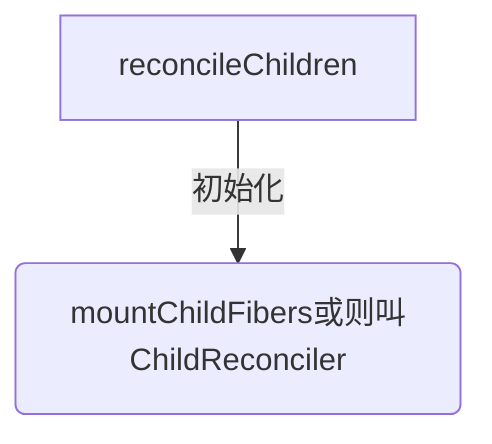
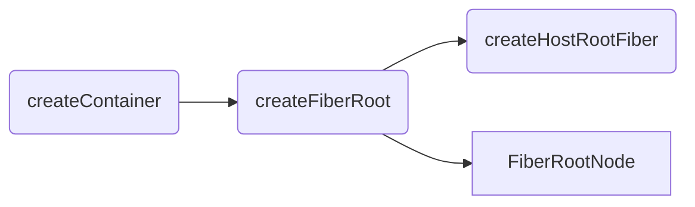
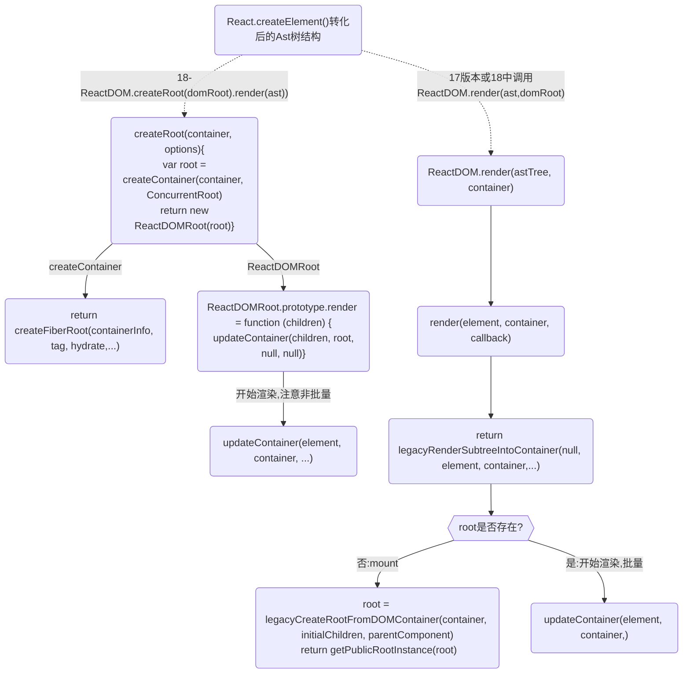
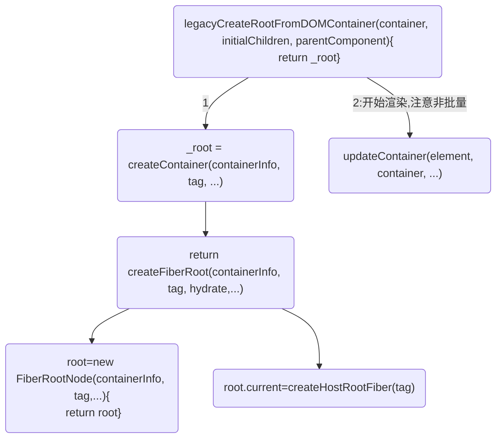
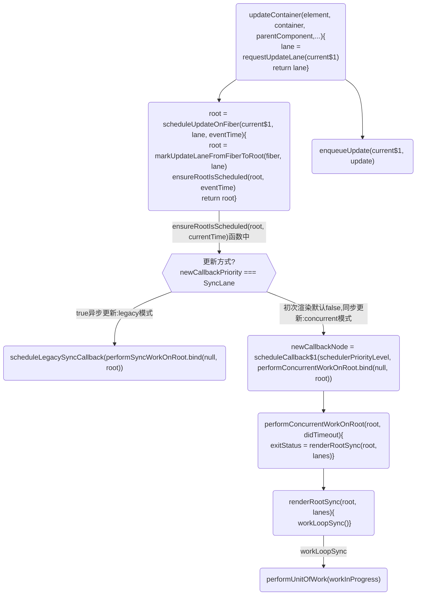

# 面试: 请你描述react 的渲染


## 流程1.  jsx语法糖的html结构是通过babel将结构解析转换为 ast 语法树结构
* react 18中：使用 babel将jsx代码转换为root.render()调用,此时就得到转化后的Ast树结构

* react17中 使用 babel将jsx代码转换为React.createElement()调用,此时就得到转化后的Ast树结构

转化测试:
https://www.babeljs.cn/repl

此时还不是fiber树,没有开启render阶段
```javaScript
<script type="text/babel">
  const root = ReactDOM.createRoot(document.getElementById('root'))
  root.render(<Test />);
</script>
```
```javaScript
function createRoot(container, options) {
  return new ReactDOMRoot(root);
}

ReactDOMHydrationRoot.prototype.render = ReactDOMRoot.prototype.render = function (children) {
    console.log('%c ==一切开始3:', 'color:red', 'ReactDOMRoot.prototype.render调用updateContainer()开启render阶段==', children);
    var root = this._internalRoot;
}
```

接下来的流程开log会很清晰

## 流程2. 调用 ReactDOMRoot.prototype.render() 开始render阶段
两大阶段：render和commit

### render 阶段作用
render函数主要做了两件事，一件是将ast树转换为fiber 结构。填入许多调度、更新、diff相关数据，并转换ast树为dom树，一件是挂载。

render 阶段的工作可以分为递阶段和归阶段作用：是在内存中构建一棵新的fiber树（称为workInProgress树）
* 其中递阶段会执行 beginWork()
* 归阶段会执行 completeWork()

```
在内存中构建的workInProgress树所有更新工作已经完成，这包括树中fiber节点的更新、diff、effectTag的标记、effectList的收集。

正在构建Fiber树叫workInProgress Fiber，这两颗树的节点通过alternate相连.

真实dom对应在内存中的Fiber节点形成Fiber树，这颗Fiber树在react中叫current Fiber
```

<br />

### 2-1.render阶段开始于
`performSyncWorkOnRoot()`18中初始化调用或`performConcurrentWorkOnRoot()`的调用,这取决于本次更新是同步更新还是异步更新.

render/reconciliation 协调阶段(可中断/异步)：通过 Diff 算法找出所有节点变更，例如节点新增、删除、属性变更等等, 获得需要更新的节点信息，

render 阶段：纯净且没有副作用，可能会被 React 暂停、终止或重新启动。

在 render 阶段，React 主要是在内存中做计算，明确 DOM 树的更新点；而 commit 阶段，则负责把 render 阶段生成的更新真正地执行掉。

在 render 阶段，一个庞大的更新任务被分解为了一个个的工作单元，这些工作单元有着不同的优先级，React 可以根据优先级的高低去实现工作单元的打断和恢复。

`performUnitOfWork()`将触发对 beginWork 的调用，进而实现对新 Fiber 节点的创建。
若 beginWork 所创建的 Fiber 节点不为空，则 performUniOfWork 会用这个新的 Fiber 节点来更新 workInProgress 的值，为下一次循环做准备。

通过循环调用`performUnitOfWork()`来触发 beginWork，新的 Fiber 节点就会被不断地创建。当 workInProgress 终于为空时，说明没有新的节点可以创建了，也就意味着已经完成对整棵 Fiber 树的构建。

react把每个fiber当成生成fiber最小单元,只要迭代所有fiber则到顶级Fiber时整颗FiberTree便生成了。
```javascript
// performConcurrentWorkOnRoot会调用该方法
function workLoopConcurrent() {
  while (workInProgress !== null && !shouldYield()) {
    performUnitOfWork(workInProgress)
  }
}

// performSyncWorkOnRoot 会调用该方法,react 18 初始化调用这个
function workLoopSync() {
  while (workInProgress !== null) {
    performUnitOfWork(workInProgress)
  }
}
/*
它们唯一的区别是是否调用shouldYield。如果当前浏览器帧没有剩余时间，shouldYield会中止循环，直到浏览器有空闲时间后再继续遍历。

workInProgress代表当前已创建的 workInProgress fiber。
* */

function performUnitOfWork(unitOfWork) {
  workInProgressNums = workInProgressNums + 1
  // The current, flushed, state of this fiber is the alternate. Ideally
  // nothing should rely on this, but relying on it here means that we don't
  // need an additional field on the work in progress.
  var current = unitOfWork.alternate;
  setCurrentFiber(unitOfWork);
  var next;

  if ((unitOfWork.mode & ProfileMode) !== NoMode) {
    startProfilerTimer(unitOfWork);
    //对当前节点进行协调，如果存在子节点，则返回子节点的引用
    next = beginWork$1(current, unitOfWork, subtreeRenderLanes);
    stopProfilerTimerIfRunningAndRecordDelta(unitOfWork, true);
  } else {
    next = beginWork$1(current, unitOfWork, subtreeRenderLanes);
  }

  resetCurrentFiber();
  unitOfWork.memoizedProps = unitOfWork.pendingProps;

  //如果无子节点，则代表当前的child链表已经遍历完
  if (next === null) {
    // If this doesn't spawn new work, complete the current work.
    //此函数内部会帮我们找到下一个可执行的节点
    completeUnitOfWork(unitOfWork);
  } else {
    workInProgress = next;
  }

  ReactCurrentOwner$2.current = null;
}
```

### render阶段1:beginWork 作用是传入当前 Fiber 节点，创建子 Fiber 节点
beginWork的主要功能就是处理当前遍历到的fiber，经过一番处理之后返回它的子fiber，一个一个地往外吐出fiber节点，那么workInProgress树也就会被一点一点地构建出来
> https://www.zhihu.com/column/c_1320765419813421056

首先从 rootFiber 开始向下深度优先遍历。为遍历到的每个 Fiber 节点调用beginWork方法。

* current：当前组件对应的 Fiber 节点在上一次更新时的 Fiber 节点，即 workInProgress.alternate；
* workInProgress：当前组件对应的 Fiber 节点；
* renderLanes：优先级相关，在讲解Scheduler时再讲解。
```javaScript
function beginWork(
  current: Fiber | null,
  workInProgress: Fiber,
  renderExpirationTime: ExpirationTime
): Fiber | null {
  // mount current !== null 为null,不走以下逻辑
  if (current !== null) {

  }

  switch (workInProgress.tag) {
    case IndeterminateComponent: 
      // ...省略
    case LazyComponent: 
      // ...省略
    case FunctionComponent: 
      // ...省略
    case ClassComponent: 
      // ...省略
    case HostRoot:
      // ...省略
    case HostComponent:
      // ...省略
    case HostText:
  }
}

/*
该方法会根据传入的 Fiber 节点创建子 Fiber 节点，并将这两个 Fiber 节点连接起来。
当遍历到叶子节点（即没有子组件的组件）时就会进入"归"阶段。
* */
```
接以上代码：
对于我们常见的组件类型，如（FunctionComponent/ClassComponent/HostComponent），最终会进入 reconcileChildren 方法。
从该函数名就能看出这是Reconciler模块的核心部分。那么他究竟做了什么呢？
* 对于 mount 的组件，他会创建新的子 Fiber 节点；
* 对于 update 的组件，他会将当前组件与该组件在上次更新时对应的 Fiber 节点比较（也就是俗称的Diff 算法），将比较的结果生成新 Fiber 节点。

不论走哪个逻辑，最终他会生成新的子 Fiber 节点并赋值给workInProgress.child，作为本次 beginWork 返回值，并作为下次performUnitOfWork执行时workInProgress的传参。

mountChildFibers与reconcileChildFibers这两个方法的逻辑基本一致。唯一的区别是：reconcileChildFibers 会为生成的 Fiber 节点带上effectTag属性，而 mountChildFibers 不会。
```javaScript
var reconcileChildFibers = ChildReconciler(true);
var mountChildFibers = ChildReconciler(false);
function reconcileChildren(current, workInProgress, nextChildren, renderLanes) {
  if (current === null) {
    console.log('%c reconcileChildren mount', 'yellow');
    workInProgress.child = mountChildFibers(workInProgress, null, nextChildren, renderLanes);
  } else {
    console.log('%c reconcileChildren update', 'yellow');
    workInProgress.child = reconcileChildFibers(workInProgress, current.child, nextChildren, renderLanes);
  }
}

// 这个代码很长 1k
function ChildReconciler(shouldTrackSideEffects) {

}
```

流程开打印比较直观，画图太复杂：


## render阶段2:completeWork
ompleteWork阶段处在beginWork之后，commit之前，起到的是一个承上启下的作用。它接收到的是经过diff后的fiber节点，然后他自己要将DOM节点和effectList都准备好。因为commit阶段是不能被打断的，所以充分准备有利于commit阶段做更少的工作。

每个fiber节点在更新/创建时都会经历两个阶段：beginWork和completeWork。
complete阶段workInProgress节点都是经过diff算法调和过的，也就意味着对于某个节点来说它fiber的形态已经基本确定了，但除此之外还有两点：
* 目前只有fiber形态变了，对于原生DOM组件（HostComponent）和文本节点（HostText）的fiber来说，对应的DOM节点（fiber.stateNode）并未变化。
* 经过Diff生成的新的workInProgress节点持有了flag(即effectTag)

workInProgress节点的completeWork阶段主要做的:
* 真实DOM节点的创建以及挂载
```
构建过程中，会自下而上将子节点的第一层第一层插入到当前节点。
更新过程中，会计算DOM节点的属性，一旦属性需要更新，会为DOM节点对应的workInProgress节点标记Update的effectTag
```
* effectList的收集
```
执行beginWork后会创建子 Fiber 节点，节点上可能存在effectTag。
```
* DOM属性的处理,次要理解
* 错误处理,次要理解

一旦workInProgress树的所有节点都完成complete，则说明workInProgress树已经构建完成，所有的更新工作已经做完，接下来这棵树会进入commit阶段
```javaScript
// 还是上面提到的performUnitOfWork()
function performUnitOfWork(unitOfWork) {
  // ...
  //如果无子节点，则代表当前的child链表已经遍历完
  if (next === null) {
    // If this doesn't spawn new work, complete the current work.
    //此函数内部会帮我们找到下一个可执行的节点
    console.log(`%c 无子节点，则代表当前的child链表已经遍历完,开启子组件链completeUnitOfWork:${unitOfWork.type}`, 'color:black');
    completeUnitOfWork(unitOfWork);
  } else {
    workInProgress = next;
  }
}

function completeUnitOfWork(unitOfWork) {
  var completedWork = unitOfWork;

  do {
    var current = completedWork.alternate;
    var returnFiber = completedWork.return; // Check if the work completed or if something threw.

    if ((completedWork.flags & Incomplete) === NoFlags) {
      setCurrentFiber(completedWork);
      var next = void 0;

      if ((completedWork.mode & ProfileMode) === NoMode) {
        console.log(`%c ==开始completeWork-1`, 'color:black')
        next = completeWork(current, completedWork, subtreeRenderLanes);
      } else {
        console.log(`%c ==开始completeWork-2`, 'color:black')
        startProfilerTimer(completedWork);
        next = completeWork(current, completedWork, subtreeRenderLanes); // Update render duration assuming we didn't error.

        stopProfilerTimerIfRunningAndRecordDelta(completedWork, false);
      }

      resetCurrentFiber();

      if (next !== null) {
        // Completing this fiber spawned new work. Work on that next.
        workInProgress = next;
        return;
      }
    }else{
      // ...
    }

    // 查看当前节点是否存在兄弟节点
    var siblingFiber = completedWork.sibling;
    if (siblingFiber !== null) {
      // If there is more work to do in this returnFiber, do that next.
      // 若存在，便把siblingFiber节点作为下一个工作单元，
      // 继续执行performUnitOfWork，执行当前节点并尝试遍历当前节点所在的child链表
      workInProgress = siblingFiber;
      return;
    }

    // 如果不存在兄弟节点，则回溯到父节点，尝试查找父节点的兄弟节点
    completedWork = returnFiber; // Update the next thing we're working on in case something throws.
    workInProgress = completedWork;
  } while (completedWork !== null); // We've reached the root.
}

// 正式进入completeWork
// 类似 beginWork，completeWork 也是针对不同 fiber.tag 调用不同的处理逻辑。
function completeWork(current, workInProgress, renderLanes) {
  const newProps = workInProgress.pendingProps;

  switch (workInProgress.tag) {
    case IndeterminateComponent:
    case LazyComponent:
    case SimpleMemoComponent:
    case FunctionComponent:
    case ForwardRef:
    case Fragment:
    case Mode:
    case Profiler:
    case ContextConsumer:
    case MemoComponent:
      return null;
    case ClassComponent: {
      // ...省略
      return null;
    }
    case HostRoot: {
      // ...省略
      updateHostContainer(workInProgress);
      return null;
    }
    case HostComponent: {
      // ...省略
      return null;
    }
}
```

重点关注页面渲染所必须的HostComponent（即原生 DOM 组件对应的 Fiber 节点）,

同时针对 HostComponent，判断update时我们还需要考虑 workInProgress.stateNode != null ?（即该 Fiber 节点是否存在对应的 DOM 节点）。

### 解析：在"归"阶段会调用completeWork处理 Fiber 节点
completeWork 将根据 workInProgress 节点的 tag 属性的不同，进入不同的 DOM 节点的创建、处理逻辑。

completeWork 内部有 3 个关键动作：
* 创建 DOM 节点（CreateInstance）
* 将 DOM 节点插入到 DOM 树中（AppendAllChildren）
* 为 DOM 节点设置属性（FinalizeInitialChildren）

当某个 Fiber 节点执行完completeWork，如果其存在兄弟 Fiber 节点（即fiber.sibling !== null），会进入其兄弟 Fiber 的"递"阶段。

如果不存在兄弟 Fiber，会进入父级 Fiber 的"归"阶段。

"递"和"归"阶段会交错执行直到"归"到 rootFiber。至此，协调阶段的工作就结束了。


### 3-2. render阶段之update时: fiber 双缓存 和 diff
在update diff 比较时： 就是在构建 workInProgress fiber tree 的过程中，
会根据新的状态形成的jsx（ClassComponent的render或者FuncComponent的返回值）和current Fiber对比形（diff算法）构建**workInProgress的Fiber树**。
```
判断 current fiber tree 中的 fiber node 是否可以被 workInProgress fiber tree 复用。

能被复用，意味在本次更新中，需要做:
组件的 update 以及 dom 节点的 move、update 等操作；

不可复用，则意味着需要做:
组件的 mount、unmount 以及 dom 节点的 insert、delete 等操作。
```

当更新完成以后，fiberRootNode 的 current 指针会指向 workInProgress fiber tree，作为下一次更新的 current fiber tree

## B. commit 阶段
render 阶段全部工作完成。在 performSyncWorkOnRoot 函数中 fiberRootNode 被传递给 commitRoot 方法，开启commit 阶段工作流程。

commit 提交阶段(不可中断/同步)：将需要更新的节点一次过批量更新，对应早期版本的 patch 过程。

### B-1.React的commit阶段是干什么的？简单来说，就是将DOM渲染到页面上
1. before mutation阶段-执行DOM操作前,这个阶段 DOM 节点还没有被渲染到界面上去，过程中会触发 getSnapshotBeforeUpdate，也会处理 useEffect 钩子相关的调度逻辑。

2. mutation阶段-执行DOM操作
```
mutation 阶段，这个阶段负责 DOM 节点的渲染。在渲染过程中，会遍历 effectList，根据 flags（effectTag）的不同，执行不同的 DOM 操作
```

3. layout阶段-执行DOM操作后
```
layout 阶段，这个阶段处理 DOM 渲染完毕之后的收尾逻辑。比如调用 componentDidMount/componentDidUpdate，
调用 useLayoutEffect 钩子函数的回调等。除了这些之外，它还会把 fiberRoot 的 current 指针指向 workInProgress Fiber 树。
```

### commit 之入口scheduler去调度的是commitRootImpl，它是commit阶段的核心实现，整个commit阶段被划分成三个部分
commit阶段的入口是commitRoot函数，它会告知scheduler以立即执行的优先级去调度commit阶段的工作。

### commit之 before mutation 阶段，会遍历 effectList，依次执行：
```
1. 处理 DOM 节点渲染/删除后的 autoFocus、blur 逻辑；
2. 调用getSnapshotBeforeUpdate 生命周期钩子；
3. 调度useEffect。

1. commitRootImpl是commit阶段主要函数，调用commitBeforeMutationEffects
2. commitBeforeMutationEffects主要功能是：执行commitBeforeMutationEffectOnFiber和通过flushPassiveEffects调度useEffect
3. commitBeforeMutationEffectOnFiber通过判断组件类型主要来执行类组件getSnapshotBeforeUpdate生命周期函数
```
### commit之进入：mutation 阶段


## 扩展：useState 更新
```
react 合成事件中改变状态是异步的，出于减少 render 次数，react 会收集所有状态变更，然后比对优化，最后做一次变更
```

# 首次更新流程

## 1.使用 babel将jsx代码转换为React.createElement()调用
测试：https://www.babeljs.cn/repl
```jsx
// jsx
const element = <h1 style = {{"color": "red"}}>123
    <div>test</div>
</h1>

// babel 编译过后生成的代码
const element = /*#__PURE__*/React.createElement("h1", {
  style: {
    "color": "red"
  }
}, "123", /*#__PURE__*/React.createElement("div", null, "test"));
```

## 2.简单react 渲染实例:不使用bable
渲染代码：example-code\例-1-jsx-ast-r17.html
```html
<script>
const container = document.getElementById('root');
const element = React.createElement(
    'div',
    { className: 'red' },
    'Click Me'
)
console.log('createElement 转化后ast树的结构:', element)
ReactDOM.render(element, container)
/*
{
    $$typeof: Symbol(react.element)
    key: null
    props:
    children: "Click Me"
    className: "red"
    [[Prototype]]: Object
    ref: null
    type: "div"
    _owner: null
    _store: {validated: false}\
}
*/
</script>
```

## 3.简单实例：使用bable
渲染代码：example-code\例4-在html-使用bable转义jsx.html
```html
<script type="text/babel">
  function Test() {
    return (
      <div className="red">Click Me</div>
    )
  }

  ReactDOM.render(<Test />, document.getElementById('root'))
</script>
```

## A.总结
### A-1.render主要具备两个功能,line:29529：
1. 将ast树转换为真实的dom
2. 挂载到页面上:render()

### A-2. `legacyRenderSubtreeIntoContainer`:
根据 container 是否存在 root 区分初始化/更新，创建或获取 fiberRoot;

Babel 会把 JSX 转译成一个名为 React.createElement() 函数调用,
因此legacyRenderSubtreeIntoContainer 中打印的children实际上是通过React.createElement()处理过的
```javaScript
// 从 container 取出 _reactRootContainer 作为 react 的一个根:
var maybeRoot = container._reactRootContainer;
```
检查 root 是否存在，如果存在就是 Update，如果不存在就是初始化。
```
A.若root不存在：
调用 legacyCreateRootFromDOMContainer(contaiber,forceHydrate) 初始化 root。
将 root 赋值给 container._reactRootContainer,取出 root 中的_internalRoot 作为 fiberRoot。

B.若 root 存在, 从 root 中取出 fiberRoot:
  root = maybeRoot;
调用 updateContainer(children,fiberRoot,parentComponent,callBack)
注意：这里 callBack 会通过 getPublicRootInstance() 递归找到 fiberRoot 上第一个非 HTMlElement 结点,并将 callback 绑定在它上边。
```

```javaScript
function render(element, container, callback) {
    return legacyRenderSubtreeIntoContainer(null, element, container, false, callback); 
}

function legacyRenderSubtreeIntoContainer(parentComponent, children, container, forceHydrate, callback) {
    // ...
    var maybeRoot = container._reactRootContainer;
    var root;

    if (!maybeRoot) {
      // Initial mount
      root = legacyCreateRootFromDOMContainer(container, children, parentComponent, callback, forceHydrate);
    } else {
      root = maybeRoot;

      if (typeof callback === 'function') {
        var originalCallback = callback;

        callback = function () {
          var instance = getPublicRootInstance(root);
          originalCallback.call(instance);
        };
      } // Update


      updateContainer(children, root, parentComponent, callback);
    }

    return getPublicRootInstance(root);
}

```

### A-3.legacyCreateRootFromDOMContainer 第一次渲染调用
作用：清空container,创建root:
```
03-legacyCreateRootFromDOMContainer.md
```
<br />

## A-4. createFiberRoot 创建fiberRoot对象
最终创建了 fiberRoot 和 rootFiber：


## A-5. 开始渲染工作
这个是 17或则在18中调用ReactDOM.render(ast,domRoot)的流程，如果在18中调用ReactDOM.createRoot(domRoot).render(Ast) 是不用走下面的流程的,18直接流程图的流程构建fiber和更新
```javaScript
/*
可以见到 mount ---> legacyCreateRootFromDOMContainer 不批量调用 updateContainer

update 直接调用 updateContainer
*/
function legacyRenderSubtreeIntoContainer(parentComponent, children, container, forceHydrate, callback) {
  if (!maybeRoot) {
    console.log('开始调用-->0-a0:初始化渲染')
    // Initial mount
    root = legacyCreateRootFromDOMContainer(container, children, parentComponent, callback, forceHydrate);
  } else {
    root = maybeRoot;

    if (typeof callback === 'function') {
      var originalCallback = callback;

      callback = function () {
        var instance = getPublicRootInstance(root);
        originalCallback.call(instance);
      };
    } // Update

    console.log('更新流程-->1-a1:即更新')
    updateContainer(children, root, parentComponent, callback);
  }

  return getPublicRootInstance(root);
}

// 第一次渲染
legacyCreateRootFromDOMContainer(){
      
  console.log('-->0-a,初始化渲染不执行批量更新',)
  flushSync(function () {
    updateContainer(initialChildren, _root, parentComponent, callback);
  });
}
```

## A-6. render 阶段: performConcurrentWorkOnRoot 在第一次渲染中调用
render 阶段开始于 performSyncWorkOnRoot 或 performConcurrentWorkOnRoot 方法的调用。前面有提到：这取决于本次更新是同步更新还是异步更新。
```javaScript
// performConcurrentWorkOnRoot 调用 renderRootSync -->workLoopSync
function performConcurrentWorkOnRoot(root, didTimeout) {
  var exitStatus = shouldTimeSlice ? renderRootConcurrent(root, lanes) : renderRootSync(root, lanes);
  return null;
}

// 第一次渲染走这个 renderRootSync --> renderRootSync -->workLoopSync
function renderRootSync(root, lanes) {
  do {
    try {
      console.log('renderRootSync--->', root);
      workLoopSync();
      break;
    } catch (thrownValue) {
      handleError(root, thrownValue);
    }
  } while (true);
}

function renderRootConcurrent(root, lanes) {
do {
  try {
    workLoopConcurrent();
    break;
  } catch (thrownValue) {
    handleError(root, thrownValue);
  }
} while (true);
}
```

### A-6-1.workLoopConcurrent workLoopSync两个函数区别 
它们唯一的区别是是否调用shouldYield。如果当前浏览器帧没有剩余时间，shouldYield会中止循环，直到浏览器有空闲时间后再继续遍历。

workInProgress代表当前已创建的 workInProgress fiber。
```javaScript
function workLoopConcurrent() {
  // Perform work until Scheduler asks us to yield
  while (workInProgress !== null && !shouldYield()) {
    performUnitOfWork(workInProgress);
  }
}

// 第一次渲染走这个
function workLoopSync() {
  // Already timed out, so perform work without checking if we need to yield.
  while (workInProgress !== null) {
    performUnitOfWork(workInProgress);
  }
}
```

### A-6-2. performUnitOfWork 作用
创建下一个 Fiber 节点，并赋值给 workInProgress，同时把 workInProgress 与已创建的 Fiber 节点连接起来构成 Fiber 树。


## 1.程序入口


## 2.接上面的mount流程,注意 17或则在18中调用ReactDOM.render(ast,domRoot)的流程，如果在18中调用ReactDOM.createRoot(domRoot).render(Ast) 是不用走下面的流程的,18直接上面的流程图构建fiber和更新


## 3.重点：17/18版本 初始化/更新 渲染流程,接上面 updateContainer



