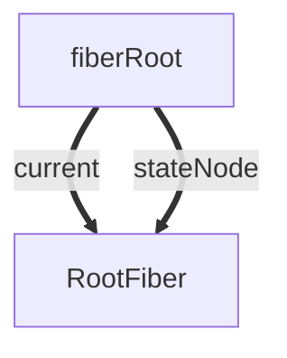
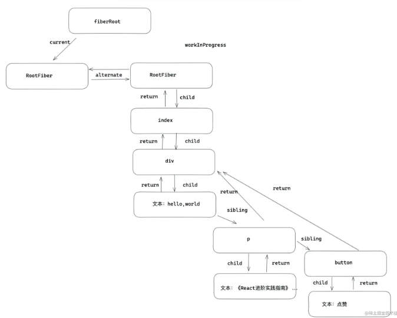

## 前言
### react fiber的任务
- 把渲染/更新过程拆分为更小的、可中断的工作单元
- 在浏览器空闲时执行工作循环
- 将所有执行结果汇总patch到真实DOM上

react 把渲染/更新过程分为2个阶段（diff + patch）：
1. diff ~ render/reconciliation
2. patch ~ commit

```
diff的实际工作是对比prevInstance和nextInstance的状态，找出差异及其对应的DOM change。
diff本质上是一些计算（遍历、比较），是可拆分的（算一半待会儿接着算） 
```

```
patch阶段把本次更新中的所有DOM change应用到DOM树，是一连串的DOM操作。
些DOM操作虽然看起来也可以拆分（按照change list一段一段做），但这样做一方面可能造成DOM实际状态与维护的内部状态不一致，另外还会影响体验。而且，一般场景下，DOM更新的耗时比起diff及生命周期函数耗时不算什么，拆分的意义不很大
```
所以，render/reconciliation阶段的工作（diff）可以拆分，commit阶段的工作（patch）不可拆分

### 怎么拆？
react的拆分单位是fiber（fiber tree上的一个节点）

在更新的时候可能会更新大量的dom，所以react在应用层和dom层之间增加了一层Fiber，而Fiber是在内存中工作的，所以在更新的时候只需要在内存中进行dom更新的比较，最后再应用到需要更新真实节点上

- 在react15之前，这个对比的过程被称之为stack reconcile，它的对比方式是‘一条路走到黑’，也就是说这个对比的过程是不能被中断的，这会出现什么情况呢，比如在页面渲染一个比较消耗性能操作，如果这个时候如果用户进行一些操作就会出现卡顿，应用就会显得不流畅。

- react16之后出现了scheduler，以及react17的Lane模型，它们可以配合着工作，将比较耗时的任务按照Fiber节点划分成工作单元，并且遍历Fiber树计算或者更新节点上的状态可以被中断、继续，以及可以被高优先级的任务打断，比如用户触发的更新就是一个高优先级的任务，高优先级的任务优先执行，应用就不会太卡顿。

## 1.初始化

### 1-1.第一步：创建fiberRoot和rootFiber
在mount时：会创建fiberRoot和rootFiber，然后根据jsx对象创建Fiber节点，节点连接成current Fiber树

- fiberRoot(fiberRoot只能有一个)： 首次构建应用， 创建一个 fiberRoot ，整个应用的根节点。

- rootFiber(rootFiber可以有多个): 通过 ReactDOM.render 渲染出来的。
```
比如一个组件会渲染一个rootFiber。 
```



### 1-2.第二步：创建workInProgress树,Fiber是怎样工作的

正在构建Fiber树叫workInProgress Fiber，这两颗树的节点通过alternate相连.

真实dom对应在内存中的Fiber节点形成Fiber树，这颗Fiber树在react中叫current Fiber
```
workInProgress fiber tree：内存中构建的树。
更新过程中构建的 new fiber tree

current fiber tree：正在视图层渲染的树。
old fiber tree，对应当前屏幕显示的内容，通过根节点 fiberRootNode 的 currrent 指针可以访问。
```

渲染流程中，先复用current树（rootFiber）的alternate 作为 workInProgress。
构建workInProgress Fiber发生在createWorkInProgress中，它能创建或者复用Fiber
```javaScript
export function createWorkInProgress(current: Fiber, pendingProps: any): Fiber {
  let workInProgress = current.alternate;
  // 区分是在mount时还是在update时
  if (workInProgress === null) {
    workInProgress = createFiber(
      current.tag,
      pendingProps,
      current.key,
      current.mode,
    );
    workInProgress.elementType = current.elementType;
    workInProgress.type = current.type;
    workInProgress.stateNode = current.stateNode;
   
    workInProgress.alternate = current;
    current.alternate = workInProgress;
  } else {
    // 复用属性
    workInProgress.pendingProps = pendingProps;
    workInProgress.type = current.type;
    workInProgress.flags = NoFlags;

    workInProgress.nextEffect = null;
    workInProgress.firstEffect = null;
    workInProgress.lastEffect = null;
	
    //...
  }

  workInProgress.childLanes = current.childLanes;//复用属性
  workInProgress.lanes = current.lanes;

  workInProgress.child = current.child;
  workInProgress.memoizedProps = current.memoizedProps;
  workInProgress.memoizedState = current.memoizedState;
  workInProgress.updateQueue = current.updateQueue;

  const currentDependencies = current.dependencies;
  workInProgress.dependencies =
    currentDependencies === null
      ? null
      : {
          lanes: currentDependencies.lanes,
          firstContext: currentDependencies.firstContext,
        };

  workInProgress.sibling = current.sibling;
  workInProgress.index = current.index;
  workInProgress.ref = current.ref;


  return workInProgress;
}
```

结构：
- return： 指向父级 Fiber 节点。
- child：指向子 Fiber 节点。
- sibling：指向兄弟 fiber 节点。
```
见 mermaid 文件
```


```javaScript
export default class Index extends React.Component{
   state={ number:666 } 
   handleClick=()=>{
     this.setState({
         number:this.state.number + 1
     })
   }
   render(){
     return <div>
       hello，world
       <p > 《React进阶实践指南》 { this.state.number }   </p>
       <button onClick={ this.handleClick } >点赞</button>
     </div>
   }
}
```

### 1-2-1. fiber 双缓存
```
diff 比较，就是在构建 workInProgress fiber tree 的过程中，
判断 current fiber tree 中的 fiber node 是否可以被 workInProgress fiber tree 复用。

能被复用，意味在本次更新中，需要做:
组件的 update 以及 dom 节点的 move、update 等操作；

不可复用，则意味着需要做:
组件的 mount、unmount 以及 dom 节点的 insert、delete 等操作。
```

当更新完成以后，fiberRootNode 的 current 指针会指向 workInProgress fiber tree，作为下一次更新的 current fiber tree

### 1-3.第三步：深度调和子节点，渲染视图
遍历fiber树，以workInProgress 作为最新的渲染树，即current Fiber 树。

### 总结
1. 在mount的时候，render阶段会根据jsx对象生成新的Fiber节点。
然后这些Fiber节点会被标记成带有‘Placement’的副作用，说明它们是新增的节点，需要被插入到真实节点中了。
在commit阶段就会操作真实节点，将它们插入到dom树中。

2. update
在update时： 会根据新的状态形成的jsx（ClassComponent的render或者FuncComponent的返回值）和current Fiber对比形（diff算法）构建**workInProgress的Fiber树**。

然后将fiberRoot的current指向workInProgress树，此时workInProgress就变成了current Fiber。

在update的时候，render阶段会根据最新的jsx和老的Fiber进行对比，生成新的Fiber。
这些Fiber会带有各种副作用，比如‘Deletion’、‘Update’、‘Placement’等，这一个对比的过程就是diff算法 ，在commit阶段会操作真实节点，执行相应的副作用。

### 更新
更新重复上述第二和第三步。


参考：
https://blog.csdn.net/bemystery/article/details/121848218
## 2.Fiber双缓存创建的过程:
```javaScript
function App() {
  return (
		<>
      <h1>
        <p>count</p> helloword
      </h1>
    </>
  )
}

ReactDOM.render(<App />, document.getElementById("root"));
```
### 2-1.mount
- 1.刚开始只创建了fiberRoot和rootFiber两个节点

- 2.然后根据jsx创建workInProgress Fiber：
```
见 mermaid 文件
```

- 3.把workInProgress Fiber切换成current Fiber
```
见 mermaid 文件
```

## update时
- 1.根据current Fiber创建workInProgress Fiber  ---->存疑，应该是生成的jsx 同 current Fiber diff

本人理解
```
首次渲染时：
render阶段会根据jsx对象生成新的Fiber节点，然后这些Fiber节点会被标记成带有‘Placement’的副作用，说明他们是新增节点，需要被插入到真实节点中，在commitWork阶段就会操作成真实节点，将它们插入到dom树中。

页面触发更新时
render阶段会根据最新的jsx生成的虚拟dom和current Fiber树进行对比，比较之后生成workinProgress Fiber(workinProgress Fiber树的alternate指向Current Fiber树的对应节点，这些Fiber会带有各种副作用，比如‘Deletion’、‘Update’、'Placement’等)这一对比过程就是diff算法

当workinProgress Fiber树构建完成，workInprogress 则成为了curent Fiber渲染到页面上

diff ⽐较的是什么？ ⽐较的是 current fiber 和 vdom，⽐较之后⽣成 workInprogress Fiber
```
- 2.把workInProgress Fiber切换成current Fiber

## react-reconciler阶段
1.beginWork阶段
生成相应的fiber树

2.completeWork阶段
生成实例

3.commitWork
相应的节点进行提交，渲染到页面上