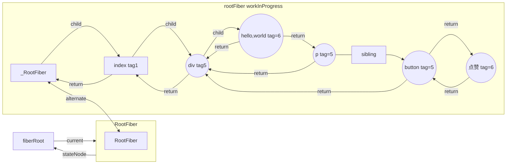
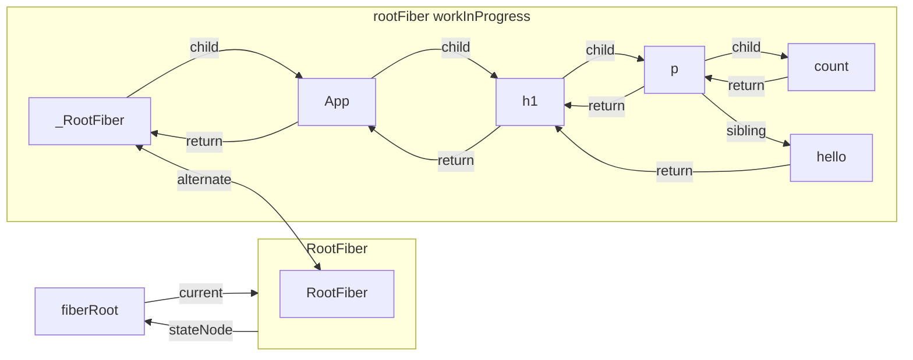
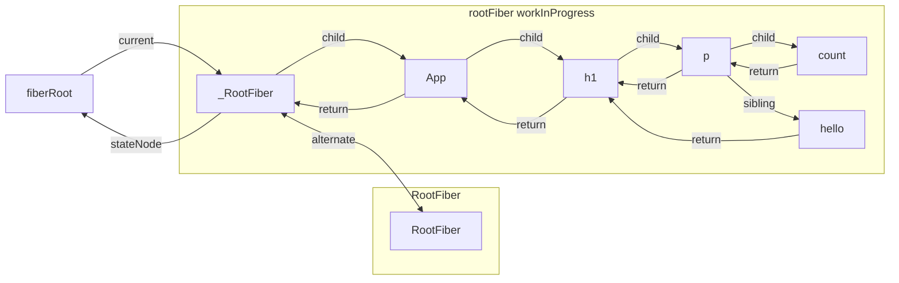

## fiber对应的关系如下：

```mermaid
%% flowchart TB
flowchart LR
  fiberRoot--current-->RootFiber
  RootFiber--stateNode-->fiberRoot

  subgraph RootFiber [RootFiber]
    RootFiber1[RootFiber]
  end

  subgraph workInProgress[rootFiber workInProgress]
    _RootFiber<--alternate-->RootFiber1
    _RootFiber--child--> 4index[index tag1] --child--> div((div tag5)) --child--> hello((hello,world tag=6))

    p((p tag=5)) ---sibling--> button((button tag=5))--return-->点赞((点赞 tag=6))
    4index --return--> _RootFiber
    div --return--> 4index
    hello --return--> div
    hello --return--> p

    点赞 --return--> button
    button --return--> div
    p --return--> div
  end
```

## 2.然后根据jsx创建workInProgress Fiber：

```mermaid
%% flowchart TB
flowchart LR
  fiberRoot--current-->RootFiber
  RootFiber--stateNode-->fiberRoot

  subgraph RootFiber [RootFiber]
    RootFiber1[RootFiber]
  end

  subgraph workInProgress[rootFiber workInProgress]
    _RootFiber<--alternate-->RootFiber1

    _RootFiber--child-->App--child-->h1--child-->p--child-->count
    App--return-->_RootFiber
    hello--return-->h1
    p--sibling-->hello
    count--return-->p
    p--return-->h1
    h1--return-->App
  end
```

## 3.把workInProgress Fiber切换成current Fiber

```mermaid
%% flowchart TB
flowchart LR
  fiberRoot--current-->_RootFiber
    _RootFiber--stateNode-->fiberRoot

  subgraph RootFiber [RootFiber]
    RootFiber1[RootFiber]
  end

  subgraph workInProgress[rootFiber workInProgress]
    _RootFiber<--alternate-->RootFiber1

    _RootFiber--child-->App--child-->h1--child-->p--child-->count
    App--return-->_RootFiber
    hello--return-->h1
    p--sibling-->hello
    count--return-->p
    p--return-->h1
    h1--return-->App
  end
```