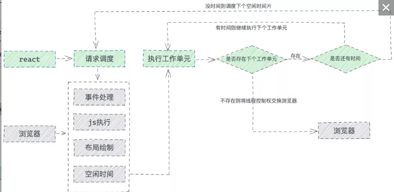
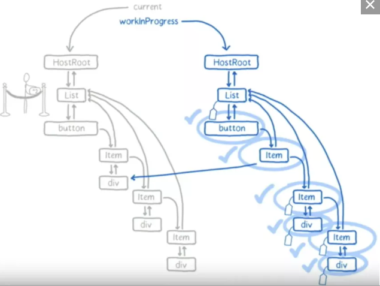

## 渲染帧
在浏览器中，页面是一帧一帧绘制出来的，渲染的帧率与设备的刷新率保持一致。

一般情况下，设备的屏幕刷新率为 1s 60次，当每秒内绘制的帧数（FPS）超过60时，页面渲染是流畅的；而当 FPS 小于60时，会出现一定程度的卡顿现象。
> 为什么JS长时间执行会影响交互响应、动画？因为JavaScript在浏览器的主线程上运行，恰好与样式计算、布局以及许多情况下的绘制一起运行。如果JavaScript运行时间过长，就会阻塞这些其他工作，可能导致掉帧。

为了解决以上的痛点问题，React希望能够彻底解决主线程长时间占用问题，于是引入了 Fiber 来改变这种不可控的现状，把渲染/更新过程拆分为一个个小块的任务，通过合理的调度机制来调控时间，指定任务执行的时机，从而降低页面卡顿的概率，提升页面交互体验。通过Fiber架构，让reconcilation过程变得可被中断。适时地让出CPU执行权，可以让浏览器及时地响应用户的交互。

## 关于fiber 结构和作用
查看：03_Fiber更新机制\01_1_fiber概念.md

## 下面来看完整的一帧中，具体做了哪些事情


1. 首先需要处理输入事件，能够让用户得到最早的反馈

2. 接下来是处理定时器，需要检查定时器是否到时间，并执行对应的回调

3. 接下来处理 Begin Frame（开始帧），即每一帧的事件，包括 window.resize、scroll、media query change 等

4. 接下来执行请求动画帧 requestAnimationFrame（rAF），即在每次绘制之前，会执行 rAF 回调

5. 紧接着进行 Layout 操作，包括计算布局和更新布局，即这个元素的样式是怎样的，它应该在页面如何展示

6. 接着进行 Paint 操作，得到树中每个节点的尺寸与位置等信息，浏览器针对每个元素进行内容填充

到这时以上的六个阶段都已经完成了，接下来处于空闲阶段（Idle Peroid），可以在这时执行requestIdleCallback里注册的任务（它就是 React Fiber 任务调度实现的基础）

## RequestIdleCallback
RequestIdleCallback 是 react Fiber 实现的基础 api 。该方法将在浏览器的空闲时段内调用的函数排队，使开发者在主事件循环上执行后台和低优先级的工作，而不影响延迟关键事件，如动画和输入响应。正常帧任务完成后没超过16ms，说明有多余的空闲时间，此时就会执行requestIdleCallback里注册的任务。

1. 低优先级任务由requestIdleCallback处理；
2. 高优先级任务，如动画相关的由requestAnimationFrame处理；
3. requestIdleCallback可以在多个空闲期调用空闲期回调，执行任务；

window.requestIdleCallback(callback)的callback中会接收到默认参数 deadline ，其中包含了以下两个属性：
```
timeRamining 返回当前帧还剩多少时间供用户使用
didTimeout 返回 callback 任务是否超时
```


```javaScript
const sleep = (delay) => {
  const start = Date.now();
  while (Date.now() - start <= delay) {}
};
const taskQueue = [
  () => {
    console.log("task1 start");
    sleep(3);
    console.log("task1 end");
  },
  () => {
    console.log("task2 start");
    sleep(3);
    console.log("task2 end");
  },
  () => {
    console.log("task3 start");
    sleep(3);
    console.log("task3 end");
  },
];
const performUnitWork = () => {
  // 取出第一个队列中的第一个任务并执行
  taskQueue.shift()();
};
const workloop = (deadline) => {
  console.log(`此帧的剩余时间为: ${deadline.timeRemaining()}`);
  // 如果此帧剩余时间大于0或者已经到了定义的超时时间（上文定义了timeout时间为1000，到达时间时必须强制执行），且当时存在任务，则直接执行这个任务
  // 如果没有剩余时间，则应该放弃执行任务控制权，把执行权交还给浏览器
  while (
    (deadline.timeRemaining() > 0 || deadline.didTimeout) &&
    taskQueue.length > 0
  ) {
    performUnitWork();
  }
  // 如果还有未完成的任务，继续调用requestIdleCallback申请下一个时间片
  if (taskQueue.length > 0) {
    window.requestIdleCallback(workloop, { timeout: 1000 });
  }
};
requestIdleCallback(workloop, { timeout: 1000 });
/*
上面定义了一个任务队列taskQueue，并定义了workloop函数，其中采用window.requestIdleCallback(workloop, { timeout: 1000 })去执行taskQueue中的任务。每个任务中仅仅做了console.log、sleep(3)的工作，时间是非常短的（大约3ms多一点），浏览器计算此帧中还剩余15.5ms，足以一次执行完这三个任务，因此在此帧的空闲时间中，taskQueue中定义的三个任务均执行完毕。打印结果如下： 
此帧的剩余时间为: 49.8
task1 start
task1 end
task2 start
task2 end
task3 start
task3 end
*/
```

## requestIdleCallback 总结
应该避免在requestIdleCallback中执行过长时间的任务，否则可能会阻塞页面渲染，以及页面交互。

当然也不建议在requestIdleCallback 里再操作 DOM，这样会导致页面再次重绘。DOM 操作建议在 rAF 中进行。同时，操作 DOM 所需要的耗时是不确定的，因为会导致重新计算布局和视图的绘制，所以这类操作不具备可预测性。

Promise 也不建议在这里面进行，因为 Promise 的回调属性 Event loop 中优先级较高的一种微任务，会在 requestIdleCallback 结束时立即执行，不管此时是否还有富余的时间，这样有很大可能会让一帧超过 16 ms。

requestIdleCallback 的基本信息也介绍完了，后面开始重点讲讲react fiber是如何搭配requestIdleCallback构建出fiber tree的。

## 四.fiber执行原理
diff的过程，也就是effect的收集过程，此过程会找出所有节点的变更，如节点新增、删除、属性变更等，这些变更 react 统称为副作用（effect），随着所有的节点（工作单元）在帧空闲时间逐个执行完毕，最后产出的结果是effect list，从中可以知道哪些节点更新、哪些节点增加、哪些节点删除了。

### 4.1 任务调度
React fiber的构建的过程以每个fiber作为一个工作单元，进行工作循环，工作循环中每次处理一个任务（工作单元），处理完毕有一次喘息的机会：
```javaScript
while (nextUnitOfWork !== null && !shouldYieldToRenderer()) {
  nextUnitOfWork = performUnitOfWork(nextUnitOfWork);
}
```
shouldYieldToRenderer就是看时间用完了没，没用完的话继续处理下一个任务，用完了就结束，把时间控制权还给主线程，等下一次requestIdleCallback回调再接着做。但如果当前渲染执行很长一段时间后还未结束，那么就不再会喘息，而是一次性把剩余工作全部做完。
```javaScript
if (!isYieldy) {
  // Flush work without yielding
  while (nextUnitOfWork !== null) {
    nextUnitOfWork = performUnitOfWork(nextUnitOfWork);
  }
}
```
React Fiber的工作调度与浏览器的核心交互流程如下： 



### 4.2 遍历流程
Tree 构建的遍历顺序，它会以旧的fiber tree为蓝本，把每个fiber作为一个工作单元，自顶向下逐节点构造workInProgress tree（构建中的新fiber tree）:

深度优先遍历
1. 从顶点开始遍历
2. 如果有子节点，先遍历子节点；
3. 如果没有子节点，则看有没有兄弟节点，有则遍历兄弟节点，并把effect向上归并
4. 如果没有兄弟节点，则看有没有父兄弟节点，有则遍历父兄弟节点
5. 如果没有都没有了，那么遍历结束

结构：
```
见 mermaid 文件
```

遍历过程:
```
见 mermaid 文件
```

以看出下一个工作单元是的确定，是由当前工作单元beginWork之后得到的，这也合情合理，毕竟没执行过当前工作单元，也就无法得知有无子节点生成。

那我们继续看看beginWork中是如何判断下一个工作单元的。
```javaScript
// 如果存在子节点，那么下一个待处理的就是子节点
if (fiber.child) {
  return fiber.child;
}
// 没有子节点了，上溯查找兄弟节点
let temp = fiber;
while (temp) {
  completeWork(temp);
  // 到顶层节点了, 退出
  if (temp === topWork) {
    break;
  }
  // 找到，下一个要处理的就是兄弟节点
  if (temp.sibling) {
    return temp.sibling;
  }
  // 没有, 继续上溯
  temp = temp.return;
}
```

### 4.3 Reconciliation
了解了遍历流程与任务调度方法之后，接下来就是就是我们熟知的Reconcilation阶段了（为了方便理解，这里不区分Diff和Reconcilation, 两者是同一个东西）。思路和 Fiber 重构之前差别不大，只不过这里不会再递归去比对、而且不会马上提交变更。

具体过程如下（以组件节点为例）：
1. 如果当前节点不需要更新，直接把子节点clone过来，跳到5；要更新的话打个tag
2. 更新当前节点状态（props, state, context等）
3. 调用shouldComponentUpdate()，false的话，跳到5
4. 调用render()获得新的子节点，并为子节点创建fiber（创建过程会尽量复用现有fiber，子节点增删也发生在这里）
5. 如果没有产生child fiber，该工作单元结束，把effect list归并到return，并把当前节点的sibling作为下一个工作单元；否则把child作为下一个工作单元
6. 如果没有剩余可用时间了，等到下一次主线程空闲时才开始下一个工作单元；否则，立即开始做
7. 如果没有下一个工作单元了（回到了workInProgress tree的根节点），第1阶段结束，进入pendingCommit状态

实际上是1-6的工作循环，7是出口，工作循环每次只做一件事，做完看要不要喘口气。工作循环结束时，workInProgress tree的根节点身上的effect list就是收集到的所有side effect（因为每做完一个都向上归并）

## BeginWork
再回到beginWork 具体看看它是如何对 Fiber 进行执行的（简化版）:
```javaScript
function beginWork(fiber: Fiber): Fiber | undefined{
  // 宿主节点diff
  case HostComponent: {
    return updateHostComponent(current, workInProgress, renderExpirationTime);
  }  
  // 类组件节点diff
    case ClassComponent: {
        return updateClassComponent(
        current,
        workInProgress,
        Component,
        resolvedProps,
        renderExpirationTime
    );
  }
  // 函数组件节点diff
  case FunctionComponent: {
    return updateFunctionComponent(
        current,
        workInProgress,
        Component,
        resolvedProps,
        renderExpirationTime
    );
  }
  // ... 其他类型节点，省略
}
```

宿主节点比对:
```javaScript
function diffHostComponent(fiber: Fiber) {
  // 新增节点
  if (fiber.stateNode == null) {
    fiber.stateNode = createHostComponent(fiber);
  } else {
    updateHostComponent(fiber);
  }
  const newChildren = fiber.pendingProps.children;
  // 比对子节点
  diffChildren(fiber, newChildren);
}
```
类组件节点比对也差不多:
```javaScript
function diffClassComponent(fiber: Fiber) {
  // 创建组件实例
  if (fiber.stateNode == null) {
    fiber.stateNode = createInstance(fiber);
  }
  if (fiber.hasMounted) {
    // 调用更新前生命周期钩子
    applybeforeUpdateHooks(fiber);
  } else {
    // 调用挂载前生命周期钩子
    applybeforeMountHooks(fiber);
  }
  // 渲染新节点
  const newChildren = fiber.stateNode.render();
  // 比对子节点
  diffChildren(fiber, newChildren);
  fiber.memoizedState = fiber.stateNode.state;
}
```
子节点比对:
```javaScript
function diffChildren(fiber: Fiber, newChildren: React.ReactNode) {
  let oldFiber = fiber.alternate ? fiber.alternate.child : null;
  // 全新节点，直接挂载
  if (oldFiber == null) {
    mountChildFibers(fiber, newChildren);
    return;
  }
  let index = 0;
  let newFiber = null;
  // 新子节点
  const elements = extraElements(newChildren);
  // 比对子元素
  while (index < elements.length || oldFiber != null) {
    const prevFiber = newFiber;
    const element = elements[index];
    const sameType = isSameType(element, oldFiber);
    if (sameType) {
      newFiber = cloneFiber(oldFiber, element);
      // 更新关系
      newFiber.alternate = oldFiber;
      // 打上Tag
      newFiber.effectTag = UPDATE;
      newFiber.return = fiber;
    }
    // 新节点
    if (element && !sameType) {
      newFiber = createFiber(element);
      newFiber.effectTag = PLACEMENT;
      newFiber.return = fiber;
    }
    // 删除旧节点
    if (oldFiber && !sameType) {
      oldFiber.effectTag = DELETION;
      oldFiber.nextEffect = fiber.nextEffect;
      fiber.nextEffect = oldFiber;
    }
    if (oldFiber) {
      oldFiber = oldFiber.sibling;
    }
    if (index == 0) {
      fiber.child = newFiber;
    } else if (prevFiber && element) {
      prevFiber.sibling = newFiber;
    }
    index++;
  }
}
```
上面解析了 Reconciliation 的过程,下图是 Reconciliation 完成后的状态，左边是旧树，右边是WIP树。对于需要变更的节点，都打上了'标签'。在提交阶段，React 就会将这些打上标签的节点应用变更。



## 双缓冲技术
双缓冲技术（double buffering），以current tree为主，workInProgress tree为辅。

具体实现：workInProgress tree构造完毕，得到的就是新的fiber tree，然后喜新厌旧的把current指针指向workInProgress tree，把旧的fiber tree放在一边。
- 可以方便的重用节点

每个fiber上都有个alternate属性，也指向一个fiber，创建workInProgress节点时优先取alternate，没有的话就创建一个：

// fiber与workInProgress互相持有引用，“喜新厌旧”之后，旧fiber就作为新fiber更新的预留空间，达到复用fiber实例的目的
```javaScript
let workInProgress = current.alternate;
if (workInProgress === null) {
  // We use a double buffering pooling technique because we know that we'll
  // only ever need at most two versions of a tree. We pool the "other" unused
  // node that we're free to reuse. This is lazily created to avoid allocating
  // extra objects for things that are never updated. It also allow us to
  // reclaim the extra memory if needed.
  // 没有就创建一个
  workInProgress = createFiber(
      current.tag,
      pendingProps,
      current.key,
      current.mode
    );
  //...这里很有意思
  workInProgress.alternate = current;
  current.alternate = workInProgress;
} else {
  // We already have an alternate.
  // Reset the effect tag.
  workInProgress.effectTag = NoEffect;
  // The effect list is no longer valid.
  workInProgress.nextEffect = null;
  workInProgress.firstEffect = null;
  workInProgress.lastEffect = null;
}
```

## 副作用的收集和提交
接下来就是将所有打了 Effect 标记的节点串联起来，这个可以在completeWork中做, 例如:
```javaScript
function completeWork(fiber) {
  const parent = fiber.return;
  // 到达顶端
  if (parent == null || fiber === topWork) {
    pendingCommit = fiber;
    return;
  }
  if (fiber.effectTag != null) {
    if (parent.nextEffect) {
      parent.nextEffect.nextEffect = fiber
    } else {
      parent.nextEffect = fiber
    }
  } else if (fiber.nextEffect) {
    parent.nextEffect = fiber.nextEffect
  }
}
```
将所有副作用提交了
```javaScript
function commitAllWork(fiber) {
  let next = fiber;
  while (next) {
    if (fiber.effectTag) {
      // 提交，偷一下懒，这里就不展开了
      commitWork(fiber);
    }
    next = fiber.nextEffect;
  }
  // 清理现场
  pendingCommit = nextUnitOfWork = topWork = null;
}
```
通过每个节点更新结束时向上归并effect list来收集任务结果，reconciliation结束后，根节点的effect list里会记录包括DOM change在内的所有side effect，最后把所有副作用应用到真实DOM上。

4.4 如何中断/断点恢复
中断：检查当前正在处理的工作单元，保存当前成果（firstEffect, lastEffect），修改tag标记一下，迅速收尾并再开一个requestIdleCallback，下次有机会再做

断点恢复：下次再处理到该工作单元时，看tag是被打断的任务，接着做未完成的部分或者重做

## 总结
从Stack reconciler到Fiber reconciler，源码层面就是干了一件递归改循环的事情，把任务拆分成一个个细小的工作单元，随着任务调度抽空执行，直到整颗树构建完成。所以react fiber所谓的性能提升只是将reconciliation中diff过程的优先级往后调了，只在浏览器空闲时执行，从而提升了用户交互、动画渲染相关的优先级，使浏览器能够更快反馈用户操作，使页面减少卡顿感，但并不会减少react渲染所需的工作量，因此想要真正提升应用性能还是得靠写好代码，减少不必要的渲染才行。