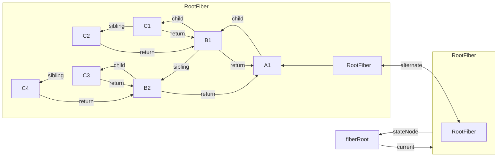
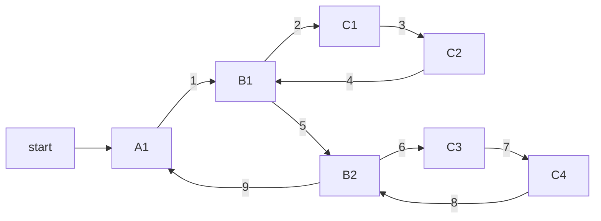

## 结构：

```mermaid
%% flowchart LR
flowchart RL
%% flowchart BT
%% flowchart TD
%% flowchart TB

  subgraph RootFiber [RootFiber]
    rootFiber1[RootFiber]
  end

  subgraph wip [RootFiber]
    _RootFiber---->A1--child-->B1--child-->C1--sibling-->C2

    B1--sibling-->B2
    B2--return-->A1

    B2--child-->C3
    C3--return-->B2

    C3--sibling-->C4
    C4--return-->B2

    B1--return-->A1
    C1--return-->B1
    C2--return-->B1
  end

  rootFiber1<--alternate-->_RootFiber

  fiberRoot--current-->RootFiber
  RootFiber--stateNode-->fiberRoot
```

## 遍历过程:

```mermaid
flowchart LR
%% flowchart TD
start-->A1--1-->B1--2-->C1--3-->C2

C2--4-->B1
B1--5-->B2
B2--9-->A1
B2--6-->C3
C3--7-->C4
C4--8-->B2
```