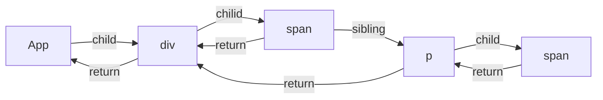

## 一.completeWork
completeUnitOfWork 中我们发现，遍历阶段的入口函数是beginWork，但回溯阶段的入口却不是completeWork，而是 completeUnitOfWork，事实上 completeUnitOfWork 内部会执行 completeWork ，接下来我们先分析 completeUnitOfWork

1. performUnitOfWork 中调用 completeUnitOfWork
```javaScript
  function performUnitOfWork(unitOfWork) {
    // The current, flushed, state of this fiber is the alternate. Ideally
    // nothing should rely on this, but relying on it here means that we don't
    // need an additional field on the work in progress.
    var current = unitOfWork.alternate;
    setCurrentFiber(unitOfWork);
    var next;

    if ((unitOfWork.mode & ProfileMode) !== NoMode) {
      startProfilerTimer(unitOfWork);
      next = beginWork$1(current, unitOfWork, subtreeRenderLanes);
      stopProfilerTimerIfRunningAndRecordDelta(unitOfWork, true);
    } else {
      next = beginWork$1(current, unitOfWork, subtreeRenderLanes);
    }

    resetCurrentFiber();
    unitOfWork.memoizedProps = unitOfWork.pendingProps;

    if (next === null) {
      // If this doesn't spawn new work, complete the current work.
      completeUnitOfWork(unitOfWork);
    } else {
      workInProgress = next;
    }

    ReactCurrentOwner$2.current = null;
  }
```

2. completeUnitOfWork 中调用 completeWork
```javaScript
  function completeUnitOfWork(unitOfWork) {
    // Attempt to complete the current unit of work, then move to the next
    // sibling. If there are no more siblings, return to the parent fiber.
    var completedWork = unitOfWork;

    do {
      // The current, flushed, state of this fiber is the alternate. Ideally
      // nothing should rely on this, but relying on it here means that we don't
      // need an additional field on the work in progress.
      var current = completedWork.alternate;
      var returnFiber = completedWork.return; // Check if the work completed or if something threw.

      if ((completedWork.flags & Incomplete) === NoFlags) {
        setCurrentFiber(completedWork);
        var next = void 0;

        if ((completedWork.mode & ProfileMode) === NoMode) {
          // 为传入的节点执行completeWork
          next = completeWork(current, completedWork, subtreeRenderLanes);
        } else {
          startProfilerTimer(completedWork);
          next = completeWork(current, completedWork, subtreeRenderLanes); // Update render duration assuming we didn't error.

          stopProfilerTimerIfRunningAndRecordDelta(completedWork, false);
        }

        resetCurrentFiber();

        if (next !== null) {
          // Completing this fiber spawned new work. Work on that next.
          // completedWork派生出其他子节点时，回到beginWork阶段继续执行
          workInProgress = next;
          return;
        }

        resetChildLanes(completedWork);

        if (returnFiber !== null && // Do not append effects to parents if a sibling failed to complete
          (returnFiber.flags & Incomplete) === NoFlags) {
          // Append all the effects of the subtree and this fiber onto the effect
          // list of the parent. The completion order of the children affects the
          // side-effect order.
          if (returnFiber.firstEffect === null) {
            returnFiber.firstEffect = completedWork.firstEffect;
          }

          if (completedWork.lastEffect !== null) {
            if (returnFiber.lastEffect !== null) {
              returnFiber.lastEffect.nextEffect = completedWork.firstEffect;
            }

            returnFiber.lastEffect = completedWork.lastEffect;
          } // If this fiber had side-effects, we append it AFTER the children's
          // side-effects. We can perform certain side-effects earlier if needed,
          // by doing multiple passes over the effect list. We don't want to
          // schedule our own side-effect on our own list because if end up
          // reusing children we'll schedule this effect onto itself since we're
          // at the end.


          var flags = completedWork.flags; // Skip both NoWork and PerformedWork tags when creating the effect
          // list. PerformedWork effect is read by React DevTools but shouldn't be
          // committed.

          if (flags > PerformedWork) {
            if (returnFiber.lastEffect !== null) {
              returnFiber.lastEffect.nextEffect = completedWork;
            } else {
              returnFiber.firstEffect = completedWork;
            }

            returnFiber.lastEffect = completedWork;
          }
        }
      } else {
        // This fiber did not complete because something threw. Pop values off
        // the stack without entering the complete phase. If this is a boundary,
        // capture values if possible.
        var _next = unwindWork(completedWork); // Because this fiber did not complete, don't reset its expiration time.


        if (_next !== null) {
          // If completing this work spawned new work, do that next. We'll come
          // back here again.
          // Since we're restarting, remove anything that is not a host effect
          // from the effect tag.
          _next.flags &= HostEffectMask;
          workInProgress = _next;
          return;
        }

        if ((completedWork.mode & ProfileMode) !== NoMode) {
          // Record the render duration for the fiber that errored.
          stopProfilerTimerIfRunningAndRecordDelta(completedWork, false); // Include the time spent working on failed children before continuing.

          var actualDuration = completedWork.actualDuration;
          var child = completedWork.child;

          while (child !== null) {
            actualDuration += child.actualDuration;
            child = child.sibling;
          }

          completedWork.actualDuration = actualDuration;
        }

        if (returnFiber !== null) {
          // Mark the parent fiber as incomplete and clear its effect list.
          returnFiber.firstEffect = returnFiber.lastEffect = null;
          returnFiber.flags |= Incomplete;
        }
      }

      var siblingFiber = completedWork.sibling;

      // 若存在兄弟节点 则进入其beginWork流程
      if (siblingFiber !== null) {
        // If there is more work to do in this returnFiber, do that next.
        workInProgress = siblingFiber;
        return;
      } // Otherwise, return to the parent

      // 不存在兄弟节点 则进入父节点的completeWork流程
      completedWork = returnFiber; // Update the next thing we're working on in case something throws.

      workInProgress = completedWork;
    } while (completedWork !== null); // We've reached the root.

    // 回溯到根节点时，设置根节点状态
    if (workInProgressRootExitStatus === RootIncomplete) {
      workInProgressRootExitStatus = RootCompleted;
    }
  }
```

### 接下来分析completeWork的具体逻辑

completeWork 主要实例代码在这里
```javaScript
// 服务端渲染的逻辑
if (_wasHydrated) {
  // TODO: Move this and createInstance step into the beginPhase
  // to consolidate.
  if (prepareToHydrateHostInstance(workInProgress, rootContainerInstance, currentHostContext)) {
    // If changes to the hydrated node need to be applied at the
    // commit-phase we mark this as such.
    markUpdate(workInProgress);
  }
} else {
  // 为当前fiber创建dom实例
  var instance = createInstance(type, newProps, rootContainerInstance, currentHostContext, workInProgress);

  // 将子孙dom节点追加到当前创建的dom节点上
  appendAllChildren(instance, workInProgress, false, false);

  // 将当前创建的挂载到stateNode属性上
  workInProgress.stateNode = instance; // Certain renderers require commit-time effects for initial mount.
  // (eg DOM renderer supports auto-focus for certain elements).
  // Make sure such renderers get scheduled for later work.

  // 处理props（绑定回调，设置dom属性...）
  if (finalizeInitialChildren(instance, type, newProps, rootContainerInstance)) {
    markUpdate(workInProgress);
  }
}
```


#### 具体实例代码：case 为 hostComponent
```javaScript
function completeWork(
  current: Fiber | null,
  workInProgress: Fiber,
  renderLanes: Lanes,
): Fiber | null {
  const newProps = workInProgress.pendingProps;
  popTreeContext(workInProgress);
  switch (workInProgress.tag) {
    case HostComponent: {
      popHostContext(workInProgress);
      const rootContainerInstance = getRootHostContainer();
      const type = workInProgress.type;
      if (current !== null && workInProgress.stateNode != null) {
       // update的流程，暂时先不关注
       // ...

      } else {
        const currentHostContext = getHostContext();
        const wasHydrated = popHydrationState(workInProgress);
        if (wasHydrated) {
         // 服务端渲染的逻辑 咱不关注
        } else {
          // 为当前fiber创建dom实例
          const instance = createInstance(
            type,
            newProps,
            rootContainerInstance,
            currentHostContext,
            workInProgress,
          );
          // 将子孙dom节点追加到当前创建的dom节点上
          appendAllChildren(instance, workInProgress, false, false);
          // 将当前创建的挂载到stateNode属性上
          workInProgress.stateNode = instance;
          // 处理props（绑定回调，设置dom属性...）
          if (
            finalizeInitialChildren(
              instance,
              type,
              newProps,
              rootContainerInstance,
              currentHostContext,
            )
          ) {
            markUpdate(workInProgress);
          }
        }
        // ref属性相关逻辑
        if (workInProgress.ref !== null) {
          markRef(workInProgress);
        }
      }
      return null;
    }
  }
}
```
completeWork内部仍会对不同tag类型进入不同case，我们还是重点关注hostComponent类型的逻辑，他会根据current状态进入不同逻辑，我们分析首屏渲染时的逻辑，发现主要有以下几步:

1. createInstance 为当前fiber创建dom实例
```javaScript
createInstance =>
createElement => 
document.createElement
```
2. appendAllChildren 遍历所有同级子代节点，执行父节点的appenChild方法，即此方法会将所有子dom节点与当前创建的dom实例连接

3. 赋值stateNode属性

4. finalizeInitialChildren 处理props

至此，首屏渲染时render阶段的大体流程就梳理完了，现在我们可以捋一下beginWork与completeWork这二者是如何相互配合共同完成fiebr树的构建的。

## 二.这里以一个简单的jsx结构为例：
beginWork与completeWork这二者是如何相互配合共同完成fiebr树的构建的。
```javaScript
return (
    <>
      <div>
        <span>age: 18</span>
        <p>
          <span>name: zs</span>
        </p>
      </div>
    </>
);
```

1. 执行div的beginWork，创建第一个span1对应的fiber节点与p对应的fiber节点，同时会将span.sibling指向p，使得span执行完completeWork可以进入p的beginWork阶段
2. 执行span的beginWork
3. 执行span的completeWork
4. 执行p的beginWork
5. 执行span2的completeWork
6. 执行span2的completeWork
7. 执行p的completeWork
8. 执行div的completeWork

最终会得到这样的一颗Fiber树:


至此，render阶段全部工作已经完成，我们得到了WIP以及对应的dom树，会被赋值给fiberRoot.finisheWork，接下来的工作就是将渲染WIP，也就是提交阶段（commit）的流程。