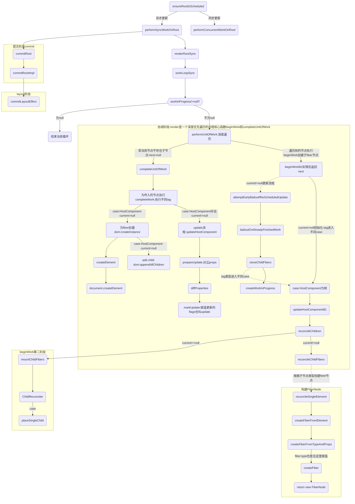

## fiber 协调过程
```
React源码-fiber树的协调与渲染\01_2_mermaid.md

FiberRootNode 
```


```mermaid
flowchart TD
%% flowchart LR
  A0A(ensureRootIsScheduled)--同步更新-->A0A1(performConcurrentWorkOnRoot)
  A0A--异步更新-->A0A2(performSyncWorkOnRoot)

  A0A2(performSyncWorkOnRoot)-->A2
  A0A2-->D1
  A2(renderRootSync)-->A3(workLoopSync)-->A0Aif

  A0Aif{{workInProgress!=null?}}--不为null-->A4
  A0Aif--为null-->endW(结束当前循环)

subgraph render1[协调阶段:render是一个深度优先遍历的过程核心函数beginWork和completeUnitOfWork]

  A4(performUnitOfWork:深度遍历)

  A4--遍历到的节点执行beginWork创建子fiber节点-->A5(beginWork$1处理完返回next)

  A4--若当前节点不存在子节点:next=null-->A6B(completeUnitOfWork)
  
  A5--current=null初始化:tag进入不同case-->A6A(case:HostComponent为例)-->A6A1(updateHostComponent$1)-->A6A2(reconcileChildren)--current!=null-->A6A3(reconcileChildFibers)

  A5-.current!=null更新流程.->A51(attemptEarlyBailoutIfNoScheduledUpdate)-->A52(bailoutOnAlreadyFinishedWork)-->A53(cloneChildFibers)

  A6B-->A6B1[为传入的节点执行completeWork:执行不同tag]--case:HostComponent并且current!=null-->A6B2(update流程:updateHostComponent)-->A6A1A(prepareUpdate:对比props)-->A6A1B(diffProperties)-->A6A1C(markUpdate:赋值更新的flags也叫update)

  A6B1--case:HostComponent-current=null-->A6B3(为fiber创建dom:createInstance)
  A6B3--case:HostComponent-current=null-->A6B4(add child dom:appendAllChildren)
  A6B3-->A6B3A(createElement)-->A6B3B(document.createElement)

  A53-->createWorkInProgress
  A53-.tag类型进入不同case.->A6A
end

subgraph render2[构建FiberNode]
  A6A3-.根据子节点类型创建fiebr节点.->B1(reconcileSingleElement) --> B2(createFiberFromElement) --> B3(createFiberFromTypeAndProps) --fiber.type也是在这里赋值--> B4(createFiber)--> B5(return new FiberNode)
end

subgraph beginWork2[beginWork第二阶段]
  A6A2--current==null-->C1(mountChildFibers)-->C2(ChildReconciler)--case-->C3(placeSingleChild)
end

%% 提交阶段commit:15_3_commit阶段.md
subgraph commit[提交阶段commit]
  D1(commitRoot)-->D2(commitRootImpl)
end

%% layout阶段:15_3_commit阶段.md
subgraph layout[layout阶段]
  D2-->E1(commitLayoutEffect)
end
```