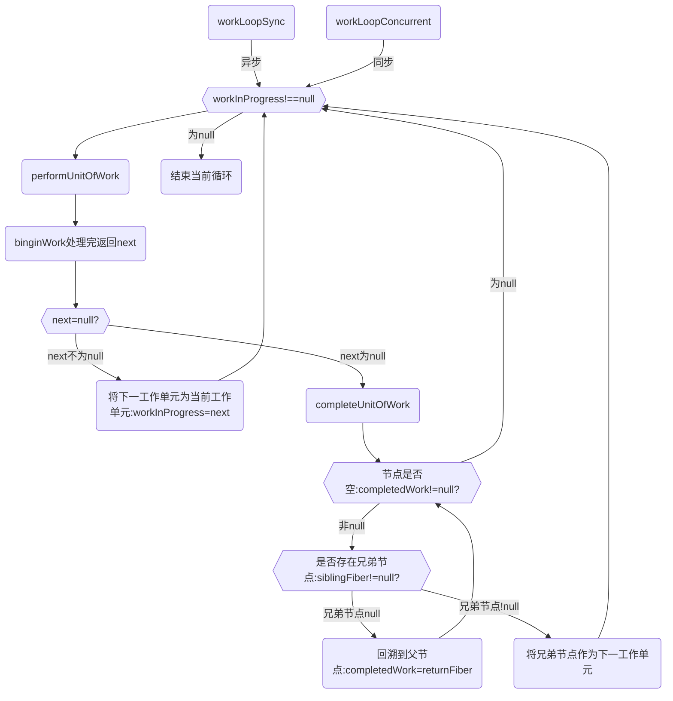
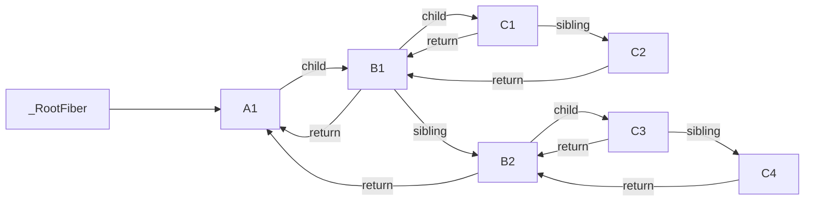

参考：https://www.jianshu.com/p/c87cc324756f

## 4.2 遍历流程
Tree 构建的遍历顺序，它会以旧的fiber tree为蓝本，把每个fiber作为一个工作单元，自顶向下逐节点构造workInProgress tree（构建中的新fiber tree）:

深度优先遍历
1. 从顶点开始遍历
2. 如果有子节点，先遍历子节点；
3. 如果没有子节点，则看有没有兄弟节点，有则遍历兄弟节点，并把effect向上归并
4. 如果没有兄弟节点，则看有没有父兄弟节点，有则遍历父兄弟节点
5. 如果没有都没有了，那么遍历结束





## 二. 链表的遍历
引入fiber前，React遍历节点的方式是n叉树的深度优先遍历，而引入fiber后是对对多种单向链表的遍历：
```
由 fiber.child 连接的父 -> 子链表的遍历
由 fiber.return 连接的子 -> 父链表的遍历
由 fiber.sibling 连接的兄 -> 弟链表的遍历
```
这三种链表的遍历主要通过beginWork和completeWork两个方法进行，我们来重点分析一下这两个方法。

### 2-1 beginWork
参数：
1. current：当前组件在current fiber tree中对应的fiber节点，即 workInProgress.alternate；
2. workInProgress：当前组件在 workInProgress fiber tree中对应的fiber节点，即current.alternate；<br>
   current fiber tree和workInProgress fiber tree中的fiber节点通过alternate属性进行连接的。
3. renderLanes：此次render的优先级；

```
%% mermaid
%% flowchart TD

beginWork-->根据传入的fiber节点创建--->A2(当前workInProgress fiber节点的所有次级workInProgress fiber节点)

这些次级节点会通过fiber.sibling进行连接,并将当前workInProgress fiber节点于次级的
第一个workInProgress fiber通过fiber.child属性连接起来。
```

```javascript
function beginWork(
  current: Fiber | null,
  workInProgress: Fiber,
  renderLanes: Lanes,
): Fiber | null {
  //...

  if (current !== null) {
    //update时
    //...
  } else {
    //mount时
    didReceiveUpdate = false;
  }

  //...

  //根据tag不同，创建不同的子Fiber节点
  switch (workInProgress.tag) {
    case IndeterminateComponent: 
      // ...省略
    case LazyComponent: 
      // ...省略
    case FunctionComponent: 
      // ...省略
    case ClassComponent: 
      // ...省略
    case HostRoot:
      // ...省略
    case HostComponent:
      // ...省略
    case HostText:
      // ...省略
    // ...省略其他类型
  }
}
```

### 2-2 首次渲染
首次渲染， workInProgress fiber tree中除了根节点之外，所有节点的alternate都为空。

所以在mount时，除了根节点fiberRootNode之外，其余节点调用beginWork时参数current等于null。

直接将didReceiveUpdate赋值为false。
此处mount和update的不同主要体现在在didReceiveUpdate的赋值逻辑的不同， 后续进入diff阶段后，
针对mount和update，diff的逻辑也会有所差别。
```javascript
const updateLanes = workInProgress.lanes;
if (current !== null) {
  //update时
  //...
} else {
  //mount时
  didReceiveUpdate = false;
}
```

### 2-3 update时
workInProgress fiber tree所有节点都存在上一次更新时的fiber节点，所以current !== null。

当current和workInProgress满足一定条件时,可以复用current节点的子节点的作为workInProgress的子节点，
反之则需要进入对比（diff）的流程，根据比对的结果创建workInProgress的子节点。

beginWork在创建fiber节点的过程中中会依赖一个didReceiveUpdate变量来标识当前的current是否有更新。
在满足下面的几种情况时，didReceiveUpdate === false：

1. 未使用forceUpdate，且oldProps === newProps && workInProgress.type === current.type && ！hasLegacyContextChanged() ，即props、fiber.type和context都未发生变化

2. 未使用forceUpdate，且!includesSomeLane(renderLanes, updateLanes)，即当前fiber节点优先级低于当前更新的优先级
```javascript
const updateLanes = workInProgress.lanes;
if (current !== null) {
  //update时
  const oldProps = current.memoizedProps;
  const newProps = workInProgress.pendingProps;
  if (
    oldProps !== newProps ||
    hasLegacyContextChanged() ||
    (__DEV__ ? workInProgress.type !== current.type : false)
  ) {
    didReceiveUpdate = true;
  } else if (!includesSomeLane(renderLanes, updateLanes)) {
    // 本次的渲染优先级renderLanes不包含fiber.lanes, 表明当前fiber节点优先级低于本次的渲染优先级，不需渲染
    didReceiveUpdate = false;
    //...
    // 虽然当前节点不需要更新，但需要使用bailoutOnAlreadyFinishedWork循环检测子节点是否需要更新
    return bailoutOnAlreadyFinishedWork(current, workInProgress, renderLanes);
  } else {
    if ((current.effectTag & ForceUpdateForLegacySuspense) !== NoEffect) {
      // forceUpdate产生的更新，需要强制渲染
      didReceiveUpdate = true;
    } else {
      didReceiveUpdate = false;
    }
  }
} else {
  //mount时
  //...
}
```

### 2-4 updateXXX
beginWork会根据当前的workInProgress.tag的不同，进入到不同的分支执行创建子Fiber节点。
主要经历了下面的几个步骤：
```
1.计算当前workInProgress的fiber.memoizedState、fiber.memoizedProps等需要持久化的数据

2.获取下级ReactElement对象，根据实际情况, 设置fiber.effectTag；

3.根据ReactElement对象, 调用reconcilerChildren生成下级fiber子节点，并将第一个子fiber节点赋值给
workInProgress.child。同时，根据实际情况, 设置fiber.effectTag；
```

```javascript
switch (workInProgress.tag) {
  case IndeterminateComponent: 
    // ...
  case LazyComponent: 
    // ...
  case FunctionComponent: 
    // ...
  case ClassComponent: 
    // ...
  case HostRoot:
    // ...
  case HostComponent:
    // ...
  case HostText:
    // ...
  // ...
}
```

### 2-5 updateHostComponent为例进行分析
HostComponent代表原生的 DOM 元素节点(如div,span,p等节点)，这些节点的更新会进入updateHostComponent。

在各个updateXXX函数中，会判断当前节点是否需要更新，如果不需要更新则会进入bailoutOnAlreadyFinishedWork，

并使用bailoutOnAlreadyFinishedWork的结果作为beginWork的返回值，提前beginWork，而不需要进入diff阶段。

### 2-5-1 常见的不需要更新的情况
1. updateClassComponent时若!shouldUpdate && !didCaptureError
2. updateFunctionComponent时若current !== null && !didReceiveUpdate
3. updateMemoComponent时若compare(prevProps, nextProps) && current.ref === workInProgress.ref
4. updateHostRoot时若nextChildren === prevChildren
```javascript
function updateHostComponent(
  current: Fiber | null,
  workInProgress: Fiber,
  renderLanes: Lanes,
) {
  //...

  //1. 状态计算, 由于HostComponent是无状态组件, 所以只需要收集 nextProps即可, 它没有 memoizedState
  const type = workInProgress.type;
  const nextProps = workInProgress.pendingProps;
  const prevProps = current !== null ? current.memoizedProps : null;
  // 2. 获取下级`ReactElement`对象
  let nextChildren = nextProps.children;
  const isDirectTextChild = shouldSetTextContent(type, nextProps);

  if (isDirectTextChild) {
    // 如果子节点只有一个文本节点, 不用再创建一个HostText类型的fiber
    nextChildren = null;
  } else if (prevProps !== null && shouldSetTextContent(type, prevProps)) {
  // 特殊操作需要设置fiber.effectTag 
    workInProgress.effectTag |= ContentReset;
  }
  // 特殊操作需要设置fiber.effectTag 
  markRef(current, workInProgress);
  // 3. 根据`ReactElement`对象, 调用`reconcilerChildren`生成`fiber`子节点，并将第一个子fiber节点赋值给workInProgress.child。
  reconcileChildren(current, workInProgress, nextChildren, renderLanes);
  return workInProgress.child;
}
```

### 2-6 bailoutOnAlreadyFinishedWork
bailoutOnAlreadyFinishedWork内部先会判断!includesSomeLane(renderLanes, workInProgress.childLanes)是否成立。

若!includesSomeLane(renderLanes, workInProgress.childLanes)成立则所有的子节点都不需要更新,
或更新的优先级都低于当前更新的渲染优先级。

此时以此节点为头节点的整颗子树都可以直接复用。此时会跳过整颗子树，并使用null作为beginWork的返回值（进入回溯的逻辑）；

若不成立，则表示虽然当前节点不需要更新，但当前节点存在某些fiber子节点需要在此次渲染中进行更新，则复用current fiber
生成workInProgress的次级节点；
```javascript
function bailoutOnAlreadyFinishedWork(
  current: Fiber | null,
  workInProgress: Fiber,
  renderLanes: Lanes,
): Fiber | null {
  //...

  if (!includesSomeLane(renderLanes, workInProgress.childLanes)) {
    // renderLanes 不包含 workInProgress.childLanes
    // 所有的子节点都不需要在本次更新进行更新操作，直接跳过，进行回溯
    return null;
  } 

  //...

  // 虽然此节点不需要更新，此节点的某些子节点需要更新，需要继续进行协调
  cloneChildFibers(current, workInProgress);
  return workInProgress.child;
}
```

### 2-7 effectTag 用于保存要执行DOM操作的具体类型
上面我们介绍到在updateXXX的主要逻辑中，在获取下级ReactElement以及根据ReactElement对象, 调用reconcileChildren生成fiber子节点时，
都会根据实际情况，进行effectTag的设置。那么effectTag的作用到底是什么呢？

reconciler 的目的之一就是负责找出变化的组件，随后通知Renderer需要执行的DOM操作，effectTag正是用于保存要执行DOM操作的具体类型。

effectTag通过二进制表示：
```javascript
//...
// 意味着该Fiber节点对应的DOM节点需要插入到页面中。
export const Placement = /*                    */ 0b000000000000010;
//意味着该Fiber节点需要更新。
export const Update = /*                       */ 0b000000000000100;
export const PlacementAndUpdate = /*           */ 0b000000000000110;
//意味着该Fiber节点对应的DOM节点需要从页面中删除。
export const Deletion = /*                     */ 0b000000000001000;
//...
```
通过这种方式保存effectTag可以方便的使用位操作为fiber赋值多个effect以及判断当前fiber是否存在某种effect。
> React 的优先级 lane 模型中同样使用了二进制的方式来表示优先级。

## 三 reconcileChildren : diff 执行的地方
updateXXX函数中，会根据获取到的下级ReactElement对象, 调用reconcileChildren
生成当前workInProgress fiber节点的下级fiber子节点。
双缓冲机制:
```
在协调阶段，React利用diff算法，将产生update的ReactElement与current fiber tree中对应的节点进行比较，

并最终在内存中生成workInProgress fiber tree。随后Renderer会依据workInProgress fiber tree将update渲染到页面上。

同时根节点的current属性会指向workInProgress fiber tree，此时workInProgress fiber tree就变为current fiber tree。
```
本文的重点是reconciler 进行协调的过程，只需要了解reconcileChildren函数的目的，
不会对reconcileChildren中的diff算法的实现做更深入的了解，对React的diff算法:
> https://juejin.cn/post/7040030267636973605

### 3-1 reconcileChildren也会通过current === null 区分mount与update，再分别执行不同的工作：
```javascript
export function reconcileChildren(
  current: Fiber | null,
  workInProgress: Fiber,
  nextChildren: any,
  renderLanes: Lanes
) {
  if (current === null) {
    // 对于mount的组件
    workInProgress.child = mountChildFibers(
      workInProgress,
      null,
      nextChildren,
      renderLanes,
    );
  } else {
    // 对于update的组件
    workInProgress.child = reconcileChildFibers(
      workInProgress,
      current.child,
      nextChildren,
      renderLanes,
    );
  }
}
```

### 3-2 mountChildFibers与reconcileChildFibers的都是通过 ChildReconciler 生成的。
```javascript
/*
* 他们的不同点在于shouldTrackSideEffects参数的不同，当shouldTrackSideEffects为true时会为生成的fiber节点收集effectTag属性，
* 反之不会进行收集effectTag属性。
* */
var reconcileChildFibers = ChildReconciler(true);
var mountChildFibers = ChildReconciler(false);

function ChildReconciler(shouldTrackSideEffects) {
   //...

   function reconcileChildrenArray(
           returnFiber: Fiber,
           currentFirstChild: Fiber | null,
           newChildren: Array<*>,
           lanes: Lanes,
   ): Fiber | null {
      //... 
   }

   //...

   function reconcileSingleElement(
           returnFiber: Fiber,
           currentFirstChild: Fiber | null,
           element: ReactElement,
           lanes: Lanes,
   ): Fiber {
      //... 
   }

   //...

   function reconcileChildFibers(
           returnFiber: Fiber,
           currentFirstChild: Fiber | null,
           newChild: any,
           lanes: Lanes,
   ): Fiber | null {
      //... 
   }

   return reconcileChildFibers;
}
```
这样做的目的是提升commit阶段的效率。如果mountChildFibers也会赋值effectTag，由于mountChildFibers的节点都是首次渲染的，所以他们的
effectTag都会收集到Placement effectTag。那么commit阶段在执行DOM操作时，会导致每个fiber节点都需要进行插入操作。为了解决这个问题，
在mount时只有根节点会进行effectTag的收集，在commit阶段只会执行一次插入操作。

### 3-2-1 ChildReconciler
ChildReconciler内部定义了许多用于操作fiber节点的函数，并最终会使用一个名为 reconcileChildFibers 的函数作为返回值。
这个函数的主要目的是生成当前workInProgress fiber节点的下级fiber节点，并将第一个子fiber节点作为本次beginWork返回值。
```javaScript
export const reconcileChildFibers = ChildReconciler(true);
export const mountChildFibers = ChildReconciler(false);

function ChildReconciler(shouldTrackSideEffects) {
  //...

  function reconcileChildrenArray(
    returnFiber: Fiber,
    currentFirstChild: Fiber | null,
    newChildren: Array<*>,
    lanes: Lanes,
  ): Fiber | null { 
    //... 
  }

  //...

  function reconcileSingleElement(
    returnFiber: Fiber,
    currentFirstChild: Fiber | null,
    element: ReactElement,
    lanes: Lanes,
  ): Fiber {
    //... 
  }

  //...

  function reconcileChildFibers(
    returnFiber: Fiber,
    currentFirstChild: Fiber | null,
    newChild: any,
    lanes: Lanes,
  ): Fiber | null {
    //... 
  }
  
  return reconcileChildFibers;
}
```

reconcileChildFibers的执行过程中除了向下生成子节点之外，还会进行下列的操作：
1. 把即将要在commit阶段中要对dom节点进行的操作（如新增,移动: Placement, 删除: Deletion）收集到effectTag中；
2. 对于被删除的fiber节点, 除了节点自身的effectTag需要收集Deletion之外, 还要将其添加到父节点的effectList中(正常effectList的收集是在 
   completeWork中进行的, 但是被删除的节点会脱离fiber树, 无法进入completeWork的流程, 所以在beginWork阶段提前加入父节点的effectList)。
```
在遍历的流程中我们可以看到，beginWork返回值不为空时，会把该值赋值给workInProgress，作为下一次的工作单元，
即完成了父 -> 子链表中的一个节点的遍历。beginWork返回值为空时我们将进入completeWork。
```

## 接下来看
Reconciler-completeUnitOfWork