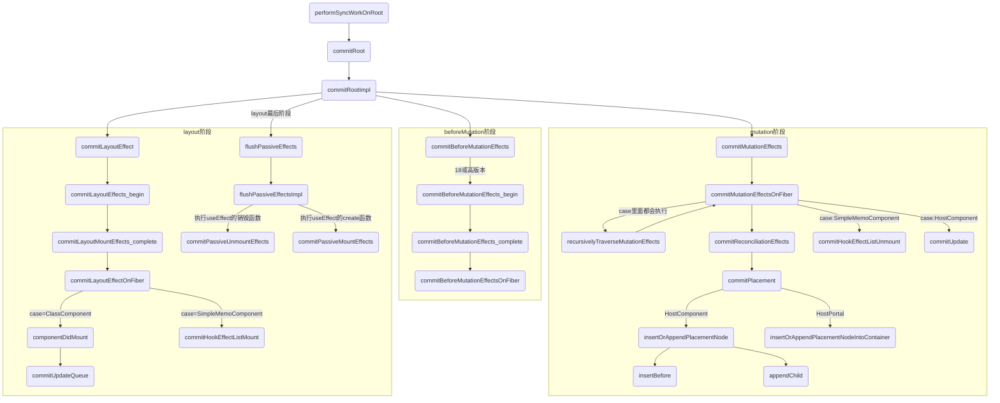

## commit流程 辅助文件 mermaid

```mermaid
flowchart TD
%% flowchart LR

A(performSyncWorkOnRoot)-->B1(commitRoot)-->C1(commitRootImpl)-->2A

C1(commitRootImpl)-->3A
C1-->4A
C1--layout最后阶段-->5A

subgraph befor[beforeMutation阶段]
  2A(commitBeforeMutationEffects)--18或高版本-->2B(commitBeforeMutationEffects_begin)-->2C(commitBeforeMutationEffects_complete)-->2D(commitBeforeMutationEffectsOnFiber)
end

subgraph Mutation[mutation阶段]
  3A(commitMutationEffects)-->3B(commitMutationEffectsOnFiber)--case里面都会执行-->3C(recursivelyTraverseMutationEffects)

  3C-->3B
  3B-->3D1(commitReconciliationEffects)-->3E(commitPlacement)
  3B--case:SimpleMemoComponent-->3D2(commitHookEffectListUnmount)
  3B--case:HostComponent-->3D3(commitUpdate)
  3E--HostComponent-->3E1(insertOrAppendPlacementNode)-->3E1a(insertBefore)
  3E--HostPortal-->3E2(insertOrAppendPlacementNodeIntoContainer)

  3E1-->3E1b(appendChild)
end

subgraph layout[layout阶段]
  4A(commitLayoutEffect)-->4B(commitLayoutEffects_begin)-->4C(commitLayoutMountEffects_complete)-->4D(commitLayoutEffectOnFiber)

  4D--case=ClassComponent-->4E1(componentDidMount)-->4E2(commitUpdateQueue)
  4D--case=SimpleMemoComponent-->4E3(commitHookEffectListMount)

  5A(flushPassiveEffects)-->5B(flushPassiveEffectsImpl)
  5B--执行useEffect的销毁函数-->5C1(commitPassiveUnmountEffects)
  5B--执行useEffect的create函数-->5C2(commitPassiveMountEffects)
end
```