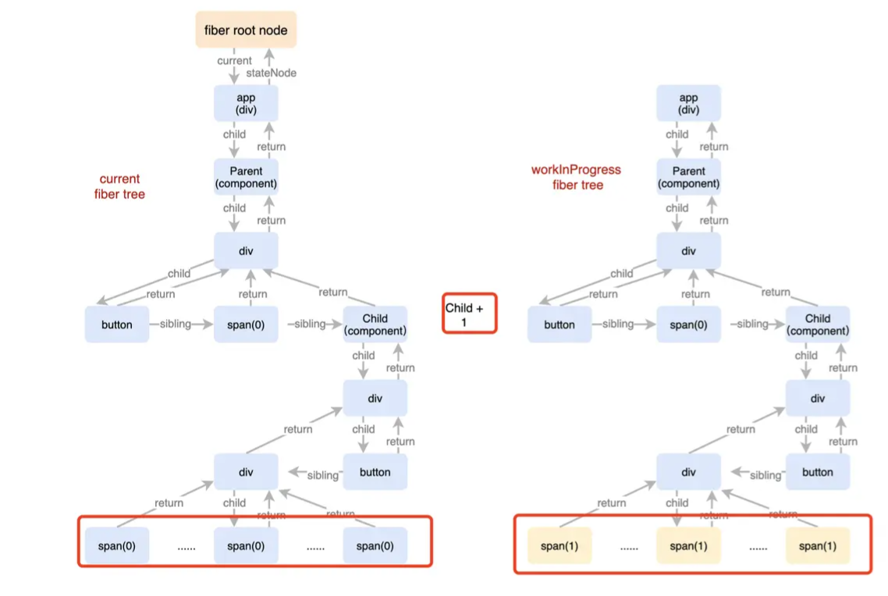
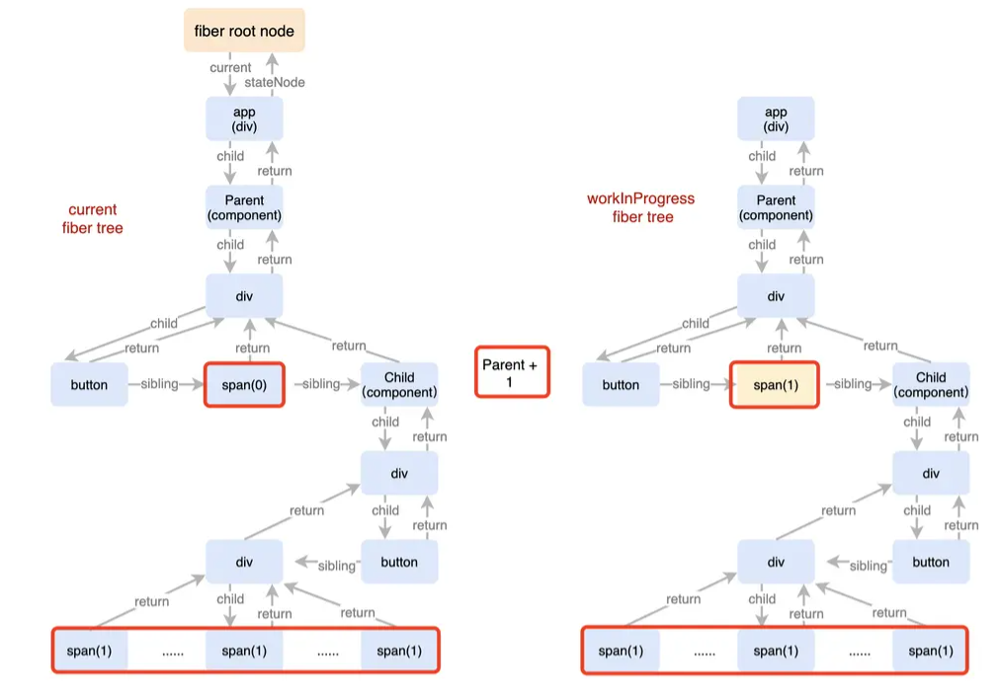
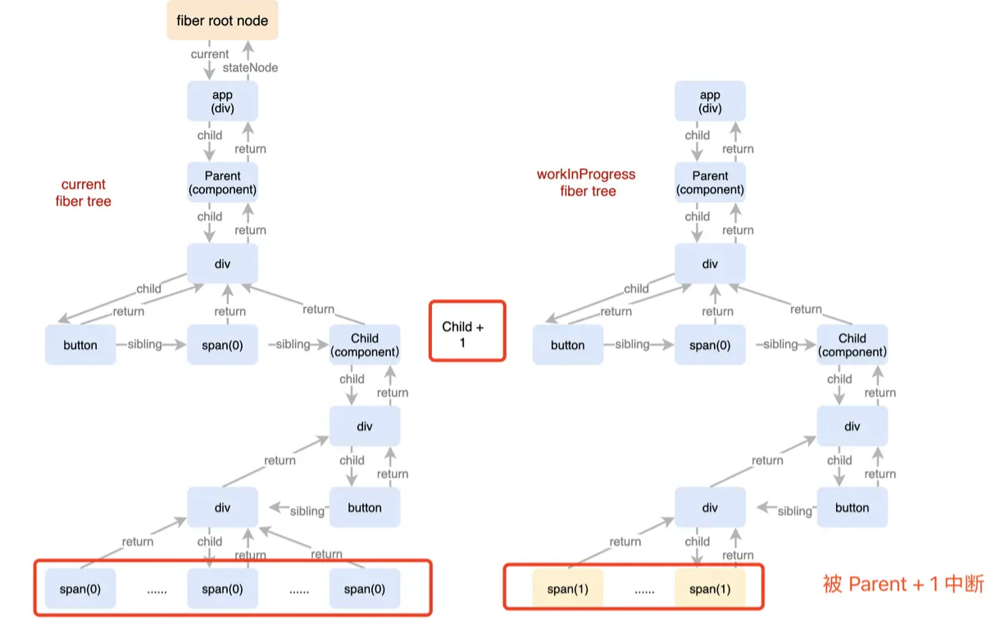
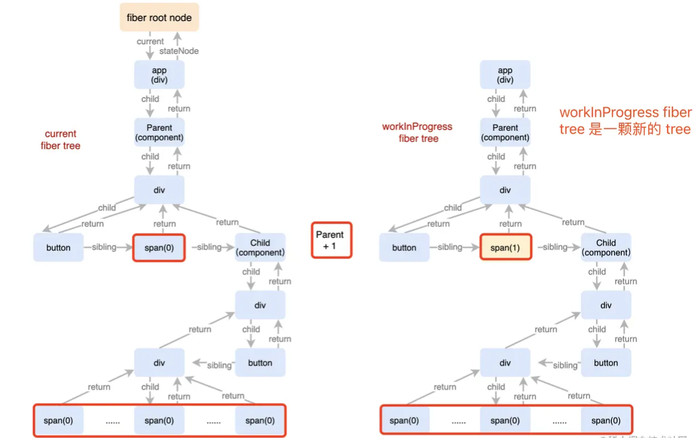

参考：
https://juejin.cn/post/6993275270866141221


## 总结
```
为什么 React 要采取双缓存 fiber tree 结构了?

current fiber tree，记录上一次更新结束的状态；workInProgree fiber tree，更新过程中创建的 new tree，可随着更新优先级的变化随时重置。
```


## 关于 Concurrent
> Concurrent 模式是一组 React 的新功能，可帮助应用保持响应，并根据用户的设备性能和网速进行适当的调整。

Concurrent 是 React 提供的新的特性，最关键的一点就是将原来的同步不可中断的更新变为可中断的异步更新。
同步不可中断更新，意味着在更新过程中，即使产生了更高优先级的更新，原来的更新也会继续处理，等处理完毕渲染到屏幕上以后才会开始处理更高优先级的更新。
而异步可中断更新，意味着同样的情况，原来的更新可先中断，优先处理更高优先级的更新，处理完毕之后才处理原来被中断的更新。

### 例子
我们点击 Child 的 button 按钮，同时给 Child 和 Parent 的 number 加 1。其中 Child 的加 1 操作先开始，并且 Parent 的加 1 操作优先级更高。

```javaScript
function Parent() {
    const [number, setNumber] = useState(1);
    const buttonRef = useRef(null);
    const add = () => { setNumber(number + 1) }
    const click = () => { buttonRef.current.click() }
    return (
        <div>
            <button ref={buttonRef} onClick={add}>修改 Parent</button>
            <span>{number}</span>
            <Child callback={click} />
        </div>
    )
 }

const Child = (props) => {
    const [number, setNumber] = useState(1);
    const click = () => {
        setTimeout(() => {
            // setTimeout 内部产生的更新，优先级为普通优先级
            setNumber(number + 1);
        }, 10)
        setTimeout(() => {
            // click 触发的更新，优先级为用户 block 优先级，要更高一些
            props.callback && props.callback();
        }, 10);
     }

    return (
        <div>
            <button onClick={click}>修改 Child + Parent</button>
            <div  className="box">
                {Array(50000).fill(number).map(item => (<span>{item}</span>))}
            </div>
        </div>
                
    )
}
```


#### 不可中断更新：
```javaScript
ReactDOM.render(<Parent />, document.geElementById('app'));
/*
观察示例，可以很明显的看到 Child 的加 1 操作先于 Parent 的加 1 操作完成。尽管 Parent 的加 1 操作优先级更高，但仍需要等待 Child 的加 1 操作完成以后才会进行。
*/
```
内部工作过程如下：


### 可中断更新：
```javaScript
ReactDOM.createRoot(document.getElementById('app')).render(<Parent />);
/*
示例中可以很明显的看到 Parent 的加 1 操作先完成。在 Concurrent 模式下，尽管 Child 的加 1 操作先开始，但会被 Parent 的加 1 操作中断，等 Parent 的加 1 操作完成以后才会继续。
*/
```
内部工作过程如下：




异步可中断更新，体现在 fiber tree 上，就是 workInProgress fiber tree 的构建整个过程是可中断的。

在构建 workInProgress 的过程中，如果有更高优先级的更新产生， React 会停止 workInProgress fiber tree 的构建，然后开始处理更高优先级的更新，重新构建 workInProgress fiber tree。
等更高优先级的更新处理完毕之后，才会处理原来被中断的更新。

### 对应的源码如下：
```javaScript
// 可中断渲染过程
function renderRootConcurrent(root, lanes) {
  ...
  // workInProgressRootRenderLanes !== lanes，意味着有更高优先级的更新需要处理
  if (workInProgressRoot !== root || workInProgressRootRenderLanes !== lanes) {
    ...
    // 我们就可以清楚的看到优先级变更导致 workInProgress fiber tree 重置的过程。
    console.log('重置 workInProgress tree', workInProgressRootRenderLanes, lanes)
    // 原来的更新中断，从头开始构建 workInProgress tree
    prepareFreshStack(root, lanes);
    ...
  }
  ...
}
```

```javaScript
function prepareFreshStack(root, lanes) {
  ...
  workInProgressRoot = root;
  // 从头开始构建 workInProgress tree
  workInProgress = createWorkInProgress(root.current, null);
  ...
}
```
