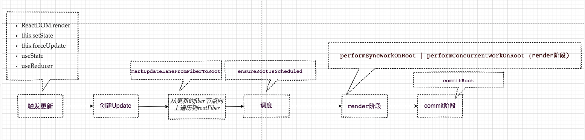

上一节我们介绍了react两种模式的入口函数到render阶段的调用过程，也就是mount首次渲染的流程，这节我们介绍在更新状态之后到render阶段的流程。
在react中触发状态更新的几种方式：
```
ReactDOM.render

this.setState

this.forceUpdate

useState

useReducer
```
# 我们重点看下重点看下this.setState和this.forceUpdate，hook在第11章讲

流程：1.首先调用 this.setState 或则 this.forceUpdate更新
C:\Users\ruo\AppData\Roaming\npm\node_modules\react-dom\cjs\react-dom.development.js
```js
var classComponentUpdater = {
  isMounted: isMounted,
  enqueueSetState: function (inst, payload, callback) {
  	//payload表示更新后的值
    console.log("enqueueSetState--->状态更新",inst, payload, callback)
    //1.获取fiber节点
    var fiber = get(inst);
    var eventTime = requestEventTime();
    //2.获取优先级更新相关lane
    var lane = requestUpdateLane(fiber);
    //3.创建update 对象
    var update = createUpdate(eventTime, lane);
    update.payload = payload;

    if (callback !== undefined && callback !== null) {
      {
        warnOnInvalidCallback(callback, 'setState');
      }

      update.callback = callback;
    }
    //4.将update 对象加入到 queue
    enqueueUpdate(fiber, update);
    //最后调用scheduleUpdateOnFiber 调度 fiber节点
    scheduleUpdateOnFiber(fiber, lane, eventTime);
  },
```
2.触发之后会创建 update对象，这个对象会挂载一些更新信息或状态,之后加入到 updateQueue


## 1.this.setState内调用this.updater.enqueueSetState
C:\Users\ruo\AppData\Roaming\npm\node_modules\react\cjs
```js
Component.prototype.setState = function (partialState, callback) {
  if (!(typeof partialState === 'object' || typeof partialState === 'function' || partialState == null)) {
    {
      throw Error( "setState(...): takes an object of state variables to update or a function which returns an object of state variables." );
    }
  }
  this.updater.enqueueSetState(this, partialState, callback, 'setState');
};
```
调用 enqueueSetState()
```
加入 enqueueUpdate()
然后再调度任务 scheduleUpdateOnFiber()
```
在scheduleUpdateOnFiber(fiber, lane, eventTime); 中调用
markUpdateLaneFromFiberToRoot(),从更新的fiber节点向上遍历到rootFiber

2.scheduleUpdateOnFiber()最后会调用 ensureRootIsScheduled调度
```js
function scheduleUpdateOnFiber(fiber, lane, eventTime) {
  checkForNestedUpdates();
  warnAboutRenderPhaseUpdatesInDEV(fiber);
  var root = markUpdateLaneFromFiberToRoot(fiber, lane);

  if (root === null) {
    warnAboutUpdateOnUnmountedFiberInDEV(fiber);
    return null;
  } // Mark that the root has a pending update.


  markRootUpdated(root, lane, eventTime);

  if (root === workInProgressRoot) {
    // Received an update to a tree that's in the middle of rendering. Mark
    // that there was an interleaved update work on this root. Unless the
    // `deferRenderPhaseUpdateToNextBatch` flag is off and this is a render
    // phase update. In that case, we don't treat render phase updates as if
    // they were interleaved, for backwards compat reasons.
    {
      workInProgressRootUpdatedLanes = mergeLanes(workInProgressRootUpdatedLanes, lane);
    }

    if (workInProgressRootExitStatus === RootSuspendedWithDelay) {
      // The root already suspended with a delay, which means this render
      // definitely won't finish. Since we have a new update, let's mark it as
      // suspended now, right before marking the incoming update. This has the
      // effect of interrupting the current render and switching to the update.
      // TODO: Make sure this doesn't override pings that happen while we've
      // already started rendering.
      markRootSuspended$1(root, workInProgressRootRenderLanes);
    }
  } // TODO: requestUpdateLanePriority also reads the priority. Pass the
  // priority as an argument to that function and this one.


  var priorityLevel = getCurrentPriorityLevel();

  if (lane === SyncLane) {
    if ( // Check if we're inside unbatchedUpdates
    (executionContext & LegacyUnbatchedContext) !== NoContext && // Check if we're not already rendering
    (executionContext & (RenderContext | CommitContext)) === NoContext) {
      // Register pending interactions on the root to avoid losing traced interaction data.
      schedulePendingInteractions(root, lane); // This is a legacy edge case. The initial mount of a ReactDOM.render-ed
      // root inside of batchedUpdates should be synchronous, but layout updates
      // should be deferred until the end of the batch.

      performSyncWorkOnRoot(root);
    } else {
      ensureRootIsScheduled(root, eventTime);
      schedulePendingInteractions(root, lane);

      if (executionContext === NoContext) {
        // Flush the synchronous work now, unless we're already working or inside
        // a batch. This is intentionally inside scheduleUpdateOnFiber instead of
        // scheduleCallbackForFiber to preserve the ability to schedule a callback
        // without immediately flushing it. We only do this for user-initiated
        // updates, to preserve historical behavior of legacy mode.
        resetRenderTimer();
        flushSyncCallbackQueue();
      }
    }
  } else {
    // Schedule a discrete update but only if it's not Sync.
    if ((executionContext & DiscreteEventContext) !== NoContext && ( // Only updates at user-blocking priority or greater are considered
    // discrete, even inside a discrete event.
    priorityLevel === UserBlockingPriority$2 || priorityLevel === ImmediatePriority$1)) {
      // This is the result of a discrete event. Track the lowest priority
      // discrete update per root so we can flush them early, if needed.
      if (rootsWithPendingDiscreteUpdates === null) {
        rootsWithPendingDiscreteUpdates = new Set([root]);
      } else {
        rootsWithPendingDiscreteUpdates.add(root);
      }
    } // Schedule other updates after in case the callback is sync.


    ensureRootIsScheduled(root, eventTime);
    schedulePendingInteractions(root, lane);
  } // We use this when assigning a lane for a transition inside
```


## 2.markUpdateLaneFromFiberToRoot 在 scheduleUpdateOnFiber中调用
```
作用是合并根节点和当前节点的lane,
	//1.alternate lane也会合并
    alternate.lanes = mergeLanes(alternate.lanes, lane);
    //2. 将所有lane都合并到根节点，这样根节点就可取到所有的子节点，子孙节点的lane
	while (parent !== null) {
	    parent.childLanes = mergeLanes(parent.childLanes, lane);
	    alternate = parent.alternate;

	    if (alternate !== null) {
	      alternate.childLanes = mergeLanes(alternate.childLanes, lane);
	    } else {
	      {
	        if ((parent.flags & (Placement | Hydrating)) !== NoFlags) {
	          warnAboutUpdateOnNotYetMountedFiberInDEV(sourceFiber);
	        }
	      }
	}
```

```js
function markUpdateLaneFromFiberToRoot(sourceFiber, lane) {
  // Update the source fiber's lanes
  sourceFiber.lanes = mergeLanes(sourceFiber.lanes, lane);
  var alternate = sourceFiber.alternate;

  if (alternate !== null) {
    alternate.lanes = mergeLanes(alternate.lanes, lane);
  }

  {
    if (alternate === null && (sourceFiber.flags & (Placement | Hydrating)) !== NoFlags) {
      warnAboutUpdateOnNotYetMountedFiberInDEV(sourceFiber);
    }
  } // Walk the parent path to the root and update the child expiration time.


  var node = sourceFiber;
  var parent = sourceFiber.return;

  while (parent !== null) {
    parent.childLanes = mergeLanes(parent.childLanes, lane);
    alternate = parent.alternate;

    if (alternate !== null) {
      alternate.childLanes = mergeLanes(alternate.childLanes, lane);
    } else {
      {
        if ((parent.flags & (Placement | Hydrating)) !== NoFlags) {
          warnAboutUpdateOnNotYetMountedFiberInDEV(sourceFiber);
        }
      }
    }

    node = parent;
    parent = parent.return;
  }

  if (node.tag === HostRoot) {
    var root = node.stateNode;
    return root;
  } else {
    return null;
  }
}
```
## 3.调度 ensureRootIsScheduled 在 scheduleUpdateOnFiber()调用
```js
function ensureRootIsScheduled(root, currentTime) {
  var existingCallbackNode = root.callbackNode; // Check if any lanes are being starved by other work. If so, mark them as
  // expired so we know to work on those next.

  markStarvedLanesAsExpired(root, currentTime); // Determine the next lanes to work on, and their priority.

  var nextLanes = getNextLanes(root, root === workInProgressRoot ? workInProgressRootRenderLanes : NoLanes); // This returns the priority level computed during the `getNextLanes` call.

  var newCallbackPriority = returnNextLanesPriority();

  if (nextLanes === NoLanes) {
    // Special case: There's nothing to work on.
    if (existingCallbackNode !== null) {
      cancelCallback(existingCallbackNode);
      root.callbackNode = null;
      root.callbackPriority = NoLanePriority;
    }

    return;
  } // Check if there's an existing task. We may be able to reuse it.


  if (existingCallbackNode !== null) {
    var existingCallbackPriority = root.callbackPriority;

    if (existingCallbackPriority === newCallbackPriority) {
      // The priority hasn't changed. We can reuse the existing task. Exit.
      return;
    } // The priority changed. Cancel the existing callback. We'll schedule a new
    // one below.


    cancelCallback(existingCallbackNode);
  } // Schedule a new callback.


  var newCallbackNode;
  if (newCallbackPriority === SyncLanePriority) {
    // Special case: Sync React callbacks are scheduled on a special
    // internal queue
    newCallbackNode = scheduleSyncCallback(performSyncWorkOnRoot.bind(null, root));
  } else if (newCallbackPriority === SyncBatchedLanePriority) {
    newCallbackNode = scheduleCallback(ImmediatePriority$1, performSyncWorkOnRoot.bind(null, root));
  } else {
    var schedulerPriorityLevel = lanePriorityToSchedulerPriority(newCallbackPriority);
    newCallbackNode = scheduleCallback(schedulerPriorityLevel, performConcurrentWorkOnRoot.bind(null, root));
  }
  root.callbackPriority = newCallbackPriority;
  root.callbackNode = newCallbackNode;
} // This is the entry point for every concurrent task, i.e. anything that
```

### 这个tag标识有什么用呢
```
render阶段组件更新会根据checkHasForceUpdateAfterProcessing，和checkShouldComponentUpdate来判断，

如果Update的tag是ForceUpdate，则 checkHasForceUpdateAfterProcessing 为true，当组件是PureComponent时;  checkShouldComponentUpdate 会浅比较state和props，所以当使用this.forceUpdate一定会更新.
```
```js
function resumeMountClassInstance(workInProgress, ctor, newProps, renderLanes) {
  var instance = workInProgress.stateNode;
  var oldProps = workInProgress.memoizedProps;
  instance.props = oldProps;
  var oldContext = instance.context;
  var contextType = ctor.contextType;
  var nextContext = emptyContextObject;
	...
  var shouldUpdate = checkHasForceUpdateAfterProcessing() || checkShouldComponentUpdate(workInProgress, ctor, oldProps, newProps, oldState, newState, nextContext);
  if (shouldUpdate) {
    // In order to support react-lifecycles-compat polyfilled components,
    // Unsafe lifecycles should not be invoked for components using the new APIs.
    if (!hasNewLifecycles && (typeof instance.UNSAFE_componentWillMount === 'function' || typeof instance.componentWillMount === 'function')) {
      if (typeof instance.componentWillMount === 'function') {
        instance.componentWillMount();
      }

      if (typeof instance.UNSAFE_componentWillMount === 'function') {
        instance.UNSAFE_componentWillMount();
      }
    }

    if (typeof instance.componentDidMount === 'function') {
      workInProgress.flags |= Update;
    }
  } else {
    // If an update was already in progress, we should schedule an Update
    // effect even though we're bailing out, so that cWU/cDU are called.
    if (typeof instance.componentDidMount === 'function') {
      workInProgress.flags |= Update;
    } // If shouldComponentUpdate returned false, we should still update the
    // memoized state to indicate that this work can be reused.


    workInProgress.memoizedProps = newProps;
    workInProgress.memoizedState = newState;
  } // Update the existing instance's state, props, and context pointers even

}
```