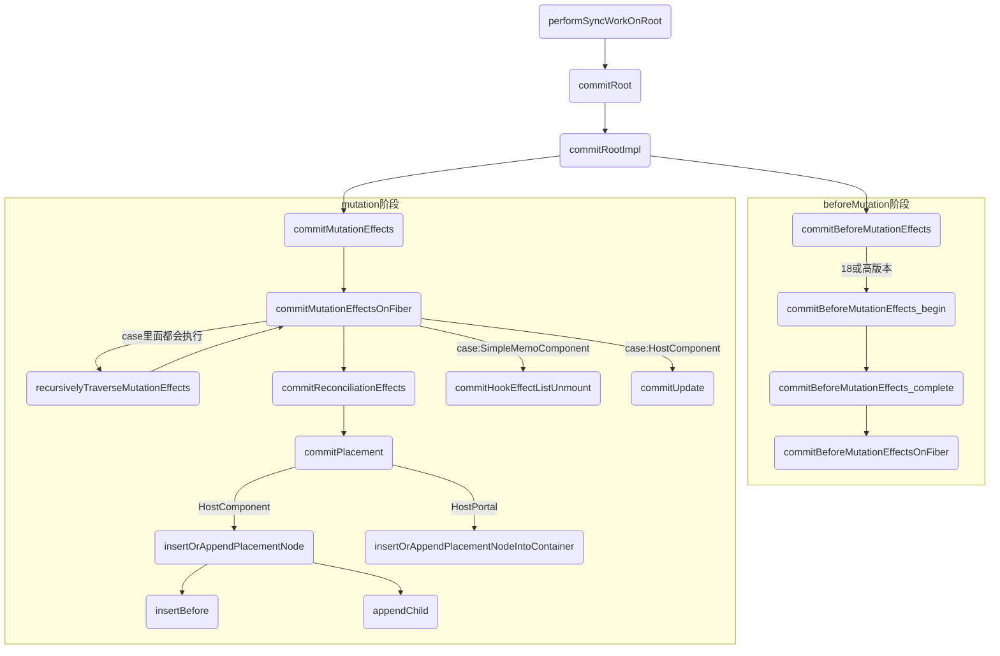
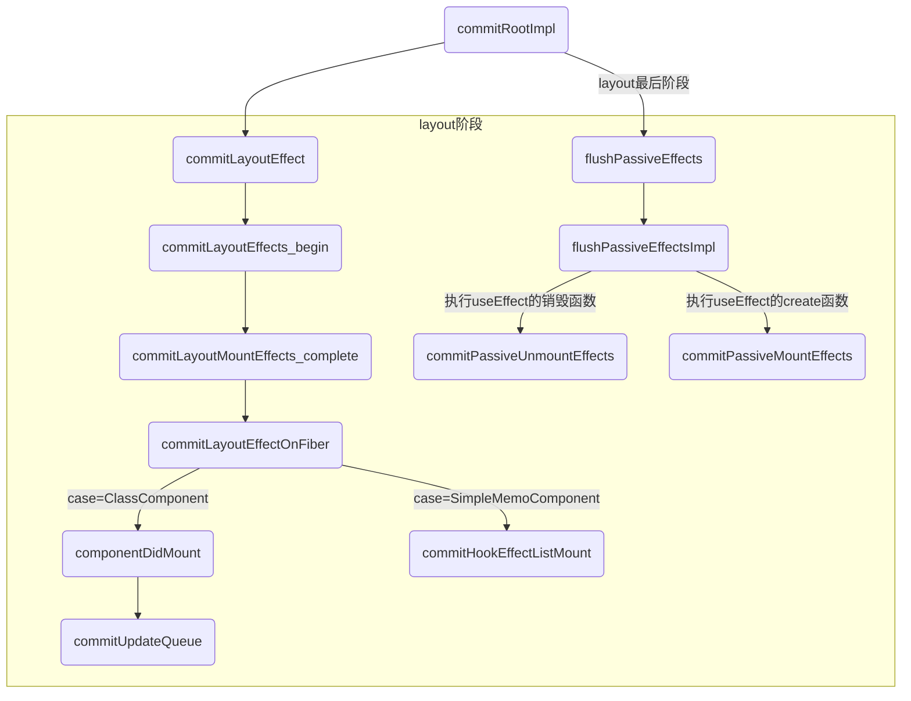
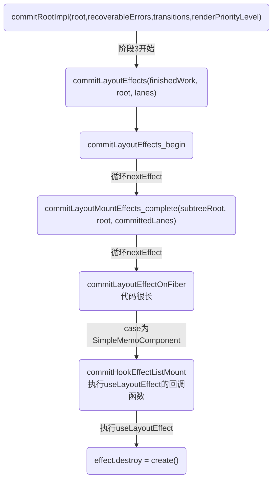
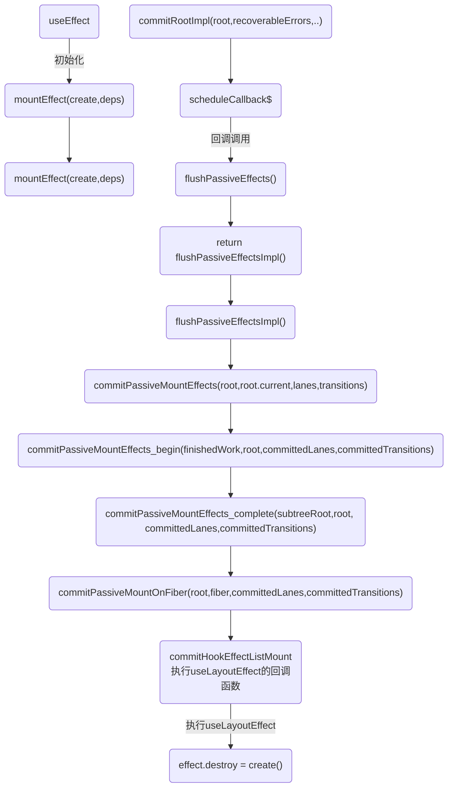

# commit流程图




## 执行useLayoutEffect流程图


## useEffect 流程图



# 一. commit 阶段:简单来说，就是将DOM渲染到页面上
1. before mutation阶段-执行DOM操作前,这个阶段 DOM 节点还没有被渲染到界面上去，过程中会触发 getSnapshotBeforeUpdate，也会处理 useEffect 钩子相关的调度逻辑。

2. mutation阶段-执行DOM操作
```
mutation 阶段，这个阶段负责 DOM 节点的渲染。在渲染过程中，会遍历 effectList，根据 flags（effectTag）的不同，执行不同的 DOM 操作
```

3. mutation阶段-执行DOM操作
```
mutation 阶段，这个阶段负责 DOM 节点的渲染。在渲染过程中，会遍历 effectList，根据 flags（effectTag）的不同，执行不同的 DOM 操作
```
### 5-2.appendAllChildren
appendAllChildren负责将子孙DOM节点插入刚生成的DOM节点中。

beginWork时介绍过，在mount时，为了避免每个fiber节点都需要进行插入操作，在mount时，只有根节点会收集effectTag，
其余节点不会进行effectTag的收集。由于每次执行appendAllChildren后，我们都能得到一棵以当前workInProgress为


render 阶段全部工作完成。在 performSyncWorkOnRoot 函数中 fiberRootNode 被传递给 commitRoot 方法，开启commit 阶段工作流程。

commit 提交阶段(不可中断/同步)：将需要更新的节点一次过批量更新，对应早期版本的 patch 过程。

根节点的DOM树。因此在commit阶段我们只需要对mount的根节点进行一次插入操作就可以了。

### commit 之入口scheduler去调度的是commitRootImpl，它是commit阶段的核心实现，整个commit阶段被划分成三个部分
commit阶段的入口是commitRoot函数，它会告知scheduler以立即执行的优先级去调度commit阶段的工作。

# 二. commit 阶段之-before mutation阶段-执行DOM操作前
## 1.流程概览
commitRoot 方法是commit 阶段工作的起点。fiberRootNode 会作为传参。
```javaScript
commitRoot(root);
```

在 rootFiber.firstEffect 上保存了一条需要执行副作用的 Fiber 节点的单向链表effectList，这些 Fiber 节点的 updateQueue 中保存了变化的 props。

这些副作用对应的 DOM 操作在commit 阶段执行。
```
除此之外，一些生命周期钩子（比如 componentDidXXX）、hook（比如 useEffect）需要在commit 阶段执行。
```
### 1-1,commit 阶段的主要工作（即 Renderer 的工作流程）分为三部分：
* before mutation 阶段（执行 DOM 操作前）
* mutation 阶段（执行 DOM 操作）
* layout 阶段（执行 DOM 操作后）

<br />

## 2.另外,在before mutation 阶段之前和layout 阶段之后还有一些额外工作
涉及到比如 useEffect 的触发、优先级相关的重置、 ref 的绑定/解绑。

<br />

### 2-1.before mutation 之前
commitRootImpl 方法中直到第一句 if (firstEffect !== null) 之前属于 before mutation 之前。

```
可以看如下代码，before mutation之前主要做一些变量赋值，状态重置的工作。

这一长串代码我们只需要关注最后赋值的 firstEffect，在 commit 的三个子阶段都会用到他
```

```javaScript
do {
    // 触发 useEffect 回调与其他同步任务。由于这些任务可能触发新的渲染，所以这里要一直遍历执行直到没有任务
    flushPassiveEffects();
  } while (rootWithPendingPassiveEffects !== null);

  // root 指 fiberRootNode
  // root.finishedWork 指当前应用的 rootFiber
  const finishedWork = root.finishedWork;

  // 凡是变量名带 lane 的都是优先级相关
  const lanes = root.finishedLanes;
  if (finishedWork === null) {
    return null;
  }
  root.finishedWork = null;
  root.finishedLanes = NoLanes;

  // 重置 Scheduler 绑定的回调函数
  root.callbackNode = null;
  root.callbackId = NoLanes;

  let remainingLanes = mergeLanes(finishedWork.lanes, finishedWork.childLanes);
  // 重置优先级相关变量
  markRootFinished(root, remainingLanes);

  // 清除已完成的 discrete updates，例如：用户鼠标点击触发的更新。
  if (rootsWithPendingDiscreteUpdates !== null) {
    if (
      !hasDiscreteLanes(remainingLanes) &&
      rootsWithPendingDiscreteUpdates.has(root)
    ) {
      rootsWithPendingDiscreteUpdates.delete(root);
    }
  }

  // 重置全局变量
  if (root === workInProgressRoot) {
    workInProgressRoot = null;
    workInProgress = null;
    workInProgressRootRenderLanes = NoLanes;
  } else {
  }

  // 将 effectList 赋值给 firstEffect
  // 由于每个 fiber 的 effectList 只包含他的子孙节点
  // 所以根节点如果有 effectTag 则不会被包含进来
  // 所以这里将有 effectTag 的根节点插入到 effectList 尾部
  // 这样才能保证有 effect 的 fiber 都在 effectList 中
  let firstEffect;
  if (finishedWork.effectTag > PerformedWork) {
    if (finishedWork.lastEffect !== null) {
      finishedWork.lastEffect.nextEffect = finishedWork;
      firstEffect = finishedWork.firstEffect;
    } else {
      firstEffect = finishedWork;
    }
  } else {
    // 根节点没有 effectTag
    firstEffect = finishedWork.firstEffect;
  }
```

<br />

### 2-1.layout 之后
主要包括三点内容：
* useEffect 相关的处理。我们会在讲解layout阶段时讲解。
* 性能追踪相关。 源码里有很多和interaction相关的变量。他们都和追踪 React 渲染时间、性能相关，在 Profiler API 和 DevTools 中使用。

在commit 阶段会触发一些生命周期钩子（如 componentDidXXX）和 hook（如 useLayoutEffect、useEffect）。 在这些回调方法中可能触发新的更新，新的更新会开启新的 render-commit 流程;
例如：
```
useLayoutEffect会在layout 阶段同步执行回调。回调中我们触发了状态更新 setCount(randomNum)，这会重新调度一个同步任务。该任务会在在如上 commitRoot 倒数第二行代码处被同步执行。

flushSyncCallbackQueue();
```

```javaScript
const rootDidHavePassiveEffects = rootDoesHavePassiveEffects;

// useEffect 相关
if (rootDoesHavePassiveEffects) {
  rootDoesHavePassiveEffects = false;
  rootWithPendingPassiveEffects = root;
  pendingPassiveEffectsLanes = lanes;
  pendingPassiveEffectsRenderPriority = renderPriorityLevel;
} else {}

// 性能优化相关
if (remainingLanes !== NoLanes) {
  if (enableSchedulerTracing) {
    // ...
  }
} else {
  // ...
}

// 性能优化相关
if (enableSchedulerTracing) {
  if (!rootDidHavePassiveEffects) {
    // ...
  }
}

// ...检测无限循环的同步任务
if (remainingLanes === SyncLane) {
  // ...
} 

// 在离开 commitRoot 函数前调用，触发一次新的调度，确保任何附加的任务被调度
ensureRootIsScheduled(root, now());

// ...处理未捕获错误及老版本遗留的边界问题


// 执行同步任务，这样同步任务不需要等到下次事件循环再执行
// 比如在 componentDidMount 中执行 setState 创建的更新会在这里被同步执行
// 或 useLayoutEffect
flushSyncCallbackQueue();

return null;
```

<br />

## 3.正文开始，before mutation 阶段
before mutation 阶段的代码很短，整个过程就是遍历 effectList 并调用commitBeforeMutationEffects 函数处理。
```javaScript
// 保存之前的优先级，以同步优先级执行，执行完毕后恢复之前优先级
const previousLanePriority = getCurrentUpdateLanePriority();
setCurrentUpdateLanePriority(SyncLanePriority);

// 将当前上下文标记为 CommitContext，作为 commit 阶段的标志
const prevExecutionContext = executionContext;
executionContext |= CommitContext;

// 处理 focus 状态
focusedInstanceHandle = prepareForCommit(root.containerInfo);
shouldFireAfterActiveInstanceBlur = false;

// beforeMutation 阶段的主函数
commitBeforeMutationEffects(finishedWork);

focusedInstanceHandle = null;
```

我们重点关注 beforeMutation 阶段的主函数 commitBeforeMutationEffects 做了什么。

<br />

### 3-1.commitBeforeMutationEffects
大体代码逻辑：
```javaScript
function commitBeforeMutationEffects() {
  while (nextEffect !== null) {
    const current = nextEffect.alternate;

    if (!shouldFireAfterActiveInstanceBlur && focusedInstanceHandle !== null) {
      // ...focus blur 相关
    }

    const effectTag = nextEffect.effectTag;

    // 调用 getSnapshotBeforeUpdate
    if ((effectTag & Snapshot) !== NoEffect) {
      commitBeforeMutationEffectOnFiber(current, nextEffect);
    }

    // 调度 useEffect
    if ((effectTag & Passive) !== NoEffect) {
      if (!rootDoesHavePassiveEffects) {
        rootDoesHavePassiveEffects = true;
        scheduleCallback(NormalSchedulerPriority, () => {
          flushPassiveEffects();
          return null;
        });
      }
    }
    nextEffect = nextEffect.nextEffect;
  }
}
```

整体可以分为三部分：
1. 处理 DOM 节点渲染/删除后的 autoFocus、blur 逻辑；
2. 调用getSnapshotBeforeUpdate 生命周期钩子；
3.调度 useEffect。

我们讲解下2、3两点。

### 3-1-1.调用 getSnapshotBeforeUpdate
commitBeforeMutationEffectOnFiber 是 commitBeforeMutationLifeCycles 的别名。

在该方法内会调用getSnapshotBeforeUpdate，你可以在 这里 看到这段逻辑。

从 React 16 开始，componentWillXXX 钩子前增加了UNSAFE_前缀。

究其原因，是因为 Stack Reconciler 重构为 Fiber Reconciler 后，render 阶段的任务可能中断/重新开始，对应的组件在render 阶段的生命周期钩子（即componentWillXXX）可能触发多次。

这种行为和 React 15 不一致，所以标记为UNSAFE_。更详细的解释参照这里

为此，React 提供了替代的生命周期钩子getSnapshotBeforeUpdate。

我们可以看见，getSnapshotBeforeUpdate 是在commit 阶段内的before mutation 阶段调用的，由于commit 阶段是同步的，所以不会遇到多次调用的问题。

### 3-1-2.调度 useEffect
在这几行代码内，scheduleCallback 方法由Scheduler 模块提供，用于以某个优先级异步调度一个回调函数。
```javaScript
// 调度 useEffect
if ((effectTag & Passive) !== NoEffect) {
  if (!rootDoesHavePassiveEffects) {
    rootDoesHavePassiveEffects = true;
    scheduleCallback(NormalSchedulerPriority, () => {
      // 触发 useEffect
      flushPassiveEffects();
      return null;
    });
  }
}
```
在此处，被异步调度的回调函数就是触发 useEffect 的方法flushPassiveEffects。

我们接下来讨论useEffect 如何被异步调度，以及为什么要异步（而不是同步）调度。

### 3-1-3.如何异步调度
在flushPassiveEffects 方法内部会从全局变量rootWithPendingPassiveEffects 获取 effectList。
在我们讲到，effectList中 保存了需要执行副作用的 Fiber 节点。其中副作用包括：
- 插入 DOM 节点（Placement）
- 更新 DOM 节点（Update）
- 删除 DOM 节点（Deletion）

除此外，当一个FunctionComponent含有useEffect或useLayoutEffect，他对应的 Fiber 节点也会被赋值 effectTag。你可以从 这里 看到 hook 相关的 effectTag。

在flushPassiveEffects 方法内部会遍历 rootWithPendingPassiveEffects（即 effectList）执行 effect 回调函数。

如果在此时直接执行，rootWithPendingPassiveEffects === null。

那么 rootWithPendingPassiveEffects 会在何时赋值呢？

在上一节layout 之后的代码片段中会根据 rootDoesHavePassiveEffects === true ? 决定是否赋值 rootWithPendingPassiveEffects。
```javaScript
const rootDidHavePassiveEffects = rootDoesHavePassiveEffects;
if (rootDoesHavePassiveEffects) {
  rootDoesHavePassiveEffects = false;
  rootWithPendingPassiveEffects = root;
  pendingPassiveEffectsLanes = lanes;
  pendingPassiveEffectsRenderPriority = renderPriorityLevel;
}
```

所以整个useEffect 异步调用分为三步：
1. before mutation 阶段在scheduleCallback 中调度flushPassiveEffects；
2. layout 阶段之后将effectList赋值给rootWithPendingPassiveEffects；
3. scheduleCallback触发flushPassiveEffects，flushPassiveEffects内部遍历rootWithPendingPassiveEffects。

### 3-1-3.为什么需要异步调用？
可见，useEffect 异步执行的主要原因是防止同步执行时阻塞浏览器渲染。

摘录自 React 文档 effect 的执行时机 ：
```
与 componentDidMount、componentDidUpdate 不同的是，在浏览器完成布局与绘制之后，传给 useEffect 的函数会延迟调用。这使得它适用于许多常见的副作用场景，比如设置订阅和事件处理等情况，因此不应在函数中执行阻塞浏览器更新屏幕的操作。
```


## 4.总结
经过本节学习，我们知道了在 before mutation 阶段，会遍历 effectList，依次执行：
1. 处理 DOM 节点渲染/删除后的 autoFocus、blur 逻辑；
2. 调用getSnapshotBeforeUpdate 生命周期钩子；
3. 调度useEffect。

下一步是：mutation 阶段

### commit之 before mutation 阶段，会遍历 effectList，依次执行：
```
1. 处理 DOM 节点渲染/删除后的 autoFocus、blur 逻辑；
2. 调用getSnapshotBeforeUpdate 生命周期钩子；
3. 调度useEffect。

1. commitRootImpl是commit阶段主要函数，调用commitBeforeMutationEffects
2. commitBeforeMutationEffects主要功能是：执行commitBeforeMutationEffectOnFiber和通过flushPassiveEffects调度useEffect
3. commitBeforeMutationEffectOnFiber通过判断组件类型主要来执行类组件getSnapshotBeforeUpdate生命周期函数
```

# 三. commit 阶段之-mutation阶段-执行DOM操作
## 1-1.概览
类似 before mutation 阶段，mutation 阶段也是遍历 effectList，执行函数。这里执行的是 commitMutationEffects。
```javaScript
nextEffect = firstEffect;
do {
  try {
      commitMutationEffects(root, renderPriorityLevel);
    } catch (error) {
      invariant(nextEffect !== null, 'Should be working on an effect.');
      captureCommitPhaseError(nextEffect, error);
      nextEffect = nextEffect.nextEffect;
    }
} while (nextEffect !== null);
```

## 2.commitMutationEffects
commitMutationEffects会遍历 effectList，对每个 Fiber 节点执行如下三个操作：
* 根据 ContentReset effectTag 重置文字节点；
* 更新 ref；
* 根据 effectTag 分别处理，其中 effectTag 包括(Placement | Update | Deletion | Hydrating)；

代码如下，你可以在 这里 看到commitMutationEffects 源码：
```javaScript
function commitMutationEffects(root: FiberRoot, renderPriorityLevel) {
  // 遍历 effectList
  while (nextEffect !== null) {

    const effectTag = nextEffect.effectTag;

    // 根据 ContentReset effectTag 重置文字节点
    if (effectTag & ContentReset) {
      commitResetTextContent(nextEffect);
    }

    // 更新 ref
    if (effectTag & Ref) {
      const current = nextEffect.alternate;
      if (current !== null) {
        commitDetachRef(current);
      }
    }

    // 根据 effectTag 分别处理
    const primaryEffectTag =
      effectTag & (Placement | Update | Deletion | Hydrating);
    switch (primaryEffectTag) {
      // 插入 DOM
      case Placement: {
        commitPlacement(nextEffect);
        nextEffect.effectTag &= ~Placement;
        break;
      }
      // 插入 DOM 并 更新 DOM
      case PlacementAndUpdate: {
        // 插入
        commitPlacement(nextEffect);

        nextEffect.effectTag &= ~Placement;

        // 更新
        const current = nextEffect.alternate;
        commitWork(current, nextEffect);
        break;
      }
      // SSR
      case Hydrating: {
        nextEffect.effectTag &= ~Hydrating;
        break;
      }
      // SSR
      case HydratingAndUpdate: {
        nextEffect.effectTag &= ~Hydrating;

        const current = nextEffect.alternate;
        commitWork(current, nextEffect);
        break;
      }
      // 更新 DOM
      case Update: {
        const current = nextEffect.alternate;
        commitWork(current, nextEffect);
        break;
      }
      // 删除 DOM
      case Deletion: {
        commitDeletion(root, nextEffect, renderPriorityLevel);
        break;
      }
    }

    nextEffect = nextEffect.nextEffect;
  }
}
```

我们关注步骤三中的 Placement | Update | Deletion。Hydrating 作为服务端渲染相关，我们先不关注。

### 2-1.Placement effect
当 Fiber 节点含有 Placement effectTag，意味着该 Fiber 节点对应的 DOM 节点需要插入到页面中。
调用的方法为 commitPlacement，你可以在 这里 看到commitPlacement源码。
该方法所做的工作分为三步：
1. 获取父级 DOM 节点。其中 finishedWork 为传入的 Fiber 节点。
```javaScript
const parentFiber = getHostParentFiber(finishedWork);
// 父级 DOM 节点
const parentStateNode = parentFiber.stateNode;
```
2. 获取 Fiber 节点的 DOM 兄弟节点。
```javaScript
const before = getHostSibling(finishedWork);
```
3. 根据 DOM 兄弟节点是否存在决定调用parentNode.insertBefore或parentNode.appendChild执行 DOM 插入操作。
```javaScript
// parentStateNode是否是rootFiber
if (isContainer) {
  insertOrAppendPlacementNodeIntoContainer(finishedWork, before, parent);
} else {
  insertOrAppendPlacementNode(finishedWork, before, parent);
}
```
值得注意的是， getHostSibling （获取兄弟 DOM 节点）的执行很耗时，当在同一个父 Fiber 节点下依次执行多个插入操作，getHostSibling 算法的复杂度为指数级。
这是由于 Fiber 节点不只包括 HostComponent，所以 Fiber 树和渲染的 DOM 树节点并不是一一对应的。要从 Fiber 节点找到 DOM 节点很可能跨层级遍历。

考虑如下例子：
```javaScript
function Item() {
  return <li><li>;
}

function App() {
  return (
    <div>
      <Item/>
    </div>
  )
}
ReactDOM.render(<App/>, document.getElementById('root'));
```

对应的 Fiber 树和 DOM 树结构为：
```
// Fiber 树
          child      child      child       child
rootFiber -----> App -----> div -----> Item -----> li

// DOM 树
#root ---> div ---> li
```

当在 div 的子节点 Item 前插入一个新节点 p，即 App 变为：
```javaScript
function App() {
  return (
    <div>
      <p></p>
      <Item/>
    </div>
  )
}
```
对应的 Fiber 树和 DOM 树结构为：
```
// Fiber 树
          child      child      child
rootFiber -----> App -----> div -----> p 
                                       | sibling       child
                                       | -------> Item -----> li 
// DOM 树
#root ---> div ---> p
             |
               ---> li
```
此时 DOM 节点 p 的兄弟节点为 li，而 Fiber 节点 p 对应的兄弟 DOM 节点为：
```javaScript
fiberP.sibling.child
```
即 fiber p 的兄弟 fiber Item 的子 fiber li。

<br />

### 2-2.Update effect
当 Fiber 节点含有 Update effectTag，意味着该 Fiber 节点需要更新。调用的方法为commitWork，他会根据 Fiber.tag 分别处理。你可以在 这里 看到commitWork 源码。

这里我们主要关注FunctionComponent和HostComponent。

### 2-2-1.FunctionComponent mutation
当 fiber.tag 为 FunctionComponent，会调用commitHookEffectListUnmount。该方法会遍历 effectList，执行所有 useLayoutEffect hook 的销毁函数。你可以在 这里 看到commitHookEffectListUnmount 源码。

所谓销毁函数，见如下例子：
```javaScript
 useLayoutEffect(() => {
  // ...一些副作用逻辑

  return () => {
    // ...这就是销毁函数
  }
})
```
你不需要很了解useLayoutEffect，我们会在下一节详细介绍。你只需要知道在mutation 阶段会执行useLayoutEffect 的销毁函数。

### 2-2-2.HostComponent mutation
当 fiber.tag 为HostComponent，会调用commitUpdate，你可以在 这里 看到commitUpdate 源码。

最终会在updateDOMProperties中将render 阶段 completeWork 中为 Fiber 节点赋值的updateQueue对应的内容渲染在页面上。
```javaScript
for (let i = 0; i < updatePayload.length; i += 2) {
  const propKey = updatePayload[i];
  const propValue = updatePayload[i + 1];

  // 处理 style
  if (propKey === STYLE) {
    setValueForStyles(domElement, propValue);
  // 处理 DANGEROUSLY_SET_INNER_HTML
  } else if (propKey === DANGEROUSLY_SET_INNER_HTML) {
    setInnerHTML(domElement, propValue);
  // 处理 children
  } else if (propKey === CHILDREN) {
    setTextContent(domElement, propValue);
  } else {
  // 处理剩余 props
    setValueForProperty(domElement, propKey, propValue, isCustomComponentTag);
  }
}
```

<br />

### 2-3.Deletion effect
当 Fiber 节点含有 Deletion effectTag，意味着该 Fiber 节点对应的 DOM 节点需要从页面中删除。调用的方法为commitDeletion，你可以在 这里 看到commitDeletion 源码。

该方法会执行如下操作：
1. 递归调用 Fiber 节点及其子孙 Fiber 节点中fiber.tag为ClassComponen的componentWillUnmount 生命周期钩子，从页面移除 Fiber 节点对应 DOM 节点；
2. 解绑 ref；
3. 调度 useEffect 的销毁函数。

<br />

## 总结
从这节我们学到mutation 阶段会遍历effectList，依次执行commitMutationEffects。

该方法的主要工作为“根据 effectTag 调用不同的处理函数处理 Fiber。

# 四. commit 阶段之-layout阶段-执行DOM操作后
该阶段之所以称为 layout，因为该阶段的代码都是在 DOM 渲染完成（mutation 阶段完成）后执行的。

该阶段触发的生命周期钩子和 hook 可以直接访问到已经改变后的 DOM，即该阶段是可以参与 DOM layout 的阶段。
### 3-1.概览
与前两个阶段类似，layout 阶段也是遍历 effectList，执行函数。

具体执行的函数是commitLayoutEffects。
```javaScript
root.current = finishedWork;

nextEffect = firstEffect;
do {
  try {
    commitLayoutEffects(root, lanes);
  } catch (error) {
    invariant(nextEffect !== null, "Should be working on an effect.");
    captureCommitPhaseError(nextEffect, error);
    nextEffect = nextEffect.nextEffect;
  }
} while (nextEffect !== null);

nextEffect = null;
```

### 3-2.commitLayoutEffects
commitLayoutEffects一共做了两件事：

1. commitLayoutEffectOnFiber（调用生命周期钩子和 hook 相关操作）；
2. commitAttachRef（赋值 ref）。
```javaScript
function commitLayoutEffects(root: FiberRoot, committedLanes: Lanes) {
  while (nextEffect !== null) {
    const effectTag = nextEffect.effectTag;

    // 调用生命周期钩子和 hook
    if (effectTag & (Update | Callback)) {
      const current = nextEffect.alternate;
      commitLayoutEffectOnFiber(root, current, nextEffect, committedLanes);
    }

    // 赋值 ref
    if (effectTag & Ref) {
      commitAttachRef(nextEffect);
    }

    nextEffect = nextEffect.nextEffect;
  }
}
```

### 3-2.commitLayoutEffectOnFiber
commitLayoutEffectOnFiber 方法会根据fiber.tag对不同类型的节点分别处理。

你可以在 这里 看到commitLayoutEffectOnFiber 源码（ commitLayoutEffectOnFiber 为别名，方法原名为 commitLifeCycles）。

对于ClassComponent，他会通过 current === null ? 区分是 mount 还是 update，调用componentDidMount或componentDidUpdate。

触发状态更新的this.setState如果赋值了第二个参数回调函数，也会在此时调用。
```javaScript
this.setState({ xxx: 1 }, () => {
  console.log("i am update~");
});
```

对于FunctionComponent及相关类型，他会调用useLayoutEffect hook的回调函数，调度 useEffect 的销毁与回调函数。

相关类型指特殊处理后的FunctionComponent，比如 ForwardRef、React.memo 包裹的 FunctionComponent。
```javaScript
  switch (finishedWork.tag) {
    // 以下都是 FunctionComponent 及相关类型
    case FunctionComponent:
    case ForwardRef:
    case SimpleMemoComponent:
    case Block: {
      // 执行 useLayoutEffect 的回调函数
      commitHookEffectListMount(HookLayout | HookHasEffect, finishedWork);
      // 调度 useEffect 的销毁函数与回调函数
      schedulePassiveEffects(finishedWork);
      return;
    }
```

在上一节介绍时介绍过，mutation 阶段会执行 useLayoutEffect hook 的销毁函数。

结合这里我们可以发现，useLayoutEffect hook 从上一次更新的销毁函数调用到本次更新的回调函数调用是同步执行的。

而 useEffect 则需要先调度，在Layout 阶段完成后再异步执行。

这就是useLayoutEffect与useEffect的区别。

对于 HostRoot，即 rootFiber，如果赋值了第三个参数回调函数，也会在此时调用。
```javaScript
ReactDOM.render(<App />, document.querySelector("#root"), function() {
  console.log("i am mount~");
});
```

### 3-3.commitAttachRef
commitLayoutEffects会做的第二件事是commitAttachRef，你可以在 这里 看到commitAttachRef 源码。

代码逻辑很简单：获取 DOM 实例，更新 ref。
```javaScript
function commitAttachRef(finishedWork: Fiber) {
  const ref = finishedWork.ref;
  if (ref !== null) {
    const instance = finishedWork.stateNode;

    // 获取DOM实例
    let instanceToUse;
    switch (finishedWork.tag) {
      case HostComponent:
        instanceToUse = getPublicInstance(instance);
        break;
      default:
        instanceToUse = instance;
    }

    if (typeof ref === "function") {
      // 如果ref是函数形式，调用回调函数
      ref(instanceToUse);
    } else {
      // 如果ref是ref实例形式，赋值ref.current
      ref.current = instanceToUse;
    }
  }
}
```

## 4.current Fiber 树切换
至此，整个layout 阶段就结束了。

在我们介绍过，workInProgress Fiber 树在commit 阶段完成渲染后会变为 current Fiber 树。这行代码的作用就是切换 fiberRootNode 指向的 current Fiber树。

那么这行代码为什么在这里呢？（在mutation 阶段结束后，layout 阶段开始前。）
```javaScript
root.current = finishedWork;
```
我们知道componentWillUnmount会在mutation 阶段执行。此时 current Fiber 树还指向前一次更新的 Fiber 树，在生命周期钩子内获取的 DOM 还是更新前的。

componentDidMount和componentDidUpdate会在layout 阶段执行。此时current Fiber 树已经指向更新后的 Fiber 树，在生命周期钩子内获取的 DOM 就是更新后的。

### 总结
从这节我们学到，layout 阶段会遍历 effectList，依次执行commitLayoutEffects。该方法的主要工作为“根据 effectTag 调用不同的处理函数处理 Fiber 并更新 ref。