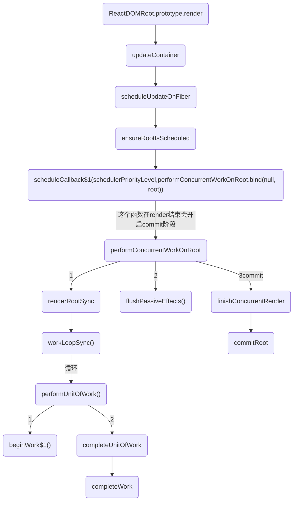
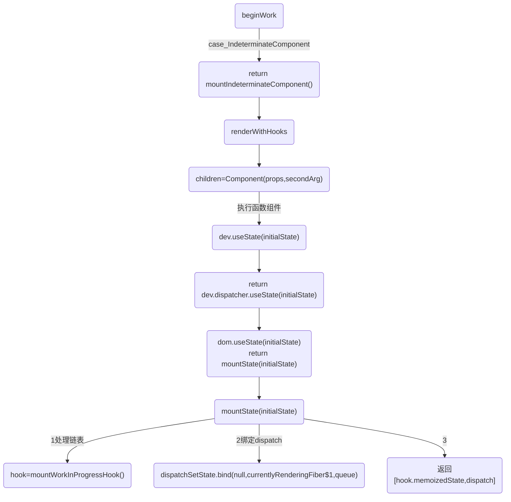
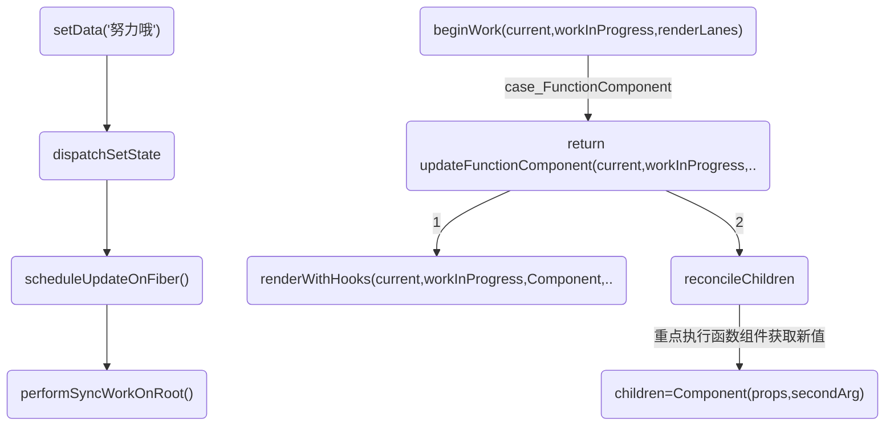

# 前言
一些全局变量
在讲解源码之前，先认识一些 重要的全局变量：
* currentlyRenderingFiber：正在处理的函数组件对应 fiber。在执行 useState 等 hook 时，需要通过它知道当前 hook 对应哪个 fiber。

* workInProgressHook：挂载时正在处理的 hook 对象。我们会沿着 workInProcess.memoizedState 链表一个个往下走，这个 workInProgressHook 就是该链表的指针。

* currentHook：旧的 fiber 的 hooks 链表（current.memorizedState）指针。

* ReactCurrentDispatcher：全局对象，是一个 hook 调度器对象，其下有 useState、useEffect 等方法，是我们业务代码中 hook 底层调用的方法。ReactCurrentDispatcher 有三种：
  * ContextOnlyDispatcher：所有方法都会抛出错误，用于防止开发者在调用函数组件的其他时机调用 React Hook；
  * HooksDispatcherOnMount：挂载阶段用。比如它的 useState 要将初始值保存起来；
  * HooksDispatcherOnUpdate：更新阶段用。比如它的 useState 会无视传入的初始值，而是从链表中取出值。


1、React Hooks 为什么不能写在条件语句中？

要保证 React Hooks 的顺序一致。

函数组件的状态是保存在 fiber.memorizedState 中的。它是一个链表，保存调用 Hook 生成的 hook 对象，这些对象保存着状态值。当更新时，我们每调用一个 Hook，其实就是从 fiber.memorizedState 链表中读取下一个 hook，取出它的状态。

如果顺序不一致了或者数量不一致了，就会导致错误，取出了一个其他 Hook 对应的状态值。


# 流程图


## useState 挂载hooks函数;生成dispatch;挂载链表
接上面beginWork


## setState 更新


# hooks基础
## 为什么hooks
主要是class组件比较冗余、生命周期函数写法不友好，functional组件更符合React编程思想
```javaScript
// hook的结构
export type Hook = {
  memoizedState: any, //上一次的state
  baseState: any,  // 当前state
  baseUpdate: Update<any, any> | null,  // update func
  next: Hook | null, // 链表
  queue: UpdateQueue<any, any> | null,  // 用于缓存多次action
};

const example ={
  baseQueue:null,
  baseState:"改变我",
  memoizedState:"改变我",
  next:{},
  queue:{},
}
```


# setState

## 挂载useState

首先要注意的是，虽然 App 是一个 FunctionComponent，但是在 first paint 的时候，React 判断其为 IndeterminateComponent。
```javaScript
function beginWork(current, workInProgress, renderLanes) {
  // 省略代码
  console.log('%c=beginWork()===start1-初始化', 'color:magenta', { getFiberName: getFiberName(workInProgress), current, renderLanes, workInProgress })

  switch (workInProgress.tag) {
    case IndeterminateComponent:
      {
        console.log('%c=beginWork()==end 2 mountIndeterminateComponent', 'color:magenta')

        console.log(`%c=探究初始和hook=调用mountIndeterminateComponent`, 'color:blueviolet')
        return mountIndeterminateComponent(current, workInProgress, workInProgress.type, renderLanes);
  }
}

function mountIndeterminateComponent(_current, workInProgress, Component, renderLanes) {
  // 省略代码

  ReactCurrentOwner$1.current = workInProgress;

  console.log(`%c=探究初始和hook=mountIndeterminateComponent调用renderWithHooks 1`, 'color:blueviolet', { workInProgress, Component, props, context, renderLanes })

  value = renderWithHooks(null, workInProgress, Component, props, context, renderLanes);

  console.log(`%c=探究初始和hook=mountIndeterminateComponent调用renderWithHooks 返回值`, 'color:blueviolet', { value })

  // 省略代码
}
```

### renderWithHooks
1. workInProgress 赋值给全局变量 currentlyRenderingFiber，之后执行 hook 就能知道是给哪个组件更新状态了。
2. 选择 hook 调度器：根据是挂载还是更新阶段，ReactCurrentDispatcher 设置为对应 hook 调度器。
3. 调用函数组件，进行 render。函数组件内部会调用 Hook，并返回 ReactElement。
4. 重置全局变量，比如 currentlyRenderingFiber 设置回 null；ReactCurrentDispatcher 还原为 ContextOnlyDispatcher，防止在错误时机使用 Hook。

renderWithHooks 中，我们会根据组件处于不同的状态，给 ReactCurrentDispatcher.current 挂载不同的 dispatcher 。而在first paint 时，挂载的是ContextOnlyDispatcher
或则 HooksDispatcherOnMountInDEV
```javaScript
function renderWithHooks(current, workInProgress, Component, props, secondArg, nextRenderLanes) {
    renderLanes = nextRenderLanes;
    console.log(`%c=探究初始和hook=renderWithHooks挂载将workInProgress 赋值给全局变量 currentlyRenderingFiber,这样在调用 Hook 时就能知道对应的 fiber 是谁`, 'color:blueviolet')
    currentlyRenderingFiber$1 = workInProgress;

    {
      if (current !== null && current.memoizedState !== null) {
        ReactCurrentDispatcher$1.current = HooksDispatcherOnUpdateInDEV;
      } else if (hookTypesDev !== null) {
        // This dispatcher handles an edge case where a component is updating,
        // but no stateful hooks have been used.
        // We want to match the production code behavior (which will use HooksDispatcherOnMount),
        // but with the extra DEV validation to ensure hooks ordering hasn't changed.
        // This dispatcher does that.
        ReactCurrentDispatcher$1.current = HooksDispatcherOnMountWithHookTypesInDEV;
      } else {
        console.log(`%c=探究初始和hook=renderWithHooks dev挂载的是HooksDispatcherOnMountInDEV hook`, 'color:blueviolet', { current: HooksDispatcherOnMountInDEV })
        ReactCurrentDispatcher$1.current = HooksDispatcherOnMountInDEV;
      }
    }


    // 省略代码
    console.log(`%c=探究初始和hook=renderWithHooks挂载,将一些全局变量进行重置`, 'color:blueviolet')
    ReactCurrentDispatcher$1.current = ContextOnlyDispatcher;
    // 省略代码
}

HooksDispatcherOnMountInDEV = {
  readContext: function (context) {
    return readContext(context);
  },
  // 省略
  useState: function (initialState) {
    currentHookNameInDev = 'useState';
    mountHookTypesDev();
    var prevDispatcher = ReactCurrentDispatcher$1.current;
    ReactCurrentDispatcher$1.current = InvalidNestedHooksDispatcherOnMountInDEV;

    try {
      console.log('=useState=dom=调用mountState', { initialState })
      return mountState(initialState);
    } finally {
      ReactCurrentDispatcher$1.current = prevDispatcher;
    }
  },
}
```

接下里走进我们的 App()，我们会调用 React.useState,这里的 dispatcher 就是上文挂载到 ReactCurrentDispatcher.current 的ContextOnlyDispatcher

## 分析1:dev里面的 useState
可见实际上执行的是 dispatcher.useState()，这里面会通过执行 resolveDispatcher() 得到一个 dispatcher，然后调用该对象上的 useState() 方法
```javaScript
function useState(initialState) {
  console.log('=useState=dev=调用mountState', { initialState })
  var dispatcher = resolveDispatcher();
  return dispatcher.useState(initialState);
}

function resolveDispatcher() {
  var dispatcher = ReactCurrentDispatcher.current;
  {
    if (dispatcher === null) {
      error('Invalid hook call. Hooks can only be called inside of the body of a function component. This could happen for' + ' one of the following reasons:\n' + '1. You might have mismatching versions of React and the renderer (such as React DOM)\n' + '2. You might be breaking the Rules of Hooks\n' + '3. You might have more than one copy of React in the same app\n' + 'See https://reactjs.org/link/invalid-hook-call for tips about how to debug and fix this problem.');
    }
  } // Will result in a null access error if accessed outside render phase. We
  // intentionally don't throw our own error because this is in a hot path.
  // Also helps ensure this is inlined.
  return dispatcher;
}
```

## dispatcher.useState就是dom里面的 useState()
可以见到结构：
```javaScript
hook.memoizedState = hook.baseState = initialState;
var queue = {
  pending: null,
  interleaved: null,
  lanes: NoLanes,
  dispatch: null,
  lastRenderedReducer: basicStateReducer,
  lastRenderedState: initialState
};
hook.queue = queue;
```

```javaScript
useState: function (initialState) {
  currentHookNameInDev = 'useState';
  mountHookTypesDev();
  var prevDispatcher = ReactCurrentDispatcher$1.current;
  ReactCurrentDispatcher$1.current = InvalidNestedHooksDispatcherOnMountInDEV;

  try {
    console.log('=useState=调用mountState', { initialState })
    return mountState(initialState);
  } finally {
    ReactCurrentDispatcher$1.current = prevDispatcher;
  }
},
```

## 调用 mountState 函数
mountState 函数对 var hook = mountWorkInProgressHook()进行赋值:

### mountState 和 dispatchSetState.bind
1. 创建新的 hook 空对象，挂到 workInProcess.memorizedState 队列上（mountWorkInProgressHook 方法）。
2. dispatchSetState 绑定对应 fiber 和 queue，方便以后 setState 快速找到相关对象，最后返回状态值和更新状态方法。

dispatchSetState.bind(null, currentlyRenderingFiber$1, queue)

利用bind返回dispatch函数

这也是为什么虽然 dispatchSetState 本身需要三个参数，但我们使用的时候都是 setState(params)，只用传一个参数的原因。
```javaScript
function mountState(initialState) {
  var hook = mountWorkInProgressHook();

  if (typeof initialState === 'function') {
    // $FlowFixMe: Flow doesn't like mixed types
    initialState = initialState();
  }

  hook.memoizedState = hook.baseState = initialState;
  var queue = {
    pending: null,
    interleaved: null,
    lanes: NoLanes,
    dispatch: null,
    lastRenderedReducer: basicStateReducer,
    lastRenderedState: initialState
  };
  hook.queue = queue;

  var dispatch = queue.dispatch = dispatchSetState.bind(null, currentlyRenderingFiber$1, queue)
  console.log('=useState=dom=利用bind返回dispatch:', { dispatch })
  return [hook.memoizedState, dispatch];
}
```

### mountWorkInProgressHook作用:
给 memoizedState 链表加节点的逻辑,写过单链表的会比较理解，头节点要特殊处理
* 创建一个 hook
* 若无 hook 链，则创建一个 hook 链；若有，则将新建的 hook 加至末尾
* 将新建的这个 hook 挂载到 workInProgressHook 以及当前 fiber node 的 memoizedState 上

返回 workInProgressHook，也就是这个新建的 hook
```javaScript
function mountWorkInProgressHook() {
  var hook = {
    memoizedState: null,
    baseState: null,
    baseQueue: null,
    queue: null,
    next: null
  };

  if (workInProgressHook === null) {
    // This is the first hook in the list
    console.log('=useState=dom=调用workInProgressHook 1:', { hook, workInProgressHook })
    currentlyRenderingFiber$1.memoizedState = workInProgressHook = hook;
  } else {
    // Append to the end of the list
    workInProgressHook = workInProgressHook.next = hook;
    console.log('=useState=dom=调用workInProgressHook 2:', { hook, workInProgressHook })
  }

  return workInProgressHook;
}
```

# setState dispatchSetState() 重点函数在这里触发组件更新
之前 mountState 时，我们返回了一个绑定了 fiber、queue 参数的 dispatchSetState

第一个 setState 在被调用时会立即计算新状态，这是为了 做新旧 state 对比，决定是否更新组件。如果对比发现状态没变，继续计算下一个 setState 的新状态，直到找到为止。如果没找到，就不进行更新。

其后的 setState 则不会计算，等到组件重新 render 再计算。

为对比新旧状态计算出来的状态值，会保存到 update.eagerState，并将 update.hasEagerState 设置为 true，之后更新时通过它来直接拿到计算后的最新值。

dispatchSetState 会拿到对应的 fiber、queue（对应 hook 的 queue）、action（新的状态）。

创建一个 update 空对象；
1. 计算出最新状态，放入到 update.egerState。
2. 对比新旧状态是否相同（使用 Object.is 对比）。相同就不更新了，结束。不相同，进行后续的操作。
3. 将 update 放到 queue.interleaved 或 concurrentQueues 链表上（.new 和 .old 文件的逻辑差得有点多），之后更新阶段会搬到 queue.pending。
4. 将当前 fiber 的 lanes 设置为 SyncLane，这样后面的 setState 就不会立刻计算最新状态了，而是在更新阶段才计算。
5. 接着是调度更新（scheduleUpdateOnFiber），让调度器进行调度，执行更新操作
```javaScript
function dispatchSetState(fiber, queue, action) {
  {
    if (typeof arguments[3] === 'function') {
      error("State updates from the useState() and useReducer() Hooks don't support the " + 'second callback argument. To execute a side effect after ' + 'rendering, declare it in the component body with useEffect().');
    }
  }

  console.log('=useState=app=dispatchSetState:', { fiber, queue, action })

  var lane = requestUpdateLane(fiber);
  // 创建一个 update 更新对象
  var update = {
    lane: lane,
    action: action,
    hasEagerState: false,
    eagerState: null,
    next: null
  };

  if (isRenderPhaseUpdate(fiber)) {
    console.log('=useState=app=dispatchSetState调用enqueueRenderPhaseUpdate渲染阶段更新:')
    enqueueRenderPhaseUpdate(queue, update);
  } else {
    enqueueUpdate$1(fiber, queue, update);
    var alternate = fiber.alternate;

    if (fiber.lanes === NoLanes && (alternate === null || alternate.lanes === NoLanes)) {
      // The queue is currently empty, which means we can eagerly compute the
      // next state before entering the render phase. If the new state is the
      // same as the current state, we may be able to bail out entirely.

      var lastRenderedReducer = queue.lastRenderedReducer;
      console.log('=useState=app=dispatchSetState 计算新状态', { queue, lastRenderedReducer })

      if (lastRenderedReducer !== null) {
        var prevDispatcher;

        {
          prevDispatcher = ReactCurrentDispatcher$1.current;
          ReactCurrentDispatcher$1.current = InvalidNestedHooksDispatcherOnUpdateInDEV;
        }

        try {
          // currentState 旧值
          var currentState = queue.lastRenderedState;
          // currentState 新值
          var eagerState = lastRenderedReducer(currentState, action); // Stash the eagerly computed state, and the reducer used to compute
          // it, on the update object. If the reducer hasn't changed by the
          // time we enter the render phase, then the eager state can be used
          // without calling the reducer again.

          update.hasEagerState = true;
          update.eagerState = eagerState;
          console.log('=useState=app=dispatchSetState 对比新旧状态是否不同', { eagerState, currentState, objectIs: objectIs(eagerState, currentState) })
          if (objectIs(eagerState, currentState)) {
            // Fast path. We can bail out without scheduling React to re-render.
            // It's still possible that we'll need to rebase this update later,
            // if the component re-renders for a different reason and by that
            // time the reducer has changed.
            return;
          }
        } catch (error) {// Suppress the error. It will throw again in the render phase.
        } finally {
          {
            ReactCurrentDispatcher$1.current = prevDispatcher;
          }
        }
      }
    }

    var eventTime = requestEventTime();
    console.log('=useState=app=dispatchSetState调用scheduleUpdateOnFiber调度fiber更新')
    var root = scheduleUpdateOnFiber(fiber, lane, eventTime);

    if (root !== null) {
      entangleTransitionUpdate(root, queue, lane);
    }
  }

  markUpdateInDevTools(fiber, lane);
}
```


## update会执行useState 获取最新状态
见流程图，children=Component(props,secondArg) 重新执行函数组件获取最新状态
```javaScript
HooksDispatcherOnUpdateInDEV = {
  // 省略代码
  useState: function (initialState) {
        currentHookNameInDev = 'useState';
        updateHookTypesDev();
        var prevDispatcher = ReactCurrentDispatcher$1.current;
        ReactCurrentDispatcher$1.current = InvalidNestedHooksDispatcherOnUpdateInDEV;

        try {
          console.log('=updateState=4', { initialState })
          return updateState(initialState);
        } finally {
          ReactCurrentDispatcher$1.current = prevDispatcher;
        }
  }
  // 省略代码
}
```

updateReducer，只是 reducer 是固定好的，作用就是用来直接执行 setValue（即 dispath） 函数传进来的 action，即 useState 其实是对 useReducer 的一个封装，只是 reducer 函数是预置好的。

useState 本质上在使用 useReducer，在 React 源码层提供了特殊的名为 basicStateReducer 的 reducer


updateReducer 主要工作有两个：

从 current.memorizedState 拷贝 hook 到 workInProcess 下（updateWorkInProgressHook 方法）。
将 hook.queue.pending 队列合并到 currentHook.baseQueue 下，然后遍历队列中的 update 对象，使用 action 和 reducer 计算出最新的状态，更新到 hook 上，最后返回新状态和新 setState。
```javaScript
// reducer 函数
function basicStateReducer(state, action) {
  return typeof action === 'function' ? action(state) : action;
}

// setReducer 更新阶段对应的 updateReducer
function updateReducer(reducer, initialArg, init) {
  // ----- 【1】 拷贝 hook（current -> workInProcess），并返回这个 hook -----
  const hook = updateWorkInProgressHook();
  
  // ----- 【2】 读取队列，计算出最新状态，更新 hook 的状态 -----
  // ...
}
```

### 先看看 updateWorkInProgressHook 方法。
该方法中，currentHook 设置为 current.memoizedState 链表的下一个 hook，拷贝它到 currentlyRenderingFiber.memoizedState 链表上，返回这个 hook。
```javaScript
function updateWorkInProgressHook() {
  // 1. 移动 currentHook 指针
  //（来自 current.memoizedState 链表）
  var nextCurrentHook; 
  if (currentHook === null) {
    var current = currentlyRenderingFiber.alternate;
    if (current !== null) {
      nextCurrentHook = current.memoizedState;
    } else {
      nextCurrentHook = null;
    }
  } else {
    nextCurrentHook = currentHook.next;
  }

  // 2. 移动 workInProgressHook 指针
  //（来自 currentlyRenderingFiber.memoizedState 链表）
  var nextWorkInProgressHook;
  if (workInProgressHook === null) {
    nextWorkInProgressHook = currentlyRenderingFiber.memoizedState;
  } else {
    nextWorkInProgressHook = workInProgressHook.next;
  }

  if (nextWorkInProgressHook !== null) {
    // 这种情况为 “渲染时更新逻辑”（在 render 时调用了 setState）
    // 为了更聚焦普通情况，这里不讨论
    workInProgressHook = nextWorkInProgressHook;
    nextWorkInProgressHook = workInProgressHook.next;
    currentHook = nextCurrentHook;
  } else {
    // 3. 渲染时不更新，nextWorkInProgressHook 就一定是 null
    if (nextCurrentHook === null) {
      throw new Error('Rendered more hooks than during the previous render.');
    }

    currentHook = nextCurrentHook;
    var newHook = {
      memoizedState: currentHook.memoizedState,
      baseState: currentHook.baseState,
      baseQueue: currentHook.baseQueue,
      queue: currentHook.queue,
      next: null // next 就不拷贝了
    };

    // 4. 经典单链表末尾加节点写法
    if (workInProgressHook === null) {
      currentlyRenderingFiber.memoizedState = workInProgressHook = newHook;
    } else {
      workInProgressHook = workInProgressHook.next = newHook;
    }
  }

  // 5. 返回拷贝 hook 对象
  return workInProgressHook;
}
```

拿到拷贝后的 hook，就可以计算新状态值了。

首先将 hook.queue.pending 队列合并到 currentHook.baseQueue 下。该队列包含了一系列 update 对象（因为可能调用了多次 setState），里面保存有 setState 传入的最新状态值（函数或其他值）。

然后遍历 update 计算出最新状态，保存回 hook，并返回最新状态值和 setState 方法。
```javaScript
function updateReducer(reducer, initialArg, init) {
  // ----- 【1】 拷贝 hook（current -> workInProcess），并返回这个 hook ----
  const hook = updateWorkInProgressHook();
  
  // ----- 【2】 读取队列，计算出最新状态，更新 hook 的状态 -----
  // 取出 hook.queue 链表，添加到 current.baseQueue 末尾
  const queue = hook.queue;
  queue.lastRenderedReducer = reducer;
  const current = currentHook;
  let baseQueue = current.baseQueue;
  const pendingQueue = queue.pending;
  if (pendingQueue !== null) {
    if (baseQueue !== null) {
      const baseFirst = baseQueue.next;
      const pendingFirst = pendingQueue.next;
      baseQueue.next = pendingFirst;
      pendingQueue.next = baseFirst;
    }
    current.baseQueue = baseQueue = pendingQueue;
    queue.pending = null;
  }

  // 处理更新队列
  if (baseQueue !== null) {
    const first = baseQueue.next;
    let newState = current.baseState;

    let newBaseState = null;
    let newBaseQueueFirst = null;
    let newBaseQueueLast = null;
    let update = first;
  
    // 循环，根据 baseQueue 链表下的 update 对象计算新状态
    do {   
      // 删掉了一些跳过更新的逻辑

      if (update.hasEagerState) {
        // 为了对比新旧状态来决定是否更新，所计算的新状态。
        // 如果不同，给 update.hasEagerState 设置为 true
        // 新状态赋值给 update.eagerState
        newState = update.eagerState;
      } else {
        // 计算新状态
        const action = update.action;
        newState = reducer(newState, action);
      }     
      update = update.next;
    } while (update !== null && update !== first);   
    if (newBaseQueueLast === null) {
      newBaseState = newState;
    } else {
      newBaseQueueLast.next = newBaseQueueFirst;
    }
    if (!is(newState, hook.memoizedState)) {
      markWorkInProgressReceivedUpdate();
    }
  // 更新 hook 状态
    hook.memoizedState = newState;
    hook.baseState = newBaseState;
    hook.baseQueue = newBaseQueueLast;
    queue.lastRenderedState = newState;
  }
  const dispatch = queue.dispatch;
  return [hook.memoizedState, dispatch];
}
```
