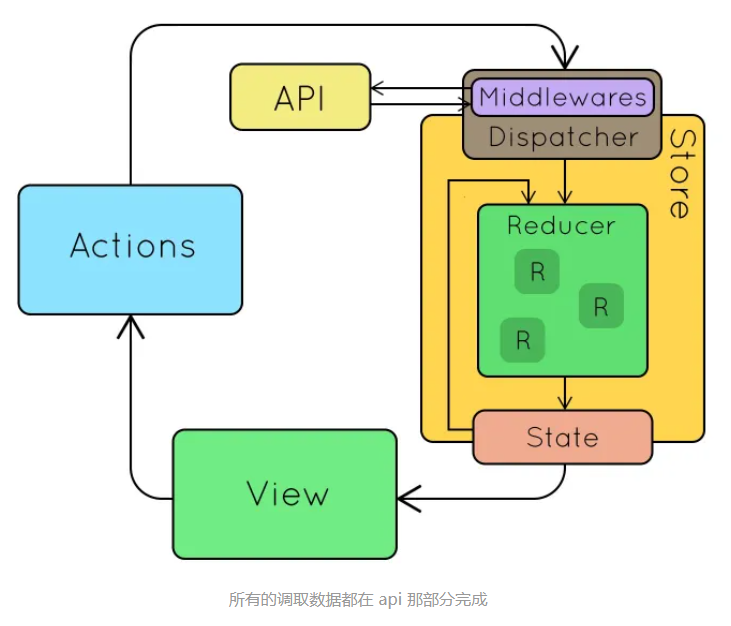

# redux
## 原理
### 容器组件和展示组件
react-redux 提供的 connect 函数，可以把 React 组件和 Redux 的 store 链接起来生成一个新的容器组件(这里有个经典的设计模式 “高阶组件”)

数据如何获取就是容器组件需要负责的事情，在获取到数据后通过 props 属性传递到展示组件，当展示组件需要变更状态时调用容器组件提供的方法同步这些
状态变化。

总结下来，容器组件需要做两件事： 
- 从 Redux 的 store 中获取数据给到展示组件，对应下例 mapStateToProps() 方法。
- 提供方法供展示组件同步需要变更的状态，对应下例 mapDispatchToProps() 方法。

### 模拟一下createStore的源码
通过redux当中的createStore方法来创建一个store，它提供3个主要的方法:
```javascript
// 以下代码示例来自redux官方教程
const createStore = (reducer) => {
    let state;
    let listeners = [];

    // 用来返回当前的state
    const getState = () => state;

    // 根据action调用reducer返回新的state并触发listener
    const dispatch = (action) => {
        state = reducer(state, action);
        listeners.forEach(listener => listener());
    };
    
    /* 这里的subscribe有两个功能
     * 调用 subscribe(listener) 会使用listeners.push(listener)注册一个listener
     * 而调用 subscribe 的返回函数则会注销掉listener
     */
    const subscribe = (listener) => {
        listeners.push(listener);
        return () => {
            listeners = listeners.filter(l => l !== listener);
        };
    };

    return { getState, dispatch, subscribe };
};
```

redux、useContext是通过将所有状态放到一个状态树里，全局公用来解决的。

使用redux、useContext时，状态树发送变动，只会更新使用了此状态的组件，其它组件不会更新。用法需要手动往组件里注入状态。

redux、useContext中状态的修改需要发出dispatch，通过触发action来修改。不能直接修改Store，那么可以通过dispatch、action追溯状态的变化。

实现原理
1. 顶层分发状态，让React组件被动地渲染。
2. 监听事件，事件有权利回到所有状态顶层影响状态。


## redux 和 context
App根节点组件提供的`Context`对象可以看成是App级的全局作用域，所以，我们利用App根节点组件提供的`Context`对象创建一些App级的全局数据。现成的例子可以参考react-redux，以下是`<Provider />`组件源码的核心实现：

App的根组件用`<Provider />`组件包裹后，本质上就为App提供了一个全局的属性`store`，相当于在整个App范围内，共享`store`属性。当然，`<Provider />`组件也可以包裹在其他组件中，在组件级的全局范围内共享`store`。
```js
export function createProvider(storeKey = 'store', subKey) {
    const subscriptionKey = subKey || `${storeKey}Subscription`

    class Provider extends Component {
        getChildContext() {
          return { [storeKey]: this[storeKey], [subscriptionKey]: null }
        }

        constructor(props, context) {
          super(props, context)
          this[storeKey] = props.store;
        }

        render() {
          return Children.only(this.props.children)
        }
    }

    // ......

    Provider.propTypes = {
        store: storeShape.isRequired,
        children: PropTypes.element.isRequired,
    }
    Provider.childContextTypes = {
        [storeKey]: storeShape.isRequired,
        [subscriptionKey]: subscriptionShape,
    }

    return Provider
}

export default createProvider()
```


## redux使用
* Store : 储存
```
createStore接受一个reducer作为参数，以后每当store.dispatch一个新的action，就会自动调用reducer,返回新的state
```
* Connect： 
   * 包装原组件，将state和action通过props的方式传入到原组件内部。
   * 监听store tree变化，使其包装的原组件可以响应state变化
```
当 redux store 中的 state 变化时，对应的mapStateToProps函数会被执行，如果mapStateToProps函数新返回的对象与之前对象浅比较相等(此时，如果是类组件可以理解为 shouldComponentUpdate 方法返回 false)，展示组件就不会重新渲染，否则重新渲染展示组件。
```
* Action : 动作
* Reducer : 见实例


## 2-2.Store
store:首先要创建一个对象store，这个对象有各种方法，用来让外界获取Redux的数据（store.getState），或者让外界来修改Redux中的数据（store.dispatch）

在 reducer 纯函数中不允许直接修改 state 对象，每次都应返回一个新的 state。原生 JavaScript 中我们要时刻记得使用 ES6 的扩展符 ... 

或Object.assign() 函数创建一个新 state，但是仍然是一个浅 copy，遇到复杂的数据结构我们还需要做深拷贝返回一个新的状态，总之你要保证每次都返回一个新对象，一方面深拷贝会造成性能损耗、另一方面难免会忘记从而直接修改原来的 state。

### reducer 纯函数要保证以下两点：
reducer 根据 action 的响应决定怎么去修改 store 中的 state。编写 reducer 函数没那么复杂，倒要切记该函数始终为一个纯函数，应避免直接修改state。

1. 同样的参数，函数的返回结果也总是相同的。例如，根据上一个 state 和 action 也会返回一个新的 state，类似这样的结构(previousState, action) => newState。

2. 函数执行没有任何副作用，不受外部执行环境的影响。例如，不会有任何的接口调用或修改外部对象。


## 2-1.Action
Action表示应用中的各类动作或操作，不同的操作会改变应用相应的state状态，说白了就是一个带type属性的对象
```javascript
import { Dispatch } from 'redux';
import {
  LOGIN_SUCCESS
} from './actiontypes';

export const loginAction = (data:string) => (dispatch: Dispatch) => {
  dispatch({
      type: LOGIN_SUCCESS,
      payload: data
  });
};
```

通过react-redux做连接，使用Provider：从最外部封装了整个应用，并向connect模块传递store。
Connect： 
1. 包装原组件，将state和action通过props的方式传入到原组件内部。
2. 监听store tree变化，使其包装的原组件可以响应state变化

简单地说就是：
1.顶层分发状态，让React组件被动地渲染。
2.监听事件，事件有权利回到所有状态顶层影响状态。

1. Redux 的核心是一个 store。
2. action:action 是一个 JavaScript 对象，通常包含了 type、payload 等字段，用于描述发生的事件及相关信息

3. reducer：撸开袖子真刀实枪的就去干了，比如一连长要求增援，增援要求是100杆枪，团长马上就给你加了100杆枪送了过去。reducer 不是一个对象，而是一个返回更新后 state 的纯函数

5. connect方法理解：connect(mapStateToProps, mapDispatchToProps)(MyComponent)

connect是真正的重点，它是一个科里化函数，意思是先接受两个参数（数据绑定mapStateToProps和事件绑定mapDispatchToProps），再接受一个参数（将要绑定的组件本身）：

5. mapStateToProps：构建好Redux系统的时候，它会被自动初始化，但是你的React组件并不知道它的存在，因此你需要分拣出你需要的Redux状态，所以你需要绑定一个函数，它的参数是state，简单返回你关心的几个值。

## 实战：
```javascript
// store:index.ts
import { createStore, combineReducers, applyMiddleware } from 'redux';
import logger from 'redux-logger';
import thunk from 'redux-thunk';
import userStore from './user.store';
import { composeWithDevTools } from 'redux-devtools-extension';

const reducer = combineReducers({
  userStore,
});

const enhancers = process.env.APP_ENV === 'dev' ? composeWithDevTools(
  applyMiddleware(thunk, logger)
) : applyMiddleware(thunk);

const store = createStore(reducer, enhancers);

export default store;


// user.store.ts 是一个reducer
import { sessionStorage } from "../utils/storage";
import { removeTiemManualToken, setTiemManualToken } from "@/utils/auth";
import { IAction, IUser } from "@/utils/types";
import { LOGIN_SUCCESS, LOGOUT } from "./actions/actiontypes";

export interface IUserState {
  user?: IUser;
  token?: string;
}

const initUserState: IUserState = sessionStorage.getItem("user") || {};

const userStore = (state: IUserState = initUserState, action: IAction) => {
  const { payload, type } = action;

  switch (type) {
    case LOGIN_SUCCESS:
      setTiemManualToken(payload);
      const userState = { ...state, token: action.payload };
      // 注意这里调用了外部，违背纯函数的原则
      sessionStorage.setItem("user", userState);

      return userState;
    case LOGOUT:
      // 注意这里调用了外部，违背纯函数的原则
      removeTiemManualToken();
      sessionStorage.removeItem("user");

      return {};
    default:
      return state;
  }
};

export default userStore;
```

组件内使用,mapStateToProps 使用
```javaScript
const AuthRoute: FC<IAuthRoute> = (props) => {
  const { children, token } = props;
  const logined: boolean = token ? true : false;
  console.log('=====AuthRouteRender=====', logined);

  return (logined ? <>{children}</> : (
    <Navigate
      replace={true}
      to='/login'
      state={{ from: `${location.pathname}${location.search}` }}
    />
  ));
};

const mapStateToProps = (state: any) => {
  return {
    token: state.userStore.token
  };
};

export default connect(mapStateToProps, null)(AuthRoute);
```

mapDispatchToProps
```javaScript
// web\src\pages\login\login.tsx
import { loginAction } from '@/stores/actions/userActions';
const Login = (props: LonginProps) => {
  // ...
}
const mapDispatchToProps = (dispatch: any) => {

  return {
    loginAction: (data: string) => dispatch(loginAction(data)),
  };
};

export default connect(null, mapDispatchToProps)(Login);

// userActions.ts
import { Dispatch } from 'redux';
import {
  LOGIN_SUCCESS
} from './actiontypes';

export const loginAction = (data:string) => (dispatch: Dispatch) => {
  dispatch({
      type: LOGIN_SUCCESS,
      payload: data
  });
};
```

## redux-thunk 和 redux-saga区别
概念
Redux Thunk:Redux 的异步处理中间件
Dva:一个基于redux 和 redux-saga 的数据流方案

### redux 时异步操作出现的具体时机
当出发一个 action 会经过中间件 middlewares，这时所有的 side effect 操作，例如调用 api 获取数据等等都将在这里完成。然后再经由 reducer 更新 state，最后传递到 view 完成 MVC 的数据流循环。


## redux-thunk 解决方案
注册插件
```javaScript
// Note: this API requires redux@>=3.1.0
const store = createStore(rootReducer, applyMiddleware(thunk));

ReactDOM.render(
  <Provider store={store}>
    <Routes />
  </Provider>,
  document.getElementById('root')
);
```

Reducer 也非常简单，和原来一模一样
```javaScript
export default (state = defaultState, action) => {
  switch (action.type) {
    case REMOTE_DATA_RECEIVED:
      return {
        ...state,
        data: action.data
      };
    default:
      return state;
  }
};
```

### 不同之处在于 action
```javaScript
// 普通的 action
export function toggleTodo(index) {
  return { type: TOGGLE_TODO, index }
}

// redux-thunk 的 action 可以是一 异步的 higher order function 高阶函数
export const fetchData = args => async (dispatch, getState) => {
  const state = getState();
  const url = 'https://jsonplaceholder.typicode.com/users/' + args;

  try {
    const response = await fetch(url)
      .then(resp => {
        return resp;
      })
      .then(resp => resp.json());

    dispatch({
      type: REMOTE_DATA_RECEIVED,
      data: response
    });
  } catch (error) {
    console.log(error);
  }
};
```

## 2.redux-saga 解决方案
### 区别:saga 使用的仍然是普通的 action
```javaScript
// 这个 action 将由 saga 监听，并且出发 side effect 异步加载 api 操作
export const fetchData = () => ({
  type:  "START_FETCH_DATA"
});

// 这个 action 将由 saga 发出
export const fetchSuccess = data => ({
  type: "REMOTE_DATA_RECEIVED",
  payload: data
});
```

接下来就是注册 saga 相关 side effect 操作。下面的文件是 fetchData.saga.js
```javaScript
import { takeLatest, put } from "redux-saga/effects";

function* fetchDataSaga(action){
  try {
    const response = yield fetch(action.url);
    const data = yield response.json()
    yield put(fetchSuccess(data));
  } catch (error) {
    console.log(error);
  }
}

export default function* watchFetchSaga(){
  // saga 将监听此事件，takeLatest 表示仅仅只监听最新的此事件
  yield takeLatest("START_FETCH_DATA", fetchDataSaga)
}
```

### 总结
saga 自己基本上完全弄了一套 asyc 的事件监听机制。虽然好的一方面是将来可以扩展成 worker 相关的模块，甚至可以做到 multiple threads 同时执行，但代码量大大增加。如果只是普通的 application，用 redux-thunk 足够

# mobx
响应式依赖状态

MobX 的理念是通过观察者模式对数据做出追踪处理，在对可观察属性作出变更或者引用的时候，触发其依赖的监听函数；整体的store注入机制采用react提供的context来进行传递;

而mobx维护了多个状态树，每个状态树相互独立，通过import或 Provider + inject将状态注入至组件。

Mobx虽然也是遵循了Flux思想，让数据和逻辑单向流动，但是，Mobx底层使用的还是数据劫持（Object.defineProperty / Proxy）。它任然支持直接修改数据并更新视图。


## 2.mobx使用
computed,reactions,actions,inject,observer,Provider

* Provider: 顶层提供store的服务，Provider store={store}

* inject: 注入Provider提供的store到该组件的props中，组件内部使用
inject 是一个高阶组件 高阶组件返回的是组件，作用在包装组件

### observable(value):可观察的状态
用法:
+ observable(value)
+ @observable classProperty = valu
Observable 值可以是JS基本数据类型、引用类型、普通对象、类实例、数组和映射。
```js
import { observable } from "mobx";

class Todo {
    id = Math.random();
    @observable title = "";
    @observable finished = false;
}
```

### Computed values(计算值)
通过@computed 装饰器或者利用 (extend)Observable 时调用 的getter / setter 函数来进行使用。
```js
class TodoList {
    @observable todos = [];
    @computed get unfinishedTodoCount() {
        return this.todos.filter(todo => !todo.finished).length;
    }
}
```

### Reactions(反应)
```
Reactions 和计算值很像，但它不是产生一个新的值，而是会产生一些副作用，比如打印到控制台、网络请求、递增地更新 React 组件树以修补DOM、等等。 简而言之，reactions 在 响应式编程和命令式编程之间建立沟通的桥梁
```

### react 中使用
(无状态函数)组件变成响应式组件，方法是在组件上添加 observer 函数/ 装饰器. observer由 mobx-react 包提供的。
```js
import React, {Component} from 'react';
import ReactDOM from 'react-dom';
import {observer} from 'mobx-react';

@observer
class TodoListView extends Component {
    render() {
        return <div>
            <ul>
                {this.props.todoList.todos.map(todo =>
                    <TodoView todo={todo} key={todo.id} />
                )}
            </ul>
            Tasks left: {this.props.todoList.unfinishedTodoCount}
        </div>
    }
}

const TodoView = observer(({todo}) =>
    <li>
        <input
            type="checkbox"
            checked={todo.finished}
            onClick={() => todo.finished = !todo.finished}
        />{todo.title}
    </li>
)

const store = new TodoList();

ReactDOM.render(<TodoListView todoList={store} />, document.getElementById('mount'));
```