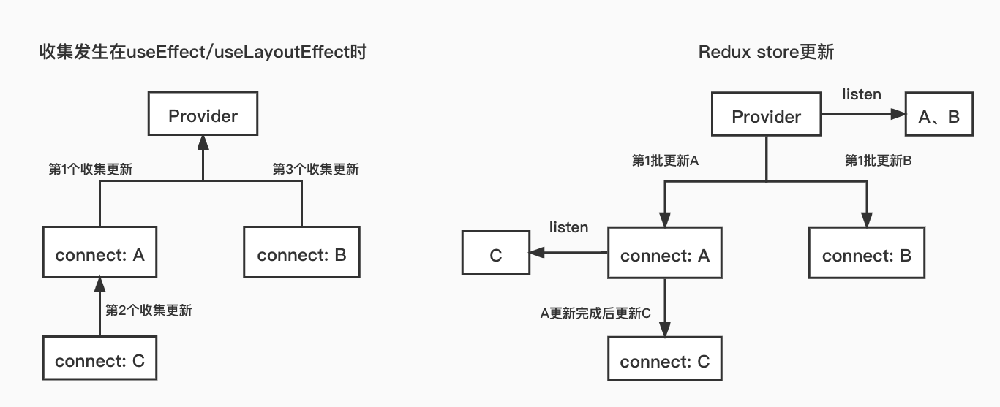

# redux
## 原理
### 容器组件和展示组件
react-redux 提供的 connect 函数，可以把 React 组件和 Redux 的 store 链接起来生成一个新的容器组件(这里有个经典的设计模式 “高阶组件”)

数据如何获取就是容器组件需要负责的事情，在获取到数据后通过 props 属性传递到展示组件，当展示组件需要变更状态时调用容器组件提供的方法同步这些
状态变化。

总结下来，容器组件需要做两件事： 
- 从 Redux 的 store 中获取数据给到展示组件，对应下例 mapStateToProps() 方法。
- 提供方法供展示组件同步需要变更的状态，对应下例 mapDispatchToProps() 方法。

### 模拟一下createStore的源码
通过redux当中的createStore方法来创建一个store，它提供3个主要的方法:
```javascript
// 以下代码示例来自redux官方教程
const createStore = (reducer) => {
    let state;
    let listeners = [];

    // 用来返回当前的state
    const getState = () => state;

    // 根据action调用reducer返回新的state并触发listener
    const dispatch = (action) => {
        state = reducer(state, action);
        listeners.forEach(listener => listener());
    };
    
    /* 这里的subscribe有两个功能
     * 调用 subscribe(listener) 会使用listeners.push(listener)注册一个listener
     * 而调用 subscribe 的返回函数则会注销掉listener
     */
    const subscribe = (listener) => {
        listeners.push(listener);
        return () => {
            listeners = listeners.filter(l => l !== listener);
        };
    };

    return { getState, dispatch, subscribe };
};
```

redux、useContext是通过将所有状态放到一个状态树里，全局公用来解决的。

使用redux、useContext时，状态树发送变动，只会更新使用了此状态的组件，其它组件不会更新。用法需要手动往组件里注入状态。

redux、useContext中状态的修改需要发出dispatch，通过触发action来修改。不能直接修改Store，那么可以通过dispatch、action追溯状态的变化。

实现原理
1. 顶层分发状态，让React组件被动地渲染。
2. 监听事件，事件有权利回到所有状态顶层影响状态。


## redux 和 context
App根节点组件提供的`Context`对象可以看成是App级的全局作用域，所以，我们利用App根节点组件提供的`Context`对象创建一些App级的全局数据。现成的例子可以参考react-redux，以下是`<Provider />`组件源码的核心实现：

App的根组件用`<Provider />`组件包裹后，本质上就为App提供了一个全局的属性`store`，相当于在整个App范围内，共享`store`属性。当然，`<Provider />`组件也可以包裹在其他组件中，在组件级的全局范围内共享`store`。
```js
export function createProvider(storeKey = 'store', subKey) {
    const subscriptionKey = subKey || `${storeKey}Subscription`

    class Provider extends Component {
        getChildContext() {
          return { [storeKey]: this[storeKey], [subscriptionKey]: null }
        }

        constructor(props, context) {
          super(props, context)
          this[storeKey] = props.store;
        }

        render() {
          return Children.only(this.props.children)
        }
    }

    // ......

    Provider.propTypes = {
        store: storeShape.isRequired,
        children: PropTypes.element.isRequired,
    }
    Provider.childContextTypes = {
        [storeKey]: storeShape.isRequired,
        [subscriptionKey]: subscriptionShape,
    }

    return Provider
}

export default createProvider()
```


## redux使用
* Store : 储存
```
createStore接受一个reducer作为参数，以后每当store.dispatch一个新的action，就会自动调用reducer,返回新的state
```
* Connect： 
   * 包装原组件，将state和action通过props的方式传入到原组件内部。
   * 监听store tree变化，使其包装的原组件可以响应state变化
```
当 redux store 中的 state 变化时，对应的mapStateToProps函数会被执行，如果mapStateToProps函数新返回的对象与之前对象浅比较相等(此时，如果是类组件可以理解为 shouldComponentUpdate 方法返回 false)，展示组件就不会重新渲染，否则重新渲染展示组件。
```
* Action : 动作
* Reducer : 见实例


通过react-redux做连接，使用Provider：从最外部封装了整个应用，并向connect模块传递store。
Connect： 
1. 包装原组件，将state和action通过props的方式传入到原组件内部。
2. 监听store tree变化，使其包装的原组件可以响应state变化

简单地说就是：
1.顶层分发状态，让React组件被动地渲染。
2.监听事件，事件有权利回到所有状态顶层影响状态。

1. Redux 的核心是一个 store。
2. action:action 是一个 JavaScript 对象，通常包含了 type、payload 等字段，用于描述发生的事件及相关信息

3. reducer：撸开袖子真刀实枪的就去干了，比如一连长要求增援，增援要求是100杆枪，团长马上就给你加了100杆枪送了过去。reducer 不是一个对象，而是一个返回更新后 state 的纯函数

5. connect方法理解：connect(mapStateToProps, mapDispatchToProps)(MyComponent)

connect是真正的重点，它是一个科里化函数，意思是先接受两个参数（数据绑定mapStateToProps和事件绑定mapDispatchToProps），再接受一个参数（将要绑定的组件本身）：

5. mapStateToProps：构建好Redux系统的时候，它会被自动初始化，但是你的React组件并不知道它的存在，因此你需要分拣出你需要的Redux状态，所以你需要绑定一个函数，它的参数是state，简单返回你关心的几个值。


### reducer 纯函数要保证以下两点：
reducer 根据 action 的响应决定怎么去修改 store 中的 state。编写 reducer 函数没那么复杂，倒要切记该函数始终为一个纯函数，应避免直接修改state。

1. 同样的参数，函数的返回结果也总是相同的。例如，根据上一个 state 和 action 也会返回一个新的 state，类似这样的结构(previousState, action) => newState。

2. 函数执行没有任何副作用，不受外部执行环境的影响。例如，不会有任何的接口调用或修改外部对象。


## 2-2.Store
store:首先要创建一个对象store，这个对象有各种方法，用来让外界获取Redux的数据（store.getState），或者让外界来修改Redux中的数据（store.dispatch）

在 reducer 纯函数中不允许直接修改 state 对象，每次都应返回一个新的 state。原生 JavaScript 中我们要时刻记得使用 ES6 的扩展符 ... 

或Object.assign() 函数创建一个新 state，但是仍然是一个浅 copy，遇到复杂的数据结构我们还需要做深拷贝返回一个新的状态，总之你要保证每次都返回一个新对象，一方面深拷贝会造成性能损耗、另一方面难免会忘记从而直接修改原来的 state。


## 2-1.Action
Action表示应用中的各类动作或操作，不同的操作会改变应用相应的state状态，说白了就是一个带type属性的对象
```javascript
import { Dispatch } from 'redux';
import {
  LOGIN_SUCCESS
} from './actiontypes';

export const loginAction = (data:string) => (dispatch: Dispatch) => {
  dispatch({
      type: LOGIN_SUCCESS,
      payload: data
  });
};
```

## 实战：
查看实例代码
```javaScript
react18-test
redux 模块
```

# redux-thunk 和 redux-saga区别
概念
Redux Thunk:Redux 的异步处理中间件
Dva:一个基于redux 和 redux-saga 的数据流方案

### redux 时异步操作出现的具体时机
当出发一个 action 会经过中间件 middlewares，这时所有的 side effect 操作，例如调用 api 获取数据等等都将在这里完成。然后再经由 reducer 更新 state，最后传递到 view 完成 MVC 的数据流循环。


## redux-thunk 解决方案
注册插件
```javaScript
// Note: this API requires redux@>=3.1.0
const store = createStore(rootReducer, applyMiddleware(thunk));

ReactDOM.render(
  <Provider store={store}>
    <Routes />
  </Provider>,
  document.getElementById('root')
);
```

Reducer 也非常简单，和原来一模一样
```javaScript
export default (state = defaultState, action) => {
  switch (action.type) {
    case REMOTE_DATA_RECEIVED:
      return {
        ...state,
        data: action.data
      };
    default:
      return state;
  }
};
```

### 不同之处在于 action
```javaScript
// 普通的 action
export function toggleTodo(index) {
  return { type: TOGGLE_TODO, index }
}

// redux-thunk 的 action 可以是一 异步的 higher order function 高阶函数
export const fetchData = args => async (dispatch, getState) => {
  const state = getState();
  const url = 'https://jsonplaceholder.typicode.com/users/' + args;

  try {
    const response = await fetch(url)
      .then(resp => {
        return resp;
      })
      .then(resp => resp.json());

    dispatch({
      type: REMOTE_DATA_RECEIVED,
      data: response
    });
  } catch (error) {
    console.log(error);
  }
};
```

## 2.redux-saga 解决方案
### 区别:saga 使用的仍然是普通的 action
```javaScript
// 这个 action 将由 saga 监听，并且出发 side effect 异步加载 api 操作
export const fetchData = () => ({
  type:  "START_FETCH_DATA"
});

// 这个 action 将由 saga 发出
export const fetchSuccess = data => ({
  type: "REMOTE_DATA_RECEIVED",
  payload: data
});
```

接下来就是注册 saga 相关 side effect 操作。下面的文件是 fetchData.saga.js
```javaScript
import { takeLatest, put } from "redux-saga/effects";

function* fetchDataSaga(action){
  try {
    const response = yield fetch(action.url);
    const data = yield response.json()
    yield put(fetchSuccess(data));
  } catch (error) {
    console.log(error);
  }
}

export default function* watchFetchSaga(){
  // saga 将监听此事件，takeLatest 表示仅仅只监听最新的此事件
  yield takeLatest("START_FETCH_DATA", fetchDataSaga)
}
```

### 总结
saga 自己基本上完全弄了一套 asyc 的事件监听机制。虽然好的一方面是将来可以扩展成 worker 相关的模块，甚至可以做到 multiple threads 同时执行，但代码量大大增加。如果只是普通的 application，用 redux-thunk 足够

# redux 源码
```json
{
  "react-redux": "^8.0.5",
  "redux": "^4.2.0",
  "redux-thunk": "^2.4.2",
  "react": "^18.2.0",
}
```

react 中能更新 redux 的 store，并能监听 store 的变化并通知 react 的相关组件更新，从而能让 react 将状态放在外部管理（有利于 model 集中管理，能利用 redux 单项数据流架构，数据流易预测易维护，也极大的方便了任意层级组件间通信

### 问题
1. react-redux 是如何关联起 redux 和 react 的？
2. 究竟是 redux 性能不好还是 react-redux 性能不好？
3. 具体不好在哪里？
4. 能不能避免？

https://segmentfault.com/a/1190000041472179

react-redux 是如何关联起 redux 和 react 的？这个问题倒是有不少源码解析的文章，我曾经看过一篇很详细的，不过很可惜是老版本的，还在用 class component，所以当时的我决定自己去看源码。当时属于是粗读:

读完之后的简单总结就是 Provider 中有 Subscription 实例，connect 这个高阶组件中也有 Subscription 实例，并且有负责自身更新的 hooks: useReducer，useReducer 的 dispatch 会被注册进 Subscription 的 listeners，listeners 中有一个方法 notify 会遍历调用每个 listener，notify 会被注册给 redux 的 subscribe，从而 redux 的 state 更新后会通知给所有 connect 组件，当然每个 connect 都有检查自己是否需要更新的方法 checkForUpdates 来避免不必要的更新，具体细节就不说了。

总之，当时我只粗读了整体逻辑，但是可以解答我上面的问题了：

1. react-redux 确实有可能性能不好。而至于 redux，每次 dispatch 都会让 state 去每个 reducer 走一遍，并且为了保证数据 immutable 也会有额外的创建复制开销。不过 mutable 阵营的库如果频繁修改对象也会导致 V8 的对象内存结构由顺序结构变成字典结构，查询速度降低，以及内联缓存变得高度超态，这点上 immutable 算拉回一点差距。不过为了一个清晰可靠的数据流架构，这种级别的开销在大部分场景算是值得，甚至忽略不计。
2. react-redux 性能具体不好在哪里？因为每个 connect 不管需不需要更新都会被通知一次，开发者定义的 selector 都会被调用一遍甚至多遍，如果 selector 逻辑昂贵，还是会比较消耗性能的。

3. 那么 react-redux 一定会性能不好吗？不一定，根据上面的分析，如果你的 selector 逻辑简单（或者将复杂派生计算都放在 redux 的 reducer 里，但是这样可能不利于构建一个合理的 model），connect 用的不多，那么性能并不会被 mobx 这样的细粒度更新拉开太多。也就是说 selector 里业务计算不复杂、使用全局状态管理的组件不多的情况下，完全不会有可感知的性能问题。那如果 selector 里面的业务计算复杂怎么办呢？能不能完全避免呢？当然可以，你可以用 reselect 这个库，它会缓存 selector 的结果，只有原始数据变化时才会重新计算派生数据。

## 前言
https://segmentfault.com/a/1190000041472179

### "Stale Props" and "Zombie Children"（过期 Props 和僵尸子节点问题）
自 v7.1.0 版本发布以后，react-redux 就可以使用 hooks api 了，官方也推荐使用 hooks 作为组件中的默认使用方法。但是有一些边缘情况可能会发生，这篇文档就是让我们意识到这些事的。

react-redux 实现中最难的地方之一就是：如果你的 mapStateToProps 是(state, ownProps)这样使用的，它将会每次被传入『最新的』props。一直到版本 4 都一直有边缘场景下的重复的 bug 被报告，比如：有一个列表 item 的数据被删除了，mapStateToProps 里面就报错了。

从版本 5 开始，react-redux 试图保证 ownProps 的一致性。在版本 7 里面，每个 connect()内部都有一个自定义的 Subscription 类，从而当 connect 里面又有 connect，它能形成一个嵌套的结构。这确保了树中更低层的 connect 组件只会在离它最近的祖先 connect 组件更新后才会接受到来自 store 的更新。然而，这个实现依赖于每个 connect()实例里面覆写了内部 React Context 的一部分（subscription 那部分），用它自身的 Subscription 实例用于嵌套。然后用这个新的 React Context ( \<ReactReduxContext.Provider\> ) 渲染子节点。

如果用 hooks，没有办法渲染一个 context.Provider，这就代表它不能让 subscriptions 有嵌套的结构。因为这一点，"stale props" 和 "zombie child" 问题可能在『用 hooks 代替 connect』 的应用里重新发生。


具体来说，"stale props" 会出现在这种场景：
* selector 函数会根据这个组件的 props 计算出数据
* 父组件会重新 render，并传给这个组件新的 props
* 但是这个组件会在 props 更新之前就执行 selector（译者注：因为子组件的来自 store 的更新是在 useLayoutEffect/useEffect 中注册的，所以子组件先于父组件注册，redux 触发订阅会先触发子组件的更新方法）

这种旧的 props 和最新 store state 算出来的结果，很有可能是错误的，甚至会引起报错。

"Zombie child"具体是指在以下场景：
* 多个嵌套的 connect 组件 mounted，子组件比父组件更早的注册到 store 上
* 一个 action dispatch 了在 store 里删除数据的行为，比如一个 todo list 中的 item
* 父组件在渲染的时候就会少一个 item 子组件
* 但是，因为子组件是先被订阅的，它的 subscription 先于父组件。当它计算一个基于 store 和 props 计算的值时，部分数据可能已经不存在了，如果计算逻辑不注意的话就会报错。

useSelector()试图这样解决这个问题：它会捕获所有来自 store 更新导致的 selector 计算中的报错，当错误发生时，组件会强制更新，这时 selector 会再次执行。这个需要 selector 是个纯函数并且你没有逻辑依赖 selector 抛出错误。

如果你更喜欢自己处理，这里有一个可能有用的事项能帮助你在使用 useSelector() 时避免这些问题

* 不要在 selector 的计算中依赖 props
* 如果在：你必须要依赖 props 计算并且 props 将来可能发生变化、依赖的 store 数据可能会被删除，这两种情况下时，你要防备性的写 selector。不要直接像 state.todos[props.id].name 这样读取值，而是先读取 state.todos[props.id]，验证它是否存在再读取 todo.name
因为 connect 向 context provider 增加了必要的 Subscription，它会延迟执行子 subscriptions 直到这个 connected 组件 re-rendered。组件树中如果有 connected 组件在使用 useSelector 的组件的上层，也可以避免这个问题，因为父 connect 有和 hooks 组件同样的 store 更新（译者注：父 connect 组件更新后才会更新子 hooks 组件，同时 connect 组件的更新会带动子节点更新，被删除的节点在此次父组件的更新中已经卸载了：因为上文中说 state.todos[props.id].name ，说明 hooks 组件是上层通过 ids 遍历出来的。于是后续来自 store 的子 hooks 组件更新不会有被删除的）

以上的解释可能让大家明白了 "Stale Props" 和 "Zombie Children" 问题是如何产生的以及 react-redux 大概是怎么解决的，就是通过子代 connect 的更新被嵌套收集到父级 connect，每次 redux 更新并不是遍历更新所有 connect，而是父级先更新，然后子代由父级更新后才触发更新。但是似乎 hooks 的出现让它并不能完美解决问题了，而且具体这些设计的细节也没有说到。这部分的疑惑和缺失就是我准备再读 react-redux 源码的原因。


## 宏观设计
总体的抽象设计，让大家心中带着设计蓝图去读其中的细节，否则只看细节很难让它们之间串联起来明白它们是如何共同协作完成整个功能的。
React-Redux 的 Provider 和 connect 都提供了自己的贯穿子树的 context，它们的所有的子节点都可以拿到它们，并会将自己的更新方法交给它们。最终形成了根 <-- 父 <-- 子这样的收集顺序。根收集的更新方法会由 redux 触发，父收集的更新方法在父更新后再更新，于是保证了父节点被 redux 更新后子节点才更新的顺序。




## 1. 从react-redux常用的 api 切入
入口就是src/index.ts
```javaScript
import { useSyncExternalStore } from 'use-sync-external-store/shim'
import { useSyncExternalStoreWithSelector } from 'use-sync-external-store/shim/with-selector'

import { unstable_batchedUpdates as batch } from './utils/reactBatchedUpdates'
import { setBatch } from './utils/batch'

import { initializeUseSelector } from './hooks/useSelector'
import { initializeConnect } from './components/connect'

initializeUseSelector(useSyncExternalStoreWithSelector)
initializeConnect(useSyncExternalStore)

// Enable batched updates in our subscriptions for use
// with standard React renderers (ReactDOM, React Native)
setBatch(batch)

export { batch }

export * from './exports'
```


# mobx
响应式依赖状态

MobX 的理念是通过观察者模式对数据做出追踪处理，在对可观察属性作出变更或者引用的时候，触发其依赖的监听函数；整体的store注入机制采用react提供的context来进行传递;

而mobx维护了多个状态树，每个状态树相互独立，通过import或 Provider + inject将状态注入至组件。

Mobx虽然也是遵循了Flux思想，让数据和逻辑单向流动，但是，Mobx底层使用的还是数据劫持（Object.defineProperty / Proxy）。它任然支持直接修改数据并更新视图。


## 2.mobx使用
computed,reactions,actions,inject,observer,Provider

* Provider: 顶层提供store的服务，Provider store={store}

* inject: 注入Provider提供的store到该组件的props中，组件内部使用
inject 是一个高阶组件 高阶组件返回的是组件，作用在包装组件

### observable(value):可观察的状态
用法:
+ observable(value)
+ @observable classProperty = valu
Observable 值可以是JS基本数据类型、引用类型、普通对象、类实例、数组和映射。
```js
import { observable } from "mobx";

class Todo {
    id = Math.random();
    @observable title = "";
    @observable finished = false;
}
```

### Computed values(计算值)
通过@computed 装饰器或者利用 (extend)Observable 时调用 的getter / setter 函数来进行使用。
```js
class TodoList {
    @observable todos = [];
    @computed get unfinishedTodoCount() {
        return this.todos.filter(todo => !todo.finished).length;
    }
}
```

### Reactions(反应)
```
Reactions 和计算值很像，但它不是产生一个新的值，而是会产生一些副作用，比如打印到控制台、网络请求、递增地更新 React 组件树以修补DOM、等等。 简而言之，reactions 在 响应式编程和命令式编程之间建立沟通的桥梁
```

### react 中使用
(无状态函数)组件变成响应式组件，方法是在组件上添加 observer 函数/ 装饰器. observer由 mobx-react 包提供的。
```js
import React, {Component} from 'react';
import ReactDOM from 'react-dom';
import {observer} from 'mobx-react';

@observer
class TodoListView extends Component {
    render() {
        return <div>
            <ul>
                {this.props.todoList.todos.map(todo =>
                    <TodoView todo={todo} key={todo.id} />
                )}
            </ul>
            Tasks left: {this.props.todoList.unfinishedTodoCount}
        </div>
    }
}

const TodoView = observer(({todo}) =>
    <li>
        <input
            type="checkbox"
            checked={todo.finished}
            onClick={() => todo.finished = !todo.finished}
        />{todo.title}
    </li>
)

const store = new TodoList();

ReactDOM.render(<TodoListView todoList={store} />, document.getElementById('mount'));
```