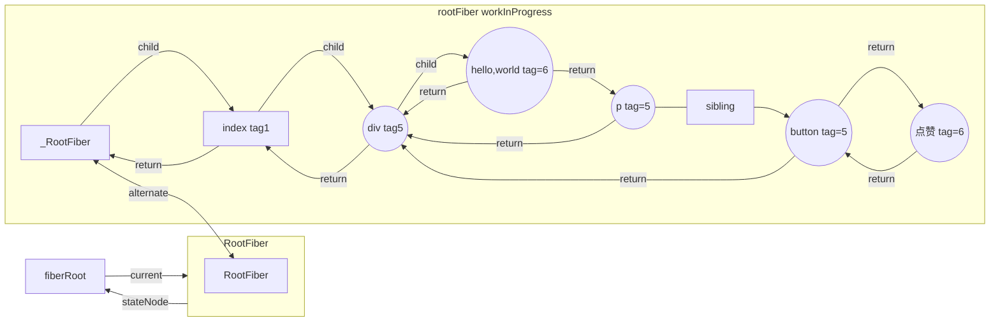

## 1.注意FiberRootNode 和 FiberNode 的不同
FiberRootNode是初始化 只调用一次,一个是fiber 协调
```javaScript
  function FiberRootNode(containerInfo, tag, hydrate) {
    console.log('==FiberRootNode 是初始化相关只调用一次===')
    this.tag = tag;
    this.containerInfo = containerInfo;
    this.pendingChildren = null;
    this.current = null;
    this.pingCache = null;
    this.finishedWork = null;
    this.timeoutHandle = noTimeout;
    this.context = null;
    this.pendingContext = null;
    this.hydrate = hydrate;
    this.callbackNode = null;
    this.callbackPriority = NoLanePriority;
    this.eventTimes = createLaneMap(NoLanes);
    this.expirationTimes = createLaneMap(NoTimestamp);
    this.pendingLanes = NoLanes;
    this.suspendedLanes = NoLanes;
    this.pingedLanes = NoLanes;
    this.expiredLanes = NoLanes;
    this.mutableReadLanes = NoLanes;
    this.finishedLanes = NoLanes;
    this.entangledLanes = NoLanes;
    this.entanglements = createLaneMap(NoLanes);
    ...
```

## FiberNode
```javaScript
function FiberNode(
  tag: WorkTag,
  pendingProps: mixed,
  key: null | string,
  mode: TypeOfMode,
) {

  // 用来表示当前Fiber对应的是那种类型的组件，如ClassComponent、FunctionComponent等
  this.tag = tag;
  // 通过不同过期时间，判断任务是否过期,以前版本用：expirationTime
  this.lanes = NoLanes;
  // 组件的key,调和子节点时候用到
  this.key = key; // fiber的key
  // 组件对应的ReactElement里的type，比如class组件对应那个class
  this.elementType = null;
  // 一般都等于elementType，但是通过lazy加载的组件，一开始会为null，直到加载完成才会设置为正确的type
  // fiber对应的DOM元素的标签类型，div、p...
  this.type = null; 

  //真实dom节点,管理 instance 自身的特性
  // 对应的实例，比如class组件对应class实例，原生的组件对应dom
  this.stateNode = null; // fiber的实例，类组件场景下，是组件的类，HostComponent场景，是dom元素

  // Fiber 链表相关
  this.return = null; // 指向父级fiber
  this.child = null; // 指向子fiber
  this.sibling = null; // 同级兄弟fiber
  this.index = 0;

  this.ref = null; // ref相关

  // Fiber更新相关
  /*用作为工作单元 来计算state*/

  // 等待被更新的属性
  // 当前处理过程中的组件props对象
  this.pendingProps = pendingProps;
  // 上一次渲染完成之后的props
  this.memoizedProps = null;
  // 等待更新的任务队列
  this.updateQueue = null; // 存储update的链表
  // 上一次渲染完成的state
  this.memoizedState = null; // 类组件存储fiber的状态，函数组件存储hooks链表
  this.dependencies = null;
  // 当前组件的mode，默认继承夫节点。比如是否处于异步渲染等
  this.mode = mode;

  // Effects
  /*
 effectTag、nextEffect、firstEffect、lastEffect为effect相关信息，保存当前diff的成果。这些参数共同为后续的工作循环提供了可能，使react可以在执行完每个fiber时停下，根据浏览器的繁忙情况判断是否继续往下执行，因此我们也可以将fiber理解成一个工作单元。 
  */
  // flags原为effectTag，表示当前这个fiber节点变化的类型：增、删、改
  // 用来记录本次更新在当前组件产生的副作用，比如新增、修改、删除等
  this.flags = NoFlags;

  /*单链表结构，方便遍历 Fiber Tree 上有副作用的节点*/ 
  // 用链表记录产生的副作用
  this.nextEffect = null;
  // 副作用链表中的第一个
  this.firstEffect = null;
  // 最后一个
  this.lastEffect = null;


  // 调度优先级相关
  // 该fiber中的优先级，它可以判断当前节点是否需要更新
  this.lanes = NoLanes; 
  this.childLanes = NoLanes;// 子树中的优先级，它可以判断当前节点的子树是否需要更新

  /*
  * 可以看成是workInProgress（或current）树中的和它一样的节点，
  * 可以通过这个字段是否为null判断当前这个fiber处在更新还是创建过程
  * */
  // 双缓存树，指向缓存的fiber。更新阶段，两颗树互相交替。
  // 指向当前fiber对应的一个拷贝,fiber的版本池，即记录fiber更新过程，便于恢复
  this.alternate = null;
}
```


## 结构例子：
```javaScript
export default class Index extends React.Component{
   state={ number:666 } 
   handleClick=()=>{
     this.setState({
         number:this.state.number + 1
     })
   }
   render(){
     return <div>
       hello，world
       <p > 《React进阶实践指南》 { this.state.number }   </p>
       <button onClick={ this.handleClick } >点赞</button>
     </div>
   }
}
```

### fiber对应的关系如下：
