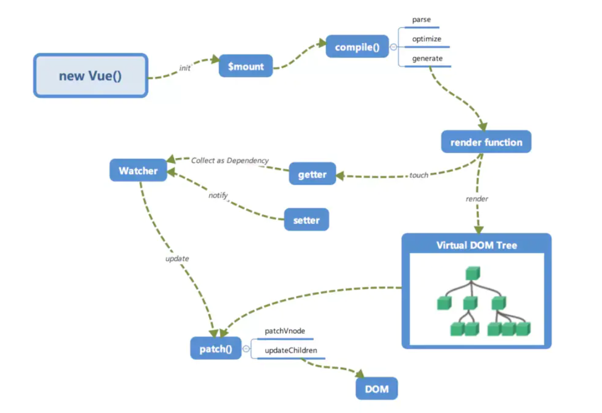

## 1.vue 特点
1. Vue的template、script、style是分离的，可读性和可维护性比较好

2. 提供了便捷的模板命令
```
vue 用v-if 条件渲染div
还有v-model,v-on:click,v-for

react中用js，运算符去实现 v-if, array.map() 去实现 v-for
```

3. 提供了computed,watch 副作用的钩子，在react 统一使用useEffect去实现这些功能
```javaScript
改变组件状态：
vue: this.data = x;
react: setState(x);
```

4. 模板引擎,区别就是在使用webpack打包的过程中，vue是用vue-loader来处理.vue后缀的文件;

react初始化的时候使用bable 处理jsx模板组件，得到ast树的结构,然后再进一步构建fiber树

5. 由于 Vue 是通过 template 模版进行编译的，所以在编译的时候可以很好对静态节点进行分析然后进行打补丁标记，然后在 Diff 的时候，Vue2 是判断如果是静态节点则跳过过循环对比，而 Vue3 则是把整个静态节点进行提升处理，Diff 的时候是不过进入循环的，所以 Vue3 比 Vue2 的 Diff 性能更高效。而 React 因为是通过 JSX 进行编译的，是无法进行静态节点分析的，所以 React 在对静态节点处理这一块是要逊色的。

6. 渲染/更新方式,见下面扩展
回答react和vue不同：
在Vue中，一个组件在渲染期间依赖于自动追踪，因此vue框架知道提前哪一个组件需要渲染当组件状态发生改变时。每个组件可以被认为具有自动为你实现react shouldComponentUpdate。


7. Vue2 和 Vue3 的比对和更新是同步进行的，这个跟 React15 是相同的，就是在比对的过程中，如果发现了那些节点需要移动或者更新或删除，是立即执行的，也就是 React 中常讲的不可中断的更新，如果比对量过大的话，就会造成卡顿，所以 React16 起就更改为了比对和更新是异步进行的，所以 React16 以后的 Diff 是可以中断，Diff 和任务调度都是在内存中进行的，所以即便中断了，用户也不会知道。


8. 另外 Vue2 和 Vue3 都使用了双端对比算法，而 React 的 Fiber 由于是单向链表的结构，所以在 React 不设置由右向左的链表之前，都无法实现双端对比。

## 扩展:vue渲染/更新方式
数据劫持结合发布者-订阅者模式的方式实现:数据-->视图的变化

通过过劫持可以精确响应更新,检测到data的改变就会重新渲染视图(vue 值会立刻改变，但是 DOM 是异步更新的)

创建 — 在组件创建时执行
挂载 — DOM 被挂载时执行
更新 — 当响应数据被修改时执行
销毁 — 在元素被销毁之前立即运行

####  实现数据的双向绑定4个步骤：
1. 实现一个监听器Observer，用来劫持并监听所有属性，如果有变动的，就通知订阅者。

在组件初始化时候Vue遍历data所有的属性，并使用defineProperty把这些属性全部转为getter/setter,实现了一个`监听器Observer`对所有属性进行劫持监听。如果属性发上变化了，执行`订阅者Watcher`;

2. 每一个`订阅者Watcher`都绑定一个更新函数，因为Watcher是有很多个，所以我们需要有一个`消息订阅器Dep`来专门收集这些订阅者，然后在`监听器Observer和`和`订阅者Watcher`之间进行统一管理的。，

3. watcher可以收到属性的变化通知并执行相应的函数，这里就涉及到`解析器Compile`从而更新视图。

6. `解析器Compile`，可以扫描和解析每个节点的相关指令（v-model，v-on等指令），如果节点存在v-model，v-on等指令，则解析器Compile初始化这类节点的模板数据，使之可以显示在视图上，然后将相关指令（如v-model，v-on）对应初始化成一个`订阅者Watcher`，并替换模板数据或者绑定相应的函数，此时当订阅者Watcher接收到相应属性的变化，执行updateComponent方法(异步),通过vm._render()更新vNode(新旧node对比),最后渲染到html中


```js
//observer:观察者
function observer(obj) {
	if (obj && typeof obj === 'object') {
		for (let key in obj) {
			if (!obj.hasOwnProperty(key)) break;
			defineReactive(obj, key, obj[key]);
		}
	}
}

function defineReactive(obj, key, value) {
	observer(value);
	Object.defineProperty(obj, key, {
		get() {
			return value;
		},
		set(newValue) {
			observer(newValue);
			if (value === newValue) return;
			value = newValue;
		}
	});
}

function $set(data, key, value) {
	defineReactive(data, key, value);
}
```

<br />

## 2.react 特点
1. 模板引擎:jsx
react初始化的时候使用bable 处理jsx模板组件，得到ast树的结构,然后再进一步构建fiber树

2. 配合ts比较友好,函数式编程是用函数的组合来进行编程,带来的是组件化开发
```
1. 比如区分容器组件和展示组件

2. react提倡把业务拆分更小的组件，使用shouldComponentUpdate(){return true}重新渲染组件或则 React.memo():{return true}不会渲染,进行深层比较去控制组件的渲染
```
4. 可不回答：丰富的技术生态圈,很多大型应用都是react
5. react 渲染/更新方式
```
03-react更新方式-源码初探-jsx-ast-createElement.md
```

## 3.vue和react相同和不相同的地方
```
1. 虚拟dom,以数据为驱动的开发模式;

2. 单向数据流，单向数据流就是model的更新会触发view的更新，view的更新不会触发model的更新，它们的作用是单向的.

不同：
1.更新方式
2.模板引擎
```
### 3-1.优化方式 的不同
```
react useMemo 或则旧版shouldComponentUpdate 决定组件是否需要重现渲染
react 改变state 需要this.setState()，react不允许直接更改状态，setState是异步的,会批量地对state进行更新以提高性能的,减少渲染次数.

所以，react没办法做到检测属性变化直接驱动render函数的执行，得依赖依赖setState调用.而且所有子组件会刷新。
（如果需要通过setState第二个参数传入callback能让你拿到更新后的state）
```
