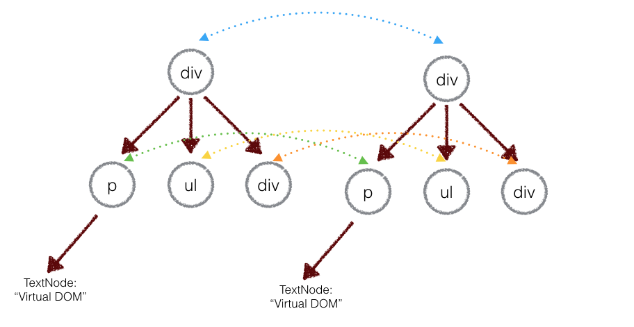
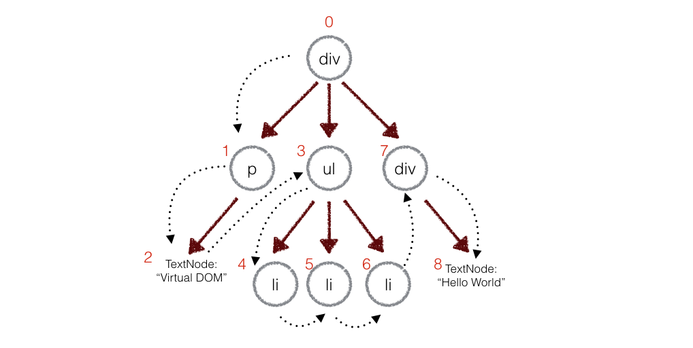
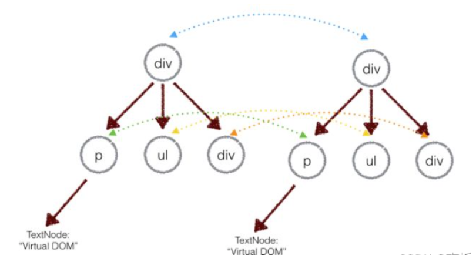
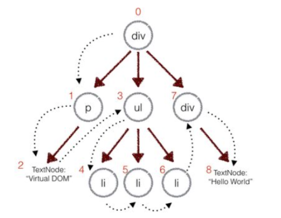

### 要先了解 Fiber 树的生成原理才更好去理解 Fiber 树 diff 的过程
1. JSX 的编译之后,创建一个叫 fiberRoot 的 Fiber 节点，然后开始从 fiberRoot 这个根 Fiber 开始进行协调，生成一棵 Fiber 树，这个棵树被称为：`workInProgress Fiber 树,正在工作的 Fiber 树`

Fiber 链表生成的代码片段。 这个协调子节点的函数接收两个参数，returnFiber 是父 Fiber，children 是这个节点的子元素的虚拟 DOM数据。
```javaScript
// 这个协调子节点的函数接收两个参数，returnFiber 是父 Fiber，children 是这个节点的子元素的虚拟 DOM数据。
export function reconcileChildren(returnFiber, children) {
    // 如果是字符串或者数字则不创建 Fiber
    if(isStringOrNumber(children)) {
        return
    }
    const newChildren = isArray(children) ? children : [children]
    // 上一轮的 fiber 节点
    let previousNewFiber = null;
    // 初次渲染（false）还是更新（true）
    let shouldTrackSideEffects = !!returnFiber.alternate
    // 老 Fiber 节点
    let oldFiber = returnFiber.alternate && returnFiber.alternate.child
    let nextOldFiber = null
    // 上一次协调返回的位置
    let lastPlacedIndex = 0;
    // 记录每个 fiber 节点的位置
    let newIdx = 0;
    // 如果不存在老 Fiber 则是初始化的过程，进行 Fiber 链表的创建
    if(!oldFiber) {
        for (; newIdx < newChildren.length; newIdx++) {
            // 获取节点元素内容
            const newChild = newChildren[newIdx]
            // 如果节点为 null 则不需要创建 fiber 节点
            if(newChild === null) {
                continue
            }
            // 创建新 fiber 的时候记录了关键的父 fiber 等重要信息
            const newFiber = createFiber(newChild, returnFiber)
            // 记录当前每一个 fiber 的位置
            lastPlacedIndex = placeChild(
                newFiber,
                lastPlacedIndex,
                newIdx,
                shouldTrackSideEffects // 初次渲染（false）还是更新（true）
            )
		    // 当上一轮的 fiber 节点为 null 的时候，这一轮的 fiber 就是头节点
            if(previousNewFiber === null) {
                // 父 fiber 的 child 就是第一个节点
                returnFiber.child = newFiber
            } else {
                // 如果不是第一个节点，那么就是兄弟节点
                // 上一轮 fiber 的兄弟节点是这一轮的 fiber 节点
                previousNewFiber.sibling = newFiber;
            }
		   // 记录上一轮的 fiber，既是这一轮的 fiber 便是下一轮的上一轮 fiber
            previousNewFiber = newFiber
        }
        return
    }
}
```

构建完的 workInProgress Fiber树 会在 commit阶段 渲染到页面。

### 第二步:在组件状态数据发生变更的时候，会根据最新的状态数据先会生成新的虚拟DOM，再去构建一棵新的workInProgress Fiber树，而在重新协调构建新的 Fiber 树的过程也就是 React Diff 发生的地方

用新的树和旧的树进行比较，记录两棵树的差异。

`算法：深度优先遍历`
有子节点，就遍历子节点，没有子节点，就找兄弟节点，没有兄弟节点，就找叔叔节点，叔叔节点也没有的话，就继续往上找，它爷爷的兄弟，如果一直没找到，就代表所有的更新任务都更新完毕了

重点是在更新自己的同时需要去协调子节点,这个Diff 发生的地方

进入协调的时候它自己就是父 Fiber，它的子节点在协调之前，是刚刚通过更新的状态数据生成的最新的虚拟DOM数据，是个数组结构的元素数据。

那么要进行更新，就肯定是以为最新的节点数据为准了，又因为最新的节点数据是一个数组，所以可以进行循环对比每一个节点

第一轮，常见情况的比对
那么第一个节点的老 Fiber 怎么拿到呢？可以通过 父 Fiber 的 child 属性拿到，这样第一个节点的老 Fiber 就拿到了，那么第二节点的老 Fiber，很明显可以通过第一个节点的老 Fiber 节点的 sibling 属性拿到，后面的以此类推。
怎么比对呢？

在循环的新节点虚拟DOM数据的时候，拿到新节点虚拟DOM信息，然后就去和老 Fiber 节点进行比对，如果两个节点相同则创建一个新的 Fiber 节点并复用一些老 Fiber 节点的信息，比如真实 DOM，并给这个新的 Fiber 节点打上一个 Update 的标记，代表这个节点需要更新即可。
接着去更新协调位置信息。


接着去更新协调位置信息。

在循环的最后进行 Fiber 链表的处理：
如果是头节点，则把新 Fiber 设置为父 Fiber 的 child 属性的值；如果不是头节点，则把新 Fiber 设置为上一轮循环的创建的 Fiber 节点的 sibing 属性的值；更新上一轮 Fiber 变量的值，就是把这一轮的 Fiber 设置成下一轮的 Fiber;更新比对的老 Fiber 的值。如果新节点都能找到能复用的节点，则判断是否还存在老节点，有则删除。

React Diff 算法分以下几个步骤：

1. 第一轮，从左向右新老节点进行比对查找能复用的旧节点，如果有新老节点比对不成功的，则停止这一轮的比对，并记录了停止的位置。
2. 如果第一轮比对，能把所有的新节点都比对完毕，则删除旧节点还没进行比对的节点。
3. 如果第一轮的比对，没能将所有的新节点都比对完毕，则继续从第一轮比对停止的位置继续开始循环新节点，拿每一个新节点去老节点里面进行查找，有匹配成功的则复用，没匹配成功的则在协调位置的时候打上 Placement 的标记。
4. 在所有新节点比对完毕之后，检查还有没有没进行复用的旧节点，如果有，则全部删除。

### 3. 把步骤2所记录的差异应用到步骤1所构建的真实DOM树上，更新视图。

Virtual DOM 本质上, DOM 这么慢，我们就在它们 JS 和 DOM 之间加个缓存。
CPU（JS）只操作内存（Virtual DOM），最后的时候再把变更写入硬盘（DOM）。

## 比较两棵虚拟 DOM 树的差异
两个树的完全的 diff 算法是一个时间复杂度为 O(n^3) 的问题。但是在前端当中，你很少会跨越层级地移动 DOM 元素。

所以 Virtual DOM 只会对同一个层级的元素进行对比：
下面的 div 只会和同一层级的 div 对比，第二层级的只会跟第二层级对比。这样算法复杂度就可以达到O (n)。




### 深度优先遍历，记录差异
在实际的代码中，会对新旧两棵树进行一个深度优先的遍历，这样每个节点都会有一个唯一的标记：

在深度优先遍历的时候，每遍历到一个节点就把该节点和新的的树进行对比。如果有差异的话就记录到一个对象里面。

在深度优先遍历的时候，每遍历到一个节点就把该节点和新的的树进行对比。如果有差异的话就记录到一个对象里面。




### React 不能通过双端对比进行 Diff 算法优化
是因为目前 Fiber 上没有设置反向链表,（就目前这个单向链表的数据结构，如果采用）双端对比查找算法比较难控制它反向查找的，但它确实是一种成功的算法。


## 算法实现
### 步骤一:用js对象模拟DOM树
```js
<div id="container">
    <p>Real DOM</p>
    <ul>
        <li class="item">Item 1</li>
        <li class="item">Item 2</li>
        <li class="item">Item 3</li>
    </ul>
</div>
	|
	|js对象来模拟上述的DOM Tree
	|
	v
var el = require('./element');

var ul = el('ul',{id:'list'},[
    el('li', {class: 'item'}, ['Item 1']),
    el('li', {class: 'item'}, ['Item 2']),
    el('li', {class: 'item'}, ['Item 3'])
])

// element.js
// patch.js
// diff.js
// util.js
```

### element.js
render方法会根据tagName构建一个真正的DOM节点，然后设置节点的属性，最后递归构建自己的子节点。生成的ulRoot是真正的DOM节点，把它塞入文档中，这样body里面就有了真正的< ul >的DOM结构
```javaScript
let ulRoot = ul.render();
document.body.appendChild(ulRoot)
|
|
V
<ul id='list'>
  <li class='item'>Item 1</li>
  <li class='item'>Item 2</li>
  <li class='item'>Item 3</li>
</ul>
```

## 二.核心功能2：diff算法
比较两颗DOM树的差异是Virtual DOM算法最核心的部分，也就是Virtual DOM的diff算法。

diff算法复杂度达到 O(n),必须保持Virtual DOM 只会对同一个层级的元素进行对比：

```
例子中：div只会和同一层级的div对比，第二层级的只会跟第二层级对比。


假设现在可以英文字母唯一地标识每一个子节点：
旧的节点顺序：a b c d e f g h i

现在对节点进行了删除、插入、移动的操作。新增j节点，删除e节点，移动h节点：
新的节点顺序：a b c h d f g i j

现在知道了新旧的顺序，求最小的插入、删除操作（移动可以看成是删除和插入操作的结合）。
这个问题抽象出来其实是字符串的最小编辑距离问题（Edition Distance），最常见的解决算法是 Levenshtein Distance，通过动态规划求解，时间复杂度为 O(M * N)。
但是我们并不需要真的达到最小的操作，我们只需要优化一些比较常见的移动情况，牺牲一定DOM操作，让算法时间复杂度达到线性的（O(max(M, N))。

但是要注意的是，因为tagName是可重复的，不能用这个来进行对比。
所以需要给子节点加上唯一标识key，列表对比的时候，使用key进行对比，这样才能复用老的 DOM 树上的节点。

这样，我们就可以通过深度优先遍历两棵树，每层的节点进行对比，记录下每个节点的差异了
```

### 2-1.深度优先遍历，记录差异
会对新旧两棵树进行一个深度优先的遍历，这样每个节点都会有一个唯一的标记：
在深度优先遍历的时候，每遍历到一个节点就把该节点和新的的树进行对比。如果有差异的话就记录到一个对象里面。

```javaScript
// diff函数,对比两棵树
function diff(oldTree,newTree){
    let index = 0;  // 当前节点的标志
    let patches = {};   //记录每个节点的差异对象
    dfsWalk(oldTree, newTree, index, patches);
    return patches;
}

// 对两棵树进行深度优先遍历
function dfsWalk(oldNode,newNode,index,patches){
    // 对比oldNode和newNode的不同,记录下来
    patches[index] = [...]
    diffChildren(oldNode.children, newNode.children, index, patches)
}

// 遍历子节点
function diffChildren(oldChildren, newChildren, index, patches){
    let leftNode = null;
    let currentNodeIndex = index;
    oldChildren.forEach(function(child,i){
        let newChild = newChildren[i];
        currentNodeIndex = (leftNode && leftNode.count) // 计算节点的标识
      ? currentNodeIndex + leftNode.count + 1
      : currentNodeIndex + 1
        dfsWalk(child, newChild, currentNodeIndex, patches) // 深度遍历子节点
        leftNode = child
    });
}
```

例如，上面的div和新的div有差异，当前的标记是0，那么：
```javaScript
patches[0] = [{difference}, {difference}, ...] // 用数组存储新旧节点的不同
// 同理p是patches[1]，ul是patches[3]，类推。
```

### 2-2.只考虑相同等级diff，可以分为下面4中情况：
```
1. 替换掉原来的节点，例如把上面的div换成了section
2. 修改了节点的属性
3. 移动、删除、新增子节点，例如上面div的子节点，把p和ul顺序互换
4. 对于文本节点，文本内容可能会改变。例如修改上面的文本节点2内容为Virtual DOM 2。
```

1. 第一种。如果节点类型变了，比如下面的p标签变成了h3标签，则直接卸载旧节点装载新节点，这个过程称为REPLACE。
```
renderA: <ul>
renderB: <ul class: 'marginLeft10'>
=> [addAttribute class "marginLeft10"]
```

2. 第二种情况。节点类型一样，仅仅是属性变化了，这一过程叫PROPS。比如

这一过程只会执行节点的更新操作，不会触发节点的卸载和装载操作。
```
renderA: <ul>
renderB: <ul class: 'marginLeft10'>
=> [addAttribute class "marginLeft10"]
```
3. 第三种。节点发生了移动，增加，或者删除操作。该过程称为REOREDR。虚拟DOM Diff算法解析
4. 第四种。只是文本变化了，TEXT过程。该过程只会替换文本。
5. 如果在一些节点中间插入一个F节点，简单粗暴的做法是：卸载C，装载F，卸载D，装载C，卸载E，装载D，装载E。如下图：
这种方法显然是不高效的。 而如果给每个节点唯一的标识(key)，那么就能找到正确的位置去插入新的节点。


### 2-3.差异类型
假设定义如下：
```javaScript
var REPLACE = 0
var REORDER = 1
var PROPS = 2
var TEXT = 3
```

对于节点替换，很简单。判断新旧节点的tagName和是不是一样的，如果不一样的说明需要替换掉。如div换成section，就记录下：
```javaScript
patches[0] = [{
  type: REPALCE,
  node: newNode // el('section', props, children)
}]
```

如果给div新增了属性id为container，就记录下：
```javaScript
patches[0] = [{
  type: REPALCE,
  node: newNode // el('section', props, children)
}, {
  type: PROPS,
  props: {
    id: "container"
  }
}]
```

如果是文本节点，如上面的文本节点2，就记录下：
```javaScript
patches[2] = [{
  type: TEXT,
  content: "Virtual DOM2"
}]
```

那如果把我div的子节点重新排序呢？例如p, ul, div的顺序换成了div, p, ul。这个该怎么对比？
```
如果按照同层级进行顺序对比的话，它们都会被替换掉。如p和div的tagName不同，p会被div所替代。

最终，三个节点都会被替换，这样DOM开销就非常大。

而实际上是不需要替换节点，而只需要经过节点移动就可以达到，我们只需知道怎么进行移动。
```

## 3.把差异应用到真正的DOM树上
因为步骤一所构建的 JavaScript 对象树和render出来真正的DOM树的信息、结构是一样的。

所以我们可以对那棵DOM树也进行深度优先的遍历，遍历的时候从步骤二生成的patches对象中找出当前遍历的节点差异，然后进行 DOM 操作
```javaScript
function patch (node, patches) {
  var walker = {index: 0}
  dfsWalk(node, walker, patches)
}

function dfsWalk (node, walker, patches) {
  var currentPatches = patches[walker.index] // 从patches拿出当前节点的差异

  var len = node.childNodes
    ? node.childNodes.length
    : 0
  for (var i = 0; i < len; i++) { // 深度遍历子节点
    var child = node.childNodes[i]
    walker.index++
    dfsWalk(child, walker, patches)
  }

  if (currentPatches) {
    applyPatches(node, currentPatches) // 对当前节点进行DOM操作
  }
}
```
applyPatches，根据不同类型的差异对当前节点进行 DOM 操作：
```javaScript
function applyPatches (node, currentPatches) {
  currentPatches.forEach(function (currentPatch) {
    switch (currentPatch.type) {
      case REPLACE:
        node.parentNode.replaceChild(currentPatch.node.render(), node)
        break
      case REORDER:
        reorderChildren(node, currentPatch.moves)
        break
      case PROPS:
        setProps(node, currentPatch.props)
        break
      case TEXT:
        node.textContent = currentPatch.content
        break
      default:
        throw new Error('Unknown patch type ' + currentPatch.type)
    }
  })
}
```
<br />
