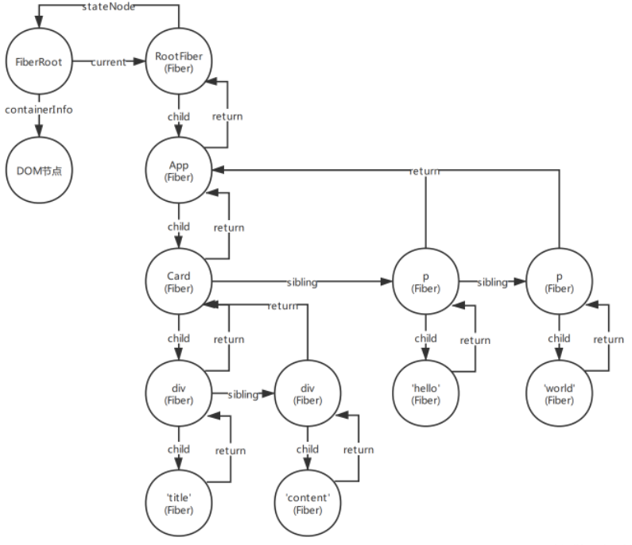

## 前言：手动操作DOM带来的性能缺陷
在使用原生的js api或者jquery等一些方法直接去操作dom的时候，可能会引起页面的reflow-回流，而页面的回流耗时和消耗性能。

频繁的去操作dom，会引起页面的卡顿，影响用户的体验。虚拟DOM就是为了解决频繁操作DOM的性能问题创造出来的。

复杂一点的页面 ，对 DOM 的操作是非常综合的，CRUD都有。

React 帮助在复杂的界面环境下，如何尽量降低 DOM Reflow 的成本。

而一旦出现了频繁变化，DOM Reflow 的开销就变得非常大。React 的 Diff 就是解决这个最痛的问题的。

还有一个问题WebApp 复杂到一定程度之后，不依赖 Angular、Ember 或者 React 这样的框架，你的代码就会完全失控，更何谈性能调优。

## A.虚拟dom的定义和作用
定义：

React 的虚拟 DOM 以对象树的形式保存在内存中，并且是可以在浏览器和 Node 中生成，这是前后端同构提供了先决条件，也是react服务端渲染的前提;

虚拟 Dom 在前后端都是以对象树的形式存在的，但在展露原型的方式服务端和客户端是不一样的:
```mermaid
flowchart LR
A0(jsx+data)-->A1(虚拟dom)--client-->A2(DOM Ele)

A1--Server-->A1a(react.renderToString)-->A3(HTML String)
```

### A-2.虚拟dom作用：
* 1.提高开发效率
`关于提升性能:如果是首次渲染，VitrualDom不具有任何优势，甚至它要进行更多的计算，消耗更多的内存。`
```
直接操作DOM是非常耗费性能的，这一点毋庸置疑。但是React使用VitrualDom也是无法避免操作DOM的。

如果是首次渲染，VitrualDom不具有任何优势，甚至它要进行更多的计算，消耗更多的内存。

VitrualDom的优势在于React的Diff算法和批处理策略，React在页面更新之前，提前计算好了如何进行更新和渲染DOM。
实际上，这个计算过程我们在直接操作DOM时，也是可以自己判断和实现的，但是一定会耗费非常多的精力和时间，而且往往我们自己做的是不如React好的。所以，在这个过程中React帮助我们"提升了性能"。

所以，我更倾向于说，VitrualDom帮助我们提高了开发效率，在重复渲染时它帮助我们计算如何更高效的更新，而不是它比DOM操作更快。
```

* 2.跨浏览器兼容
React基于VitrualDom自己实现了一套自己的事件机制，自己模拟了事件冒泡和捕获的过程，采用了事件代理，批量更新等方法，抹平了各个浏览器的事件兼容性问题。

* 3.跨平台兼容:VitrualDom为React带来了跨平台渲染的能力
只需要告诉React你想让视图处于什么状态，React则通过VitrualDom确保DOM与该状态相匹配。你不必自己去完成属性操作、事件处理、DOM更新，React会替你完成这一切。

* 4.`提升页面的更新渲染的性能,这也是虚拟dom重要作用,注意首屏渲染的性能并不能靠虚拟dom提升`

加入使用原生api去操作一个会导致回流的DOM操作10次，那么浏览器会每次都会重新走一次上面的全流程，包括一些没变化的位置计算。

浏览器没有如此智能，收到第一个更新DOM请求后，并不知道后续还有9次更新操作，因此会马上执行流程，最终执行10次流程。显然例如计算DOM节点的坐标值等都是白白浪费性能，可能这次计算完，紧接着下一个DOM更新请求，节点值就会改变，前面的计算就是浪费。

`理想的状态是一次性构建完DOM树，再执行后续操作。`
而虚拟DOM不会立即去操作DOM，而是将这10次更新的diff内容保存到本地的一个js对象中，最终将这个js对象一次性attach到DOM树上，通知浏览器去执行绘制工作，这样可以避免大量的无谓的计算量。

创建-更新-流程图参考


## 2.探究性能和虚拟dom
### B.大型应用为什么会慢?
稍微了解浏览器加载页面原理的前端同学都知道网页性能问题大都出现在DOM节点频繁操作上；
在构建复杂的大型应用的时候，各种页面之前的相互操作和更新很有可能会引起页面的重绘或重排列，而频繁操作这些dom其实是非常消耗性能的
```
这是一个节点上的属性，可以看到一个节点上的属性是非常多的，在复杂应用中，操作这些属性的时候可能一不小心就会引起节点大量的更新，那如何提高应用的性能呢？
```

## B-1.为什么JS长时间执行会影响交互响应、动画？
浏览器机制：
JavaScript 引擎和页面渲染引擎两个线程是互斥的，当其中一个线程执行时，另一个线程只能挂起等待。

因为JavaScript在浏览器的主线程上运行，恰好与样式计算、布局以及许多情况下的绘制一起运行。

如果需要渲染的组件比较庞大，js执行会占据主线程时间较长，就会阻塞这些其他工作，会导致页面响应度变差，可能导致掉帧。用户可能会感觉到卡顿。
```
我们都知道浏览器渲染引擎是单线程的，在 React15.x 及之前版本，从 setState 开始到渲染完成整个过程是不受控制且连续不中断完成的，由于该过程将会占用整个线程，则其他任务都会被阻塞，如样式计算、界面布局以及许多情况下的绘制等。如果需要渲染的是一个很大、层级很深的组件，这可能就会使用户感觉明显卡顿，比如更新一个组件需要1毫秒，如果有200个组件要更新，那就需要200毫秒，在这200毫秒的更新过程中，浏览器唯一的主线程在专心运行更新操作，无暇去做其他任何事情。想象一下，在这200毫秒内，用户往一个input元素中输入点什么，敲击键盘也不会立即获得响应，虽然渲染输入按键结果是浏览器主线程的工作，但是浏览器主线程被React占用，抽不出空，最后的结果就是用户敲了按键看不到反应，等React更新过程结束之后，咔咔咔那些按键一下子出现在input元素里了，这个版本的调和器可以称为栈调和器（Stack Reconciler）。Stack Reconcilier 的主要缺陷就是不能暂停渲染任务，也不能切分任务，更无法有效平衡组件更新渲染与动画相关任务间的执行顺序（即不能划分任务优先级），这样就很有可能导致重要任务卡顿，动画掉帧等问题。
```

<br />

## A.react中的虚拟dom--->Fiber树
* 1.react16之前 在进行组件渲染时，从setState开始到渲染完成整个过程是同步的（“一气呵成”）。也会造成上面为什么慢/阻塞的问题。
```
所有的任务都是按照先后顺序，没有区分优先级，这样就会导致优先级比较高的任务无法被优先执行。
```

* 2.React 提供pureComponent,shouldComponentUpdate，useMemo,useCallback让开发者来操心哪些subtree是需要重新渲染的，哪些是不需要重新渲染的。

因此，为了解决以上的痛点问题，React希望能够彻底解决主线程长时间占用问题;


虚拟DOM记录了真实DOM的相关数据，在复杂的更新过程中，利用系统调度将复杂的更新按帧率分割成多个小更新，通过计算出每个时间片虚拟DOM的数据和该时间片前虚拟DOM的数据进行比对，便可得出最小的更新位置和更新内容，最后再按时间片映射进真实的DOM中，这样就能平衡DOM频繁渲染带来的性能损耗和复杂计算带来的渲染阻塞。


Fiber架构的核心在于对浏览器进行了时间分片处理:
Fiber 是 React 16 实现的一套新的更新机制，让 React 的更新过程变得可控，避免了之前一竿子递归到底影响性能的做法。

把渲染/更新过程拆分为一个个小块的任务，通过合理的调度机制来调控时间，指定任务执行的时机，从而降低页面卡顿的概率，提升页面交互体验。

通过Fiber架构， 实现了可中断与恢复，适时地让出CPU执行权，中间可以返回至主进程控制执行其他任务,恢复后也可以复用之前的中间状态，并给不同的任务赋予不同的优先级，其中每个任务更新单元为React Element 对应的 Fiber 节点。

调和器允许渲染过程分段完成，而不必一次性完成，在渲染期间可返回到主线程控制执行其他任务。这是通过计算部分组件树的变更，并暂停渲染更新，询问主线程是否有更高需求的绘制或者更新任务需要执行，这些高需求的任务完成后再重新渲染。这一切的实现是在代码层引入了一个新的数据结构：Fiber对象，每一个组件实例对应有一个fiber实例，此fiber实例负责管理组件实例的更新，渲染任务及与其他fiber实例的通信，这个先进的调和器叫做调和器（Fiber Reconciler），它提供的新功能主要有：
* 1.把可中断的任务拆分成小任务；
* 2.可重用各分阶段任务，对正在做的工作调整优先次序；
* 3.可以在父子组件任务间前进后退切换任务，以支持React执行过程中的布局刷新；

### 性能优化1:Fiber双缓存
1. Fiber双缓存可以在构建好wip Fiber树之后切换成current Fiber，内存中直接一次性切换，提高了性能
```
React中，渲染机制就是React会调用render()函数构建一棵Dom树， 当我们需要对DOM进行事件监听时，首先对VitrualDom进行事件监听，VitrualDom会代理原生的DOM事件从而做出响应。

React中workingProgress Fiber树存在的意义是什么?
在React中最多会同时存在两棵Fiber树，当前显示在页面是current Fiber树，在内存中构建的Fiber树称为workInProgress Fiber树，workingProgress Fiber这棵树是在内存中构建的，构建完成才统一替换，这样不会产生不完全的真实dom。一旦更新完成，react会直接将current树替换成workingProgress Fiber树，以便快速完成DOM的更新。也是react提升性能的一部分

因为 workInProgress Fiber 在更新的过程中，是在内存中构建的，所有速度是非常快的，得到最终更新后的 Firber，直接替换 Current Firber。

current Firber 树有一个 alternate 属性指向 workInProgress Firber 树，workInProgress Firber 树内也 有一个alternate 属性指向current Firber 树

在state/props发生改变的时候，render()函数会被再次调用渲染出另外一棵树，重新渲染所有的节点，构造出新的虚拟Dom tree跟原来的Dom tree用Diff算法进行比较，找到需要更新的地方批量改动，再渲染到真实的DOM上，由于这样做就减少了对Dom的频繁操作，从而提升的性能。 
```

### 性能优化之2:Fiber的存在使异步可中断的更新成为了可能
1. Fiber的存在使异步可中断的更新成为了可能，作为工作单元，可以在时间片内执行工作，没时间了交还执行权给浏览器，下次时间片继续执行之前暂停之后返回的Fiber

从而使得浏览器处理时候可以将控制权交出去，避免了js线程过多占用而阻塞渲染线程，实现了更细粒度的调度，即为：协程和线程的调度

- Fiber可以在reconcile的时候进行相应的diff更新，让最后的更新应用在真实节点上


## fiber结构:是一个链表数据结构（环状链表）,它是Fiber树结构的节点单位
Fiber Tree 一个重要的特点是链表结构，将递归遍历编程循环遍历，然后配合 requestIdleCallback API, 实现任务拆分、中断与恢复。

fiber 是react中最小的执行单位,承载节点信息、优先级、updateQueue，同时它还是一个工作单元。


这个链接的结构是怎么构成的呢?Fiber树的每个节点通过child、sibling、return来相互连接，最后构成一个虚拟DOM树:
```javaScript
// 单链表树结构
{
   return: Fiber | null, // 指向父节点
   child: Fiber | null,// 指向自己的第一个子节点
   sibling: Fiber | null,// 指向自己的兄弟结构，兄弟节点的return指向同一个父节点
}
```

特点是任何一个位置的 Fiber 节点，都可以非常容易知道它的父 Fiber, 第一个子元素的 Fiber,和它的兄弟节点 Fiber。却不容易知道它前一个 Fiber 节点是谁，这就是 React 中单向链表 Fiber 节点的特点。也正是因为这些即便在协调的过程被中断了，再恢复协调的时候，依然知道当前的 父节点和孩子节点等信息。


```html
<App>
  <Card>
	<div>title</div>
	<div>content</div>
  </Card>
  <p>hello</p>
  <p>world</p>
</App>
```


## Fiber实现原理
1. 实现的方式是requestIdleCallback这一 API，但 React 团队 polyfill 了这个 API，使其对比原生的浏览器兼容性更好且拓展了特性。
```
window.requestIdleCallback()方法将在浏览器的空闲时段内调用的函数排队。这使开发者能够在主事件循环上执行后台和低优先级工作，而不会影响延迟关键事件，
如动画和输入响应。函数一般会按先进先调用的顺序执行，然而，如果回调函数指定了执行超时时间 timeout，则有可能为了在超时前执行函数而打乱执行顺序。
```

requestIdleCallback回调的执行的前提条件是当前浏览器处于空闲状态。

即requestIdleCallback的作用是在浏览器一帧的剩余空闲时间内执行优先度相对较低的任务。首先 React 中任务切割为多个步骤，分批完成。在完成一部分任务之后，将控制权交回给浏览器，让浏览器有时间再进行页面的渲染。等浏览器忙完之后有剩余时间，再继续之前 React 未完成的任务，是一种合作式调度。

简而言之，由浏览器给我们分配执行时间片，我们要按照约定在这个时间内执行完毕，并将控制权还给浏览器。

2. 基于Fiber节点实现，被称为 Fiber Reconciler。
作为静态的数据结构来说，每个 Fiber 节点对应一个 React element，保存了该组件的类型（函数组件/类组件/原生组件等等）、对应的 DOM 节点等信息。

作为动态的工作单元来说，每个 Fiber 节点保存了本次更新中该组件改变的状态、要执行的工作。


<br />

## 3. Fiber 架构可以分为三层：Scheduler,Scheduler,Scheduler
Fiber 架构的核心即是"可中断"、"可恢复"、"优先级"

工作流如下：
1. 每个更新任务都会被赋予一个优先级。
2. 当更新任务抵达调度器时，高优先级的更新任务（记为 A）会更快地被调度进 Reconciler 层；
3. 此时若有新的更新任务（记为 B）抵达调度器，调度器会检查它的优先级，若发现 B 的优先级高于当前任务 A，那么当前处于 Reconciler 层的 A 任务就会 
被中断，调度器会将 B 任务推入 Reconciler 层。
4. 当 B 任务完成渲染后，新一轮的调度开始，之前被中断的 A 任务将会被重新推入 Reconciler 层，继续它的渲染之旅，即“可恢复”。

* 1.Scheduler 调度器:调度任务的优先级，高优任务优先进入 Reconciler
```
这个需要上面提到的requestIdleCallback，React 团队实现了功能更完备的 requestIdleCallback polyfill，这就是 Scheduler。
除了在空闲时触发回调的功能外，Scheduler 还提供了多种调度优先级供任务设置。
```
* 2.Reconciler 协调器:更新 fiber 的过程叫做 Reconciler
在 React 15 中是递归处理虚拟 DOM 的，React 16 则是变成了可以中断的循环过程，每次循环都会调用shouldYield判断当前是否有剩余时间。
```
fiber 根据优先级暂停、继续、排列优先级：Fiber节点上保存了优先级，能通过不同节点优先级的对比，达到任务的暂停、继续、排列优先级等能力，也为上层实现批量更新、Suspense提供了基础
```

```javascript
function workLoopConcurrent() {
  // Perform work until Scheduler asks us to yield
  while (workInProgress !== null && !shouldYield()) {
    // workInProgress表示当前工作进度的树。
    workInProgress = performUnitOfWork(workInProgress)
  }
}
```
React 16 是如何解决中断更新时 DOM 渲染不完全的问题呢？

在 React 16 中，Reconciler与Renderer不再是交替工作。当Scheduler将任务交给Reconciler后，Reconciler会为变化的虚拟 DOM 打上的标记
```javascript
export const Placement = /*             */ 0b0000000000010
export const Update = /*                */ 0b0000000000100
export const PlacementAndUpdate = /*    */ 0b0000000000110
export const Deletion = /*              */ 0b0000000001000
/*
Placement表示插入操作
PlacementAndUpdate表示替换操作
Update表示更新操作
Deletion表示删除操作

整个Scheduler与Reconciler的工作都在内存中进行，所以即使反复中断，用户也不会看见更新不完全的 DOM。只有当所有组件都完成Reconciler的工作，
才会统一交给Renderer。
* */
```

* 3.Renderer 渲染器:负责将变化的组件渲染到页面上
Renderer根据Reconciler为虚拟 DOM 打的标记，同步执行对应的 DOM 操作。
```mermaid
graph LR
一次更新--更新element-->create_element--更新-->调度器React_Fiber-->真实dom
```
