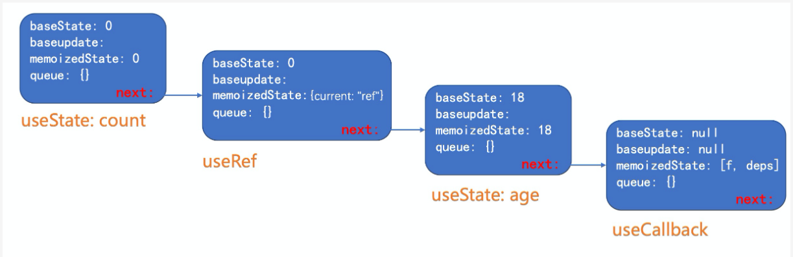

## 1.第一个链表：hooks
```javascript
/*
Hooks are stored as a linked list on the fiber's memoizedState field.  
hooks 以链表的形式存储在fiber节点的memoizedState属性上
The current hook list is the list that belongs to the current fiber.
当前的hook链表就是当前正在遍历的fiber节点上的
The work-in-progress hook list is a new list that will be added to the work-in-progress fiber.
work-in-progress hook 就是即将被添加到正在遍历fiber节点的hooks新链表
*/
let currentHook: Hook | null = null;
let nextCurrentHook: Hook | null = null;
```

从上面的源码注释可以看出hooks链表与fiber链表是极其相似的；也得知hooks 链表是保存在fiber节点的memoizedState属性的, 
而赋值是在renderWithHooks函数具体实现的；
```javascript
export function renderWithHooks(
  current: Fiber | null,
  workInProgress: Fiber,
  Component: any,
  props: any,
  refOrContext: any,
  nextRenderExpirationTime: ExpirationTime,
): any {
  renderExpirationTime = nextRenderExpirationTime;
  currentlyRenderingFiber = workInProgress;
  // 获取当前节点的hooks 链表；
  nextCurrentHook = current !== null ? current.memoizedState : null;
  // ...省略一万行
}
```

有可能代码贴了这么多，你还没反应过来这个hooks 链表具体指什么？
其实就是指一个组件包含的hooks, 比如上面示例中的：
```javascript
const [count, setCount] = useState(0);
const [age, setAge] = useState(18);
const self = useRef(0);
const onClick = useCallback(() => {
  setAge(19);
  setAge(20);
  setAge(21);
}, []);
```
形成的链表就是下面这样的：



所以在下一次更新时，再次执行hook，就会去获取当前运行节点的hooks链表；
```js
const hook = updateWorkInProgressHook();
// updateWorkInProgressHook 就是一个纯链表的操作：指向下一个 hook节点
```
到这 hooks 链表是什么，应该就明白了；这时你可能会更明白，为什么hooks不能在循环，
判断语句中调用，而只能在函数最外层使用，因为挂载或则更新时，这个队列需要是一致的，才能保证hooks的结果正确。

