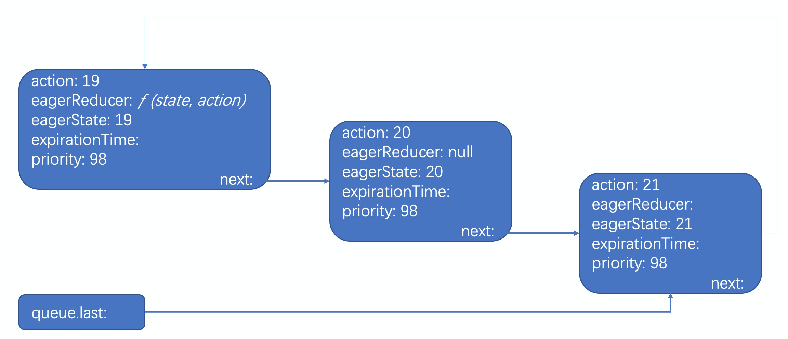

## 第二个链表：state
其实state 链表不是hooks独有的，类操作的setState也存在，正是由于这个链表存在，所以有一个经(sa)典(bi)React 面试题：
```
setState为什么默认是异步，什么时候是同步？

```
## 1.异步:
+ setState 和 useState中的set函数是异步执行的（不会立即更新state的结果）
+ 多次执行setState 和 useState的set函数，组件只会重新渲染一次

+ 不同的是，setState会更新当前作用域下的状态，但是set函数不会更新，只能在新渲染的组件作用域中访问到
+ 同时setState会进行state的合并，但是useState中的set函数做的操作相当于是直接替换，只不过内部有个防抖的优化才导致组件不会立即被重新渲染

### 2.同步：在setTimeout，Promise.then等异步事件或者原生事件中
+ setState和useState的set函数是同步执行的（立即重新渲染组件）
+ 多次执行setState和useState的set函数，每一次的执行都会调用一次render

结合实例来看，当点击增加会执行三次setAge
```javascript
const onClick = useCallback(() => {
  setAge(19);
  setAge(20);
  setAge(21);
}, []);
```
第一次执行完dispatch后，会形成一个状态待执行任务链表：

如果仔细观察，会发现这个链表还是一个环（会在updateReducer后断开）, 这一块设计相当有意思，我现在也还没搞明白为什么需要环，值得细品，而建立这个链表的逻辑就在dispatchAction函数中。
```javascript
function dispatchAction(fiber, queue, action) {
  // 只贴了相关代码
  const update = {
    expirationTime,
    suspenseConfig,
    action,
    eagerReducer: null,
    eagerState: null,
    next: null,
  };
  // Append the update to the end of the list.
  const last = queue.last;
  if (last === null) {
    // This is the first update. Create a circular list.
    update.next = update;
  } else {
    const first = last.next;
    if (first !== null) {
      // Still circular.
      update.next = first;
    }
    last.next = update;
  }
  queue.last = update;

  // 触发更新
  scheduleWork(fiber, expirationTime);
}
```

上面已经说了，执行setAge 只是形成了状态待执行任务链表，真正得到最终状态，其实是在下一次更新(获取状态)时，即：
```
// 读取最新age
const [age, setAge] = useState(18);
```
而获取最新状态的相关代码逻辑存在于updateReducer中：
```javascript
function updateReducer(reducer, initialArg,init?) {
  const hook = updateWorkInProgressHook();
  const queue = hook.queue;
  // ...隐藏一百行
  // 找出第一个未被执行的任务；
  let first;
  // baseUpdate 只有在updateReducer执行一次后才会有值
  if (baseUpdate !== null) {
    // 在baseUpdate有值后，会有一次解环的操作；
    if (last !== null) {
      last.next = null;
    }
    first = baseUpdate.next;
  } else {
    first = last !== null ? last.next : null;
  }

  if (first !== null) {
    let newState = baseState;
    let newBaseState = null;
    let newBaseUpdate = null;
    let prevUpdate = baseUpdate;
    let update = first;
    let didSkip = false;
    // do while 遍历待执行任务的状态链表
    do {
      const updateExpirationTime = update.expirationTime;
      if (updateExpirationTime < renderExpirationTime) {
        // 优先级不足，先标记，后面再更新
      } else {
        markRenderEventTimeAndConfig(
          updateExpirationTime,
          update.suspenseConfig,
        );

        // Process this update.
        if (update.eagerReducer === reducer) {
          // 简单的说就是状态已经计算过，那就直接用
          newState = update.eagerState;
        } else {
          const action = update.action;
          newState = reducer(newState, action);
        }
      }
      prevUpdate = update;
      update = update.next;
      // 终止条件是指针为空 或 环已遍历完
    } while (update !== null && update !== first);  
    // ...省略100行
    return [newState, dispatch];
  }
}
```
最后来看，状态更新的逻辑似乎是最绕的。但如果看过setState，这一块可能就比较容易。至此，第二个链表state就理清楚了。


