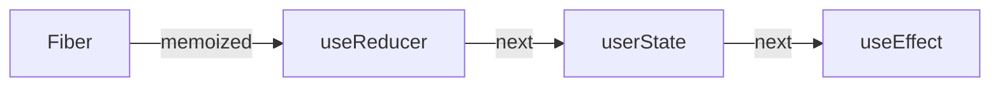
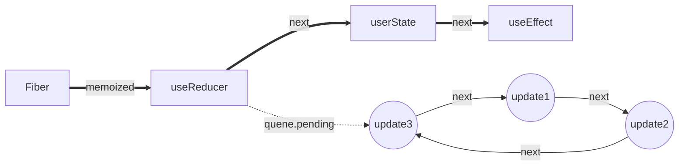

## 首先，Hooks是以单向链表的形式存储在 Fiber 的 memoizedState 属性身上


同时，每个hooks又拥有自己的更新队列queue，queue.pending 会指向一个环状链表


- 由图可知，queue.pending 永远指向最后一个更新
- 由图可知，pending.next 永远指向第一个更新

## 为什么要用环状链表呢
因为React的更新任务是有优先级的。

假如有三个 update，第二个update的优先级比较高，那么会先执行第二个 update，单向链表可能会导致第一个update丢失，而环状链表的优势在于可以从任何节点开始循环链表。总结来说：环状链表可以保证update不丢失，并且保证状态依赖的连续性。

### 辅:单向链表实现
```javaScript
function buildQueue(queue,action){
    const update = {action,next:null}
    const pending = queue.pending
 
    if(!pending){
        queue.pending = update
    }else{
        let current = queue.pending
        // 找到末尾的元素
        while(current.next){
            current = current.next
        }
        // 将update挂载到链表的末尾
        current.next = update
    }
}
 
// excute
let queue = {pending:null}
buildQueue(queue,'hooks1')
buildQueue(queue,'hooks2')
 
// output: queue.pending = {action:'hooks1',next:{action:'hooks2',next:null}}
```

### 辅:环状链表实现
```javaScript
function dispatchAction(queue,action){
     const update = {action,next:null}
     const pending = queue.pending
     if(pending === null){
        update.next = update // 自己与自己创建一个环状链表
     }else{
        update.next = pending.next
        pending.next = update
     }
     queue.pending = update
}
 
let queue = {pending:null}
 
/**
 * update.next === update
 * queue.pending === update(action) 
 */
dispatchAction(queue,'action')
 
 
/**
 * update(action1).next -> update(action).next [update(action)]    
 * update1 的next 指向 update
 * queue.pending.next [update(update)] -> update(action1)          
 * update 指向 update1
 * queue.pending -> update(action1)                                
 * queue.pending 指向 update1
 */
dispatchAction(queue,'action1')
```