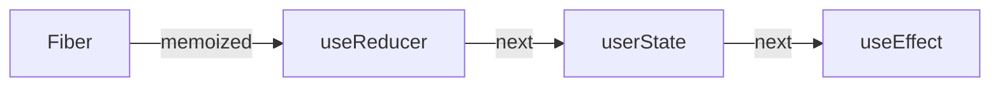
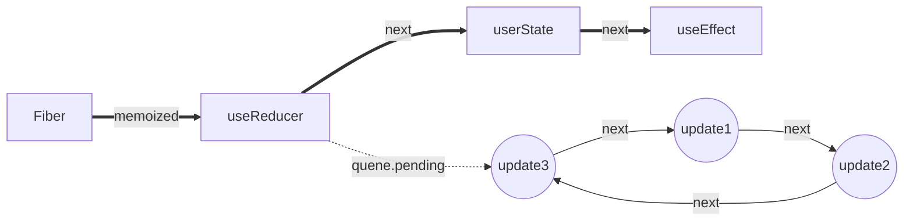

## Hooks是以单向链表

```mermaid
graph LR
1[Fiber] --memoized--> 2[useReducer] --next-->3[userState]--next-->4[useEffect]
```

## hooks又拥有自己的更新队列

```mermaid
graph LR
1[Fiber] ==> |memoized|2[useReducer] ==>|next| 3[userState]==>|next| 4[useEffect]

2 -.->|quene.pending| B1((update3))--next-->B2

B2((update1))--next-->B3((update2))--next-->B1
```