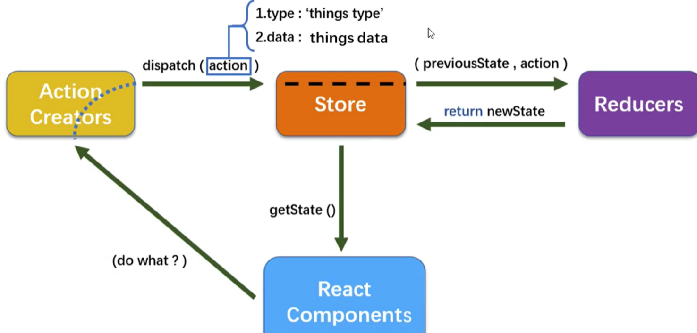

## 1.实现原理：参考上面的context和redux的联系
简单地说就是：
1.顶层分发状态，让React组件被动地渲染。
2.监听事件，事件有权利回到所有状态顶层影响状态。

1. createStore接受一个reducer作为参数，以后每当store.dispatch一个新的action，就会自动调用reducer,返回新的state

2. 通过react-redux做连接，使用Provider：从最外部封装了整个应用，并向connect模块传递store。

3. Connect： 
   * 包装原组件，将state和action通过props的方式传入到原组件内部。
   * 监听store tree变化，使其包装的原组件可以响应state变化
  当 redux store 中的 state 变化时，对应的 `mapStateToProps` 函数会被执行，如果 `mapStateToProps` 函数新返回的对象与之前对象浅比较相等
  (此时，如果是类组件可以理解为 shouldComponentUpdate 方法返回 false)，展示组件就不会重新渲染，否则重新渲染展示组件。

## 2.Api
Redux 有3大核心概念：
+ Action : 动作
+ Reducer : 见实例
+ Store : 储存
  createStore接受一个reducer作为参数，以后每当store.dispatch一个新的action，就会自动调用reducer,返回新的state

<br />

## 2-1.Action
Action表示应用中的各类动作或操作，不同的操作会改变应用相应的state状态，说白了就是一个带type属性的对象
```javascript
import { Dispatch } from 'redux';
import {
  LOGIN_SUCCESS
} from './actiontypes';

export const loginAction = (data:string) => (dispatch: Dispatch) => {
  dispatch({
      type: LOGIN_SUCCESS,
      payload: data
  });
};
```

<br />

## 2-2.Store
### 1. Redux 的核心是一个 store。
store:首先要创建一个对象store，这个对象有各种方法，用来让外界获取Redux的数据（store.getState），或者让外界来修改Redux中的数据（store.dispatch）
```
在 reducer 纯函数中不允许直接修改 state 对象，每次都应返回一个新的 state。原生 JavaScript 中我们要时刻记得使用 ES6 的扩展符 ... 

或Object.assign() 函数创建一个新 state，但是仍然是一个浅 copy，遇到复杂的数据结构我们还需要做深拷贝返回一个新的状态，总之你要保证每次都返回一个新对象，一方面深拷贝会造成性能损耗、另一方面难免会忘记从而直接修改原来的 state。
```

### 2.reducer 纯函数要保证以下两点：
reducer 根据 action 的响应决定怎么去修改 store 中的 state。编写 reducer 函数没那么复杂，倒要切记该函数始终为一个纯函数，应避免直接修改state。

1. 同样的参数，函数的返回结果也总是相同的。例如，根据上一个 state 和 action 也会返回一个新的 state，类似这样的结构(previousState, action) => newState。

2. 函数执行没有任何副作用，不受外部执行环境的影响。例如，不会有任何的接口调用或修改外部对象。

### 实战：
```javascript
// store:index.ts
import { createStore, combineReducers, applyMiddleware } from 'redux';
import logger from 'redux-logger';
import thunk from 'redux-thunk';
import userStore from './user.store';
import { composeWithDevTools } from 'redux-devtools-extension';

const reducer = combineReducers({
  userStore,
});

const enhancers = process.env.APP_ENV === 'dev' ? composeWithDevTools(
  applyMiddleware(thunk, logger)
) : applyMiddleware(thunk);

const store = createStore(reducer, enhancers);

export default store;


// user.store.ts 是一个reducer
import { sessionStorage } from "../utils/storage";
import { removeTiemManualToken, setTiemManualToken } from "@/utils/auth";
import { IAction, IUser } from "@/utils/types";
import { LOGIN_SUCCESS, LOGOUT } from "./actions/actiontypes";

export interface IUserState {
  user?: IUser;
  token?: string;
}

const initUserState: IUserState = sessionStorage.getItem("user") || {};

const userStore = (state: IUserState = initUserState, action: IAction) => {
  const { payload, type } = action;

  switch (type) {
    case LOGIN_SUCCESS:
      setTiemManualToken(payload);
      const userState = { ...state, token: action.payload };
      // 注意这里调用了外部，违背纯函数的原则
      sessionStorage.setItem("user", userState);

      return userState;
    case LOGOUT:
      // 注意这里调用了外部，违背纯函数的原则
      removeTiemManualToken();
      sessionStorage.removeItem("user");

      return {};
    default:
      return state;
  }
};

export default userStore;
```

### 实战：组件内使用
1. mapStateToProps 使用
```javaScript
const AuthRoute: FC<IAuthRoute> = (props) => {
  const { children, token } = props;
  const logined: boolean = token ? true : false;
  console.log('=====AuthRouteRender=====', logined);

  return (logined ? <>{children}</> : (
    <Navigate
      replace={true}
      to='/login'
      state={{ from: `${location.pathname}${location.search}` }}
    />
  ));
};

const mapStateToProps = (state: any) => {
  return {
    token: state.userStore.token
  };
};

export default connect(mapStateToProps, null)(AuthRoute);
```

2. mapDispatchToProps
```javaScript
// web\src\pages\login\login.tsx
import { loginAction } from '@/stores/actions/userActions';
const Login = (props: LonginProps) => {
  // ...
}
const mapDispatchToProps = (dispatch: any) => {

  return {
    loginAction: (data: string) => dispatch(loginAction(data)),
  };
};

export default connect(null, mapDispatchToProps)(Login);

// userActions.ts
import { Dispatch } from 'redux';
import {
  LOGIN_SUCCESS
} from './actiontypes';

export const loginAction = (data:string) => (dispatch: Dispatch) => {
  dispatch({
      type: LOGIN_SUCCESS,
      payload: data
  });
};
```

### 容器组件和展示组件
```
react-redux 提供的 connect 函数，可以把 React 组件和 Redux 的 store 链接起来生成一个新的容器组件(这里有个经典的设计模式 “高阶组件”)，
数据如何获取就是容器组件需要负责的事情，在获取到数据后通过 props 属性传递到展示组件，当展示组件需要变更状态时调用容器组件提供的方法同步这些
状态变化。
```
总结下来，容器组件需要做两件事： 
- 从 Redux 的 store 中获取数据给到展示组件，对应下例 mapStateToProps() 方法。
- 提供方法供展示组件同步需要变更的状态，对应下例 mapDispatchToProps() 方法。


### 模拟一下createStore的源码
通过redux当中的createStore方法来创建一个store，它提供3个主要的方法:
```javascript
// 以下代码示例来自redux官方教程
const createStore = (reducer) => {
    let state;
    let listeners = [];

    // 用来返回当前的state
    const getState = () => state;

    // 根据action调用reducer返回新的state并触发listener
    const dispatch = (action) => {
        state = reducer(state, action);
        listeners.forEach(listener => listener());
    };
    
    /* 这里的subscribe有两个功能
     * 调用 subscribe(listener) 会使用listeners.push(listener)注册一个listener
     * 而调用 subscribe 的返回函数则会注销掉listener
     */
    const subscribe = (listener) => {
        listeners.push(listener);
        return () => {
            listeners = listeners.filter(l => l !== listener);
        };
    };

    return { getState, dispatch, subscribe };
};
```