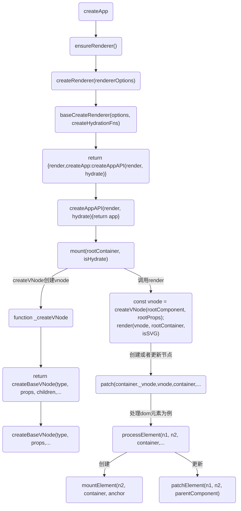
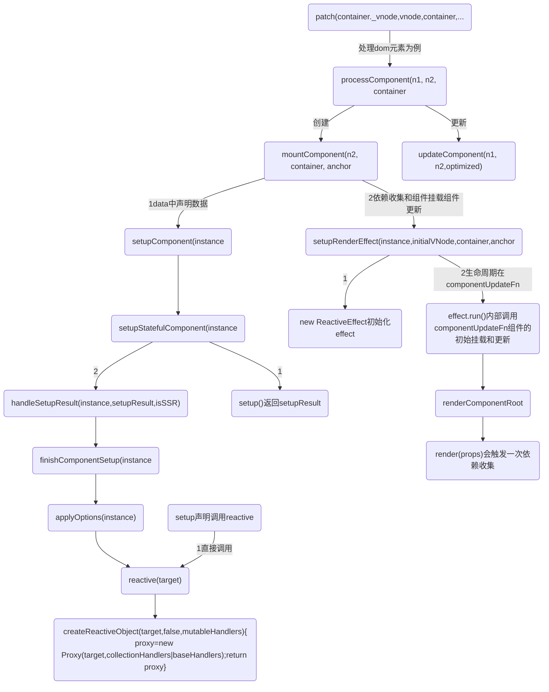
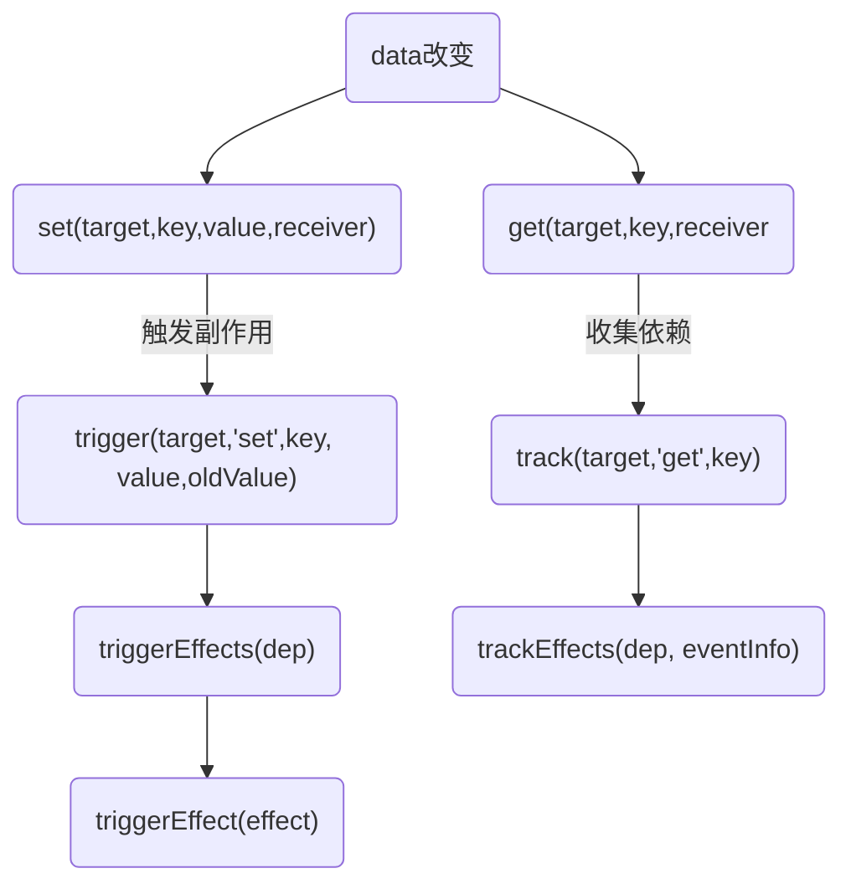

<br />

## 调用patch处理组件元素
* 在mountComponent走reactive流程
```
见: 
00-3-vue3源码-响应式原理与reactive.md
```
* 在 componentUpdateFn 函数中，进行了组件的初始挂载和更新，生命周期函数就是在这些操作的前后触发执行的，在上面的源码中，使用 invokeArrayFns 函数进行生命周期函数的触发执行


## data更新


## 第一步
我们在平时开发，使用的便是运行时包中的函数。让我们从vue应用的构建函数createApp开始。
createApp:
* 1.创建app实例，并返回该实例
* 2.重写mount方法
调用 ensureRenderer().createApp(...args) 创建一个 app 实例，然后重写 mount 方法挂载，返回这个实例

ensureRenderer 是一个单例模式的函数，会返回一个 renderer，如果无 renderer 则会调用createRenderer 进行获取 renderer ，获得了一个 app 实例；


## 第二步：ensureRenderer 最后调用 baseCreateRenderer
baseCreateRenderer包含了组件渲染的核心逻辑,主要实现了：
* 实现了组件渲染的创建、更新、卸载等核心逻辑
* 返回渲染函数，以及创建应用实例方法，当然还有 hydrate
```
ensureRenderer函数返回包含render、createApp和hydrate三个函数的单例对象，其中hydrate水合函数与ssr有关，createApp需要使用到render、createApp。所以在解析render之前，我们先简单看下createAppAPI。
```

```javaScript
const createApp = ((...args) => {
  console.log('%c运行时==>createApp：', 'color:yellow', ...args)
  const app = ensureRenderer().createApp(...args);
}

const render = ((...args) => {
  console.log('运行时==>render调用ensureRenderer().render(...args)')
  ensureRenderer().render(...args);
});

function ensureRenderer() {
  return (renderer ||
    (renderer = createRenderer(rendererOptions)));
}

function createRenderer(options) {
  return baseCreateRenderer(options);
}
```

## createApp大致的流程，这里再总结下整个过程
1. 执行 createApp 首先会创建渲染器，这里要注意的是存在2种渲染器类型，并且它们都是通过延迟创建的，主要目的是当用户只引用reactive响应式框架的时候，方便进行tree-shaking优化。且两种渲染器都是基于 baseCreateRender 方法来实现。

2. baseCreateRender 函数执行后会返回 render 渲染函数和 createApp 方法，其中 render 函数是组件创建、更新和卸载的主要核心逻辑实现。createApp则用于创建应用实例，进行应用实例的初始化。

3. createAppAPI用于生成默认的应用上下文 context，这里定义了应用实例具备的属性和方法，并通过重写扩展 context.app 属性，让用户能够进行对上下文的自定义操作，比如自定义组件、指令、mixin、插件安装等一系列操作。并存在mount方法完成将根组件转为虚拟节点 vNode，并通过render 函数完成对 vNode 的渲染。

## 创建实例:createAppAPI() 调用了mount() render()
1. 创建定义一个实例上下文context，包含属性和方法

2. 重写扩展context.app方法，实现用户可以对上下文相关属性的自定义操作，也就是应用实例暴露的api实现，比如自定义指令、混入mixin、组件等提供用户自定义实现。

3. 根据根组件和属性在 mount 方法中完成虚拟节点 vNode 的转换，并通过 render 完成渲染，关于渲染函数在 baseCreateRender 已经说过。

`createApp的重点的是mount挂载函数。在挂载时期主要做了三件事：`
1. 基于createApp的参数创建虚拟节点。
2. 基于虚拟节点和容器元素进行进行渲染。
3. 最后返回虚拟节点component属性的代理对象，主要使根实例可以取得所有属性成员，比如refs等，顾不具体讲解。

```javaScript
function createAppAPI(render, hydrate) {
  return function createApp(rootComponent, rootProps = null) {
    if (!isFunction(rootComponent)) {
      rootComponent = Object.assign({}, rootComponent);
    }
    // ...
    ...
    // ...
    directive(name, directive) {
      {
        validateDirectiveName(name);
      }
      if (!directive) {
        return context.directives[name];
      }
      if (context.directives[name]) {
        warn$1(`Directive "${name}" has already been registered in target app.`);
      }
      context.directives[name] = directive;
      return app;
    },
    mount(rootContainer, isHydrate, isSVG) {
      // 未挂载执行
      if (!isMounted) {
        // #5571
        if (rootContainer.__vue_app__) {
          warn$1(`There is already an app instance mounted on the host container.\n` +
            ` If you want to mount another app on the same host container,` +
            ` you need to unmount the previous app by calling \`app.unmount()\` first.`);
        }
        // 根据根组件创建虚拟节点
        console.log('%c运行时==>createAppAPI--未挂载执行,创建根虚拟节点,mount中调用createVNode:根据根组件创建虚拟节点：', 'color:yellow')
        const vnode = createVNode(rootComponent, rootProps);
        console.log('%c运行时==>createAppAPI--未挂载执行,根据根组件创建虚拟节点vnode结果：', 'color:yellow', vnode)
        // store app context on the root VNode.
        // this will be set on the root instance on initial mount.
        // 将app的上下文存储在根虚拟节点
        vnode.appContext = context;
        // HMR root reload
        {
          context.reload = () => {
            render(cloneVNode(vnode), rootContainer, isSVG);
          };
        }
        // 水合或者渲染虚拟节点
        if (isHydrate && hydrate) {
          hydrate(vnode, rootContainer);
        }
        else {
          console.log('%c运行时==>createAppAPI--mount中调用render:渲染虚拟节点：', 'color:red')
          render(vnode, rootContainer, isSVG);
        }
        // 设置isMounted,设置app容器
        isMounted = true;
        app._container = rootContainer;
        rootContainer.__vue_app__ = app;
        {
          app._instance = vnode.component;
          devtoolsInitApp(app, version);
        }
        return getExposeProxy(vnode.component) || vnode.component.proxy;
      }
      else {
        warn$1(`App has already been mounted.\n` +
          `If you want to remount the same app, move your app creation logic ` +
          `into a factory function and create fresh app instances for each ` +
          `mount - e.g. \`const createMyApp = () => createApp(App)\``);
      }
    },

    // ... 
    ...
    // ... 
    return app;
  };
}
```


## 组件挂载流程
上面讲叙createApp 创建应用实例主流程逻辑，接下来看虚拟节点的创建、渲染以及挂载。

讲述新组件挂载流程，关于组件更新放后面

## A.mount的源码之createVNode

`type`
```
type 属性用于描述 VNode 的类型，VNode 的类型有很多种，这里我们看下 string 和 Component 类型，当 VNode 的 type 属性是字符串的时候，说明当前的 VNode 描述的是普通的元素，当 VNode 的 type 是 Component 的时候，说明当前的 VNode 描述的是一个组件。
```


在创建虚拟节点时，会进行一些类型检查、正规化、克隆、块树节点追踪、兼容Vue2等操作。最后只是单纯地返回了一个虚拟节点对象。总结，createVNode做了如下几件事：
1. 对属性props标准化
2. 将VNode类型信息进行编码为位图
3. 创建VNode对象
4. 对子节点进行标准化
```javaScript
// 第一步是根据组件和组件属性，生成一个VNode虚拟节点。
const vnode = createVNode(rootComponent as Component, rootProps)

const createVNode = (createVNodeWithArgsTransform);

const createVNodeWithArgsTransform = (...args) => {
  return _createVNode(...(vnodeArgsTransformer
    ? vnodeArgsTransformer(args, currentRenderingInstance)
    : args));
};

// 第二步
function createBaseVNode(type, props = null, children = null, patchFlag = 0, dynamicProps = null, shapeFlag = type === Fragment ? 0 : 1 /* ShapeFlags.ELEMENT */, isBlockNode = false, needFullChildrenNormalization = false) {
  const vnode = {
    __v_isVNode: true,
    __v_skip: true,
    type, // 传入的组件对象
    props, // 传递给组件对象的参数
    key: props && normalizeKey(props), // 取出所有传入的key
    ref: props && normalizeRef(props), // 对props进行ref正规化
    scopeId: currentScopeId, // 现在的作用域id 
    slotScopeIds: null,
    children, // 子节点
    component: null,
    suspense: null,
    ssContent: null,
    ssFallback: null,
    dirs: null,
    transition: null,
    el: null,
    anchor: null,
    target: null,
    targetAnchor: null,
    staticCount: 0,
    shapeFlag, // 虚拟节点类型标记
    patchFlag, // patch算法标记
    dynamicProps, // 动态Props
    dynamicChildren: null,
    appContext: null,
    ctx: currentRenderingInstance
  };
  if (needFullChildrenNormalization) {
    normalizeChildren(vnode, children);
    // normalize suspense children
    if (shapeFlag & 128 /* ShapeFlags.SUSPENSE */) {
      type.normalize(vnode);
    }
  }
  else if (children) {
    // compiled element vnode - if children is passed, only possible types are
    // string or Array.
    vnode.shapeFlag |= isString(children)
      ? 8 /* ShapeFlags.TEXT_CHILDREN */
      : 16 /* ShapeFlags.ARRAY_CHILDREN */;
  }
  // validate key
  if (vnode.key !== vnode.key) {
    warn$1(`VNode created with invalid key (NaN). VNode type:`, vnode.type);
  }
  // track vnode for block tree
  if (isBlockTreeEnabled > 0 &&
    // avoid a block node from tracking itself
    !isBlockNode &&
    // has current parent block
    currentBlock &&
    // presence of a patch flag indicates this node needs patching on updates.
    // component nodes also should always be patched, because even if the
    // component doesn't need to update, it needs to persist the instance on to
    // the next vnode so that it can be properly unmounted later.
    (vnode.patchFlag > 0 || shapeFlag & 6 /* ShapeFlags.COMPONENT */) &&
    // the EVENTS flag is only for hydration and if it is the only flag, the
    // vnode should not be considered dynamic due to handler caching.
    vnode.patchFlag !== 32 /* PatchFlags.HYDRATE_EVENTS */) {
    currentBlock.push(vnode);
  }
  return vnode;
}
```

## B. 构建好了VNode，下面看看如果进行渲染
render函数很简单，根据传参决定是否销毁、还是创建或者更新组件。下面看看创建具体流程。

render函数可以说是vue重点中的重点，因为vue的patch算法便是在这里执行，通过patch比较新旧虚拟节点的不同，有针对性的更新相关dom节点。

从源码可以看出，当新旧虚拟节点不同，会先卸载旧节点。

### B-1. 我们的重点是弄清Vue的关键算法patch
在patch函数中，vNode存在八种不同的类型，会根据vNode的类型去做对应的处理，挂载DOM，或者更新DOM。

patch 的过程中主要完成以下几件事情：
* 创建需要新增的节点
* 移除已经废弃的节点
* 移动或修改需要更新的节点

1. 当新旧节点为同一个节点时，直接退出patch。
2. 当新旧节点不是同一个类型时直接卸载旧节点，isSameVNodeType的代码很简单，就只是n1.type === n2.type && n1.key === n2.key，即除了类型以外，还要判断key是否相同。
3. 当新节点被打上BAIL标记，则退出优化模式。
4. 根据节点的不同类型，执行不同的处理算法。

```javaScript
const render = (vnode, container, isSVG) => {
  console.log('%c调用render之render1：', 'color:red', vnode, 'container:', container)
  if (vnode == null) {
    // 没有传入新的虚拟节点，当存在旧虚拟节点，则卸载旧虚拟节点
    if (container._vnode) {
      console.log('%c调用render之render2：', 'color:red', '虚拟节点不存在，则销毁')
      unmount(container._vnode, null, null, true);
    }
  }
  else {
    // 创建、或者更新节点，创建的时候这里container._vnode是不存在的
    // 第一个参数: 旧的虚拟节点
    // 第二个参数：新的vnode
    // 第三个参数：vnode转化为dom，最终要挂载的dom容器
    console.log('%c调用render之render3：虚拟节点存在，创建或更新', 'color:red')
    patch(container._vnode || null, vnode, container, null, null, null, isSVG);
  }
  flushPreFlushCbs();
  flushPostFlushCbs();
  // 缓存虚拟节点数据，作为已完成渲染的标识
  container._vnode = vnode;
};

const patch = (n1, n2, container, anchor = null, parentComponent = null, parentSuspense = null, isSVG = false, slotScopeIds = null, optimized = isHmrUpdating ? false : !!n2.dynamicChildren) => {
  /*
  n1,旧节点
  n2,新节点
  container,DOM容器，vNode渲染成dom会挂载到该节点下 
  */
  if (n1 === n2) {
    return;
  }
  // ...
  ...
  // ...
  const { type, ref, shapeFlag } = n2;
  switch (type) {
    case Text:
      console.log(`%c调用patch处理文本节点:`, 'color:red')
      processText(n1, n2, container, anchor);
      break;
    case Comment:
      console.log(`%c调用patch处理注释节点:`, 'color:red')
      processCommentNode(n1, n2, container, anchor);
      break;
    default:
      if (shapeFlag & 1 /* ShapeFlags.ELEMENT */) {
        console.log(`%c调用patch处理DOM元素:`, 'color:red')
        processElement(n1, n2, container, anchor, parentComponent, parentSuspense, isSVG, slotScopeIds, optimized);
      }
      else if (shapeFlag & 6 /* ShapeFlags.COMPONENT */) {
        console.log(`%c调用patch处理组件元素:`, 'color:red')
        processComponent(n1, n2, container, anchor, parentComponent, parentSuspense, isSVG, slotScopeIds, optimized);
      }
}
```
`较为重点的COMPONENT和ELEMENT类型,又由于COMPONENT是由ELEMENT组成的，根节点是COMPONENT，我们先从processComponent开始。`


### 例子1：processComponent
processComponent较为简单，考虑三种情况进行处理:
* 组件激活
* 全新组件挂载
* 变更组件更新。

由于activate函数由keep-alive组件定义，非patch算法的关键，在此不对组件缓存激活进行剖析。因此我们从组件首次挂载的情况开始。
1. 创建组件实例
2. 设置组件实例
3. 执行带副作用的渲染函数

从源码可以处理如下：

1. effect创建了一个副作用渲染函数 componentEffect，当组件数据变化时，该函数会重新执行一次。
2. 渲染组件生成子树subTree，并把子树挂载到
3. 将子树的根节点保存到当前节点
4. 整个组件挂载过程，执行了一些钩子函数，如beforeMount、Mount，以及 keep-alive 的处理。

```javaScript
const processComponent = (n1, n2, container, anchor, parentComponent, parentSuspense, isSVG, slotScopeIds, optimized) => {
  n2.slotScopeIds = slotScopeIds;
  if (n1 == null) {
    if (n2.shapeFlag & 512 /* ShapeFlags.COMPONENT_KEPT_ALIVE */) {
      parentComponent.ctx.activate(n2, container, anchor, isSVG, optimized);
    }
    else {
      console.log(`%cprocessComponent:1调用mountComponent:`, 'color:magenta')
      mountComponent(n2, container, anchor, parentComponent, parentSuspense, isSVG, optimized);
    }
  }
  else {
    console.log(`%cprocessComponent:2调用updateComponent:`, 'color:magenta')
    updateComponent(n1, n2, optimized);
  }
};

// 第二步
const mountComponent = (initialVNode, container, anchor, parentComponent, parentSuspense, isSVG, optimized) => {
  const instance = (initialVNode.component = createComponentInstance(initialVNode, parentComponent, parentSuspense));
  console.log(`%cmountComponent:2调用createComponentInstance创建组件实例:`, 'color:magenta', instance)
  if (instance.type.__hmrId) {
    registerHMR(instance);
  }
  {
    pushWarningContext(initialVNode);
    startMeasure(instance, `mount`);
  }
  // inject renderer internals for keepAlive
  // 将keepAlive注入渲染器内部
  if (isKeepAlive(initialVNode)) {
    instance.ctx.renderer = internals;
  }
  // resolve props and slots for setup context
  {
    {
      startMeasure(instance, `init`);
    }

    console.log(`%cmountComponent:2调用setupComponent设置组件实例:`, 'color:magenta')
    setupComponent(instance);
    {
      endMeasure(instance, `init`);
    }
  }
  // setup() is async. This component relies on async logic to be resolved
  // before proceeding
  if (instance.asyncDep) {
    parentSuspense && parentSuspense.registerDep(instance, setupRenderEffect);
    // Give it a placeholder if this is not hydration
    // TODO handle self-defined fallback
    if (!initialVNode.el) {
      const placeholder = (instance.subTree = createVNode(Comment));
      processCommentNode(null, placeholder, container, anchor);
    }
    return;
  }
  console.log(`%c==end mountComponent:2调用setupRenderEffect设置并执行带副作用的渲染函数:`, 'color:magenta')
  setupRenderEffect(instance, initialVNode, container, anchor, parentSuspense, isSVG, optimized);
  {
    popWarningContext();
    endMeasure(instance, `mount`);
  }
};
```


### B-2.处理组件和DOM元素为例
看挂载元素的过程，下面看看 mountElement 方法,整个过程如下：

1. 创建DOM元素，如果 vNode.el 非空且为静态虚拟节点，则直接克隆一个。
2. 先挂载元素子节点，因为当前节点可能依赖子节点的属性。如果子节点是文本节点，则直接设置节点内容；如果节点是数组，则遍历子节点，递归执行patch操作。相关代码，可自行查看。
3. 属性存在，则处理元素的相关属性。
4. 挂载元素到容器 container 上。


```javaScript
const processElement = (n1, n2, container, anchor, parentComponent, parentSuspense, isSVG, slotScopeIds, optimized) => {
  isSVG = isSVG || n2.type === 'svg';
  if (n1 == null) {
    mountElement(n2, container, anchor, parentComponent, parentSuspense, isSVG, slotScopeIds, optimized);
  }
  else {
    patchElement(n1, n2, parentComponent, parentSuspense, isSVG, slotScopeIds, optimized);
  }
};


const mountElement = (vnode, container, anchor, parentComponent, parentSuspense, isSVG, slotScopeIds, optimized) => {
  let el;
  let vnodeHook;
  const { type, props, shapeFlag, transition, dirs } = vnode;

  el = vnode.el = hostCreateElement(vnode.type, isSVG, props && props.is, props);
  console.log('%cmountElement调用hostCreateElement创建新元素', 'color:black', el)
  // mount children first, since some props may rely on child content
  // being already rendered, e.g. `<select value>`
  if (shapeFlag & 8 /* ShapeFlags.TEXT_CHILDREN */) {
    console.log('mountElement:处理子节点是文本内容的情况')
    hostSetElementText(el, vnode.children);
  }
  else if (shapeFlag & 16 /* ShapeFlags.ARRAY_CHILDREN */) {
    console.log('mountElement:处理子节点是数组的情况')
    mountChildren(vnode.children, el, null, parentComponent, parentSuspense, isSVG && type !== 'foreignObject', slotScopeIds, optimized);
  }
  if (dirs) {
    invokeDirectiveHook(vnode, null, parentComponent, 'created');
  }

  // ...
  ... 
  // ...

  console.log('%c==end mountElement调用hostInsert把元素挂载到容器上', 'color:black')
  hostInsert(el, container, anchor);
  if ((vnodeHook = props && props.onVnodeMounted) ||
    needCallTransitionHooks ||
    dirs) {
    queuePostRenderEffect(() => {
      vnodeHook && invokeVNodeHook(vnodeHook, parentComponent, vnode);
      needCallTransitionHooks && transition.enter(el);
      dirs && invokeDirectiveHook(vnode, null, parentComponent, 'mounted');
    }, parentSuspense);
  }
};
```

## 总结
至此便阅读了组件挂载过程。首先会创建虚拟节点VNode，然后执行渲染逻辑。若创建的VNode为null，则组件执行卸载过程，否则执行创建或者更新流程。本篇文章讲解挂载过程，创建的VNode存在8种类型，

我们针对组件和元素进行了分析。挂载元素的流程是：创建DOM元素->更新元素属性->递归挂载子节点，这里DOM相关操作，可以参考 nodeOps.ts 文件，底子里也是通过dom api来完成。挂载组件的过程是，创建组件实例->设置组件实例->执行带副作用的渲染函数，渲染组件子树，关于组件渲染更细则实现可以阅读 componentRenderUtils.ts 文件。