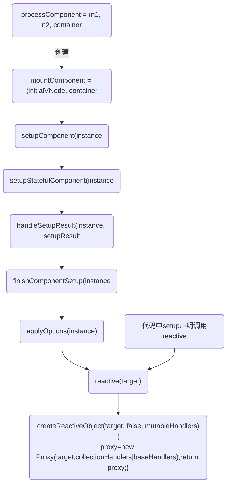

## Object.defineProperty 不足
1. 无法检测对象的 property 的添加或移除。而对于这个缺陷，Vue2 提供了 vm.$set 和全局的 Vue.set API 让我们能够向对象添加响应式的 property

2. Object.defineProperty 的不能监听对数组索引的改动以及数组 length 的改动,vue2 处理方式也同上

Proxy 对象能够利用 handler 陷阱在 get、set 时捕获到任何变动，也能监听对数组索引的改动以及 数组 length 的改动。

## 接上面 vnode-patch
Vue的关键算法patch


## 响应式与reactive
createReactiveObject函数接受 5 个参数:

1. target：目标对象，想要生成响应式的原始对象。
2. isReadonly：生成的代理对象是否只读。
3. baseHandlers：生成代理对象的 handler 参数。当 target 类型是 Array 或 Object 时使用该 handler。
4. collectionHandlers：当 target 类型是 Map、Set、WeakMap、WeakSet 时使用该 handler。
5. proxyMap：存储生成代理对象后的 Map 对象
```javaScript
function reactive(target) {
  // if trying to observe a readonly proxy, return the readonly version.
  if (isReadonly(target)) {
    return target;
  }
  console.log('%c响应式=>1:reactive->createReactiveObject创建一个代理对象并返回', 'color:chartreuse')
  return createReactiveObject(target, false, mutableHandlers, mutableCollectionHandlers, reactiveMap);
}

function createReactiveObject(target, isReadonly, baseHandlers, collectionHandlers, proxyMap) {
  if (!isObject(target)) {
    {
      console.warn(`value cannot be made reactive: ${String(target)}`);
    }
    return target;
  }
  // target is already a Proxy, return it.
  // exception: calling readonly() on a reactive object
  if (target["__v_raw" /* ReactiveFlags.RAW */] &&
    !(isReadonly && target["__v_isReactive" /* ReactiveFlags.IS_REACTIVE */])) {
    return target;
  }
  // target already has corresponding Proxy
  const existingProxy = proxyMap.get(target);
  if (existingProxy) {
    return existingProxy;
  }
  // only specific value types can be observed.
  const targetType = getTargetType(target);
  if (targetType === 0 /* TargetType.INVALID */) {
    return target;
  }

  console.log('%c响应式=>2:createReactiveObject:new Proxy(target', 'color:chartreuse')
  const proxy = new Proxy(target, targetType === 2 /* TargetType.COLLECTION */ ? collectionHandlers : baseHandlers);
  proxyMap.set(target, proxy);
  return proxy;
}
```