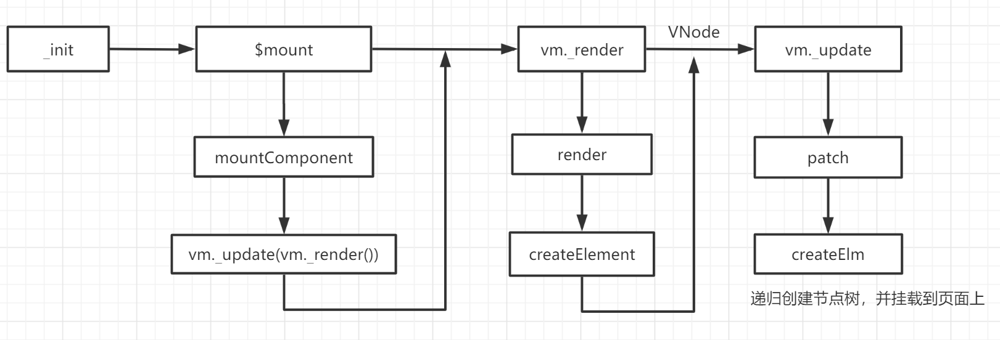

## 什么是虚拟dom
```
如我们所知，在浏览器渲染网页的过程中，加载到HTML文档后，会将文档解析并构建DOM树，然后将其与解析CSS生成的CSSOM树一起结合产生爱的结晶——RenderObject树，然后将RenderObject树渲染成页面（当然中间可能会有一些优化，比如RenderLayer树）。这些过程都存在与渲染引擎之中，渲染引擎在浏览器中是于JavaScript引擎（JavaScriptCore也好V8也好）分离开的，但为了方便JS操作DOM结构，渲染引擎会暴露一些接口供JavaScript调用。由于这两块相互分离，通信是需要付出代价的，因此JavaScript调用DOM提供的接口性能不咋地。各种性能优化的最佳实践也都在尽可能的减少DOM操作次数。

而虚拟DOM干了什么？它直接用JavaScript实现了DOM树（大致上）。组件的HTML结构并不会直接生成DOM，而是映射生成虚拟的JavaScript DOM结构，React又通过在这个虚拟DOM上实现了一个 diff 算法找出最小变更，再把这些变更写入实际的DOM中。这个虚拟DOM以JS结构的形式存在，计算性能会比较好，而且由于减少了实际DOM操作次数，性能会有较大提升
```

## 真实DOM和其解析流程
浏览器渲染引擎工作流程都差不多，大致分为5步，创建DOM树——创建StyleRules——创建Render树——布局Layout——绘制Painting
```
第一步，用HTML分析器，分析HTML元素，构建一颗DOM树(标记化和树构建)。
第二步，用CSS分析器，分析CSS文件和元素上的inline样式，生成页面的样式表。
第三步，将DOM树和样式表，关联起来，构建一颗Render树(这一过程又称为Attachment)。每个DOM节点都有attach方法，接受样式信息，返回一个render对象(又名renderer)。这些render对象最终会被构建成一颗Render树。

第四步，有了Render树，浏览器开始布局，为每个Render树上的节点确定一个在显示屏上出现的精确坐标。
第五步，Render树和节点显示坐标都有了，就调用每个节点paint方法，把它们绘制出来。
```

## 直接操作 DOM 性能差
```
1.DOM 引擎、JS 引擎 相互独立，但又工作在同一线程（主线程）
2.JS 代码调用 DOM API 必须 挂起 JS 引擎、转换传入参数数据、激活 DOM 引擎，DOM 重绘后再转换可能有的返回值，最后激活 JS 引擎并继续执行
3.若有频繁的 DOM API 调用，且浏览器厂商不做“批量处理”优化，引擎间切换的单位代价将迅速积累
4.若其中有强制重绘的 DOM API 调用，不但厂商费尽心机做的“批量处理”优化被中断，重新计算布局、重新绘制图像会引起更大的性能消耗

总结：降低引擎切换频率、减小 DOM 变更规模才是评判各种 DOM 性能优化方案的关键
```
## 为什么虚拟dom快
```
Virtual DOM 是 JS 对象树，也有 DOM diff 算法，符合上述关键条件，优化了 DOM 渲染时间；但正因为要一定程度上模拟 DOM 树，内存占用自然更高。
Virtual DOM只有在重复渲染的时候才可能提高性能，毕竟要多一个运算步骤，也要消耗更多的内存，只渲染一次，不会获得任何性能的好处。

优化思路：
对用于双向数据绑定、但频繁触发的 input 事件，启用函数节流
对每次提交给 ViewModel 的数据做 diff，只用数据差集来做重绘
对 HTML 模板中的 JS 表达式求值，在 JS 引擎中做缓存，只对变更值做 DOM API 调用

```

## 虚拟dom
诞生是基于这么一个概念：改变真实的DOM状态远比改变一个JavaScript对象的花销要大得多。
```
Virtual DOM是一个映射真实DOM的JavaScript对象，如果需要改变任何元素的状态，那么是先在Virtual DOM上进行改变，而不是直接改变真实的DOM。当有变化产生时，一个新的Virtual DOM对象会被创建并计算新旧Virtual DOM之间的差别。之后这些差别会应用在真实的DOM上。

vdom + diff算法比较了新旧dom的差异之后，还是要用原生方法去修改dom。
```

https://juejin.cn/post/6858902304599310343
## Vue视图渲染原理解析，从构建VNode到生成真实节点树
```
在 Vue 核心中除了响应式原理外，视图渲染也是重中之重。我们都知道每次更新数据，都会走视图渲染的逻辑，而这当中牵扯的逻辑也是十分繁琐。
本文主要解析的是初始化视图渲染流程，你将会了解到从挂载组件开始，Vue 是如何构建 VNode，又是如何将 VNode 转为真实节点并挂载到页面。
```

## 总结
配图


```
                                            vNode虚拟dom树
_init---->$mouted-------------->vm._render--------->vm._update
            |           |          |        |         |
            |           |          |        |         |
            V           |          V        |         V
mountComponet           |         render    |        patch
            |           |          |        |         |
            |           |          |        |         V
            V           |          V        |       createElm
vm._update(vm._render())|     createElement—     递归创建节点树，并挂载到页面上
            |           |     渲染函数返回vNode
            |————————————

```

```
1.初始化调用 $mount 挂载组件。

2._render 开始构建 VNode，核心方法为 createElement，一般会创建普通的 VNode ，遇到组件就创建组件类型的 VNode，否则就是未知标签的 VNode，构建完成传递给 _update。

3.patch 阶段根据 VNode 创建真实节点树，核心方法为 createElm，首先遇到组件类型的

4.VNode，内部会执行 $mount，再走一遍相同的流程。普通节点类型则创建一个真实节点，如果它有子节点开始递归调用 createElm，使用 insert 插入子节点，直到没有子节点就填充内容节点。最后递归完成后，同样也是使用 insert 将整个节点树插入到页面中，再将旧的根节点移除。

要点可以概括为:
+ 当某个数据属性被用到时，触发 getter，这个属性就会被作为依赖被 watcher 记录下来。

+ 整个函数被渲染完的时候，每一个被用到的数据属性都会被记录。

+ 相应的数据变动时，例如给它一个新的值，就会触发 setter，通知数据对象对应数据有变化。

+ 此时会通知对应的组件，其数据依赖有所改动，需要重新渲染。

+ 对应的组件再次调动渲染函数，生成 Virtual DOM，实现 DOM 更新。
```

```
1.Vue的编译器在编译模板之后，会把这些模板编译成一个渲染函数。而函数被调用的时候就会渲染并且返回一个虚拟DOM的树。
2.当我们有了这个虚拟的树之后，再交给一个patch函数，负责把这些虚拟DOM真正施加到真实的DOM上。在这个过程中，Vue有自身的响应式系统来侦测在渲染过程中所依赖到的数据来源
3.在渲染过程中，侦测到的数据来源之后，之后就可以精确感知数据源的变动。到时候就可以根据需要重新进行渲染。
4.当重新进行渲染之后，会生成一个新的树，将新树与旧树进行对比，就可以最终得出应施加到真实DOM上的改动。最后再通过patch函数施加改动。
```

### 挂载组件($mount)
Vue 是一个构造函数，通过 new 关键字进行实例化。
```js
// src/core/instance/index.js
function Vue (options) {
  if (process.env.NODE_ENV !== 'production' &&
    !(this instanceof Vue)
  ) {
    warn('Vue is a constructor and should be called with the `new` keyword')
  }
  this._init(options)
}
//2021实际查看instance/index.js
import { initMixin } from './init'
import { stateMixin } from './state'
import { renderMixin } from './render'
import { eventsMixin } from './events'
import { lifecycleMixin } from './lifecycle'
import { warn } from '../util/index'

function Vue (options) {
  if (process.env.NODE_ENV !== 'production' &&
    !(this instanceof Vue)
  ) {
    warn('Vue is a constructor and should be called with the `new` keyword')
  }
  this._init(options)
}
initMixin(Vue)
stateMixin(Vue)
eventsMixin(Vue)
lifecycleMixin(Vue)
renderMixin(Vue)
export default Vue
```

**在实例化时，会调用 _init 进行初始化。**
```js
// src/core/instance/init.js
Vue.prototype._init = function (options?: Object) {
    const vm: Component = this
    // ...
    if (vm.$options.el) {
      vm.$mount(vm.$options.el)
    }
}
/*
_init 内会调用 $mount 来挂载组件，而 $mount 方法实际调用的是 mountComponent。
*/

//2021实际查看vue\src\core\instance/init.js
import config from '../config'
import { initProxy } from './proxy'
import { initState } from './state'
import { initRender } from './render'
import { initEvents } from './events'
import { mark, measure } from '../util/perf'
import { initLifecycle, callHook } from './lifecycle'
import { initProvide, initInjections } from './inject'
import { extend, mergeOptions, formatComponentName } from '../util/index'

let uid = 0
export function initMixin (Vue: Class<Component>) {
  Vue.prototype._init = function (options?: Object) {
    const vm: Component = this
    // a uid
    vm._uid = uid++

    let startTag, endTag
    /* istanbul ignore if */
    if (process.env.NODE_ENV !== 'production' && config.performance && mark) {
      startTag = `vue-perf-start:${vm._uid}`
      endTag = `vue-perf-end:${vm._uid}`
      mark(startTag)
    }

    // a flag to avoid this being observed
    vm._isVue = true
    // merge options
    if (options && options._isComponent) {
      // optimize internal component instantiation
      // since dynamic options merging is pretty slow, and none of the
      // internal component options needs special treatment.
      initInternalComponent(vm, options)
    } else {
      vm.$options = mergeOptions(
        resolveConstructorOptions(vm.constructor),
        options || {},
        vm
      )
    }
    /* istanbul ignore else */
    if (process.env.NODE_ENV !== 'production') {
      initProxy(vm)
    } else {
      vm._renderProxy = vm
    }
    // expose real self
    vm._self = vm
    initLifecycle(vm)
    initEvents(vm)
    initRender(vm)
    callHook(vm, 'beforeCreate')
    initInjections(vm) // resolve injections before data/props
    initState(vm)
    initProvide(vm) // resolve provide after data/props
    callHook(vm, 'created')

    /* istanbul ignore if */
    if (process.env.NODE_ENV !== 'production' && config.performance && mark) {
      vm._name = formatComponentName(vm, false)
      mark(endTag)
      measure(`vue ${vm._name} init`, startTag, endTag)
    }

    if (vm.$options.el) {
      vm.$mount(vm.$options.el)
    }
  }
}
```

### **_init 内会调用 $mount 来挂载组件，而 $mount 方法实际调用的是 mountComponent。**
mountComponent 除了调用一些生命周期的钩子函数外，最主要是 updateComponent，它就是负责渲染视图的核心方法，其只有一行核心代码：
```js
vm._update(vm._render(), hydrating)
```

```js
// src/core/instance/lifecycle.js
export function mountComponent (
  vm: Component,
  el: ?Element,
  hydrating?: boolean
): Component {
  vm.$el = el
  // ...
  callHook(vm, 'beforeMount')

  let updateComponent
  /* istanbul ignore if */
  if (process.env.NODE_ENV !== 'production' && config.performance && mark) {
    // ...
  } else {
    updateComponent = () => {
      vm._update(vm._render(), hydrating)  // 渲染页面函数
    }
  }

  // we set this to vm._watcher inside the watcher's constructor
  // since the watcher's initial patch may call $forceUpdate (e.g. inside child
  // component's mounted hook), which relies on vm._watcher being already defined
  new Watcher(vm, updateComponent, noop, { //  渲染watcher
    before () {
      if (vm._isMounted && !vm._isDestroyed) {
        callHook(vm, 'beforeUpdate')
      }
    }
  }, true /* isRenderWatcher */)
  hydrating = false

  // manually mounted instance, call mounted on self
  // mounted is called for render-created child components in its inserted hook
  if (vm.$vnode == null) {
    vm._isMounted = true
    callHook(vm, 'mounted')
  }
  return vm
}
```
### vm.render
```
vm._render 创建并返回 VNode，vm._update 接受 VNode 将其转为真实节点。

updateComponent 会被传入 渲染Watcher，每当数据变化触发 Watcher 更新就会执行该函数，重新渲染视图。updateComponent 在传入 渲染Watcher 后会被执行一次进行初始化页面渲染。

所以我们着重分析的是 vm._render 和 vm._update 两个方法，这也是本文主要了解的原理——Vue 视图渲染流程。
```
## 构建VNode
### 1.首先是 -render 方法，它用来构建组件的 VNode。
```js
首先是 _render 方法，它用来构建组件的 VNode。
// src/core/instance/render.js
Vue.prototype._render = function () {
    const { render, _parentVnode } = vm.$options
    vnode = render.call(vm._renderProxy, vm.$createElement)
    return vnode
}

//2021.instance/render.js实际
Vue.prototype._render = function (): VNode {
    const vm: Component = this
    const { render, _parentVnode } = vm.$options

    if (_parentVnode) {
      vm.$scopedSlots = normalizeScopedSlots(
        _parentVnode.data.scopedSlots,
        vm.$slots,
        vm.$scopedSlots
      )
    }

    // set parent vnode. this allows render functions to have access
    // to the data on the placeholder node.
    vm.$vnode = _parentVnode
    // render self
    let vnode
    try {
      // There's no need to maintain a stack because all render fns are called
      // separately from one another. Nested component's render fns are called
      // when parent component is patched.
      currentRenderingInstance = vm
      vnode = render.call(vm._renderProxy, vm.$createElement)
    } catch (e) {
      handleError(e, vm, `render`)
      // return error render result,
      // or previous vnode to prevent render error causing blank component
      /* istanbul ignore else */
      if (process.env.NODE_ENV !== 'production' && vm.$options.renderError) {
        try {
          vnode = vm.$options.renderError.call(vm._renderProxy, vm.$createElement, e)
        } catch (e) {
          handleError(e, vm, `renderError`)
          vnode = vm._vnode
        }
      } else {
        vnode = vm._vnode
      }
    } finally {
      currentRenderingInstance = null
    }
    // if the returned array contains only a single node, allow it
    if (Array.isArray(vnode) && vnode.length === 1) {
      vnode = vnode[0]
    }
    // return empty vnode in case the render function errored out
    if (!(vnode instanceof VNode)) {
      if (process.env.NODE_ENV !== 'production' && Array.isArray(vnode)) {
        warn(
          'Multiple root nodes returned from render function. Render function ' +
          'should return a single root node.',
          vm
        )
      }
      vnode = createEmptyVNode()
    }
    // set parent
    vnode.parent = _parentVnode
    return vnode
  }
}
```
### 2.-render 内部会执行 render 方法并返回构建好的 VNod
```js
_render 内部会执行 render 方法并返回构建好的 VNode。render 一般是模板编译后生成的方法，也有可能是用户自定义。
// src/core/instance/render.js
export function initRender (vm) {
    vm._c = (a, b, c, d) => createElement(vm, a, b, c, d, false)
    vm.$createElement = (a, b, c, d) => createElement(vm, a, b, c, d, true)
}

//2021.07 vue\src\core\instance\render.js
export function initRender (vm: Component) {
  vm._vnode = null // the root of the child tree
  vm._staticTrees = null // v-once cached trees
  const options = vm.$options
  const parentVnode = vm.$vnode = options._parentVnode // the placeholder node in parent tree
  const renderContext = parentVnode && parentVnode.context
  vm.$slots = resolveSlots(options._renderChildren, renderContext)
  vm.$scopedSlots = emptyObject
  // bind the createElement fn to this instance
  // so that we get proper render context inside it.
  // args order: tag, data, children, normalizationType, alwaysNormalize
  // internal version is used by render functions compiled from templates
  vm._c = (a, b, c, d) => createElement(vm, a, b, c, d, false)
  // normalization is always applied for the public version, used in
  // user-written render functions.
  vm.$createElement = (a, b, c, d) => createElement(vm, a, b, c, d, true)

  // $attrs & $listeners are exposed for easier HOC creation.
  // they need to be reactive so that HOCs using them are always updated
  const parentData = parentVnode && parentVnode.data

  /* istanbul ignore else */
  if (process.env.NODE_ENV !== 'production') {
    defineReactive(vm, '$attrs', parentData && parentData.attrs || emptyObject, () => {
      !isUpdatingChildComponent && warn(`$attrs is readonly.`, vm)
    }, true)
    defineReactive(vm, '$listeners', options._parentListeners || emptyObject, () => {
      !isUpdatingChildComponent && warn(`$listeners is readonly.`, vm)
    }, true)
  } else {
    defineReactive(vm, '$attrs', parentData && parentData.attrs || emptyObject, null, true)
    defineReactive(vm, '$listeners', options._parentListeners || emptyObject, null, true)
```
### 3.initRender 在初始化就会执行为实例上绑定两个方法
```js
initRender 在初始化就会执行为实例上绑定两个方法，分别是 vm._c 和 vm.$createElement。它们两者都是调用 createElement 方法，它是创建 VNode 的核心方法，最后一个参数用于区别是否为用户自定义。
// src/core/instance/render.js
export function initRender (vm) {
    vm._c = (a, b, c, d) => createElement(vm, a, b, c, d, false)
    vm.$createElement = (a, b, c, d) => createElement(vm, a, b, c, d, true)
}
/*
vm._c 应用场景是在编译生成的 render 函数中调用，vm.$createElement 则用于用户自定义 render 函数的场景。 就像上面 render 在调用时会传入参数 vm.$createElement，我们在自定义 render 函数接收到的参数就是它。
*/
```
### 4.createElement
```js
createElement 方法实际上是对 _createElement 方法的封装，它允许传入的参数更加灵活。
```
```js
// src/core/vdom/create-elemenet.js
export function createElement (
  context: Component,
  tag: any,
  data: any,
  children: any,
  normalizationType: any,
  alwaysNormalize: boolean
): VNode | Array<VNode> {
  if (Array.isArray(data) || isPrimitive(data)) {
    normalizationType = children
    children = data
    data = undefined
  }
  if (isTrue(alwaysNormalize)) {
    normalizationType = ALWAYS_NORMALIZE
  }
  return _createElement(context, tag, data, children, normalizationType)
}
```

```js
_createElement 参数中会接收 children，它表示当前 VNode 的子节点，因为它是任意类型的，所以接下来需要将其规范为标准的 VNode 数组；
// 这里规范化 children
if (normalizationType === ALWAYS_NORMALIZE) {
  children = normalizeChildren(children)
} else if (normalizationType === SIMPLE_NORMALIZE) {
  children = simpleNormalizeChildren(children)
}
```

```js
//实际代码 src/core/vdom/create-elemenet.js
// wrapper function for providing a more flexible interface
// without getting yelled at by flow
export function createElement (
  context: Component,
  tag: any,
  data: any,
  children: any,
  normalizationType: any,
  alwaysNormalize: boolean
): VNode | Array<VNode> {
  if (Array.isArray(data) || isPrimitive(data)) {
    normalizationType = children
    children = data
    data = undefined
  }
  if (isTrue(alwaysNormalize)) {
    normalizationType = ALWAYS_NORMALIZE
  }
  return _createElement(context, tag, data, children, normalizationType)
}

export function _createElement (
  context: Component,
  tag?: string | Class<Component> | Function | Object,
  data?: VNodeData,
  children?: any,
  normalizationType?: number
): VNode | Array<VNode> {
  if (isDef(data) && isDef((data: any).__ob__)) {
    process.env.NODE_ENV !== 'production' && warn(
      `Avoid using observed data object as vnode data: ${JSON.stringify(data)}\n` +
      'Always create fresh vnode data objects in each render!',
      context
    )
    return createEmptyVNode()
  }
  // object syntax in v-bind
  if (isDef(data) && isDef(data.is)) {
    tag = data.is
  }
  if (!tag) {
    // in case of component :is set to falsy value
    return createEmptyVNode()
  }
  // warn against non-primitive key
  if (process.env.NODE_ENV !== 'production' &&
    isDef(data) && isDef(data.key) && !isPrimitive(data.key)
  ) {
    if (!__WEEX__ || !('@binding' in data.key)) {
      warn(
        'Avoid using non-primitive value as key, ' +
        'use string/number value instead.',
        context
      )
    }
  }
  // support single function children as default scoped slot
  if (Array.isArray(children) &&
    typeof children[0] === 'function'
  ) {
    data = data || {}
    data.scopedSlots = { default: children[0] }
    children.length = 0
  }
  if (normalizationType === ALWAYS_NORMALIZE) {
    children = normalizeChildren(children)
  } else if (normalizationType === SIMPLE_NORMALIZE) {
    children = simpleNormalizeChildren(children)
  }
  let vnode, ns
  if (typeof tag === 'string') {
    let Ctor
    ns = (context.$vnode && context.$vnode.ns) || config.getTagNamespace(tag)
    if (config.isReservedTag(tag)) {
      // platform built-in elements
      if (process.env.NODE_ENV !== 'production' && isDef(data) && isDef(data.nativeOn)) {
        warn(
          `The .native modifier for v-on is only valid on components but it was used on <${tag}>.`,
          context
        )
      }
      vnode = new VNode(
        config.parsePlatformTagName(tag), data, children,
        undefined, undefined, context
      )
    } else if ((!data || !data.pre) && isDef(Ctor = resolveAsset(context.$options, 'components', tag))) {
      // component
      vnode = createComponent(Ctor, data, context, children, tag)
    } else {
      // unknown or unlisted namespaced elements
      // check at runtime because it may get assigned a namespace when its
      // parent normalizes children
      vnode = new VNode(
        tag, data, children,
        undefined, undefined, context
      )
    }
  } else {
    // direct component options / constructor
    vnode = createComponent(tag, data, context, children)
  }
  if (Array.isArray(vnode)) {
    return vnode
  } else if (isDef(vnode)) {
    if (isDef(ns)) applyNS(vnode, ns)
    if (isDef(data)) registerDeepBindings(data)
    return vnode
  } else {
    return createEmptyVNode()
  }
}
```
### simpleNormalizeChildren 和 normalizeChildren 均用于规范化 children。由 normalizationType 判断 render 函数是编译生成的还是用户自定义的。

simpleNormalizeChildren 方法调用场景是 render 函数当函数是编译生成的。
normalizeChildren 方法的调用场景主要是 render 函数是用户手写的。
```js
// 1. When the children contains components - because a functional component
// may return an Array instead of a single root. In this case, just a simple
// normalization is needed - if any child is an Array, we flatten the whole
// thing with Array.prototype.concat. It is guaranteed to be only 1-level deep
// because functional components already normalize their own children.
export function simpleNormalizeChildren (children: any) {
  for (let i = 0; i < children.length; i++) {
    if (Array.isArray(children[i])) {
      return Array.prototype.concat.apply([], children)
    }
  }
  return children
}

// 2. When the children contains constructs that always generated nested Arrays,
// e.g. <template>, <slot>, v-for, or when the children is provided by user
// with hand-written render functions / JSX. In such cases a full normalization
// is needed to cater to all possible types of children values.
export function normalizeChildren (children: any): ?Array<VNode> {
  return isPrimitive(children)
    ? [createTextVNode(children)]
    : Array.isArray(children)
      ? normalizeArrayChildren(children)
      : undefined
}
```
### 经过对children的规范化，children变成了一个类型为 VNode 的数组。之后就是创建 VNode 的逻辑。
```
如果 tag 是 string 类型，则接着判断如果是内置的一些节点，创建一个普通 VNode；如果是为已注册的组件名，则通过 createComponent 创建一个组件类型的 VNode；否则创建一个未知的标签的 VNode。

如果 tag 不是 string 类型，那就是 Component 类型, 则直接调用 createComponent 创建一个组件类型的 VNode 节点。

最后 _createElement 会返回一个 VNode，也就是调用 vm._render 时创建得到的VNode。之后 VNode 会传递给 vm._update 函数，用于生成真实dom。
```
```js
// src/core/vdom/patch.js
let vnode, ns
if (typeof tag === 'string') {
  let Ctor
  ns = (context.$vnode && context.$vnode.ns) || config.getTagNamespace(tag)
  if (config.isReservedTag(tag)) {
    // platform built-in elements
    vnode = new VNode(
      config.parsePlatformTagName(tag), data, children,
      undefined, undefined, context
    )
  } else if (isDef(Ctor = resolveAsset(context.$options, 'components', tag))) {
    // component
    vnode = createComponent(Ctor, data, context, children, tag)
  } else {
    // unknown or unlisted namespaced elements
    // check at runtime because it may get assigned a namespace when its
    // parent normalizes children
    vnode = new VNode(
      tag, data, children,
      undefined, undefined, context
    )
  }
} else {
  // direct component options / constructor
  vnode = createComponent(tag, data, context, children)
}
```
## 生成真实dom(-update)
```js
_update 里最核心的方法就是 vm.__patch__ 方法，不同平台的 __patch__ 方法的定义会稍有不同，在 web 平台中它是这样定义的
可以看到 __patc__ 实际调用的是 patch 方法。

// src/platforms/web/runtime/index.js
import { patch } from './patch'
// install platform patch function
Vue.prototype.__patch__ = inBrowser ? patch : noop
```

```js
而 patch 方法是由 createPatchFunction 方法创建返回出来的函数。
这里有两个比较重要的对象 nodeOps 和 modules。nodeOps 是封装的原生dom操作方法，在生成真实节点树的过程中，dom相关操作都是调用 nodeOps 内的方法。
// src/platforms/web/runtime/patch.js
import * as nodeOps from 'web/runtime/node-ops'
import { createPatchFunction } from 'core/vdom/patch'
import baseModules from 'core/vdom/modules/index'
import platformModules from 'web/runtime/modules/index'

// the directive module should be applied last, after all
// built-in modules have been applied.
const modules = platformModules.concat(baseModules)

export const patch: Function = createPatchFunction({ nodeOps, modules })
```

```js
modules 是待执行的钩子函数。在进入函数时，会将不同模块的钩子函数分类放置到 cbs 中，其中包括自定义指令钩子函数，ref 钩子函数。在 patch 阶段，会根据操作节点的行为取出对应类型进行调用。
// src/core/vdom/patch.js
const hooks = ['create', 'activate', 'update', 'remove', 'destroy']

export function createPatchFunction (backend) {
  let i, j
  const cbs = {}
  const { modules, nodeOps } = backend

  for (i = 0; i < hooks.length; ++i) {
    cbs[hooks[i]] = []
    for (j = 0; j < modules.length; ++j) {
      if (isDef(modules[j][hooks[i]])) {
        cbs[hooks[i]].push(modules[j][hooks[i]])
      }
    }
  }
  
  // ...
  return function patch (oldVnode, vnode, hydrating, removeOnly){}
}
```

## patch
```js
// initial render
vm.$el = vm.__patch__(vm.$el, vnode, hydrating, false /* removeOnly */)
```
```
在首次渲染时，vm.$el 对应的是根节点 dom 对象，也就是我们熟知的 id 为 app 的 div。它作为 oldVNode 参数传入 patch：
```
```js
return function patch (oldVnode, vnode, hydrating, removeOnly) {
  if (isUndef(vnode)) {
    if (isDef(oldVnode)) invokeDestroyHook(oldVnode)
    return
  }

  let isInitialPatch = false
  const insertedVnodeQueue = []

  if (isUndef(oldVnode)) {
    // empty mount (likely as component), create new root element
    isInitialPatch = true
    createElm(vnode, insertedVnodeQueue)
  } else {
    const isRealElement = isDef(oldVnode.nodeType)
    if (!isRealElement && sameVnode(oldVnode, vnode)) {
      // patch existing root node
      patchVnode(oldVnode, vnode, insertedVnodeQueue, null, null, removeOnly)
    } else {
      if (isRealElement) {
        // mounting to a real element
        // check if this is server-rendered content and if we can perform
        // a successful hydration.
        if (oldVnode.nodeType === 1 && oldVnode.hasAttribute(SSR_ATTR)) {
          oldVnode.removeAttribute(SSR_ATTR)
          hydrating = true
        }
        if (isTrue(hydrating)) {
          if (hydrate(oldVnode, vnode, insertedVnodeQueue)) {
            invokeInsertHook(vnode, insertedVnodeQueue, true)
            return oldVnode
          } else if (process.env.NODE_ENV !== 'production') {
            warn(
              'The client-side rendered virtual DOM tree is not matching ' +
              'server-rendered content. This is likely caused by incorrect ' +
              'HTML markup, for example nesting block-level elements inside ' +
              '<p>, or missing <tbody>. Bailing hydration and performing ' +
              'full client-side render.'
            )
          }
        }
        // either not server-rendered, or hydration failed.
        // create an empty node and replace it
        oldVnode = emptyNodeAt(oldVnode)
      }

      // replacing existing element
      const oldElm = oldVnode.elm
      const parentElm = nodeOps.parentNode(oldElm)

      // create new node
      createElm(
        vnode,
        insertedVnodeQueue,
        // extremely rare edge case: do not insert if old element is in a
        // leaving transition. Only happens when combining transition +
        // keep-alive + HOCs. (#4590)
        oldElm._leaveCb ? null : parentElm,
        nodeOps.nextSibling(oldElm)
      )

      // update parent placeholder node element, recursively
      if (isDef(vnode.parent)) {
        let ancestor = vnode.parent
        const patchable = isPatchable(vnode)
        while (ancestor) {
          for (let i = 0; i < cbs.destroy.length; ++i) {
            cbs.destroy[i](ancestor)
          }
          ancestor.elm = vnode.elm
          if (patchable) {
            for (let i = 0; i < cbs.create.length; ++i) {
              cbs.create[i](emptyNode, ancestor)
            }
            // #6513
            // invoke insert hooks that may have been merged by create hooks.
            // e.g. for directives that uses the "inserted" hook.
            const insert = ancestor.data.hook.insert
            if (insert.merged) {
              // start at index 1 to avoid re-invoking component mounted hook
              for (let i = 1; i < insert.fns.length; i++) {
                insert.fns[i]()
              }
            }
          } else {
            registerRef(ancestor)
          }
          ancestor = ancestor.parent
        }
      }

      // destroy old node
      if (isDef(parentElm)) {
        removeVnodes([oldVnode], 0, 0)
      } else if (isDef(oldVnode.tag)) {
        invokeDestroyHook(oldVnode)
      }
    }
  }

  invokeInsertHook(vnode, insertedVnodeQueue, isInitialPatch)
  return vnode.elm
}
```
### 通过检查属性 nodeType（真实节点才有的属性）， 判断 oldVnode 是否为真实节点。
```js
const isRealElement = isDef(oldVnode.nodeType)
if (isRealElement) {
  // ...
  oldVnode = emptyNodeAt(oldVnode)
}
```
### 很明显第一次的 isRealElement 是为 true，因此会调用 emptyNodeAt 将其转为 VNode：
```js
function emptyNodeAt (elm) {
  return new VNode(nodeOps.tagName(elm).toLowerCase(), {}, [], undefined, elm)
}
```
### 接着会调用 createElm 方法，它就是将 VNode 转为真实dom 的核心方法：
```js
function createElm (
  vnode,
  insertedVnodeQueue,
  parentElm,
  refElm,
  nested,
  ownerArray,
  index
) {
  if (isDef(vnode.elm) && isDef(ownerArray)) {
    // This vnode was used in a previous render!
    // now it's used as a new node, overwriting its elm would cause
    // potential patch errors down the road when it's used as an insertion
    // reference node. Instead, we clone the node on-demand before creating
    // associated DOM element for it.
    vnode = ownerArray[index] = cloneVNode(vnode)
  }

  vnode.isRootInsert = !nested // for transition enter check
  if (createComponent(vnode, insertedVnodeQueue, parentElm, refElm)) {
    return
  }

  const data = vnode.data
  const children = vnode.children
  const tag = vnode.tag
  if (isDef(tag)) {
    vnode.elm = vnode.ns
      ? nodeOps.createElementNS(vnode.ns, tag)
      : nodeOps.createElement(tag, vnode)
    setScope(vnode)

    /* istanbul ignore if */
    if (__WEEX__) {
      // ...
    } else {
      createChildren(vnode, children, insertedVnodeQueue)
      if (isDef(data)) {
        invokeCreateHooks(vnode, insertedVnodeQueue)
      }
      insert(parentElm, vnode.elm, refElm)
    }

    if (process.env.NODE_ENV !== 'production' && data && data.pre) {
      creatingElmInVPre--
    }
  } else if (isTrue(vnode.isComment)) {
    vnode.elm = nodeOps.createComment(vnode.text)
    insert(parentElm, vnode.elm, refElm)
  } else {
    vnode.elm = nodeOps.createTextNode(vnode.text)
    insert(parentElm, vnode.elm, refElm)
  }
}
```

```js
一开始会调用 createComponent 尝试创建组件类型的节点，如果成功会返回 true。在创建过程中也会调用 $mount 进行组件范围内的挂载，所以走的还是 patch 这套流程。
if (createComponent(vnode, insertedVnodeQueue, parentElm, refElm)) {
  return
}
```
如果没有完成创建，代表该 VNode 对应的是真实节点，往下继续创建真实节点的逻辑。
```js
vnode.elm = vnode.ns
    ? nodeOps.createElementNS(vnode.ns, tag)
    : nodeOps.createElement(tag, vnode)
```
根据 tag 创建对应类型真实节点，赋值给 vnode.elm，它作为父节点容器，创建的子节点会被放到里面。
然后调用 createChildren 创建子节点：
```js
function createChildren (vnode, children, insertedVnodeQueue) {
  if (Array.isArray(children)) {
    if (process.env.NODE_ENV !== 'production') {
      checkDuplicateKeys(children)
    }
    for (let i = 0; i < children.length; ++i) {
      createElm(children[i], insertedVnodeQueue, vnode.elm, null, true, children, i)
    }
  } else if (isPrimitive(vnode.text)) {
    nodeOps.appendChild(vnode.elm, nodeOps.createTextNode(String(vnode.text)))
  }
}
```

内部进行遍历子节点数组，再次调用 createElm 创建节点，而上面创建的 vnode.elm 作为父节点传入。如此循环，直到没有子节点，就会创建文本节点插入到 vnode.elm 中。

执行完成后出来，会调用 invokeCreateHooks，它负责执行 dom 操作时的 create 钩子函数，同时将 VNode 加入到 insertedVnodeQueue 中：
```js
function invokeCreateHooks (vnode, insertedVnodeQueue) {
  for (let i = 0; i < cbs.create.length; ++i) {
    cbs.create[i](emptyNode, vnode)
  }
  i = vnode.data.hook // Reuse variable
  if (isDef(i)) {
    if (isDef(i.create)) i.create(emptyNode, vnode)
    if (isDef(i.insert)) insertedVnodeQueue.push(vnode)
  }
}
```
最后一步就是调用 insert 方法将节点插入到父节点：
```js
function insert (parent, elm, ref) {
  if (isDef(parent)) {
    if (isDef(ref)) {
      if (nodeOps.parentNode(ref) === parent) {
        nodeOps.insertBefore(parent, elm, ref)
      }
    } else {
      nodeOps.appendChild(parent, elm)
    }
  }
}
```

可以看到 Vue 是通过递归调用 createElm 来创建节点树的。同时也说明最深的子节点会先调用 insert 插入节点。所以整个节点树的插入顺序是“先子后父”。插入节点方法就是原生dom的方法 insertBefore 和 appendChild。
```js
if (isDef(parentElm)) {
  removeVnodes([oldVnode], 0, 0)
}
```
createElm 流程走完后，构建完成的节点树已经插入到页面上了。其实 Vue 在初始化渲染页面时，并不是把原来的根节点 app 给真正替换掉，而是在其后面插入一个新的节点，接着再把旧节点给移除掉。
所以在 createElm 之后会调用 removeVnodes 来移除旧节点，它里面同样是调用的原生dom方法 removeChild。
```js
invokeInsertHook(vnode, insertedVnodeQueue, isInitialPatch)

createElm 流程走完后，构建完成的节点树已经插入到页面上了。其实 Vue 在初始化渲染页面时，并不是把原来的根节点 app 给真正替换掉，而是在其后面插入一个新的节点，接着再把旧节点给移除掉。
所以在 createElm 之后会调用 removeVnodes 来移除旧节点，它里面同样是调用的原生dom方法 removeChild。
```

在 patch 的最后就是调用 invokeInsertHook 方法，触发节点插入的钩子函数。
至此整个页面渲染的流程完毕~
```js
invokeInsertHook(vnode, insertedVnodeQueue, isInitialPatch)

function invokeInsertHook (vnode, queue, initial) {
  // delay insert hooks for component root nodes, invoke them after the
  // element is really inserted
  if (isTrue(initial) && isDef(vnode.parent)) {
    vnode.parent.data.pendingInsert = queue
  } else {
    for (let i = 0; i < queue.length; ++i) {
      queue[i].data.hook.insert(queue[i])
    }
  }
}
```


## 为什么操作dom渲染成本高
```
涉及到浏览器引擎的知识，现在我们回忆一下，JavaScript是解析引擎的，页面渲染是渲染引擎的。因此不可避免地要进行两个线程之间的通信，操作越频繁，两个线程通信消耗的性能就越多。
你用传统的原生api或jQuery去操作DOM时，浏览器会从构建DOM树开始从头到尾执行一遍流程。
当你在一次操作时，需要更新10个DOM节点，浏览器没这么智能，收到第一个更新DOM请求后，并不知道后续还有9次更新操作，因此会马上执行流程，最终执行10次流程。

而通过VNode，同样更新10个DOM节点，虚拟DOM不会立即操作DOM，而是将这10次更新的diff内容保存到本地的一个js对象中，最终将这个js对象一次性attach到DOM树上，避免大量的无谓计算.


虚拟DOM的解决方式是：通过状态生成一个虚拟节点树，然后使用虚拟节点树进行渲染。假如是首次节点的渲染就直接渲染，但是第二次的话就需要进行虚拟节点树的比较，只渲染不同的部分。

DOM是为了提高性能，在React中是虚拟DOM比对,vue 2.0 采用中等粒度方案监听，只能监听到组件的变化，而组件的内部就使用虚拟DOM进行状态比对，也就是DIFF算法。
```


## vue虚拟dom
```js
Object对象来模拟真实DOM结构，这个对象包含标签名 (tag)、属性 (attrs) 和子元素对象 (children) 三个属性，通过vue中的render()函数把虚拟dom编译成真实dom，在通过appendChild()添加到页面中。
<ul>
	<li class="a">text_a</li>
	<li class="b">text_a</li>
</ul>

let ul=Element('ul',{id:'list'},[
	Element('li',{class:'a'},['tex_a']),
	Element('li',{class:'b'},['txt_b'])
])
let ulDom = ul.render() //生成真实的dom
document.body.appendChild(ulDom)
```

## 在vue中如何应用虚拟DOM的
通过VNode，vue可以对这颗抽象树进行创建节点,删除节点以及修改节点的操作，经过diff算法得出一些需要修改的最小单位,再更新视图，减少了dom操作，提高了性能。
```
vue中虚拟 DOM 最大的优势是 diff 算法，减少 JavaScript 操作真实 DOM 的带来的性能消耗。虽然这一个虚拟 DOM带来的一个优势，但并不是全部。
其它框架中也有虚拟 DOM概念， 最大的优势在于抽象了原本的渲染过程，实现了跨平台的能力，而不仅仅局限于浏览器的 DOM，可以是安卓和 IOS 的原生组件，可以是近期很火热的小程序，也可以是各种GUI。
```

## 如何实现虚拟DOM

### 首先可以看看vue中VNode的结构
这里对VNode进行稍微的说明：
```
+ 所有对象的 context 选项都指向了Vue实例
+ elm 属性则指向了其相对应的真实DOM节点
+ vue是通过createElement生成VNode
```
vnode.js
```js
export default class VNode {
  tag: string | void;
  data: VNodeData | void;
  children: ?Array<VNode>;
  text: string | void;
  elm: Node | void;
  ns: string | void;
  context: Component | void; // rendered in this component's scope
  functionalContext: Component | void; // only for functional component root nodes
  key: string | number | void;
  componentOptions: VNodeComponentOptions | void;
  componentInstance: Component | void; // component instance
  parent: VNode | void; // component placeholder node
  raw: boolean; // contains raw HTML? (server only)
  isStatic: boolean; // hoisted static node
  isRootInsert: boolean; // necessary for enter transition check
  isComment: boolean; // empty comment placeholder?
  isCloned: boolean; // is a cloned node?
  isOnce: boolean; // is a v-once node?

  constructor (
    tag?: string,
    data?: VNodeData,
    children?: ?Array<VNode>,
    text?: string,
    elm?: Node,
    context?: Component,
    componentOptions?: VNodeComponentOptions
  ) {
    /*当前节点的标签名*/
    this.tag = tag
    /*当前节点对应的对象，包含了具体的一些数据信息，是一个VNodeData类型，可以参考VNodeData类型中的数据信息*/
    this.data = data
    /*当前节点的子节点，是一个数组*/
    this.children = children
    /*当前节点的文本*/
    this.text = text
    /*当前虚拟节点对应的真实dom节点*/
    this.elm = elm
    /*当前节点的名字空间*/
    this.ns = undefined
    /*编译作用域*/
    this.context = context
    /*函数化组件作用域*/
    this.functionalContext = undefined
    /*节点的key属性，被当作节点的标志，用以优化*/
    this.key = data && data.key
    /*组件的option选项*/
    this.componentOptions = componentOptions
    /*当前节点对应的组件的实例*/
    this.componentInstance = undefined
    /*当前节点的父节点*/
    this.parent = undefined
    /*简而言之就是是否为原生HTML或只是普通文本，innerHTML的时候为true，textContent的时候为false*/
    this.raw = false
    /*静态节点标志*/
    this.isStatic = false
    /*是否作为跟节点插入*/
    this.isRootInsert = true
    /*是否为注释节点*/
    this.isComment = false
    /*是否为克隆节点*/
    this.isCloned = false
    /*是否有v-once指令*/
    this.isOnce = false
  }

  // DEPRECATED: alias for componentInstance for backwards compat.
  /* istanbul ignore next https://github.com/answershuto/learnVue*/
  get child (): Component | void {
    return this.componentInstance
  }
}
```

## 源码create-element.js
```js
export function createElement (
  context: Component,
  tag: any,
  data: any,
  children: any,
  normalizationType: any,
  alwaysNormalize: boolean
): VNode | Array<VNode> {
  if (Array.isArray(data) || isPrimitive(data)) {
    normalizationType = children
    children = data
    data = undefined
  }
  if (isTrue(alwaysNormalize)) {
    normalizationType = ALWAYS_NORMALIZE
  }
  return _createElement(context, tag, data, children, normalizationType)
}
```
```
上面可以看到createElement 方法实际上是对 _createElement 方法的封装，对参数的传入进行了判断
```

```js
export function _createElement(
    context: Component,
    tag?: string | Class<Component> | Function | Object,
    data?: VNodeData,
    children?: any,
    normalizationType?: number
): VNode | Array<VNode> {
    if (isDef(data) && isDef((data: any).__ob__)) {
        process.env.NODE_ENV !== 'production' && warn(
            `Avoid using observed data object as vnode data: ${JSON.stringify(data)}\n` +
            'Always create fresh vnode data objects in each render!',
            context`
        )
        return createEmptyVNode()
    }
    // object syntax in v-bind
    if (isDef(data) && isDef(data.is)) {
        tag = data.is
    }
    if (!tag) {
        // in case of component :is set to falsy value
        return createEmptyVNode()
    }
    ... 
    // support single function children as default scoped slot
    if (Array.isArray(children) &&
        typeof children[0] === 'function'
    ) {
        data = data || {}
        data.scopedSlots = { default: children[0] }
        children.length = 0
    }
    if (normalizationType === ALWAYS_NORMALIZE) {
        children = normalizeChildren(children)
    } else if ( === SIMPLE_NORMALIZE) {
        children = simpleNormalizeChildren(children)
    }
 // 创建VNode
    ...
}
```
可以看到_createElement接收5个参数：
```js
1.context 表示 VNode 的上下文环境，是 Component 类型
2.tag 表示标签，它可以是一个字符串，也可以是一个 Component
3.data 表示 VNode 的数据，它是一个 VNodeData 类型
4.children 表示当前 VNode的子节点，它是任意类型的
5.normalizationType 表示子节点规范的类型，类型不同规范的方法也就不一样，主要是参考 render 函数是编译生成的还是用户手写的

根据normalizationType 的类型，children会有不同的定义

if (normalizationType === ALWAYS_NORMALIZE) {
    children = normalizeChildren(children)
} else if ( === SIMPLE_NORMALIZE) {
    children = simpleNormalizeChildren(children)
}


simpleNormalizeChildren方法调用场景是 render 函数是编译生成的。
normalizeChildren方法调用场景分为下面两种：
1.render 函数是用户手写的
2.编译 slot、v-for 的时候会产生嵌套数组
--------->无论是simpleNormalizeChildren还是normalizeChildren都是对children进行规范（使children 变成了一个类型为 VNode 的 Array），这里就不展开说了

规范化children的源码位置在：src/core/vdom/helpers/normalzie-children.js
在规范化children后，就去创建VNode:
```

```js
let vnode, ns
// 对tag进行判断
if (typeof tag === 'string') {
  let Ctor
  ns = (context.$vnode && context.$vnode.ns) || config.getTagNamespace(tag)
  if (config.isReservedTag(tag)) {
    // 如果是内置的节点，则直接创建一个普通VNode
    vnode = new VNode(
      config.parsePlatformTagName(tag), data, children,
      undefined, undefined, context
    )
  } else if (isDef(Ctor = resolveAsset(context.$options, 'components', tag))) {
    // component
    // 如果是component类型，则会通过createComponent创建VNode节点
    vnode = createComponent(Ctor, data, context, children, tag)
  } else {
    vnode = new VNode(
      tag, data, children,
      undefined, undefined, context
    )
  }
} else {
  // direct component options / constructor
  vnode = createComponent(tag, data, context, children)
}
```
createComponent同样是创建VNode
源码位置：src/core/vdom/create-component.js

稍微提下createComponent生成VNode的三个关键流程：
+ 构造子类构造函数Ctor
+ installComponentHooks安装组件钩子函数
+ 实例化 vnode
```js
export function createComponent (
  Ctor: Class<Component> | Function | Object | void,
  data: ?VNodeData,
  context: Component,
  children: ?Array<VNode>,
  tag?: string
): VNode | Array<VNode> | void {
  if (isUndef(Ctor)) {
    return
  }
 // 构建子类构造函数 
  const baseCtor = context.$options._base

  // plain options object: turn it into a constructor
  if (isObject(Ctor)) {
    Ctor = baseCtor.extend(Ctor)
  }

  // if at this stage it's not a constructor or an async component factory,
  // reject.
  if (typeof Ctor !== 'function') {
    if (process.env.NODE_ENV !== 'production') {
      warn(`Invalid Component definition: ${String(Ctor)}`, context)
    }
    return
  }

  // async component
  let asyncFactory
  if (isUndef(Ctor.cid)) {
    asyncFactory = Ctor
    Ctor = resolveAsyncComponent(asyncFactory, baseCtor, context)
    if (Ctor === undefined) {
      return createAsyncPlaceholder(
        asyncFactory,
        data,
        context,
        children,
        tag
      )
    }
  }

  data = data || {}

  // resolve constructor options in case global mixins are applied after
  // component constructor creation
  resolveConstructorOptions(Ctor)

  // transform component v-model data into props & events
  if (isDef(data.model)) {
    transformModel(Ctor.options, data)
  }

  // extract props
  const propsData = extractPropsFromVNodeData(data, Ctor, tag)

  // functional component
  if (isTrue(Ctor.options.functional)) {
    return createFunctionalComponent(Ctor, propsData, data, context, children)
  }

  // extract listeners, since these needs to be treated as
  // child component listeners instead of DOM listeners
  const listeners = data.on
  // replace with listeners with .native modifier
  // so it gets processed during parent component patch.
  data.on = data.nativeOn

  if (isTrue(Ctor.options.abstract)) {
    const slot = data.slot
    data = {}
    if (slot) {
      data.slot = slot
    }
  }

  // 安装组件钩子函数，把钩子函数合并到data.hook中
  installComponentHooks(data)

  //实例化一个VNode返回。组件的VNode是没有children的
  const name = Ctor.options.name || tag
  const vnode = new VNode(
    `vue-component-${Ctor.cid}${name ? `-${name}` : ''}`,
    data, undefined, undefined, undefined, context,
    { Ctor, propsData, listeners, tag, children },
    asyncFactory
  )
  if (__WEEX__ && isRecyclableComponent(vnode)) {
    return renderRecyclableComponentTemplate(vnode)
  }

  return vnode
}
```
## 总结：
```
构造子类构造函数Ctor
installComponentHooks安装组件钩子函数
实例化 vnode
```

