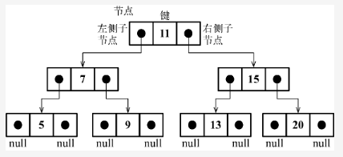

#### 树的定义
```
二叉树中的节点最多只能有两个子节点：一个是左侧子节点，另一个是右侧子节点。

这个定义有助于我们写出更高效地在树中插入、查找和删除节点的算法。二叉树在计算机科学中的应用非常广泛。
```

#### 二叉搜索树
```
二叉搜索树（BST）是二叉树的一种，但是只允许你在左侧节点存储（比父节点）小的值，在右侧节点存储（比父节点）大的值。
```
二叉搜索树数据结构的组织方式。


```
和链表一样，我们将通过指针（引用）来表示节点之间的关系（树相关的术语称其为边）。

在双向链表中，每个节点包含两个指针，一个指向下一个节点，另一个指向上一个节点。

对于树，使用同样的方式（也使用两个指针），但是一个指向左侧子节点，另一个指向右侧子节点。
因此，将声明一个Node类来表示树中的每个节点。

值得注意的一个小细节是，不同于在之前的章节中将节点本身称作节点或项，我们将会称其为键（行{1}）。键是树相关的术语中对节点的称呼。
```

#### 如03例子
```
insert(key)：向树中插入一个新的键。
search(key)：在树中查找一个键。如果节点存在，则返回true；如果不存在，则返回false。
inOrderTraverse()：通过中序遍历方式遍历所有节点。
preOrderTraverse()：通过先序遍历方式遍历所有节点。
postOrderTraverse()：通过后序遍历方式遍历所有节点。
min()：返回树中最小的值/键。
max()：返回树中最大的值/键。
remove(key)：从树中移除某个键
```

#### 要向树中插入一个新的节点（或键），要经历三个步骤
```
第一步是验证插入操作是否是特殊情况。对于二叉搜索树的特殊情况是，我们尝试插入的树节点是否为第一个节点（行{1}）。
如果是，我们要做的就是创建一个Node类的实例并将它赋值给root属性来将root指向这个新节点（行{2}）。
因为在Node构建函数的属性里，只需要向构造函数传递我们想用来插入树的节点值（key），它的左指针和右指针的值会由构造函数自动设置为null。

第二步是将节点添加到根节点以外的其他位置。在这种情况下，我们需要一个辅助方法（行{3}）来帮助我们做这件事，它的声明如下。
```

```javascript
insert(key) {
    // special case: first key
    if (this.root == null) { // 1
        this.root = new Node(key); //2
    } else {
        this.insertNode(this.root, key); //3
    }
}

// insertNode方法会帮助我们找到新节点应该插入的正确位置。
/*
如果树非空，需要找到插入新节点的位置。因此，在调用insertNode方法时要通过参数传入树的根节点和要插入的节点。

如果新节点的键小于当前节点的键（现在，当前节点就是根节点）（行{4}），那么需要检查当前节点的左侧子节点。
注意在这里，由于键可能是复杂的对象而不是数，我们使用传入二叉搜索树构造函数的compareFn函数来比较值。
如果它没有左侧子节点（行{5}），就在那里插入新的节点（行{6}）。如果有左侧子节点，需要通过递归调用
insertNode方法（行{7}）继续找到树的下一层。
在这里，下次要比较的节点将会是当前节点的左侧子节点（左侧节点子树）。

如果节点的键比当前节点的键大，同时当前节点没有右侧子节点（行{8}），就在那里插入新的节点（行{9}）。
如果有右侧子节点，同样需要递归调用insertNode方法，但是要用来和新节点比较的节点将会是右侧子节点（右侧节点子树）（行{10}）。
* */
insertNode(node, key) {
    if (this.compareFn(key, node.key) === Compare.LESS_THAN) { //4
      if (node.left == null) {  //5
        node.left = new Node(key); //6
      } else {
        this.insertNode(node.left, key); // 7
      }
    } else if (node.right == null) { //8
      node.right = new Node(key); // 9
    } else {
      this.insertNode(node.right, key); // 10
    }
}
```

#### 树的遍历
```
访问树的所有节点有三种方式：中序、先序和后序。
```