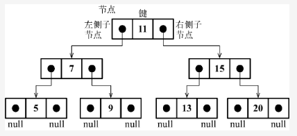

# 二叉树的种类

## 二叉树的定义
其中每个节点最多有两个子节点，称为左子节点和右子节点。如果某个节点没有子节点，则它被称为叶节点或叶子。树的最上层节点被称为根节点。

在二叉树中，左子树和右子树也是二叉树，它们由根节点的左右子节点形成。

这个定义有助于我们写出更高效地在树中插入、查找和删除节点的算法。二叉树在计算机科学中的应用非常广泛。
```
二叉树可以用来表示具有层级关系的数据，比如家族关系、文件目录结构等。
```

二叉树的遍历方式包括前序遍历、中序遍历和后序遍历。

## 1.二叉搜索树
BST 树，全称为二叉搜索树（Binary Search Tree），是一种基于二分查找的二叉树结构，它的每个节点都包含一个关键字，且所有节点的关键字都满足以下条件：

1. 左子树上所有节点的关键字均小于该节点的关键字；
2. 右子树上所有节点的关键字均大于该节点的关键字。

BST 树的主要特点是支持快速的查找、插入和删除操作，时间复杂度均为 O(log n)，其中 n 是树中节点的数量。具体地，对于查找操作，从根节点开始，不断与目标关键字比较，根据比较结果选择左子树或右子树继续查找，直到找到目标节点或遇到空节点为止。对于插入和删除操作，首先需要按照查找的方式找到待插入或待删除节点，然后根据具体情况进行节点的插入或删除操作，最后通过调整树的结构保持树的平衡性。

BST 树的缺点是，如果节点的插入顺序不合理，可能会导致树的不平衡，从而影响树的性能。例如，如果将节点按照递增或递减的顺序插入，则 BST 树会退化成一条链表，使得查找操作的时间复杂度退化为 O(n)，其中 n 是树中节点的数量。因此，在实际应用中，需要采取一些措施来保证 BST 树的平衡性，比如使用 AVL 树、红黑树等自平衡二叉树。

## 2.自平衡树
自平衡树（Self-Balancing Tree）是一类具有自动平衡性质的二叉查找树（Binary Search Tree），它能够在每次插入或删除节点时自动调整树的结构，使得整棵树始终保持平衡状态，从而保证了树中操作的最坏时间复杂度不超过 O(log n)，其中 n 为树中节点的数量。

常见的自平衡树包括
* AVL 树
* 红黑树
* 替罪羊树
* Treap 树等。这些树的自平衡策略不同，但它们都具有一定的自动平衡性质，能够保持树的平衡状态。

自平衡树的应用十分广泛，它们可以用于实现高效的数据结构，比如关联数组、集合、有序集合等。在实际应用中，自平衡树往往比普通的二叉查找树效率更高，因为它们能够保持树的平衡状态，从而减少了树的高度，使得查找、插入、删除等操作的复杂度更低。

## 3.红黑树
红黑树（Red-Black Tree）是一种自平衡的二叉查找树（Binary Search Tree），它的每个节点上都带有颜色属性，可以是红色或黑色。
红黑树满足以下规则：
1. 每个节点是红色或黑色。
2. 根节点是黑色。
3. 每个叶节点（NIL节点，空节点）是黑色的。
4. 如果一个节点是红色的，则它的子节点必须是黑色的。
5. 从任意节点到其每个叶子节点的所有路径都包含相同数目的黑色节点。

这些规则保证了红黑树的平衡性质，使得它的最坏情况下的时间复杂度为 O(log n)，其中 n 为树中节点的数量。因此，红黑树被广泛应用于需要高效插入、删除和查找操作的数据结构领域，比如在 C++ STL 中的 map 和 set 容器就是基于红黑树实现的。

## 4.AVL 树
AVL 树是一种自平衡二叉查找树，它能够在每次插入或删除节点时自动调整树的结构，使得整棵树始终保持平衡状态。AVL 树的平衡性是通过树中每个节点的平衡因子来维护的，平衡因子是该节点的左子树高度减去右子树高度的差值，因此平衡因子的取值范围为 -1、0、1。

AVL 树的平衡维护策略是：对于任意节点，其左右子树的高度差不超过1，如果不平衡，则通过旋转操作使之恢复平衡状态。AVL 树的旋转操作包括左旋和右旋，左旋是将某个节点的右子树提升为新的父节点，而右旋是将某个节点的左子树提升为新的父节点。

AVL 树的优点是：查询、插入、删除等操作的时间复杂度都是 O(log n)，其中 n 是树中节点的数量。缺点是，由于 AVL 树需要维护平衡状态，所以插入和删除节点时需要进行频繁的旋转操作，导致插入和删除操作的效率较低。

## 实例：二叉搜索树
二叉搜索树（BST）是二叉树的一种，但是只允许你在左侧节点存储（比父节点）小的值，在右侧节点存储（比父节点）大的值。

二叉搜索树数据结构的组织方式。


```
和链表一样，我们将通过指针（引用）来表示节点之间的关系（树相关的术语称其为边）。

在双向链表中，每个节点包含两个指针，一个指向下一个节点，另一个指向上一个节点。

对于树，使用同样的方式（也使用两个指针），但是一个指向左侧子节点，另一个指向右侧子节点。
因此，将声明一个Node类来表示树中的每个节点。

值得注意的一个小细节是，不同于在之前的章节中将节点本身称作节点或项，我们将会称其为键（行{1}）。键是树相关的术语中对节点的称呼。
```

## 如03例子
```
insert(key)：向树中插入一个新的键。
search(key)：在树中查找一个键。如果节点存在，则返回true；如果不存在，则返回false。
inOrderTraverse()：通过中序遍历方式遍历所有节点。
preOrderTraverse()：通过先序遍历方式遍历所有节点。
postOrderTraverse()：通过后序遍历方式遍历所有节点。
min()：返回树中最小的值/键。
max()：返回树中最大的值/键。
remove(key)：从树中移除某个键
```

## 要向树中插入一个新的节点（或键），要经历三个步骤
第一步是验证插入操作是否是特殊情况。对于二叉搜索树的特殊情况是，我们尝试插入的树节点是否为第一个节点（行{1}）。
如果是，我们要做的就是创建一个Node类的实例并将它赋值给root属性来将root指向这个新节点（行{2}）。
因为在Node构建函数的属性里，只需要向构造函数传递我们想用来插入树的节点值（key），它的左指针和右指针的值会由构造函数自动设置为null。

第二步是将节点添加到根节点以外的其他位置。在这种情况下，我们需要一个辅助方法（行{3}）来帮助我们做这件事，它的声明如下。

```javascript
insert(key) {
    // special case: first key
    if (this.root == null) { // 1
        this.root = new Node(key); //2
    } else {
        this.insertNode(this.root, key); //3
    }
}

// insertNode方法会帮助我们找到新节点应该插入的正确位置。
/*
如果树非空，需要找到插入新节点的位置。因此，在调用insertNode方法时要通过参数传入树的根节点和要插入的节点。

如果新节点的键小于当前节点的键（现在，当前节点就是根节点）（行{4}），那么需要检查当前节点的左侧子节点。
注意在这里，由于键可能是复杂的对象而不是数，我们使用传入二叉搜索树构造函数的compareFn函数来比较值。
如果它没有左侧子节点（行{5}），就在那里插入新的节点（行{6}）。如果有左侧子节点，需要通过递归调用
insertNode方法（行{7}）继续找到树的下一层。
在这里，下次要比较的节点将会是当前节点的左侧子节点（左侧节点子树）。

如果节点的键比当前节点的键大，同时当前节点没有右侧子节点（行{8}），就在那里插入新的节点（行{9}）。
如果有右侧子节点，同样需要递归调用insertNode方法，但是要用来和新节点比较的节点将会是右侧子节点（右侧节点子树）（行{10}）。
* */
insertNode(node, key) {
    if (this.compareFn(key, node.key) === Compare.LESS_THAN) { //4
      if (node.left == null) {  //5
        node.left = new Node(key); //6
      } else {
        this.insertNode(node.left, key); // 7
      }
    } else if (node.right == null) { //8
      node.right = new Node(key); // 9
    } else {
      this.insertNode(node.right, key); // 10
    }
}
```

## 树的遍历
访问树的所有节点有三种方式：中序、先序和后序。
