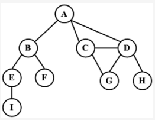
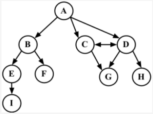
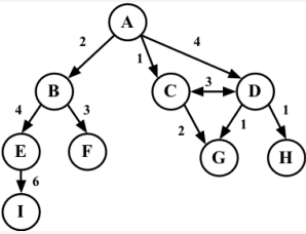
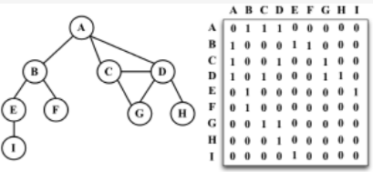
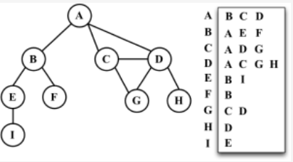

#### 1.非线性数据结构——图。
我们可以使用图来解决计算机科学世界中的很多问题，比如搜索图中的一个特定顶点或搜索一条特定边，
寻找图中的一条路径（从一个顶点到另一个顶点），寻找两个顶点之间的最短路径，以及环检测。


```
图是一组由边连接的节点（或顶点）。

由一条边连接在一起的顶点称为相邻顶点。

一个顶点的度是其相邻顶点的数量。比如，A和其他三个顶点相连接，因此A的度为3；E和其他两个顶点相连，因此E的度为2。

路径
路径是顶点的一个连续序列。

简单路径
简单路径要求不包含重复的顶点。举个例子，A D G是一条简单路径。除去最后一个顶点（因为它和第一个顶点是同一个顶点），环也是一个简单路径，比如A D C A（最后一个顶点重新回到A）。

无环，连通
如果图中不存在环，则称该图是无环的。
如果图中每两个顶点间都存在路径，则该图是连通的。
```

#### 2.有向图，无向图
```
图可以是无向的（边没有方向）或是有向的（有向图）。
如下图所示，有向图的边有一个方向。
```


强连通
```
如果图中每两个顶点间在双向上都存在路径，则该图是强连通的。例如，C和D是强连通的，而A和B不是强连通的。
```

加权
```
还可以是未加权的或是加权的。如下图所示，加权图的边被赋予了权值。
```



#### 3.图的表示
#### 3-1.邻接矩阵
```
图最常见的实现是邻接矩阵。每个节点都和一个整数相关联，该整数将作为数组的索引。我们用一个二维数组来表示顶点之间的连接。
如果索引为i的节点和索引为j的节点相邻，则array[i][j] === 1，否则array[i][j] === 0，如下图所示
```

不是强连通的图（稀疏图）如果用邻接矩阵来表示，则矩阵中将会有很多0，这意味着我们浪费了计算机存储空间来表示根本不存在的边。
例如，找给定顶点的相邻顶点，即使该顶点只有一个相邻顶点，我们也不得不迭代一整行。

邻接矩阵表示法不够好的另一个理由是， 图中顶点的数量可能会改变，而二维数组不太灵活。

#### 3-2.邻接表的动态数据结构来表示图
```
邻接表由图中每个顶点的相邻顶点列表所组成。存在好几种方式来表示这种数据结构。
我们可以用列表（数组）、链表，甚至是散列表或是字典来表示相邻顶点列表。本书采用这种方式。
```



#### 3-3.邻接矩阵
在关联矩阵中，矩阵的行表示顶点，列表示边。