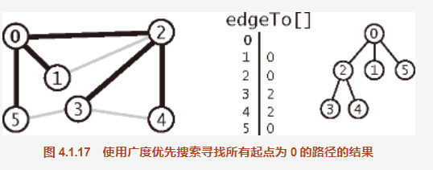

#### 1.定义
```
单点最短路径。给定一幅图和一个起点 s，回答“从 s 到给定目的顶点 v 是否存在一条路径？如果有，找出其中最短的那条（所含边数最少）。”等类似问题。

解决这个问题的经典方法叫做广度优先搜索（BFS)。它也是许多图算法的基石

深度优先搜索得到的路径不仅取决于图的结构，还取决于图的表示和递归调用的性质。
```

```
要找到从 s 到 v 的最短路径，从 s 开始，在所有由一条边就可以到达的顶点中寻找 v，
如果找不到我们就继续在与 s 距离两条边的所有顶点中查找 v，如此一直进行。

深度优先搜索就好像是一个人在走迷宫，广度优先搜索则好像是一组人在一起朝各个方向走这座迷宫，每个人都有自己的绳子。
当出现新的叉路时，可以假设一个探索者可以分裂为更多的人来搜索它们，当两个探索者相遇时，会合二为一（并继续使用先到达者的绳子）

在程序中，在搜索一幅图时遇到有多条边需要遍历的情况时，我们会选择其中一条并将其他通道留到以后再继续搜索。
在深度优先搜索中，我们用了一个可以下压的栈（这是由系统管理的，以支持递归搜索方法）。使用 LIFO（后进先出）的规则来描述压栈和走迷宫时先探索相邻的通道类似。

从有待搜索的通道中选择最晚遇到过的那条。在广度优先搜索中，我们希望按照与起点的距离的顺序来遍历所有顶点，看起来这种顺序很容易实现：
使用（FIFO，先进先出）队列来代替栈（LIFO，后进先出）即可。我们将从有待搜索的通道中选择最早遇到的那条。
```

#### 实现
```
使用了一个队列来保存所有已经被标记过但其邻接表还未被检查过的顶点。先将起点加入队列，然后重复以下步骤直到队列为空：
1.取队列中的下一个顶点 v 并标记它；
2.将与 v 相邻的所有未被标记过的顶点加入队列。
```

```
算法 4.2 中的 bfs() 方法不是递归的。不像递归中隐式使用的栈，它显式地使用了一个队列。
和深度优先搜索一样，它的结果也是一个数组 edgeTo[]，也是一棵用父链接表示的根结点为 s 的树。

它表示了 s 到每个与 s 连通的顶点的最短路径。用例也可以使用算法 4.1 中为深度优先搜索实现的相同的 pathTo() 方法得到这些路径。
用例也可以使用算法 4.1 中为深度优先搜索实现的相同的 pathTo() 方法得到这些路径。

图 4.1.17 和图 4.1.18 显示了用广度优先搜索处理样图时，算法使用的数据结构在每次循环的迭代开始时的内容。
首先，顶点 0 被加入队列，然后循环开始搜索。
```

