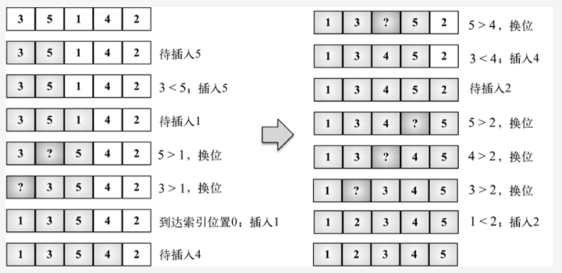

### 插入排序
```
插入排序每次排一个数组项，以此方式构建最后的排序数组。假定第一项已经排序了。接着，它和第二项进行比较—— 第二项是应该待在原位还是插到第一项
之前呢？这样，头两项就已正确排序，接着和第三项比较（它是该插入到第一、第二还是第三的位置呢），以此类推。

在完全有序的情况下，插入排序每个未排序区间元素只需要比较1次，所以时间复杂度是O(n)。而在极端情况完全逆序，时间复杂度为O(n^2).就等于每次
都把未排序元素插入到数组第一位。在数组中插入1个元素的时间复杂度为O(n),那插入n个就是o(n^2)了。

插入排序与冒泡排序对比
插入排序的移动操作比冒泡排序简单很多，插入排序需要一个赋值操作，冒泡要三个，因为插入排序不但移动操作简单，
而且优化空间还很大。
```

### 代码解读
```
迭代数组来给第i项找到正确的位置（行{2}）。注意，算法是从第二个位置（索引1）而不是0位置开始的（我们认为第一项已排序了）变量（行{3}）并也
将其值存储在一个临时变量中（行{4}），便于之后将其插入到正确的位置上。下一步是要找到正确的位置来插入项目。只要变量j比0大（因为数组的第一个
索引是0——没有负值的索引）并且数组中前面的值比待比较的值大（行{5}），我们就把这个值移到当前位置上（行{6}）并减小j。
最终，能将该值插入到正确的位置上。
```
[3, 5, 1, 4, 2] --->实例

```
(1) 3已被排序，所以我们从数组第二个值5开始。3比5小，所以5待在原位（数组的第二位）。3和5排序完毕。

(2) 下一个待排序和插到正确位置上的值是1（目前在数组的第三位）。5比1大，所以5被移至第三位去了。我们得分析1是否应该被插入到第二位——1比3大吗？
 不，所以3被移到第二位去了。接着，我们得证明1应该插入到数组的第一位上。因为0是第一个位置且没有负数位，所以1必须被插入第一位。1、3、5三个数字已经排序。

(3) 然后看下一个值：4。4应该在当前位置（索引3）还是要移动到索引较低的位置上呢？4比5小，所以5移动到索引3位置上去。那么应该把4插到索引2的位置上去吗？
4比3大，所以把4插入数组的位置3上。

(4) 下一个待插入的数字是2（数组的位置4）。5比2大，所以5移动至索引4。4比2大，所以4也得移动（位置3）。3也比2大，所以3还得移动。1比2小，所以2插入
到数组的第二位置上。至此，数组已排序完成。
```