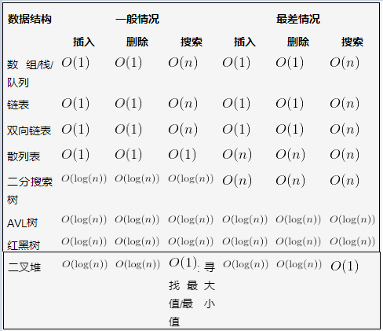
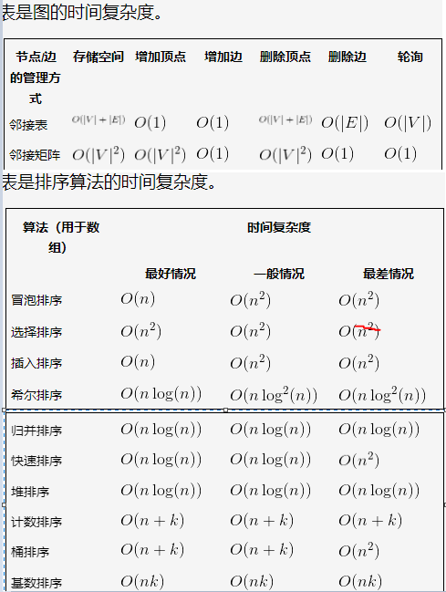
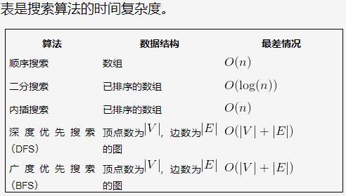

```
符号              名称

O(1)             常数
O(log(n))        对数的
O((log(n))c)    对数多项式
O(n)            线性的
O(n^2)          二次的
O(n^c)          多项式的
O(c^n)          指数的

不同的时间复杂度

输入大小(n)   O(1)    O(log(n))    O(n)   O(nlog(n))   O(n^2)  O(2^n)
10            1        1          10        10          100     1024
20            1        1.30       20        26.02       400     1048576
50            1        1.69       50        84.94       2500    非常大
100           1        2          100       200         10000   非常大
500           1        2.69       500       1349.48     25000
1000          1        3          1000      3000        1000 000
10000         1        4          10000     40000       1000 000 000
```

### 常用数据结构的时间复杂度



