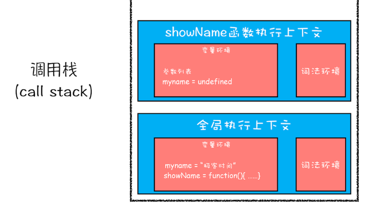
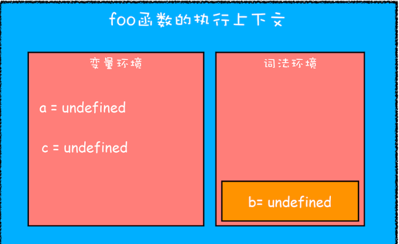

## 作用域
作用域在函数声明时就已经确定了，位置决定了变量的生命周期。通俗地理解，作用域就是变量与函数的可访问范围，即作用域控制着变量和函数的可见性和生命周期

JavaScript一共支持三种类型的作用域，它们分别是：
- 全局作用域
- 函数作用域
- 块级作用域

### 1.全局作用域
```
全局作用域中的对象在代码中的任何地方都能访问，其生命周期伴随着页面的生命周期。
```

### 2.函数作用域(局部变量)
```
函数作用域就是在函数内部定义的变量或者函数，并且定义的变量或者函数只能在函数内部被访问。函数执行结束之后，函数内部定义的变量会被销毁。
```

每个函数都有自己的执行环境，当执行流进入一个函数的时候，函数的环境会被推入一个函数栈中，而在函数执行完毕后执行环境出栈并被销毁，保存在其中的所有变量和函数定义随之销毁，控制权返回到之前的执行环境中，全局的执行环境在应用程序退出（浏览器关闭）才会被销毁。

嵌套函数作用域：在外层函数中，嵌套一个内层函数，那么这个内层函数可以向上访问到外层函数中的变量。
```javaScript
function outerFn() {
    var thing = '吃早餐';
    function innerFn() {
        console.log('函数作用域:', thing);
    }
    innerFn();
}
outerFn();  // 吃早餐
```

### 3.块作用域,es6之前 没有块级作用域,造成的问题1:变量提升
```
块级作用域就是使用一对大括号包裹的一段代码，比如函数、判断语句、循环语句，甚至单独的一个{}都可以被看作是一个块级作用域。
```



## 概念：执行上下文
函数作用域是在函数声明的时候就已经确定了，而函数执行上下文是在函数调用时创建的。

执行上下文是js引擎:
从解释到运行中间预编译时对执行做的准备工作，创建了当前区域的执行环境，这个执行环境就是执行上下文。

## 概念：什么是作用域链
在JS引擎中:
函数在执行的过程中，先从自己内部找变量如果找不到，再从创建当前函数所在的作用域(词法作用域)去找, 以此往上注意找的是变量的当前的状态。

## 概念：执行栈
调用栈用来装js代码中的各种执行上下文，是js引擎追踪函数执行的一个机制。
```javaScript
console.log(1);
function pFn() {
    console.log(2);
    (function cFn() {
        console.log(3);
    }());
    console.log(4);
}
pFn();
console.log(5);
//输出：1 2 3 4 5
```
先有全局环境下的执行上下文，调用pFn后将函数环境pFn的执行上下文压入栈中，由于pFn中执行了cFn函数，所以继续压入cFn函数的执行上下文，执行完毕后依次出栈。全局上下文只有应用程序退出前才会被销毁，比如关闭网页或者退出浏览器


```javaScript
// 例子1
var test = "test"
function showName(){
  console.log('1:',test);
  if(false){
   var test = "test"
  }
  console.log('2:',test);
}
showName()
/*
1: undefined
2: undefined
*/

// 例子2：
var test = "test"
function showName(){
  console.log('1:',test);
  if(true){
   var test = "test"
  }
  console.log('2:',test);
}
showName()
/*
1: undefined
2: test
*/

// 例子3
var test = "test"
function showName(){
  console.log('1:',test);
}
showName()
/*
1: test
*/
```
showName函数的执行上下文创建后，JavaScript引擎便开始执行showName函数内部的代码了。首先执行的是：
console.log('1:',test);

执行这段代码需要使用变量myname，结合上面的调用栈状态图，你可以看到这里有两个myname变量：一个在全局执行上下文中，其值是“test”；另外一个在showName函数的执行上下文中，其值是undefined。那么到底该使用哪个呢？

答案：“先使用函数执行上下文里面的变量,因为在函数执行过程中，JavaScript会优先从当前的执行上下文中查找变量，由于变量提升，当前的执行上下文中就包含了变量myname，而值是undefined。

### 扩展: 函数被调用发生了什么
当函数被调用，会创建一个执行环境及相应的作用域链。然后，使用arguments和其他命名参数的值来初始化函数的活动对象。

但在作用域链中，外部函数的活动对象始终处于第二位，外部函数的外部函数的活动对象处于第三位，.....直至作为作用域链终点的全局环境。

无论什么时候在函数中访问一个变量，就会从作用域链中搜索具有 对应名字的变量。一般当函数执行完毕局部活动对象就会被销毁，内存中仅保存全局作用域（全局执行环境的变量对象），但是闭包情况不同。

在函数内部定义的函数  会将  包含函数的活动对象 添加到 他的作用域链中。当匿名函数被返回后，它的作用域链被初始化为包含 fn()的活动对象和全局变量对象。这样匿名函数就可以访问在fn()中定义的所有变量。

更为重要的是，fn()执行完毕后，其活动对象也不会被销毁，因为匿名函数的作用域链让然在引用这个活动对象。换句话说，当fn()函数返回后，其执行环境的作用域链会被销毁，但它的活动对象仍然会留在内存中；直到匿名函数被销毁后，fn()的活动对象才会被销毁。


### 扩展: 函数作用域 和 闭包的产生
前面提到，函数执行完后，函数作用域的变量就会被垃圾回收。

而这段代码看出当返回了一个访问了外部函数变量的内部函数，最后外部函数的变量得以保存。

这种当变量存在的函数已经执行结束，但可以再次被访问到的方式就是“闭包”。
```javaScript
function outerFn2() {
    var thing = '吃早餐';
    function innerFn2() {
        console.log('1:函数作用域2：', thing);
        return thing
    }

    return innerFn2();
}

var foo = outerFn2();

console.log(outerFn2());  // 吃早餐
console.log(foo);  // 吃早餐
/*
1:函数作用域2： 吃早餐
1:函数作用域2： 吃早餐
吃早餐
吃早餐
*/
```

<br />

## JavaScript是如何支持块级作用域的
为了保持兼容性，我们也不得不对var声明变量这种方式保留支持,ES6是如何做到既要支持变量提升的特性，又要支持块级作用域的呢？


通过let或者const声明的变量会在进入块级作用域的时被创建，但是在该变量没有赋值之前，
引用该变量JavaScript引擎会抛出错误。这就是“暂时性死区”。

在块作用域内，let声明的变量被提升，但变量只是创建被提升，初始化并没有被提升，在初始化之前使用变量，就会形成一个暂时性死区。

```javaScript
var a = 10;
var b = 0;
function f1(){
    console.log('test1:',a); // undefined
    console.log('test2:',b); // 0
    var a = 20;     
    console.log(a); // 20
}
f1()

/*
全局作用域并且也赋值了，而在函数f1里面打印的还是undefined，这是因为函数形成的函数作用域，已经是一个封闭性的作用域，只要它里面存在此变量，将不会去访问外层作用域的相同变量了。
*/
```


```javaScript
function foo() {
	var a = 1;
	let b = 2;
	{
		let b = 3;
		var c = 4;
		let d = 5;
		console.log(a);
		console.log(b);
	}
	console.log(b);
	console.log(c);
	console.log(d);
}	
```


首先函数内部通过var声明的变量被存放到变量环境中，通过let声明的变量在预编译阶段被存放到词法环境中，当然在函数体内部块作用域中let声明的变量并没有被存放到词法环境中。


继续执行代码，当执行到代码块里面时，变量环境中的a的值已经被设置为1，词法环境中b的值已经被设置成了2，注意用let声明的变量b和d此时不是underfined而是uninitialized未初始化


最后当函数体内块作用域执行结束之后，其内部变量就会从词法环境的栈顶弹出


### 总结：
用let 声明出来的变量中都会在词法环境中存放，块级作用域是通过词法环境的栈结构来实现的，而变量提升是通过变量环境来实现的，两者结合就同时支持变量提升和块级作用域

以及变量的查找方式： 从词法环境的作用域栈顶开始向下查找，如果找到了就返回值，如果找不到，就继续去变量环境中查找
```javaScript
let test= '123'
{
  console.log(test) 
  let test= '345'
}
/*
在块级作用域中，从开始到test= '345' 代码之间会形成一个暂时性死区，如果中间去访问变量test，会报初始化之前不能访问myname的错误。
*/

// d在块级作用域中声明，在外面是访问不到的
function foo(){
var a = 1
let b = 2
{
let b = 3
var c = 4
let d = 5
console.log(a)
console.log(b)
}
console.log(b)
console.log(c)
console.log(d)
}
foo()
```


## 例子2：JavaScript是如何支持块级作用域的
需要在执行上下文的角度来揭开答案。
```
块级作用域就是通过词法环境的栈结构来实现的，而变量提升是通过变量环境来实现，通过这两者的结合，JavaScript引擎也就同时支持了变量提升和块级作用域了。
```

```javaScript
function foo(){
  var a = 1
  let b = 2
  {
    let b = 3
    var c = 4
    let d = 5
    console.log(a)
    console.log(b)
  }
  console.log(b) 
  console.log(c)
  console.log(d)
}
foo()
```
当执行上面这段代码的时候，JavaScript引擎会先对其进行编译并创建执行上下文，然后再按照顺序执行代码,例子中引入了let关键字，let关键字会创建块级作用域，那么let关键字是如何影响执行上下文的呢？

执行上下文示意图:

- 函数内部通过var声明的变量，在编译阶段全都被存放到变量环境里面了。
- 通过let声明的变量，在编译阶段会被存放到词法环境（Lexical Environment）中。
- 在函数的作用域内部，通过let声明的变量并没有被存放到词法环境中。
- 接下来，第二步继续执行代码，当执行到代码块里面时，变量环境中a的值已经被设置成了1，词法环境中b的值已经被设置成了2，这时候函数的执行上下文就如下图所示：

```
从图中可以看出，当进入函数的作用域块时，作用域块中通过let声明的变量，会被存放在词法环境的一个单独的区域中，这个区域中的变量并不影响作用域块外面的变量。

比如在作用域外面声明了变量b，在该作用域块内部也声明了变量b，当执行到作用域内部时，它们都是独立的存在。
```

其实，在词法环境内部，维护了一个小型栈结构，栈底是函数最外层的变量，进入一个作用域块后，就会把该作用域块内部的变量压到栈顶；当作用域执行完成之后，该作用域的信息就会从栈顶弹出，这就是词法环境的结构。需要注意下，我这里所讲的变量是指通过let或者const声明的变量。

再接下来，当执行到作用域块中的console.log(a)这行代码时，就需要在词法环境和变量环境中查找变量a的值了，具体查找方式是：
```
沿着词法环境的栈顶向下查询，如果在词法环境中的某个块中查找到了，就直接返回给JavaScript引擎，如果没有查找到，那么继续在变量环境中查找。
```