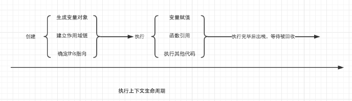
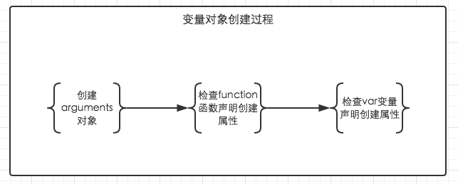
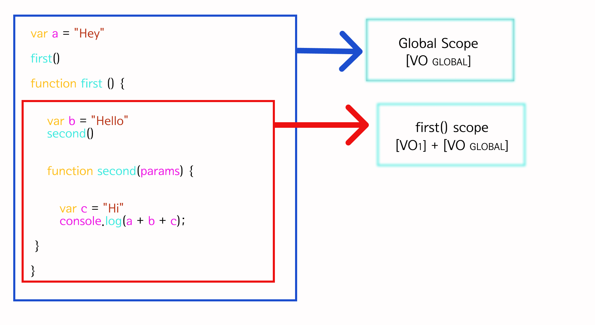
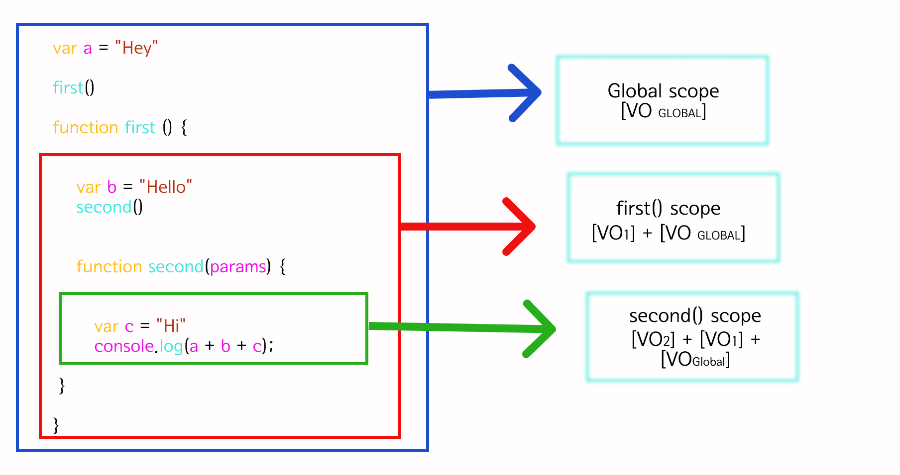
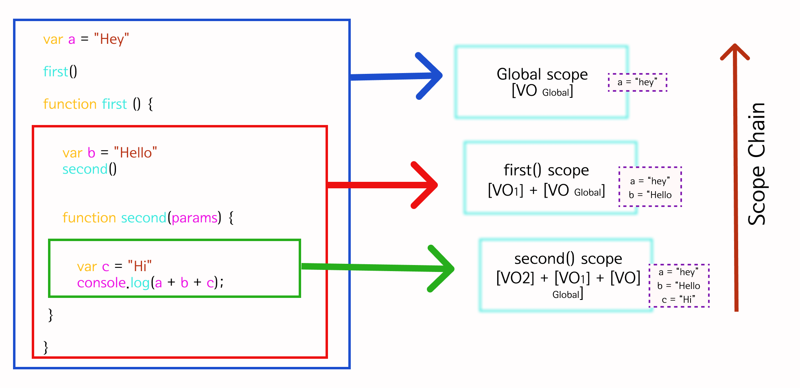

## A. JavaScript 的执行过程
理解 ESM 的模块导入,需要了解JavaScript 的执行过程。

JavaScript 执行过程分为两个阶段:
1. 编译阶段,在编译阶段 JS 引擎主要做了三件事：
    * 词法分析
    * 语法分析
    * 字节码生成

2. 执行阶段,在执行上下文运行期间，编译器解析代码，内存存储变量和函数，可执行的字节码生成后，代码执行。

## 执行上下文是如何被创建的？ 执行上下文（GEC或FEC）的创建分为两个阶段:
1. 创建阶段
2. 执行阶段

JS解析器是如何找到变量的呢？ 得对执行上下文有一个进一步的了解。
当调用一个函数时（激活），一个新的执行上下文就会被创建。而一个执行上下文的生命周期可以分为两个阶段。

1. 创建阶段
在这个阶段中，执行上下文会分别创建变量对象，建立作用域链，以及确定this的指向。

2. 代码执行阶段
创建完成之后，就会开始执行代码，这个时候，会完成变量赋值，函数引用，以及执行其他代码。

可以看出详细了解执行上下文极为重要，因为其中涉及到了变量对象，作用域链，this等很多人没有怎么弄明白，但是却极为重要的概念，它关系到我们能不能真正理解JavaScript。




**概念1.全局执行上下文 (GEC)**
每当 JavaScript 引擎接收到脚本文件时，它首先会创建一个默认的执行上下文，称为 全局执行上下文 (GEC)

GEC是基础/默认的执行上下文，所有 不在函数内部的JavaScript代码都在这里执行。每一个JavaScript文件只能有一个GEC。

**概念2.函数执行上下文（FEC）**
每当函数被调用时，JavaScript引擎就会在GEC内部创建另一种执行上下文，称为函数执行上下文（FEC），并在FEC中评估和执行函数中的代码。

因为每个函数调用都创建自己的FEC，所以在脚本运行期间会有多个FEC。

### 1. 创建阶段
在创建阶段，执行上下文首先与执行上下文对象（ECO）相关联。执行上下文对象存储了许多重要的数据，执行上下文中的代码在运行时会使用这些数据。

创建阶段分三个步骤来定义和设置执行上下文对象的属性：
1. 创建变量对象（VO）
2. 创建作用域链
3. 设置 this关键字的值

### 2. 创建阶段：创建变量对象（VO）
变量对象（VO）是一个在执行上下文中创建的类似于对象的容器，存储执行上下文中变量和函数声明。

在GEC中，`每当使用var关键字声明变量，VO就会添加一个指向该变量的属性，并将值设置为"undefined"。初始化相关变量为 undefined.`

同时，每当函数声明时，VO就会添加一个指向该函数的属性，并将这个属性存储在内存中。这就意味着在开始运行代码之前，所有函数声明就已经存储在VO中，并可以在VO中访问。

但在FEC中并不创建VO，而是生成一个类数组对象，称为arguments对象，包含传入函数的所有参数。

这种将变量和函数声明存储在内存中优先于执行代码的过程被称为提升。


变量对象的创建，依次经历了以下几个过程。
1. 建立arguments对象。检查当前上下文中的参数，建立该对象下的属性与属性值。

2. 检查当前上下文的函数声明，也就是使用function关键字声明的函数。在变量对象中以函数名建立一个属性，属性值为指向该函数所在内存地址的引用。如果函数名的属性已经存在，那么该属性将会被新的引用所覆盖。

3. 检查当前上下文中的变量声明，每找到一个变量声明，就在变量对象中以变量名建立一个属性，属性值为undefined。如果该变量名的属性已经存在，为了防止同名的函数被修改为undefined，则会直接跳过，原属性值不会被修改。
```javaScript
// var foo = 30;
function foo() { console.log('function foo') }
var foo = 20;

console.log(foo); // 20
// console.log(foo()); // 执行错误
/*
既然变量声明的foo遇到函数声明的foo会跳过，可是为什么最后foo的输出结果仍然是被覆盖了？
因为上面的三条规则仅仅适用于变量对象的创建过程。也就是执行上下文的创建过程。foo = 20是在执行上下文的执行过程中运行的，输出结果自然会是20。
*/
```

```javaScript
console.log(foo); // function foo
function foo() { console.log('function foo') }
var foo = 20;


// 执行顺序为
// 首先将所有函数声明放入变量对象中
function foo() { console.log('function foo') }

// 其次将所有变量声明放入变量对象中，但是因为foo已经存在同名函数，因此此时会跳过undefined的赋值
// var foo = undefined;

// 然后开始执行阶段代码的执行
console.log(foo); // function foo
foo = 20;
```

扩展
```javaScript
foo = 10
console.log(foo); // 10
function foo() { console.log('function foo') }
console.log(foo); // 10
var foo = 20;
console.log(foo); // 20
```




仔细对比这个例子中变量对象从创建阶段到执行阶段的变化，如果你已经理解了，说明变量对象相关的东西都已经难不倒你了。
```javaScript
function test() {
    console.log('test1:',foo);
    console.log('test2:',bar);

    var foo = 'world';
    console.log('test3:',foo);
    var bar = function () {
        return 'say';
    }

    function foo() {
        return 'hello';
    }
}

test();
/*
test1: ƒ foo() {
        return 'hello';
}
test2: undefined
test3: world
*/

// 创建阶段
VO = {
    arguments: {...},
    foo: <foo reference>,
    bar: undefined
}
// 这里有一个需要注意的地方，因为var声明的变量当遇到同名的属性时，会跳过而不会覆盖

// 执行阶段
VO -> AO
VO = {
    arguments: {...},
    foo: 'Hello',
    bar: <bar reference>,
    this: Window
}
```


### 3. 创建阶段：创建作用域链
创建完变量对象（VO），紧接着就是执行上下文的创建阶段的下一步——创建作用域链。

JavaScript中的作用域链是一个机制，决定了一段代码对于代码库中其他一些代码来说的可访问性。作用域回答这样一些问题：
一段代码可以在哪里访问？
哪里不能访问？
代码哪些部分可以被访问，哪些部分不能？

每一个函数执行上下文都会创建一个作用域：作用域相当于是一个空间/环境，变量和函数定义在这个空间里，并且可以通过一个叫做作用域查找的过程访问。

也就是说代码被写入代码库的位置，就是这段代码被读取的位置。

如果函数被定义在另一个函数内部，处在内部的函数可以访问自己内部的代码以及外部函数（父函数）的代码。`这种行为被称作词法作用域查找。`

但外部函数并不能访问内部函数的代码。

`作用域的概念就引出了JavaScript另一个相关的现象——闭包。`闭包指的是内部函数永远可以访问外部函数中的代码，即便外部函数已经执行完毕

### 来看几个例子加深理解：
* 右边是全局作用域，一旦.js文件加载就会创建这个默认作用域，整个代码中所有函数都可以访问。
* 红色方框里的是first函数的作用域，在这里定义了变量b='Hello!'和second函数


* 绿色方框里的是second函数的作用域，这里有一个console.log语句，用于打印a,b和c。


除了变量c，变量a和b并不是在second函数中定义的。但因为词法作用域查找，second函数可以访问父作用域中的变量。

在执行这段代码的时候，JS引擎在second函数作用域中找不到变量b，所以它会向上查找其父作用域，从first函数开始，在这里它找到变量b ='Hello!'，于是就回到second函数并解析变量b。

变量a的处理也是一样。JS引擎一直向上查找父作用域直至GEC作用域，并在second函数中解析a的值。

JavaScript引擎`一路向上遍历执行上下文直至解析处在函数内部触发的变量和函数的概念就叫作用域链。`



仅当JS引擎无法在作用域链中解析变量，才会停止并报错。

但反向查找并不奏效，也就是说全局作用域永远无法访问函数内部的变量，除非这些变量被函数返回。

作用域链就好像一个单向玻璃，你可以从内部看到外面，但是外面的人却看不见你。

这也就是为什么在图片中大红色的箭头是指向上方的，作用域链是单向度的。


### 4. 创建阶段：设置this关键字的值
作用域查找之后就是创建阶段的最后一步是设置this关键字的值。

JavaScript中this关键字指的是执行上下文所属的作用域。

一旦作用域链被创建，JS引擎就会初始化this关键字的值。

### 4-1.全局上下文中的"this"值
在GEC（所有函数和对象之外）中，this指向全局对象——window对象。

同时，由var关键字初始化的函数声明和变量会被作为全局对象（window对象）的方法或者属性。

### 4-2.函数中的"this"
在FEC中，并没有创建this对象，而是能够访问this被定义的环境。

1.下面的例子中，定义环境为window对象，因为函数被定义在GEC中：
```javaScript
var msg = "I will rule the world!"; 

function printMsg() { 
    console.log(this.msg); 
} 

printMsg(); // logs "I will rule the world!" to the console.
```

2.在对象中，this关键字并不指向GEC，而是指向对象本身。引用对象中的this如同引用：
```javaScript
var msg = "I will rule the world!"; 
const Victor = {
    msg: "Victor will rule the world!", 
    printMsg() { console.log(this.msg) }, 
}; 

Victor.printMsg(); // logs "Victor will rule the world!" to the console.
```

`this关键字的值设置后，执行上下文对象的所有属性就定义完成，创建阶段结束，JS引擎就进入到执行阶段。`

## 执行阶段
执行上下文创建阶段之后就是执行阶段了，在这一阶段代码执行真正开始。

到目前为止，VO包含的变量值为undefined，如果这时就运行代码，肯定会报错，我们无法执行未定义的变量。

在执行阶段，JavaScript引擎会再次读取执行上下文，并用变量的实际值更新VO。

编译器再把代码编译为计算机可执行的字节码后执行。


## JavaScript执行栈
执行栈又称调用栈，记录了脚本整个生命周期中生成的执行上下文。

JavaScript是单线程语言，也就是说它只能在同一时间执行一项任务。因此，其他的操作、函数和事件发生时，执行上下文也会被创建。`由于单线程的特性，一个堆叠了执行上下文的栈就会被创建，称为执行栈。`

当浏览器加载脚本，JS引擎从全局上下文也就是默认上下文开始执行代码，所以全局上下文被放在执行栈的最底部。

然后JS引擎再搜索代码中被调用的函数。每一次函数被调用，一个新的FEC就会被创建，并被放置在当前执行上下文的上方。

执行栈最顶部的执行上下文会成为活跃执行上下文，并且始终是JS引擎优先执行。

一旦活跃执行上下文中的代码被执行完毕，JS引擎就会从执行栈中弹出这个执行上下文，紧接着执行下一个执行上下文，以此类推。

为了了解执行栈的工作流，请考虑下面的代码：

首先，JS引擎加载脚本。

然后，JS引擎创建GEC，并把其放置在执行栈的最底部。
name变量在所有函数外部定义，所以位于GEC，并且被VO存储。
同样的步骤也发生在first、second和third函数。

别被GEC中的函数迷惑了。记住，GEC只适用于不在任何函数内部的JavaScript代码（变量和函数）。因为它们没有被定义在任何函数内部，而是定义在GEC中。是不是清晰很多😃?

当JS引擎遇到first函数调用时，一个新的FEC被创建。新的执行上下文被放置在当前上下文上方，形成执行栈。

```javaScript
var name = "Victor";

function first() {
  var a = "Hi!";
  second();
  console.log(`${a} ${name}`);
}

function second() {
  var b = "Hey!";
  third();
  console.log(`${b} ${name}`);
}

function third() {
  var c = "Hello!";
  console.log(`${c} ${name}`);
}

first();
```

```
在first函数调用时，其执行上下文变成活跃执行上下文，JavaScript首先执行。

在first函数中的变量a ='Hi!'被存储在其FEC中，而非GEC中。

接着，second函数在first函数中被调用。

由于JavaScript单线程的特性，first函数的执行会被暂停，直到second函数执行完闭，才会继续执行。

同样的，JS引擎会给second函数设置一个新的FEC，并把它放置在栈顶端，并激活。
```

second函数成为活跃执行上下文，变量b = 'Hey!'被存储在其FEC中，之后在second函数中的third函数被调用，其FEC被创建并放置在执行栈的顶部。


在third函数中的变量c = 'Hello!'被存储在其FEC中，Hello! Victor在控制台中打印。

因为函数执行了所有任务，并且返回, 其FEC就从栈顶端弹出，而调用third函数的second函数重新成为活跃执行上下文。

回到second函数，控制台打印Hey! Victor。函数完成所有任务，返回，这个执行上下文从执行栈上弹出。

当first函数执行完毕，从执行栈上弹出后，控制流回到代码的GEC。

最终，所有代码执行完毕，JS引擎把GEC从执行栈上弹出。

## 全局执行上下文对比函数执行上下文
```
全局执行上下文	                            函数执行上下文

创建一个全局变量对象存储函数和变量声明。	并不创建全局变量对象。相反，创建arguments对象存储所有传入函数的参数。

创建 `this` 对象将全局作用域中所有变量和函数作为属性和方法存储。	不创建`this` 对象，但可以访问被定义的环境，通常情况下为 `window` 对象。

不可以访问函数上下文中的代码	通过作用域查找，可以访问上下文以及父上下文中的代码（变量和函数）。

设定全局变量和函数的存储空间	仅设定函数内部变量和函数的存储空间
```

### 总结
JavaScript执行上下文是正确理解其他基础概念的核心。

代码得以运行归功于Js引擎处理执行上下文（GEC和FEC）以及调用栈。

你已经更了解你编写的函数和代码是按照什么顺序运行的，以及JS引擎是如何处理这些代码的。
理解下面这些概念，会帮助你成为一个更好的开发者：

* 熟悉一门语言的输入和输出。
* 大致理解一门语言的内在/核心概念。
* 如何编写简洁、易维护和结构清晰的代码，降低bug的风险。

### A-1. JavaScript 的常见报错类型
SyntaxError 最为特殊，因为它是 编译阶段 抛出来的错误，如果发生语法错误，JS 代码一行都不会执行。而其他类型的异常都是 执行阶段 的错误，就算报错，也会执行异常之前的脚本。
1. RangeError
```javaScript
// 这类错误很常见，例如栈溢出就是 RangeError；
function a () {
  b()
}
function b () {
  a()
}
a()

// out: 
// RangeError: Maximum call stack size exceeded
```

2. ReferenceError 也很常见，打印一个不存在的值就是 ReferenceError：
3. SyntaxError很常见，当语法不符合 JS 规范时，就会报这种错误：
4. TypeError 当一个基础类型当作函数来用时，就会报这个错误：


## 3. 变量提升-函数提升
JavaScript代码之前首先对代码进行编译，编译过程中的一部分工作就是找到所有的声明，并用合适的作用域将他们关联起来，这也正是词法作用域的核心内容。
代码的执行时分两步走的，1.解析 2.一步一步执行:

1. 注意： const、let是ES6的新特性，可以声明块级作用域,并不会被提升
2. 预编译期间会将函数声明与变量声明提升至其对应作用域的最顶端。
3. 重点：函数声明的优先级高于变量申明的优先级，并且函数声明和函数定义的部分一起被提升。

优点
1. 提高性能，提前为变量分配空间
2. 提升容错率

```javaScript
console.log(a); //ƒ a()
console.log(cTest); //ƒ (){ return 3; }
console.log(cTest()) // 3. 说明了函数表达式何函数声明同样会提升
var a = 10;
function a(){
    return 10;
}
console.log(a); // 10;
var cTest =function(){
	return 3;
}
/*
变量名与函数名一致，但是并不会将函数a覆盖
相反的此时的变量a将会被忽略；因为在内存中其实存的仅仅是函数名（变量名）

因为变量a被忽略，所以这里不会打印出来undefined，而是会打印a函数;
*/
```

```javaScript
var a = 1;
function foo() {
    console.log('test 1:',a);
    a = 10;
    console.log('test 2:',a);
    return;
    function a() {};
}
foo();
console.log('test 3:',a);
/*
test 1: ƒ a() {}
test 2: 10
test 3: 1
*/
上面的代码块经过预编译后可以看做如下形式

var a = 1; // 定义一个全局变量 a
function foo() {
    // 首先提升函数声明function a () {}到函数作用域顶端， 然后function a () {}等同于 var a =  function() {};最终形式如下
    var a = function () {}; // 定义局部变量 a 并赋值。
    a = 10; // 修改局部变量 a 的值，并不会影响全局变量 a
    console.log(a); // 打印局部变量 a 的值：10
    return;
}
foo();
console.log(a); // 打印全局变量 a 的值：1
```

改变一下上面例子的函数，去掉下面定义的函数输出会不一样
```javaScript
var a = 1;
function foo() {
    console.log('test 1:',a);
    a = 10;
    console.log('test 2:',a);
}
foo();
console.log('test 3:',a);
/*
test 1: 1
test 2: 10
test 3: 10
*/
```

<br />

### 3-1.函数声明和表达式之间的差别是:函数提升只会提升函数声明，而不会提升函数表达式。---->重点
见：
code-record-manual\test-project\js-babel\src\01-三种函数测试.js

JavaScript 解释器中存在一种变量声明被提升的机制，也就是说函数声明会被提升到作用域的最前面，即使写代码的时候是写在最后面，也还是会被提升至最前面。
而用函数表达式创建的函数是在运行时进行赋值，且要等到表达式赋值完成后才能调用

- 1).以函数声明的方法定义的函数,函数名是必须的,而函数表达式的函数名是可选的。
（函数声明整体会被提升到当前作用域的顶部，函数表达式也提升到顶部但是只有其变量名提升）

- 2).以函数声明的方法定义的函数,函数可以在函数声明之前调用,而函数表达式的函数只能在声明之后调用。

```javaScript
console.log('1:',foo1); // [Function: foo1]
foo1(); // foo1

console.log('2:',foo2); // undefined
foo2(); // 报错：TypeError: foo2 is not a function

function foo1 () {
    console.log('3: foo1');
};

var foo2 = function () {
    console.log('4: foo2');
};
```

### 1-2.函数提升题目
```javaScript
var a = 100;  
function test(){  
  console.log("a",a);  
  a = 10;
  console.log("b",a);  
}  
test();
console.log("c",a);
/*
100， 10， 10
*/
```


2021.07.16面试
```js
var a=10;
(function (){
    console.log("1:",a)
    a = 5;
    console.log("2:",window.a)
    var a = 20;
    console.log("3:",a)
})()
/*
自己的答案：
undefined
5
20
*/
/*
实际答案：
1: undefined
2: 10
3: 20
*/
```

题目：结合this
```js
var User = {
 count: 1,
 getCount: function() {
  return this.count;
 }
};
console.log(User.getCount()); 
var func = User.getCount;
console.log(func());
/*
1
undefined
*/
func是在window的上下文中被执行的，所以不会访问到count属性。
```

### 3-2.三种函数
```javaScript
function add3(){} // 1.这种写法叫做函数声明

// 2-1.单独运行一个匿名函数，不符合语法要求，需要包裹
function (){ }  // 2.这种是匿名函数
(function (){
    // 由于没有执行该匿名函数，所以不会执行匿名函数体内的语句。
    console.log("匿名函数");
})
// 2-2.如果需要执行匿名函数
(function (){
    console.log("匿名函数");
})()

var add2 = function(){} // 3.这种写法叫做函数表达式
const add = (a, b) => a + b // 箭头（同样也是表达式）
```

### 3-3.匿名函数的作用
1. 若要创建一个闭包，往往都需要用到匿名函数。
2. 模拟块级作用域，减少全局变量。执行完匿名函数，存储在内存中相对应的变量会被销毁，从而节省内存。
```javaScript
function fn(){
    (function(){
        var test = '匿名函数'
    })();
    console.log(test); // 报错
}

fn();
```

场景1：函数表达式
```javaScript
var fn = function(){
    return "匿名函数"
}
// 调用方式与调用普通函数一样
console.log(fn());
```

场景2：回调函数
```javaScript
setInterval(function(){
    console.log("匿名函数");
},1000);
```

场景3：将匿名函数作为返回值
```javaScript
function fn(){
    var test = '匿名函数'
    return function(){
        return test;
    }
}

//调用匿名函数
console.log(fn()());
//或
var box = fn();
console.log(box());
```