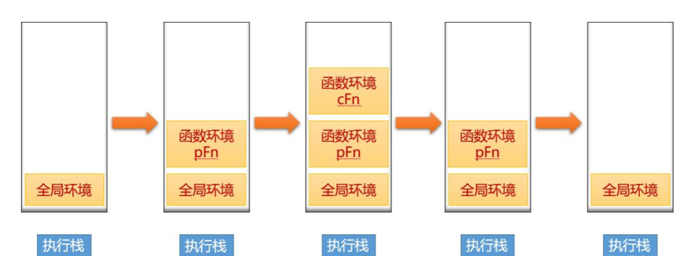

# 总结和基础
`解析和编译过程的性能非常重要，因为 V8 只有等编译完成后才能运行代码,`V8执行js过程：
* 第一步:首先解析器会把源码解析为抽象语法树（Abstract Syntax Tree），这是用来表示源码的树形结构的对象，这个过程称为解析（Parsing），主要由 V8 的 Parser 模块实现。

* 第二步:解释器（Ignotion）再将 AST 翻译为字节码，一边解释一边执行。
```
在此过程中，解释器会记特定代码片段的运行次数，如果代码运行次数超过某个阈值，那么该段代码就被标记为热代码（hot code），并将运行信息反馈给优化编译器（TurboFan）。

优化编译器根据反馈信息，优化并编译字节码，最终生成优化后的机器码，这样当该段代码再次执行时，解释器就直接使用优化机器码执行，不用再次解释，大大提高了代码运行效率。
```

### 流程图


## window 系统里怎么使用 jsvu 工具快速调试 v8？
https://blog.csdn.net/kaimo313/article/details/125094742?spm=1001.2014.3001.5501

## 字节码
* 字节码是平台无关的，机器码针对不同的平台都是不一样的
```
我觉的主要还是：对 v8 的代码进行重构，降低 v8 的代码复杂,毕竟字节码实现软件环境、与硬件环境无关，更好地进行v8的开发
```
* 字节码占用空间小，二进制机器码占用空间大。使用字节码所以能增强首次启动速度
* 源码转换为字节码时间消耗较短，生成二进制码时间消耗较长。

解释执行：V8在执行JavaScript源码时，会先通过解析器Parser将源码解析成AST，解释器Ignition会将AST转化为字节码，编译TuiboFan一边解释一遍执行。

### Turbofan优化字节码解释慢
字节码缺点执行很慢，效率低。

在运行时编译代码的技术也被称为 JIT（即时编译），通过 JIT 可以极大提升 JavaScript 代码的执行性能。

即时编译：Ignition同时会记录某一代码片段的执行次数，如果执行次数超过了某个阈值，这段代码便会被标记为热点代码(HotSpot)，同时将运行信息反馈给优化编译器TurboFan，会将这部分热点代码的字节码优化并编译，生成机器码更高效地运行。

为了提高运行效率，v8提供了Object shapes和反馈向量槽功能，缓存函数中的对象类型。然后假设在对象类型不变的情况下将字节码编译成机器码加速执行。

## 基础
### 高级语言分为:
* 编译型语言：需要编译器进行一次编译，被编译过的文件可以多次执行。如 C++、C 语言。
* 解释型语言：不需要事先编译，通过解释器一边解释一边编译器编译执行。启动快，但执行慢。
JavaScript 没有像 C++那样可以事先提供足够的信息供编译器编译出更加低级的机器代码，它只能在运行阶段收集类型信息，然后根据这些信息进行编译再执行，所以 JavaScript 也是解释型语言。

从语言的角度分析JavaScript是动态语言，Java是静态语言。
对于静态语言，在编译时就已经知道数据类型而且在运行时类型不可变，就可以分配连续的内存空间给对象。而JavaScript运行过程中类型可变。 

JavaScript 要想被计算机执行，需要一个能够快速解析并且执行 JavaScript 脚本的引擎。

### 1.CPU 执行机器指令的流程?

### 2.编程语言是如何运行的? 解释器和编译器区别
处理器不能直接理解我们通过高级语言（如C++、Go、JavaScript等）编写的代码，只能理解机器码，所以在执行程序之前，需要经过一系列的步骤，将我们编写的代码翻译成机器语言。这个过程一般是由编译器（Compiler） 或者解释器（Interpreter） 来完成。

* 解释器:它将每个高级程序语句转换成机器代码。
* 编译器:把高级语言编写的程序转换成机器码，将人可读的代码转换成计算机可读的代码（0和1）。

机器语言:
一个机器语言程序是由一系列二进制模式组成的(例 110110) 它表示应该由计算机执行的简单操作。机器语言程序是可执行的，所以它们可以直接运行

区别：
两者都是将高级语言转换成机器码，
* 解释器在程序运行时将代码转换成机器码,编译的时候会把编译器会把文件都处理，生成一个目标文件
* 编译器在程序运行之前将代码转换成机器码,解析边处理源文件边执行

二者区别：


# Parser语法分析器-->AST


在Chrome中开始下载Javascript文件后，Parser就会开始并行在单独的线程上解析代码。解析可以在下载完成后仅几毫秒内完成，并生成AST。

AST是把代码结构化成树状结构表示，这样做是为了更好的让编译器或者解释器理解。AST,比如Babel、ESLint，那么AST的生成过程是怎么样的呢？

## 步骤1.
执行 JavaScript 代码之前，V8 就准备好了代码的运行时环境。 这个环境包括了:
* 栈空间和堆空间
* 全局执行上下文
* 全局作用域
* 消息队列与事件循环系统
* 以及全局函数，WebAPI 等内置资源

### 1.空间
栈空间
栈空间主要是用来管理 JavaScript 函数调用的，栈是内存中连续的一块空间，同时栈结构是“先进后出”的策略。在函数调用过程中，涉及到上下文相关的内容都会存放在栈上，比如原生类型、引用到的对象的地址、函数的执行状态、this 值等都会存在在栈上。当一个函数执行结束，那么该函数的执行上下文便会被销毁掉。

栈空间的最大的特点是空间连续，所以在栈中每个元素的地址都是固定的，因此栈空间的查找效率非常高，但是通常在内存中，很难分配到一块很大的连续空间，因此，V8 对栈空间的大小做了限制，如果函数调用层过深，那么 V8 就有可能抛出栈溢出的错误。

栈空间用来管理 JavaScript 调用。每一段 JavaScript 代码（一段脚本，或一个函数），V8 在编译阶段会生成执行这段代码的执行环境，也叫做执行上下文。JavaScript 使用栈来管理执行上下文。编译代码时入栈，执行完成后出栈。
栈空间的最大特点是内存连续，因此栈空间的操作效率非常高。但因为内存中很难分配到一大段连续的空间，因此栈空间通常很小。

堆空间
如果有一些内存占用比较大的数据，或者不需要存储在连续空间中的数据，栈空间就不适合使用。于是 V8 使用了堆空间。
堆空间是一种树形的存储结构，用来存储对象类型的离散的数据。JavaScript 除了原生类型以外，其他的对象类型，诸如函数，数组，浏览器的 window 对象，document 对象等，都是存储在堆空间。

### 2.全局执行上下文与全局作用域
全局作用域和全局执行上下文的关系，其实你可以把作用域看成是一个抽象的概念。

V8 初始化了基础的存储空间之后，接下来就需要初始化全局执行上下文和全局作用域了，这两个内容是 V8 执行后续流程的基础。

全局作用域一直保存在内存中不会被销毁的，直到程序退出。而函数作用域是在执行该函数时创建的，当函数执行结束之后，函数作用域就随之被销毁掉了。

全局上下文中包含全局作用域和函数作用域，块级作用域。
JavaScript一共支持三种类型的作用域，它们分别是：
* 1.全局作用域,全局作用域中的对象在代码中的任何地方都能访问，其生命周期伴随着页面的生命周期。
```
每当 JavaScript 引擎接收到脚本文件时，它首先会创建一个默认的执行上下文，称为 全局执行上下文 (GEC)

GEC是基础/默认的执行上下文，所有 不在函数内部的JavaScript代码都在这里执行。每一个JavaScript文件只能有一个GEC。
```

* 2.函数作用域,函数内部定义的变量或者函数，并且定义的变量或者函数只能在函数内部被访问。函数执行结束之后，函数内部定义的变量会被销毁。
```
概念2.函数执行上下文（FEC)
每当函数被调用时，JavaScript引擎就会在GEC内部创建另一种执行上下文，称为函数执行上下文（FEC），并在FEC中评估和执行函数中的代码。

因为每个函数调用都创建自己的FEC，所以在脚本运行期间会有多个FEC。
```

* 3.块级作用域,使用一对大括号包裹的一段代码，比如函数、判断语句、循环语句，甚至单独的一个{}都可以被看作是一个块级作用域。


### 什么是作用域链
在JS引擎中: 函数在执行的过程中，先从自己内部找变量如果找不到，再从创建当前函数所在的作用域(词法作用域)去找, 以此往上注意找的是变量的当前的状态。

JavaScript中的作用域链是一个机制，决定了一段代码对于代码库中其他一些代码来说的可访问性。作用域回答这样一些问题：
一段代码可以在哪里访问？
哪里不能访问？
代码哪些部分可以被访问，哪些部分不能？

每一个函数执行上下文都会创建一个作用域：作用域相当于是一个空间/环境，变量和函数定义在这个空间里，并且可以通过一个叫做作用域查找的过程访问。

如果函数被定义在另一个函数内部，处在内部的函数可以访问自己内部的代码以及外部函数（父函数）的代码。`这种行为被称作词法作用域查找。`

但外部函数并不能访问内部函数的代码。

`作用域的概念就引出了JavaScript另一个相关的现象——闭包。`闭包指的是内部函数永远可以访问外部函数中的代码，即便外部函数已经执行完毕

## 函数调用栈/执行栈
函数调用栈(call stack)/执行栈,是一种拥有 LIFO（后进先出）数据结构的栈，用于存储代码执行时创建的执行上下文

首次运行JS代码时，会创建一个全局执行上下文并Push到当前的执行栈中。每当发生函数调用，引擎都会为该函数创建一个新的函数执行上下文并Push到当前执行栈的栈顶。

根据执行栈LIFO规则，当栈顶函数运行完成后，其对应的函数执行上下文将会从执行栈中Pop出，上下文控制权将移到当前执行栈的下一个执行上下文。

执行上下文栈（Execution context stack，ECS）
```html
<!DOCTYPE html>
<html>

<head>
    <meta charset="UTF-8">
    <title></title>
    <style></style>
</head>

<body>
    <div>
    </div>
    <script>
        var color = 'blue';
        function changeColor() {
            var anotherColor = 'red';
            debugger
            function swapColors() {
                var tempColor = anotherColor;
                anotherColor = color;
                color = tempColor;
            }
            swapColors();
        }
        changeColor();
        console.log('color:', color); // red
    </script>
</body>

</html>
```
执行过程可以在 devTool 的 call stack 中看到，其中 anonyomus 为全局上下文栈；其余为函数上下文栈

changeColor(),调用栈变成了2个：
* changeColor
* (anonyomus)


当执行到swapColors(),调用栈变成了三个：
* swapColors 在栈顶
* changeColor
* (anonyomus)


执行过程：

1. 首先创建了全局执行上下文，压入执行栈，其中的可执行代码开始执行。
2. 然后调用 changeColor 函数，JS引擎停止执行全局执行上下文，激活函数 changeColor 创建它自己的执行上下文，且把该函数上下文放入执行上下文栈顶，其中的可执行代码开始执行。
3. changeColor 调用了 swapColors 函数，此时暂停了 changeColor 的执行上下文，创建了 swapColors 函数的新执行上下文，且把该函数执行上下文放入执行上下文栈顶。
4. 当 swapColors 函数执行完后，其执行上下文从栈顶出栈，回到了 changeColor 执行上下文中继续执行。
5. changeColor 没有可执行代码，也没有再遇到其他执行上下文了，将其执行上下文从栈顶出栈，回到了 全局执行上下文 中继续执行。
6. 一旦所有代码执行完毕，JS引擎将从当前栈中移除 全局执行上下文。

### 例子
```javaScript
let a = 'Hello World!';

function first() {
  console.log('Inside first function');
  second();
  console.log('Again inside first function');
}

function second() {
  console.log('Inside second function');
}

first();
console.log('Inside Global Execution Context');
```
当上述代码在浏览器加载时，JavaScript 引擎创建了一个全局执行上下文并把它压入当前执行栈。当遇到 first() 函数调用时，JavaScript 引擎为该函数创建一个新的执行上下文并把它压入当前执行栈的顶部。

当从 first() 函数内部调用 second() 函数时，JavaScript 引擎为 second() 函数创建了一个新的执行上下文并把它压入当前执行栈的顶部。当 second() 函数执行完毕，它的执行上下文会从当前栈弹出，并且控制流程到达下一个执行上下文，即 first() 函数的执行上下文。

当 first() 执行完毕，它的执行上下文从栈弹出，控制流程到达全局执行上下文。一旦所有代码执行完毕，JavaScript 引擎从当前栈中移除全局执行上下文。


调用栈用来装js代码中的各种执行上下文
```javaScript
console.log(1);
function pFn() {
    console.log(2);
    (function cFn() {
        console.log(3);
    }());
    console.log(4);
}
pFn();
console.log(5);
//输出：1 2 3 4 5
```
先有全局环境下的执行上下文，调用pFn后将函数环境pFn的执行上下文压入栈中，由于pFn中执行了cFn函数，所以继续压入cFn函数的执行上下文，执行完毕后依次出栈。全局上下文只有应用程序退出前才会被销毁，比如关闭网页或者退出浏览器



```javaScript
// 例子1
var test = "test"
function showName(){
  console.log('1:',test);
  if(false){
   var test = "test"
  }
  console.log('2:',test);
}
showName()
/*
1: undefined
2: undefined
*/

// 例子2：
var test = "test"
function showName(){
  console.log('1:',test);
  if(true){
   var test = "test"
  }
  console.log('2:',test);
}
showName()
/*
1: undefined
2: test
*/

// 例子3
var test = "test"
function showName(){
  console.log('1:',test);
}
showName()
/*
1: test
*/
```
showName函数的执行上下文创建后，JavaScript引擎便开始执行showName函数内部的代码了。首先执行的是：
console.log('1:',test);

执行这段代码需要使用变量myname，结合上面的调用栈状态图，你可以看到这里有两个myname变量：一个在全局执行上下文中，其值是“test”；另外一个在showName函数的执行上下文中，其值是undefined。那么到底该使用哪个呢？

答案：“先使用函数执行上下文里面的变量,因为在函数执行过程中，JavaScript会优先从当前的执行上下文中查找变量，由于变量提升，当前的执行上下文中就包含了变量myname，而值是undefined。

## 初始化3.构造事件循环与消息队列
V8 是寄生在宿主环境中的，本身没有自己的主线程，而是使用宿主环境提供的主线程，V8 自身，与 V8 执行的代码，都运行在宿主环境的主线程。
只有一个主线程是不够的，当一个线程的代码执行完成后，线程就自动退出了，下次使用时又要重新启动线程，初始化数据。严重影响运行效率。
因此，主线程需要一个消息队列，存放 V8 内部的，页面响应的，JavaScript 触发的各种任务；还需要一个事件循环，不断地从消息队列中取出任务来执行

## 步骤2.初始环境准备好以后->解析阶段
整个解析过程可分为两部分: 词法分析->语法分析->生成语法树
* 词法分析: 用于将代码拆分为 “最小的，不可分割的单位”，它被叫做 “token”。比如关键字 for, if，和一些直接量，如 123 这样的数字。
* 语法分析: 语法分析用于将已经拆分后的 token ，生成抽象语法树（AST）。之后，再根据 AST `生成执行上下文和作用域。`

### 2-1.词法分析
将字符流转换为 tokens，字符流就是我们编写的一行行代码，token 是指语法上不能再分割的最小单位，可能是单个字符，也可能是字符串，图中的 Scanner 就是 V8 的词法分析器。

在 V8 中，Scanner 负责接收 Unicode 字符流，并将其解析为 tokens，提供给解析器使用。比如 var a = 1; 这行代码，经过词法分析后的 tokens 就是下面这样：

可以看到， var a = 1; 这样一行代码包括 5 个 tokens：
* 关键字 var
* 标识符 name
* 赋值运算符  =
* 分割符 ;
```javaScript
[
    {
        "type": "Keyword",
        "value": "var"
    },
        {
        "type": "Identifier",
        "value": "a"
    },
    {
        "type": "Punctuator",
        "value": "="
    },
    {
        "type": "Numeric",
        "value": "1"
    },
    {
        "type": "Punctuator",
        "value": ";"
    }
]
```

### 2-2.语法分析-->AST
将前面生成的token流根据语法规则，形成一个有元素层级嵌套的语法规则树，这个树就是AST。

根据语法规则，将 tokens 组成一个有嵌套层级的抽象语法结构树，这个树就是 AST，在此过程中，如果源码不符合语法规范，解析过程就会终止，并抛出语法错误。图中的 Parser 和 Pre-Parser 都是 V8 的语法分析器。

接下来， V8 的解析器会通过语法分析，根据 tokens 生成 AST， var a = 1; 这行代码生成的 AST 的 JSON 结构如下所示：
```json
{
  "type": "Program",
  "start": 0,
  "end": 10,
  "body": [
    {
      "type": "VariableDeclaration",
      "start": 0,
      "end": 10,
      "declarations": [
        {
          "type": "VariableDeclarator",
          "start": 4,
          "end": 9,
          "id": {
            "type": "Identifier",
            "start": 4,
            "end": 5,
            "name": "a"
          },
          "init": {
            "type": "Literal",
            "start": 8,
            "end": 9,
            "value": 1,
            "raw": "1"
          }
        }
      ],
      "kind": "var"
    }
  ],
  "sourceType": "module"
}
```
在astexplorer.net/中观察源码通过 Parser 转换后的 AST 的结构。

但是，对于一份 JavaScript 源码，如果所有源码在执行前都要完全经过解析才能执行，那必然会面临以下问题。

* 代码执行时间变长：一次性解析所有代码，必然会增加代码的运行时间。
* 消耗更多内存：解析完的 AST，以及根据 AST 编译后的字节码都会存放在内存中，必然会占用更多内存空间。
* 占用磁盘空间：编译后的代码会缓存在磁盘上，占用磁盘空间

所以，现在主流 JavaScript 引擎都实现了延迟解析（Lazy Parsing）。

### 2-3.生成执行上下文和作用域
执行上下文以函数来划分，一个函数在编译时，内部所有的块级作用域变量都会被提升

任何一个函数在编译阶段都会创建执行所需要的环境，这个环境叫做执行上下文。V8 不断地执行函数，就会不断地创建执行上下文，这些执行上下文使用栈结构维护，我们称之为执行上下文栈，也被叫做调用栈。

执行上下文是在编译阶段就被确定了的，一个执行上下文会包含以下内容：
* 变量环境，var，function 变量存放在变量环境
* let，const 存放在词法环境
* this 指针域
```
作用域查找之后就是创建阶段的最后一步是设置this的值。
JavaScript中this关键字指的是执行上下文所属的作用域。
一旦作用域链被创建，JS引擎就会初始化this关键字的值。
```

需要注意的是，执行上下文是在编译阶段创建并入栈的。即便代码没有执行。但 let，var 这些变量的声明都已经被提升，只是 let，const，这些词法环境的变量，只提升声明，不提升初始化，因此，V8 限制了访问，这被称为“暂时性死区”。


### 4. 创建阶段：设置this关键字的值
作用域查找之后就是创建阶段的最后一步是设置this关键字的值。

JavaScript中this关键字指的是执行上下文所属的作用域。

一旦作用域链被创建，JS引擎就会初始化this关键字的值。

### 4-1.全局上下文中的"this"值
在GEC（所有函数和对象之外）中，this指向全局对象——window对象。

同时，由var关键字初始化的函数声明和变量会被作为全局对象（window对象）的方法或者属性。

### 4-2.函数中的"this"
在FEC中，并没有创建this对象，而是能够访问this被定义的环境。

1.下面的例子中，定义环境为window对象，因为函数被定义在GEC中：
```javaScript
var msg = "I will rule the world!"; 

function printMsg() { 
    console.log(this.msg); 
} 

printMsg(); // logs "I will rule the world!" to the console.
```

2.在对象中，this关键字并不指向GEC，而是指向对象本身。引用对象中的this如同引用：
```javaScript
var msg = "I will rule the world!"; 
const Victor = {
    msg: "Victor will rule the world!", 
    printMsg() { console.log(this.msg) }, 
}; 

Victor.printMsg(); // logs "Victor will rule the world!" to the console.
```

`this关键字的值设置后，执行上下文对象的所有属性就定义完成，创建阶段结束，JS引擎就进入到执行阶段。`


## 执行阶段
执行上下文创建阶段之后就是执行阶段了，在这一阶段代码执行真正开始。

到目前为止，VO包含的变量值为undefined，如果这时就运行代码，肯定会报错，我们无法执行未定义的变量。

在执行阶段，JavaScript引擎会再次读取执行上下文，并用变量的实际值更新VO。

编译器再把代码编译为计算机可执行的字节码后执行。


## JavaScript执行栈
执行栈又称调用栈，记录了脚本整个生命周期中生成的执行上下文。

JavaScript是单线程语言，也就是说它只能在同一时间执行一项任务。因此，其他的操作、函数和事件发生时，执行上下文也会被创建。`由于单线程的特性，一个堆叠了执行上下文的栈就会被创建，称为执行栈。`

当浏览器加载脚本，JS引擎从全局上下文也就是默认上下文开始执行代码，所以全局上下文被放在执行栈的最底部。

然后JS引擎再搜索代码中被调用的函数。每一次函数被调用，一个新的FEC就会被创建，并被放置在当前执行上下文的上方。

执行栈最顶部的执行上下文会成为活跃执行上下文，并且始终是JS引擎优先执行。

一旦活跃执行上下文中的代码被执行完毕，JS引擎就会从执行栈中弹出这个执行上下文，紧接着执行下一个执行上下文，以此类推。

为了了解执行栈的工作流，请考虑下面的代码：

首先，JS引擎加载脚本。

然后，JS引擎创建GEC，并把其放置在执行栈的最底部。
name变量在所有函数外部定义，所以位于GEC，并且被VO存储。
同样的步骤也发生在first、second和third函数。

别被GEC中的函数迷惑了。记住，GEC只适用于不在任何函数内部的JavaScript代码（变量和函数）。因为它们没有被定义在任何函数内部，而是定义在GEC中。是不是清晰很多😃?

当JS引擎遇到first函数调用时，一个新的FEC被创建。新的执行上下文被放置在当前上下文上方，形成执行栈。

```javaScript
var name = "Victor";

function first() {
  var a = "Hi!";
  second();
  console.log(`${a} ${name}`);
}

function second() {
  var b = "Hey!";
  third();
  console.log(`${b} ${name}`);
}

function third() {
  var c = "Hello!";
  console.log(`${c} ${name}`);
}

first();
```

```
在first函数调用时，其执行上下文变成活跃执行上下文，JavaScript首先执行。

在first函数中的变量a ='Hi!'被存储在其FEC中，而非GEC中。

接着，second函数在first函数中被调用。

由于JavaScript单线程的特性，first函数的执行会被暂停，直到second函数执行完闭，才会继续执行。

同样的，JS引擎会给second函数设置一个新的FEC，并把它放置在栈顶端，并激活。
```

second函数成为活跃执行上下文，变量b = 'Hey!'被存储在其FEC中，之后在second函数中的third函数被调用，其FEC被创建并放置在执行栈的顶部。


在third函数中的变量c = 'Hello!'被存储在其FEC中，Hello! Victor在控制台中打印。

因为函数执行了所有任务，并且返回, 其FEC就从栈顶端弹出，而调用third函数的second函数重新成为活跃执行上下文。

回到second函数，控制台打印Hey! Victor。函数完成所有任务，返回，这个执行上下文从执行栈上弹出。

当first函数执行完毕，从执行栈上弹出后，控制流回到代码的GEC。

最终，所有代码执行完毕，JS引擎把GEC从执行栈上弹出。

## 全局执行上下文对比函数执行上下文
```
全局执行上下文	                            函数执行上下文

创建一个全局变量对象存储函数和变量声明。	并不创建全局变量对象。相反，创建arguments对象存储所有传入函数的参数。

创建 `this` 对象将全局作用域中所有变量和函数作为属性和方法存储。	不创建`this` 对象，但可以访问被定义的环境，通常情况下为 `window` 对象。

不可以访问函数上下文中的代码	通过作用域查找，可以访问上下文以及父上下文中的代码（变量和函数）。

设定全局变量和函数的存储空间	仅设定函数内部变量和函数的存储空间
```

### 总结
JavaScript执行上下文是正确理解其他基础概念的核心。

代码得以运行归功于Js引擎处理执行上下文（GEC和FEC）以及调用栈。

你已经更了解你编写的函数和代码是按照什么顺序运行的，以及JS引擎是如何处理这些代码的。
理解下面这些概念，会帮助你成为一个更好的开发者：

* 熟悉一门语言的输入和输出。
* 大致理解一门语言的内在/核心概念。
* 如何编写简洁、易维护和结构清晰的代码，降低bug的风险。

## JavaScript 的常见报错类型
1. SyntaxError 很常见，当语法不符合 JS 规范时，就会报这种错误
`SyntaxError 最为特殊，因为它是 编译阶段 抛出来的错误，如果发生语法错误，JS 代码一行都不会执行。而其他类型的异常都是 执行阶段 的错误，就算报错，也会执行异常之前的脚本。`
```javaScript
const token = "ABC";
console.log(token);

//语法错误: Uncaught SyntaxError: Unexpected token '%'
const newToken = %((token);
```
2. ReferenceError 也很常见，打印一个不存在的值就是 ReferenceError,报错:编译错误
```javaScript
doSomething();

function doSomething(){
  var test = 1
	console.log("How you doing?",b); // Uncaught ReferenceError: b is not defined
}
console.log('test:',test)
```
3. TypeError 当一个基础类型当作函数来用时，就会报这个错误：
4. RangeError
```javaScript
// 这类错误很常见，例如栈溢出就是 RangeError；
function a () {
  b()
}
function b () {
  a()
}
a()

// out: 
// RangeError: Maximum call stack size exceeded
```


# 惰性编译
### 例子分析1
```javaScript
function foo(a,b) {
    var d = 100
    var f = 10
    return d + f + a + b;
}
var a = 1
var c = 4
foo(1, 5)
```
1. V8 会至上而下解析这段代码，先遇到 foo 函数，会将函数声明转换为函数对象,但是并没有解析和编译函数内部的代码，不会为 foo 函数的内部代码生成抽象语法树。


2. 然后继续往下解析，后续的代码都是顶层代码，所以 V8 会为它们生成抽象语法树：

3. 代码解析完成之后，V8 便会按照顺序自上而下执行代码
    * 首先会先执行 a=1 和 c=4 这两个赋值表达式
    * 接下来执行 foo 函数的调用，过程是从 foo 函数对象中取出函数代码，V8 会先编译 foo 函数的代码，编译时同样需要先将其编译为抽象语法树和字节码，然后再解释执行。
V8 在执行一段 JavaScript 代码时，不会一次将所有代码全部编译。而是将这段代码顶层部分编译，所有的函数声明，仅在执行到该函数时才进行编译。这样的编译策略被叫做惰性编译。

### 定义
在编译 JavaScript 代码的过程中，V8 并不会一次性将所有的 JavaScript 解析为中间代码, 使用惰性编译的策略。
在解析过程中，对于不是立即执行的函数，只进行预解析（Pre Parser），只有当函数调用时，才对函数进行全量解析,是为了保证 JavaScript 初始时的运行性能。


基于惰性编译的原则，V8 在遇到全局代码，或一段函数声明时，会开始编译其内部的全部顶层代码（不包含内部的函数声明），在这个编译过程中，生成了执行上下文和词法作用域。

换句话说，假如我们要输出编译阶段的词法作用域内容，那么这个输出就与编译次数相关，而编译次数又与是否是惰性编译有关，因为惰性编译下，函数声明会在执行时编译；非惰性编译下，代码是一次性编译的。

通过作用域查看惰性编译:
```javaScript
function add (x, y) {
    const num = 100
    let result = x + y + 100
    return `RESULT: ${result}`
}
console.log(add(20, 30))
```

--print-scopes 选项可以用来输出编译阶段的作用域情况。
```javaScript
# 开启惰性编译（默认开启）
λ v8-debug --print-scopes test.js
Inner function scope:
function add () { // (0000021602C762E0) (12, 102)
  // 2 heap slots
  // local vars:
  LET result;  // (0000021602C785B0) never assigned
  VAR x;  // (0000021602C784D8) never assigned
  VAR y;  // (0000021602C78520) never assigned
  CONST num;  // (0000021602C78568) never assigned
}
Global scope:
global { // (0000021602C760C8) (0, 129)
  // will be compiled
  // 1 stack slots
  // temporary vars:
  TEMPORARY .result;  // (0000021602C76710) local[0]
  // local vars:
  VAR add;  // (0000021602C76550)
  // dynamic vars:
  DYNAMIC_GLOBAL console;  // (0000021602C767D0) never assigned

  function add () { // (0000021602C762E0) (12, 102)
    // lazily parsed
    // 2 heap slots
  }
}
Global scope:
function add (x, y) { // (0000021602C762E0) (12, 102)
  // will be compiled
  // 2 stack slots
  // local vars:
  LET result;  // (0000021602C76790) local[1], never assigned, hole initialization elided
  VAR x;  // (0000021602C76558) parameter[0], never assigned
  VAR y;  // (0000021602C76600) parameter[1], never assigned
  CONST num;  // (0000021602C766A8) local[0], never assigned, hole initialization elided
}
RESULT: 150
```

再来看一下关闭惰性编译以后，编译阶段的作用域情况:
```javaScript
# 关闭惰性编译
λ v8-debug --print-scopes --no-lazy test.js
Global scope:
global { // (0000027D3AF9DF88) (0, 129)
  // will be compiled
  // 1 stack slots
  // temporary vars:
  TEMPORARY .result;  // (0000027D3AF9EB78) local[0]
  // local vars:
  VAR add;  // (0000027D3AF9E9B8)
  // dynamic vars:
  DYNAMIC_GLOBAL console;  // (0000027D3AF9EC38) never assigned

  function add (x, y) { // (0000027D3AF9E1A0) (12, 102)
    // will be compiled
    // 2 stack slots
    // local vars:
    CONST num;  // (0000027D3AF9E568) local[0], never assigned, hole initialization elided
    VAR y;  // (0000027D3AF9E4C0) parameter[1], never assigned
    LET result;  // (0000027D3AF9E650) local[1], never assigned, hole initialization elided
    VAR x;  // (0000027D3AF9E418) parameter[0], never assigned
  }
}
RESULT: 150
```
我们可以明显看到，关闭惰性编译以后，作用域输出变 “短” 了。但是经过前面的分析，我们已经可以认识到，这并不是说关闭惰性编译后，加载的资源少了，而是编译阶段变少了。
开启惰性编译时，全局环境，add 函数，一共需要编译两次。自然有两次输出，而关闭了以后，只编译一次，这一次把所有的环境的作用域全部描述完了。

我们应该清楚的是，作用域没有变化，而是编译次数，编译阶段变了

# Ignition JS 字节码解释器 ->生成字节码
/iɡˈniSH(ə)n/
`有了 AST，执行上下文，作用域，就可以依据这些，由解释器生成字节码。`

解释器 Ignition 根据语法树生成字节码。TurboFan 是 V8 的优化编译器，TurboFan 将字节码生成优化的机器代码。

字节码是机器代码的抽象。如果字节码采用和物理 CPU 相同的计算模型进行设计，则将字节码编译为机器代码更容易。这就是为什么解释器（interpreter）常常是寄存器或堆栈。 Ignition 是具有累加器的寄存器。

您可以将 V8 的字节码看作是小型的构建块（bytecodes as small building blocks），这些构建块组合在一起构成任何 JavaScript 功能。V8 有数以百计的字节码。比如 Add 或 TypeOf 这样的操作符，或者像 LdaNamedProperty 这样的属性加载符，还有很多类似的字节码。 V8还有一些非常特殊的字节码，如 CreateObjectLiteral 或 SuspendGenerator。头文件 bytecodes.h 定义了 V8 字节码的完整列表。
https://github.com/v8/v8/blob/master/src/interpreter/bytecodes.h

每个字节码指定其输入和输出作为寄存器操作数。Ignition 使用寄存器 r0，r1，r2，... 和累加器寄存器（accumulator register）。几乎所有的字节码都使用累加器寄存器。它像一个常规寄存器，除了字节码没有指定。 例如，Add r1 将寄存器 r1 中的值和累加器中的值进行加法运算。这使得字节码更短，节省内存。

许多字节码以 Lda 或 Sta 开头。Lda 和 Stastands 中的 a 为累加器（accumulator）。例如，LdaSmi [42] 将小整数（Smi）42 加载到累加器寄存器中。Star r0 将当前在累加器中的值存储在寄存器 r0 中。

以现在掌握的基础知识，花点时间来看一个具有实际功能的字节码。
```javaScript
function incrementX(obj) {
  return 1 + obj.x;
}

incrementX({x: 42});
// V8 的编译器是惰性的，
// 如果一个函数没有运行，V8 将不会解释它
```

如果要查看 V8 的 JavaScript 字节码，可以使用在命令行参数中添加 --print-bytecode 运行 D8 或Node.js（8.3 或更高版本）来打印。对于 Chrome，请从命令行启动 Chrome，使用 --js-flags="--print-bytecode"
```
$ node --print-bytecode incrementX.js
...
[generating bytecode for function: incrementX]
Parameter count 2
Frame size 8
  12 E> 0x2ddf8802cf6e @    StackCheck
  19 S> 0x2ddf8802cf6f @    LdaSmi [1]
        0x2ddf8802cf71 @    Star r0
  34 E> 0x2ddf8802cf73 @    LdaNamedProperty a0, [0], [4]
  28 E> 0x2ddf8802cf77 @    Add r0, [6]
  36 S> 0x2ddf8802cf7a @    Return
Constant pool (size = 1)
0x2ddf8802cf21: [FixedArray] in OldSpace
 - map = 0x2ddfb2d02309 <Map(HOLEY_ELEMENTS)>
 - length: 1
           0: 0x2ddf8db91611 <String[1]: x>
Handler Table (size = 16)
```

这是每个字节码的意思，每一行：
* LdaSmi [1]  将常量 1 加载到累加器中。
* Star r0  将当前在累加器中的值 1 存储在寄存器 r0 中。
* LdaNamedProperty a0, [0], [4],LdaNamedProperty 将 a0 的命名属性加载到累加器中。ai 指向 incrementX() 的第 i 个参数。在这个例子中，我们在 a0 上查找一个命名属性，这是 incrementX() 的第一个参数。该属性名由常量 0 确定。LdaNamedProperty 使用 0 在单独的表中查找名称：
```
- length: 1
     0: 0x2ddf8db91611 <String[1]: x>
```
可以看到，0 映射到了 x。因此这行字节码的意思是加载 obj.x。

那么值为 4 的操作数是干什么的呢？ 它是函数 incrementX() 的反馈向量的索引。反馈向量包含用于性能优化的 runtime 信息。


* Return
Return 返回累加器中的值。返回语句是函数 incrementX() 的结束。此时 incrementX() 的调用者可以在累加器中获得值 43，并可以进一步处理此值。

乍一看，V8 的字节码看起来非常奇怪，特别是当我们打印出所有的额外信息。但是一旦你知道 Ignition 是一个带有累加器寄存器的寄存器，你就可以分析出大多数字节码都干了什么

