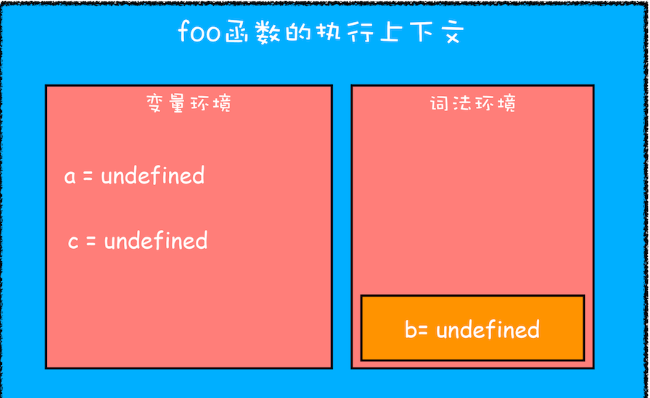
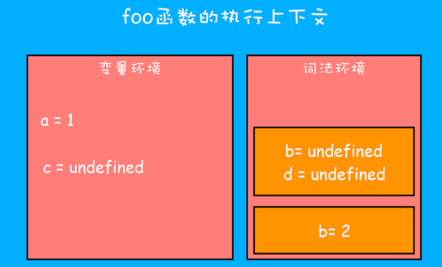

# JavaScript 是如何支持块级作用域
先说结论：
用let 声明出来的变量中都会在词法环境中存放，块级作用域是通过词法环境的栈结构来实现的，而变量提升是通过变量环境来实现的，两者结合就同时支持变量提升和块级作用域

我们需要好好理解这句话：在块作用域内，let声明的变量被提升，但变量只是创建被提升，初始化并没有被提升，在初始化之前使用变量，就会形成一个暂时性死区。引用该变量JavaScript引擎会抛出错误。这就是“暂时性死区”。

例子：
当进入函数的作用域块时，作用域块中通过 let 声明的变量，会被存放在词法环境的一个单独的区域中，这个区域中的变量并不影响作用域块外面的变量。
```javaScript
function foo(){
  var a = 1
  let b = 2
  {
    // 不影响外部
    let b = 3
    var c = 4
    let d = 5
    console.log('=a:',a)
    console.log('=b:',b)
  }
  console.log('=b:',b) 
  console.log('=c:',c)
  // console.log('=d:',d) // 外部访问报错
}
foo()

// 例子2
let test= '123'
{
  console.log(test) 
  let test= '345'
}
/*
在块级作用域中，从开始到test= '345' 代码之间会形成一个暂时性死区，如果中间去访问变量test，会报初始化之前不能访问myname的错误。
*/
```
当进入函数的作用域块时，作用域块中通过 let 声明的变量，会被存放在词法环境的一个单独的区域中，这个区域中的变量并不影响作用域块外面的变量。

在词法环境内部， 维护了一个小型栈结构。栈底是函数最外层的变量，进入一个作用域块后，就会把该作用域块内部的变量压到栈顶；当作用域执行完成之后，该作用域的信息就会从栈顶弹出，这就是词法环境的结构

当执行上面这段代码的时候，JavaScript引擎会先对其进行编译并创建执行上下文，然后再按照顺序执行代码,例子中引入了let关键字，let关键字会创建块级作用域，那么let关键字是如何影响执行上下文的呢？

执行上下文示意图:

- 函数内部通过var声明的变量，在编译阶段全都被存放到变量环境里面了。
- 通过let声明的变量，在编译阶段会被存放到词法环境（Lexical Environment）中。
- 在函数的作用域内部，通过let声明的变量并没有被存放到词法环境中。
- 接下来，第二步继续执行代码，当执行到代码块里面时，变量环境中a的值已经被设置成了1，词法环境中b的值已经被设置成了2，这时候函数的执行上下文就如下图所示：

```
从图中可以看出，当进入函数的作用域块时，作用域块中通过let声明的变量，会被存放在词法环境的一个单独的区域中，这个区域中的变量并不影响作用域块外面的变量。

比如在作用域外面声明了变量b，在该作用域块内部也声明了变量b，当执行到作用域内部时，它们都是独立的存在。
```

其实，在词法环境内部，维护了一个小型栈结构，栈底是函数最外层的变量，进入一个作用域块后，就会把该作用域块内部的变量压到栈顶；当作用域执行完成之后，该作用域的信息就会从栈顶弹出，这就是词法环境的结构。需要注意下，我这里所讲的变量是指通过let或者const声明的变量。

再接下来，当执行到作用域块中的console.log(a)这行代码时，就需要在词法环境和变量环境中查找变量a的值了，具体查找方式是：
```
沿着词法环境的栈顶向下查询，如果在词法环境中的某个块中查找到了，就直接返回给JavaScript引擎，如果没有查找到，那么继续在变量环境中查找。
```

### 例子:当查找变量时，先查找词法环境中的，如果没找到，再去变量环境中查找。
```javaScript
function foo(){
  var a = 1
  let b = 2
  {
    let b = 3
    var c = 4
    // 初始化并没有被提升，在初始化之前使用变量，就会形成一个暂时性死区。
    console.log('=d:',d) // Uncaught ReferenceError: Cannot access 'd' before initialization
    let d = 5
  }
}
foo()

// to es5: 编译成es5是不会报错的
function foo() {
  var a = 1;
  var b = 2;
  {
    var _b = 3;
    var c = 4;
    console.log('=d:', d); // undefined
    var d = 5;
  }
}
foo();
```

### 例子:
全局作用域并且也赋值了，而在函数f1里面打印的还是undefined，这是因为函数形成的函数作用域，已经是一个封闭性的作用域，只要它里面存在此变量，将不会去访问外层作用域的相同变量了。
```javaScript
var a = 10;
var b = 0;
function f1(){
    console.log('test1:',a); // undefined
    console.log('test2:',b); // 0
    var a = 20;     
    console.log(a); // 20
}
f1()
```
