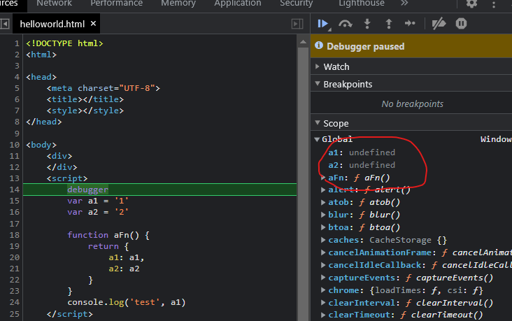

## 初始化2：执行上下文
我们想要深入理解闭包的时候，就不得不去探索作用域的世界，当我们试图去掌握 this 的时候，又不得不把它和词法作用域规则放在一起来看、以求一个更深入的理解。
总感觉这些知识点与点之间，好像有着说不清、道不明的联系。事实上，它们之间的关联确实不止于此。闭包也好、this 也罢，我们完全可以把它们放在一个完整的知识链路里来理解，那就是JS 的执行上下文。

执行上下文是js引擎从解释到运行中间预编译时对执行做的准备工作，创建了当前区域的执行环境，这个执行环境就是执行上下文。

`理解执行上下文和执行栈对于理解其他 JavaScript 概念（如变量声明提升，作用域和闭包）至关重要。`
分为三种：
* 1.全局执行上下文：只有一个，浏览器中的全局对象就是 window 对象，this 指向这个全局对象。

* 2.函数执行上下文：存在无数个，只有在函数被调用的时候才会被创建，每次调用函数都会创建一个新的执行上下文。函数作用域是在函数声明的时候就已经确定了，而函数执行上下文是在函数调用时创建的。

* 3.Eval 函数执行上下文： 指的是运行在 eval 函数中的代码，很少用而且不建议使用。

当 V8 开始执行一段可执行代码时，会生成一个执行上下文。V8 用执行上下文来维护执行当前代码所需要的变量声明、this 指向等。
执行上下文中主要包含三部分:
* 变量环境
* 词法环境:词法环境中，则包含了使用 let、const 等变量的内容。
* this 关键字


注意: 箭头函数没有自己的上下文，没有arguments，箭头函数就是赋值给变量的匿名函数,所以匿名函数不会提升
```javaScript
const fn = (val) => {
  var test2 = '2'
  var test3 = '3'
  debugger
  // undefined {val: 1, test2: '2', test3: '3'}
  console.log(this, { val, test2, test3 })
}

fn(1)

// to es5
var fn = function fn(val) {
  var test2 = '2';
  var test3 = '3';
  debugger;
  console.log(undefined, { val: val, test2: test2, test3: test3 });
};
fn(1);
```


ES5 规范去除了 ES3 中变量对象和活动对象，以 词法环境组件（ LexicalEnvironment component） 和 变量环境组件（ VariableEnvironment component） 替代。

es5 执行上下文的生命周期也包括三个阶段：创建阶段 → 执行阶段 → 回收阶段

### 例子
```javaScript
var a1 = '1'
var a2 = '2'

function aFn() {
    return {
        a1: a1,
        a2: a2
    }
}
console.log('test', a1)
```
创建阶段的执行上下文,可见发生在预编译阶段:



### 创建阶段做了三件事：
1. 确定 this 的值，也被称为 This Binding
2. LexicalEnvironment（词法环境） 组件被创建
3. VariableEnvironment（变量环境） 组件被创建

`1.This Binding`
ThisBinding 是和执行上下文绑定的，也就是说每个执行上下文中都有一个 this
`2.创建词法环境`,词法环境的结构如下：
```javaScript
GlobalExectionContext = {  // 全局执行上下文
  LexicalEnvironment: {       // 词法环境
    EnvironmentRecord: {     // 环境记录
      Type: "Object",           // 全局环境
      // 标识符绑定在这里 
      outer: <null>           // 对外部环境的引用
  }  
}
 
FunctionExectionContext = { // 函数执行上下文
  LexicalEnvironment: {     // 词法环境
    EnvironmentRecord: {    // 环境记录
      Type: "Declarative",      // 函数环境
      // 标识符绑定在这里      // 对外部环境的引用
      outer: <Global or outer function environment reference>  
  }  
}
```
词法环境有两种类型:
1. 全局环境：是一个没有外部环境的词法环境，其外部环境引用为 null。拥有一个全局对象（window 对象）及其关联的方法和属性（例如数组方法）以及任何用户自定义的全局变量，this 的值指向这个全局对象。
2. 函数环境：用户在函数中定义的变量被存储在环境记录中，包含了 arguments 对象。对外部环境的引用可以是全局环境，也可以是包含内部函数的外部函数环境。

词法环境有两个组件:
* 环境记录器 ：存储变量和函数声明的实际位置。
* 外部环境的引用 ：它指向作用域链的下一个对象，可以访问其父级词法环境

在函数环境中使用 声明式环境记录器，用来存储变量、函数和参数


`3.创建变量环境`
变量环境也是一个词法环境，因此它具有上面定义的词法环境的所有属性。

在 ES6 中，词法环境和 变量环境的区别在于

词法环境用于存储函数声明和变量（ let和const关键字）绑定，

变量环境仅用于存储变量（ var ）绑定，因此变量环境实现函数级作用域，通过词法环境在函数作用域的基础上实现块级作用域。

* 使用 let / const 声明的全局变量，会被绑定到 Script 对象而不是 Window 对象，不能以Window.xx 的形式使用；
* 使用 var 声明的全局变量会被绑定到 Window 对象；
* 使用 var / let / const 声明的局部变量都会被绑定到 Local 对象。注：Script 对象、Window 对象、Local 对象三者是平行并列关系。