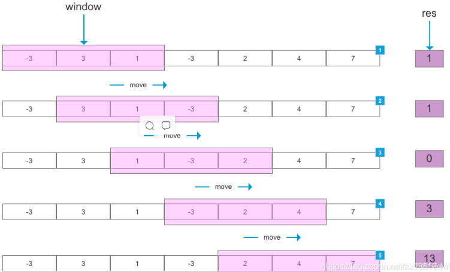

#### 该算法主要用于数组或字符串处理问题。
```
滑动窗口算法来源于计算机网络，其原型滑动窗口协议是TCP-IP协议的应用，主要用于网络数据传输时的流量控制，以避免拥塞的发生。

滑动窗口算法是在给定特定窗口大小的数组或字符串上执行要求的操作。
该技术可以将一部分问题中的嵌套循环转变为一个单循环，因此它可以减少时间复杂度。
```
+ 滑动：说明这个窗口是移动的，也就是移动是按照一定方向来的。
+ 窗口：窗口大小并不是固定的，可以不断扩容直到满足一定的条件；也可以不断缩小，直到找到一个满足条件的最小窗口；当然也可以是固定大小。

#### 图形示例
如下图所示，设定滑动窗口（window）大小为 3，当滑动窗口每次划过数组时，计算当前滑动窗口中元素的和，得到结果 res。


```
可以用来解决一些查找满足一定条件的连续区间的性质（长度等）的问题。由于区间连续，因此当区间发生变化时，可以通过旧有的计算结果对搜索空间进行剪枝，
这样便减少了重复计算，降低了时间复杂度。往往类似于“ 请找到满足 xx 的最 x 的区间（子串、子数组）的 xx ”这类问题都可以使用该方法进行解决。

需要注意的是，滑动窗口算法更多的是一种思想，而非某种数据结构的使用。
```

#### 这里采用的是字符串来讲解。但是对于数组其实也是一样的。滑动窗口算法的思路是这样：
```
1.我们在字符串 S 中使用双指针中的左右指针技巧，初始化 left = right = 0，把索引闭区间 [left, right] 称为一个「窗口」。
2.我们先不断地增加 right 指针扩大窗口 [left, right]，直到窗口中的字符串符合要求（包含了 T 中的所有字符）。
3.此时，我们停止增加 right，转而不断增加 left 指针缩小窗口 [left, right]，直到窗口中的字符串不再符合要求（不包含 T 中的所有字符了）。同时，每次增加 left，我们都要更新一轮结果。
4.重复第 2 和第 3 步，直到 right 到达字符串 S 的尽头。
```
