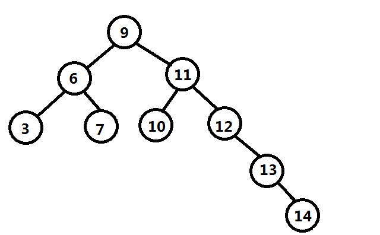
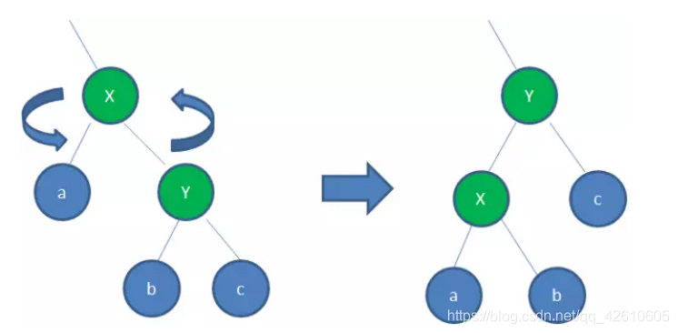
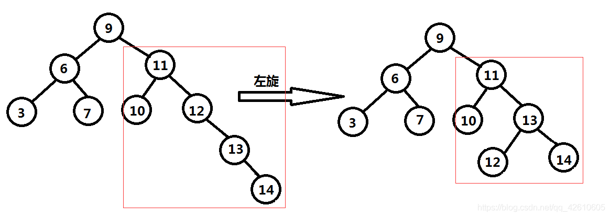
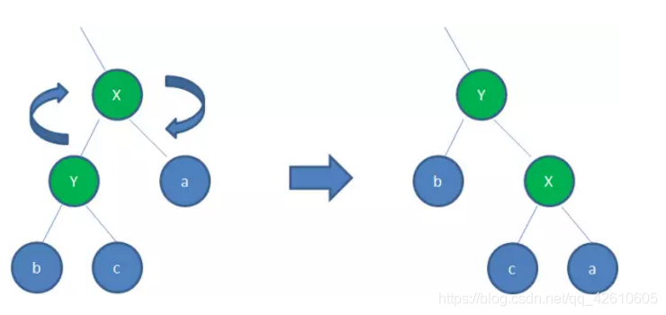

#### 1.二叉查找树
```
定义:
1.若左子树不空，则左子树上所有节点的值均小于它的根节点的值；
2.若右子树不空，则右子树上所有节点的值均大于它的根节点的值；
3.左、右子树也分别为二叉排序树；
4.没有键值相等的节点。
```

看起来二叉树的结构是很均匀的排列的，别急，当依次插入13,14数据后，如下图：


```
由于二叉树的根节点是确定不变的，所以当调整数据的插入或删除顺序，会造成二叉树朝着单项链表的方向发展（张歪了，变成歪脖子树了），大大降低了数据的查询效率。
```

#### 2.平衡二叉树是基于二叉查找树优化而来的
```
非叶子结点最多只能有两个子结点，且左边子结点点小于当前结点值，右边子结点大于当前结点树，并且为保证查询性能增增删结点时要保证左右两边结点层级相差不大于1，
具体实现有AVL、Treap、红黑树等。Java中TreeMap就是基于红黑树实现的。
```

#### 2-1.实现树结构平衡的方法

#### 2-1-1.左旋
```
逆时针旋转红黑树的两个节点，使得父节点被自己的右孩子取代，而自己成为自己的左孩子。
图中，身为右孩子的Y取代了X的位置，而X变成了自己的左孩子。
```



#### 2-1-1.右旋
```
顺时针旋转红黑树的两个节点，使得父节点被自己的左孩子取代，而自己成为自己的右孩子。
图中，身为左孩子的Y取代了X的位置，而X变成了自己的右孩子。
```



#### 总结
相同点：
```
都是基于分治思想采用二分法的策略提高数据查找速度的二叉树结构。
```

不同点：
```
1.二叉查找树的根节点是不可变的，左右两边结点层级差没有限制；
2.平衡二叉树左右两边结点层级相差不大于1，通过旋转实现根节点可变，达到自平衡。
```
相对于二叉查找树，平衡二叉树的查询效率高，但由于增加和删除节点时，为了保证自平衡会做连续的旋转操作，平衡二叉树的额外开销比较大，耗时相对较长。