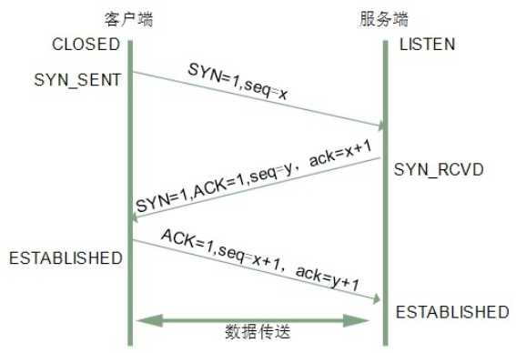
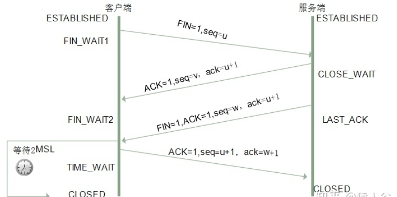

## B.三次握手解析-更加详细的解析
使用 TCP 协议建立连接需要经过三次握手
```
A--SYN请求-->B

A<--确认--B
A<--请求--B   合并

A--确认-->B
```





详解：刚开始客户端处于 Closed 的状态，服务端处于 Listen 状态。 进行三次握手： 
* 第一次握手：客户端给服务端发一个 SYN 报文，并指明客户端的初始化序列号 ISN(c)。此时客户端处于 `SYN_SEND` 状态。
首部的同步位SYN=1，初始序号seq=x，SYN=1的报文段不能携带数据，但要消耗掉一个序号。 

* 第二次握手：服务器收到客户端的 SYN 报文之后，会以自己的 SYN 报文作为应答，并且也是指定了自己的初始化序列号 ISN(s)。同时会把客户端的 ISN + 1 作为ACK 的值，表示自己已经收到了客户端的 SYN，此时服务器处于 `SYN_REVD` 的状态。
在确认报文段中SYN=1，ACK=1，确认号ack=x+1，初始序号seq=y。 

* 第三次握手：客户端收到 SYN 报文之后，会发送一个 ACK 报文，当然，也是一样把服务器的 ISN + 1 作为 ACK 的值，表示已经收到了服务端的 SYN 报文，此时客户端处于 `ESTABLISHED` 状态。服务器收到 ACK 报文之后，也处于 `ESTABLISHED` 状态，此时，双方已建立起了连接。
确认报文段ACK=1，确认号ack=y+1，序号seq=x+1（初始为seq=x，第二个报文段所以要+1），ACK报文段可以携带数据，不携带数据则不消耗序号。
发送第一个SYN的一端将执行主动打开（active open），接收这个SYN并发回下一个SYN的另一端执行被动打开（passive open）。
在socket编程中，客户端执行connect()时，将触发三次握手。

### 1-2.我们将原有的问题转换成了:为什么需要通过三次握手才可以初始化 Sockets、窗口大小和初始序列号？
* 1.通过三次握手才能阻止重复历史连接的初始化；
* 2.通过三次握手才能对通信双方的初始序列号进行初始化；
* 3.讨论其他次数握手建立连接的可能性；


### 第一个原因总结
第一个是 TCP 选择使用三次握手的最主要原因，其他的几个原因相比之下都是次要的原因。
RFC 793 - Transmission Control Protocol 其实就指出了 TCP 连接使用三次握手的首要原因:

> 为了阻止历史的重复连接初始化造成的混乱问题，防止使用 TCP 协议通信的双方建立了错误的连接。

`连接的定义，我们才能去尝试回答为什么 TCP 建立连接需要三次握手`
RFC 793 - Transmission Control Protocol 文档中非常清楚地定义了 TCP 中的连接是什么，我们简单总结一下：用于保证可靠性和流控制机制的信息，包括 Socket、序列号以及窗口大小叫做连接。

建立 TCP 连接就是通信的双方需要对上述的三种信息达成共识，连接中的一对 Socket 是由互联网地址标志符和端口组成的，窗口大小主要用来做流控制，最后的`序列号是用来追踪通信发起方发送的数据包序号，接收方可以通过序列号向发送方确认某个数据包的成功接收。 TCP 选择使用三次握手来建立连接并在连接引入了 RST 这一控制消息，接收方当收到请求时会将发送方发来的 SEQ+1 发送给对方，这时由发送方来判断当前连接是否是历史连接：`
- 如果当前连接是历史连接，即 SEQ 过期或者超时，那么发送方就会直接发送 RST 控制消息中止这一次连接；
- 如果当前连接不是历史连接，那么发送方就会发送 ACK 控制消息，通信双方就会成功建立连接；

使用三次握手和 RST 控制消息将是否建立连接的最终控制权交给了发送方，因为只有发送方有足够的上下文来判断当前连接是否是错误的或者过期的，这也是 TCP 使用三次握手建立连接的最主要原因。

### 扩展：如果采用两次
```
假如两次握手：
A--请求-->B

A<--确认--B
A<--请求--B    合并
```

```
采用两次那么发送方一旦发出建立连接的请求之后它就没有办法撤回这一次请求,造成服务端资源一直在等待；


如果在网络状况复杂或者较差的网络中，发送方连续发送多次建立连接的请求，

如果TCP建立连接只能通信两次，那么接收方只能选择接受或者拒绝发送方发起的请求，它并不清楚这一次请求是不是由于网络拥堵而早早过期的连接。此时假设的是不采用三次握手，只要服务端发出确认，就建立新的连接了，此时客户端忽略服务端发来的确认，也不发送数据，则导致服务端一致等待客户端发送数据，浪费资源。

两次握手没有办法建立 TCP 连接，使用三次握手是建立连接所需要的最小次数。
目的：为了防止失效的连接请求报文段突然又传送到主机B，因而产生错误。
```

<br />

### 第二个原因总结
三次握手能够帮助通信双方获取初始化序列号，它们能够保证数据包传输的不重不丢，还能保证它们的传输顺序，不会因为网络传输的问题发生混乱。

原因就是通信双方都需要获得一个用于发送信息的初始化序列号，作为一个可靠的传输层协议，TCP 需要在不稳定的网络环境中构建一个可靠的传输层，网络的不确定性可能会导致数据包的缺失和顺序颠倒等问题，常见的问题可能包括：
- 数据包被发送方多次发送造成数据的重复；
- 数据包在传输的过程中被路由或者其他节点丢失；
- 数据包到达接收方可能无法按照发送顺序；

为了解决上述这些可能存在的问题，TCP 协议要求发送方在数据包中加入『序列号』字段，有了数据包对应的序列号，我们就可以：
- 接收方可以通过序列号对重复的数据包进行去重；
- 发送方会在对应数据包未被 ACK 时进行重复发送；
- 接收方可以根据数据包的序列号对它们进行重新排序；

```
序列号在 TCP 连接中有着非常重要的作用，初始序列号作为 TCP 连接的一部分也需要在三次握手期间进行初始化，由于 TCP 连接通信的双方都需要获得初始序列号，所以它们其实需要向对方发送 SYN 控制消息并携带自己期望的初始化序列号 SEQ，对方在收到 SYN 消息之后会通过 ACK 控制消息以及 SEQ+1 来进行确认。
```

### 扩展：SYN攻击是什么？三次握手过程中可以携带数据吗？
`服务器端的资源分配是在二次握手时分配的，而客户端的资源是在完成三次握手时分配的`，所以服务器容易受到SYN洪泛攻击。SYN攻击就是Client在短时间内伪造大量不存在的IP地址，并向Server不断地发送SYN包，Server则回复确认包，并等待Client确认，由于源地址不存在，因此Server需要不断重发直至超时，这些伪造的SYN包将长时间占用未连接队列，导致正常的SYN请求因为队列满而被丢弃，从而引起网络拥塞甚至系统瘫痪。SYN 攻击是一种典型的 DoS/DDoS 攻击。

检测 SYN 攻击非常的方便，当你在服务器上看到大量的半连接状态时，特别是源IP地址是随机的，基本上可以断定这是一次SYN攻击。在 Linux/Unix 上可以使用系统自带的 netstats 命令来检测 SYN 攻击。

其实第三次握手的时候，是可以携带数据的。但是，第一次、第二次握手不可以携带数据
为什么这样呢?大家可以想一个问题，假如第一次握手可以携带数据的话，如果有人要恶意攻击服务器，那他每次都在第一次握手中的 SYN 报文中放入大量的数据。因为攻击者根本就不理服务器的接收、发送能力是否正常，然后疯狂着重复发 SYN 报文的话，这会让服务器花费很多时间、内存空间来接收这些报文。

也就是说，第一次握手不可以放数据，其中一个简单的原因就是会让服务器更加容易受到攻击了。而对于第三次的话，此时客户端已经处于 ESTABLISHED 状态。对于客户端来说，他已经建立起连接了，并且也已经知道服务器的接收、发送能力是正常的了，所以能携带数据也没啥毛病。


### 扩展：通俗的解释确认收发能力正常,只能助于理解,不完全正确
```
握手和敬军礼一样，源自「敌我双方互相确认对方手里没有武器、无恶意」的仪式。（虽然双方互相请求确认需要四步，但由于中间的确认
和请求是由同一个人执行的，所以合并成了一步）

正恩伸出手说：你看，我手里没有武器。（SYN）

朗普看了看说：嗯，确实没有。（ACK）于是也伸出手说：你看，我手里也没有武器。（SYN）

正恩看了看说：嗯，看来你确实有诚意。（ACK）

于是双方的手握到了一起，随着手上的一阵颤抖，一切变得索然无味……
```

<br />

## C.四次挥手
建立一个连接需要三次握手，而终止一个连接要经过四次挥手（也有将四次挥手叫做四次握手的）。这由TCP的`半关闭`（half-close）造成的。所谓的半关闭，其实就是TCP提供了连接的一端在结束它的发送后还能接收来自另一端数据的能力。

TCP 的连接的拆除需要发送四个包，因此称为四次挥手(Four-way handshake)，客户端或服务器均可主动发起挥手动作。

刚开始双方都处于 ESTABLISHED 状态，假如是客户端先发起关闭请求。四次挥手的过程如下：

- 第一次挥手：客户端发送一个 FIN 报文，报文中会指定一个序列号。此时客户端处于 `FIN_WAIT1` 状态。 即发出`连接释放报文段`（FIN=1，序号seq=u），并停止再发送数据，主动关闭TCP连接，进入FIN_WAIT1（终止等待1）状态，等待服务端的确认。
- 第二次挥手：服务端收到 FIN 之后，会发送 ACK 报文，且把客户端的序列号值 +1 作为 ACK 报文的序列号值，表明已经收到客户端的报文了，此时服务端处于 `CLOSE_WAIT` 状态。 即服务端收到连接释放报文段后即发出`确认报文段`（ACK=1，确认号ack=u+1，序号seq=v），服务端进入CLOSE_WAIT（关闭等待）状态，此时的TCP处于半关闭状态，客户端到服务端的连接释放。客户端收到服务端的确认后，进入FIN_WAIT2（终止等待2）状态，等待服务端发出的连接释放报文段。
- 第三次挥手：如果服务端也想断开连接了，和客户端的第一次挥手一样，发给 FIN 报文，且指定一个序列号。此时服务端处于 `LAST_ACK` 的状态。 即服务端没有要向客户端发出的数据，服务端发出`连接释放报文段`（FIN=1，ACK=1，序号seq=w，确认号ack=u+1），服务端进入LAST_ACK（最后确认）状态，等待客户端的确认。
- 第四次挥手：客户端收到 FIN 之后，一样发送一个 ACK 报文作为应答，且把服务端的序列号值 +1 作为自己 ACK 报文的序列号值，此时客户端处于 `TIME_WAIT` 状态。需要过一阵子以确保服务端收到自己的 ACK 报文之后才会进入 CLOSED 状态，服务端收到 ACK 报文之后，就处于关闭连接了，处于 `CLOSED` 状态。 即客户端收到服务端的连接释放报文段后，对此发出`确认报文段`（ACK=1，seq=u+1，ack=w+1），客户端进入TIME_WAIT（时间等待）状态。此时TCP未释放掉，需要经过时间等待计时器设置的时间2MSL后，客户端才进入CLOSED状态。

收到一个FIN只意味着在这一方向上没有数据流动。客户端执行主动关闭并进入TIME_WAIT是正常的，服务端通常执行被动关闭，不会进入TIME_WAIT状态。

在socket编程中，任何一方执行close()操作即可产生挥手操作。



### c-1.挥手为什么需要四次？
tcp是全双工通信，服务端和客服端都能发送和接收数据。
```
tcp在断开连接时，需要服务端和客服端都确定对方将不再发送数据。

第1次挥手
由客户端向服务端发起，服务端收到信息后就能确定客户端已经停止发送数据。

第2次挥手
由服务端向客户端发起，客户端收到消息后就能确定服务端已经知道客户端不会再发送数据。

第3次握手
由服务端向客户端发起，客户端收到消息后就能确定服务端已经停止发送数据。

第4次挥手
由客户端向服务端发起，服务端收到信息后就能确定客户端已经知道服务端不会再发送数据。
```

为什么不是3次挥手
```
在客服端第1次挥手时，服务端可能还在发送数据。

所以第2次挥手和第3次挥手不能合并。
```

A:我没有数据发给你了，你如果还有数据发给我，就继续发吧
B：我知道了，我发完了告诉你
B：我也发完了，你可以关了 
A：我知道了，我断开了，可以确认断开了

关闭 TCP 连接或者保留重用，关闭 TCP 连接的四次握手:
```
1. 主动方发送`Fin=1， Ack=Z， Seq= X`报文
2. 被动方发送`ACK=X+1， Seq=Z`报文
3. 被动方发送`Fin=1， ACK=X， Seq=Y`报文
4. 主动方发送`ACK=Y， Seq=X`报文
```
因为当服务端收到客户端的SYN连接请求报文后，可以直接发送SYN+ACK报文。其中ACK报文是用来应答的，SYN报文是用来同步的。但是关闭连接时，当服务端收到FIN报文时，很可能并不会立即关闭SOCKET，所以只能先回复一个ACK报文，告诉客户端，"你发的FIN报文我收到了"。只有等到我服务端所有的报文都发送完了，我才能发送FIN报文，因此不能一起发送。故需要四次挥手。
