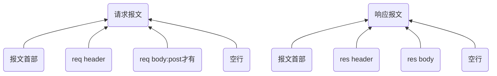

## 1.http定义和特点
定义：
HTTP是一种基于请求和响应的协议，即客户端向服务器发送一个请求，服务器接收该请求并返回一个响应。

为了传输数据，HTTP使用了一种叫做“报文”的数据结构。

浏览器会向Web服务器发送一个请求报文，该报文包括一个(报文首部)请求行、多个header和一个空行。

HTTP协议使用TCP/IP协议进行通信。HTTP是比TCP更上一层的应用层协议，只有低层协议建立之后才能，才能进行更高层协议的连接，因此，首先要建立TCP连接，一般TCP连接的端口号是80

一个TCP连接可发送多个HTTP请求，可保持TCP连接，一个 TCP 连接中 HTTP 请求依次发送。
一个域名下系统会同时建立多个 TCP 请求（最多支持6个）

特点：
- 无状态：HTTP协议是无状态协议。
```
connection: keep-alive
从HTTP/1.1起，默认都开启了Keep-Alive，保持连接特性，简单地说，当一个网页打开完成后，客户端和服务器之间用于传输HTTP数据的TCP连接不会关闭，如果客户端再次访问这个服务器上的网页，会继续使用这一条已经建立的连接。
Keep-Alive不会永久保持连接，它有一个保持时间，可以在不同的服务器软件（如Apache）中设定这个时间。
```

<br />

### 1-1.报文三个部分:报文首部(请求行) + header + body + 空行
如果http是快递员，报文就是包裹

A:请求报文由以下元素组成：

* 1. 报文首部:请求行+状态行
```
1.请求行
请求行由请求方法和URL和HTTP协议版本构成。
GET / HTTP/1.1

方法
url
端口号:Remote Address: 124.237.176.160:443
HTTP 协议版本号。

2.状态行
Status Code: 200 OK
```

* 2.headers

* 3.对于一些像 POST 这样的方法，报文的 body 就包含了发送的资源，这与响应报文的 body 类似。
```
空行之后就是可选的报文主体了，其中包含了所有类型的数据。

请求主体中包括了要发送给Web 服务器的数据；

响应主体中装载了要返回给客户端的数据。起始行和首部都是文本形式且都是结构化的，而主体则不同，主体中可以包含任意的二进制数据（比如图片、视频、音轨、软件程序）。当然，主体中也可以包含文本。
```

B:响应报文包含了下面的元素：
* 1.报文首部：状态行
```
一个状态码（status code），来告知对应请求执行成功或失败，以及失败的原因。
一个状态信息，这个信息是非权威的状态码描述信息，可以由服务端自行设定。
```
* 2.headers，与请求头部类似
* 3.资源 body。


## 2.请求报文


## A.请求报文
### 1.请求报文之-报文首部：
报文首部由方法字段、URL 字段 和HTTP 协议版本字段 3 个部分组成，他们之间使用空格隔开。
```
例如：GET /index.html HTTP/1.1
  get方法将数据拼接在url后面，传递参数受限
请求方法：
  GET、POST、HEAD、PUT、DELETE、OPTIONS、TRACE、CONNECT
```
### 2.请求报文之-req header：
详细见:
03-状态码-请求报文之req header-响应报文res header.md

### 3.请求报文之-res body：res body不在 GET 方法中使用，而是在POST 方法中使用
post方法中，会把数据以key value形式发送请求
```
GET方式的请求一般不包含”请求内容”部分，请求数据以地址的形式表现在请求行。

GET /search?hl=zh-CN&source=hp&q=domety&aq=f&oq= HTTP/1.1  
Accept: image/gif, image/x-xbitmap, image/jpeg, image/pjpeg, application/vnd.ms-excel, application/vnd.ms-powerpoint, 
application/msword, application/x-silverlight, application/x-shockwave-flash, */*  
Referer: <a href="http://www.google.cn/">http://www.google.cn/</a>  
Accept-Language: zh-cn  
Accept-Encoding: gzip, deflate  
User-Agent: Mozilla/4.0 (compatible; MSIE 6.0; Windows NT 5.1; SV1; .NET CLR 2.0.50727; TheWorld)  
Host: <a href="http://www.google.cn">www.google.cn</a>  
Connection: Keep-Alive  
Cookie: PREF=ID=80a06da87be9ae3c:U=f7167333e2c3b714:NW=1:TM=1261551909:LM=1261551917:S=ybYcq2wpfefs4V9g; 
NID=31=ojj8d-IygaEtSxLgaJmqSjVhCspkviJrB6omjamNrSm8lZhKy_yMfO2M4QMRKcH1g0iQv9u-2hfBW7bUFwVh7pGaRUb0RnHcJU37y-
FxlRugatx63JLv7CWMD6UB_O_r 
```
### 4.请求报文之-空行:发送回车符和换行符，通知服务器以下不再有请求头

<br />

## B.响应报文
### 1.响应报文之-状态行
由3部分组成：协议版本，状态码，状态码描述，之间由空格分隔
### 2.响应报文之-res header
详细见:
03-状态码-请求报文之req header-响应报文res header.md

### 3.响应报文之-req body
### 4.响应报文之-空行表示结束

<br />

# A.重点:http1.1和http2对比
##  前言:http1.1和http2.0请求资源对比
HTML 如果包含几十个图片标签，这些图片是以什么方式、什么顺序、建立了多少连接、使用什么协议被下载下来的呢？
* 1.使用http2
```
如果图片都是 HTTPS 连接并且在同一个域名下，那么浏览器在 SSL 握手之后会和服务器商量能不能用 HTTP2。

如果能的话就使用 Multiplexing 功能在这个连接上进行多路传输。

不过也未必会所有挂在这个域名的资源都会使用一个 TCP 连接去获取，但是可以确定的是 Multiplexing 很可能会被用到。
```

* 2.如果发现用不了 HTTP2 而去使用HTTP/1.1呢？
```
浏览器就会在一个 HOST 上建立多个 TCP 连接，连接数量的最大限制取决于浏览器设置，这些连接会在空闲的时候被浏览器用来发送新的请求，如果所有的连接都正在发送请求呢？那其他的请求就只能等等了。
```

### A-1.TCP/1.1和TCP/2.0 一个域名究竟可以维护多少个TCP连接
* TCP/2.0 浏览器为每个域名维护1个TCP持久连接

* TCP/1.1 浏览器为每一个域名维护了6个TCP连接
```
在一个 TCP 连接中可以传输多个 HTTP 请求， 一个域名下系统会同时建立多个 TCP 请求（最多支持6个）, 但是 TCP 对请求的处理是同步的，也就是只能一个一个的处理，在一个 HTTP 请求没有结束前，其他请求都是处于阻塞状态，这大大影响我们的首屏渲染。
```

### A-2.HTTP/1.1中浏览器是如何提高页面加载效率的呢？主要有下面两点：
1. 维持和服务器已经建立的 TCP 连接，在同一连接上顺序处理多个请求。

2. 服务器建立多个 TCP 连接。
```
在 HTTP/1.1 时代，为了提升并行下载效率，浏览器为每个域名维护了 6 个 TCP 连接。这很好理解，我们有100个资源，多线程（6个）去找服务端去要，肯定比单线程（1个）快的多。

但是浏览器不允许多个tcp链接要是有 1000 张图片的话总开 1000个TCP连接，显然不合理。
```

### A-3.HTTP/1.1 存在一个问题,默认不能并发请求发送http
HTTP/1.1中 TCP 连接中 HTTP 请求发送可以一起发送么（比如一起发三个请求，再三个响应一起接收）？

HTTP/1.1 单个 TCP 连接在同一时刻只能处理一个请求，意思是说：两个请求的生命周期不能重叠，任意两个 HTTP 请求从开始到结束的时间在同一个 TCP 连接里不能重叠。

虽然 HTTP/1.1 规范中规定了 Pipelining 来试图解决这个问题，但是这个功能在浏览器中默认是关闭的。
>  一个支持持久连接的客户端可以在一个连接中发送多个请求（不需要等待任意请求的响应）。收到请求的服务器必须按照请求收到的顺序发送响应。

Pipelining 这种设想看起来比较美好，但是在实践中会出现许多问题：

1. 一些代理服务器不能正确的处理 HTTP Pipelining。
2. 正确的流水线实现是复杂的。
3. Head-of-line Blocking 连接头阻塞：在建立起一个 TCP 连接之后，假设客户端在这个连接连续向服务器发送了几个请求。按照标准，服务器应该按照收到请求的顺序返回结果，假设服务器在处理首个请求时花费了大量时间，那么后面所有的请求都需要等着首个请求结束才能响应。

所以现代浏览器默认是不开启 HTTP Pipelining 的。

最后，HTTP2 提供了 Multiplexing 多路传输特性，可以在一个 TCP 连接中同时完成多个 HTTP 请求。

<br />

### A-4.HTTP2.0 的出现就是为了优化 HTTP1.1 存在的以上问题，优化策略如下：
1. 一个域名只能使用一个 TCP 连接
这样就可以保证 TCP 只会连接以及慢启动一次，同时也解决了竞争带宽的问题

2. 多路复用
HTTP/2 实现了资源的并行请求，也就是任何时候都可以将请求发送给服务器，而并不需要等待其他请求的完成，然后服务器也可以随时返回处理好的请求资源给浏览器
```
绿色是发起请求到请求返回的等待时间，蓝色是响应的下载时间，可以看到都是在同一个 Connection，并行完成的
在 HTTP2 中由于 Multiplexing 特点的存在，多个 HTTP 请求可以在同一个 TCP 连接中并行进行。
```

3. 请求优先级
HTTP/2 提供了请求优先级，可以在发送请求时，标上该请求的优先级，这样服务器接收到请求之后，会优先处理优先级高的请求。


4. 头部压缩：只发送头部数据的差异数据，而不是全部发送，减少头部的信息量

5. 服务端推送：服务端可以在发送页面HTML时主动推送其它资源，而不用等到浏览器解析到相应位置，发起请求再响应。例如服务端可以主动把JS和CSS文件推送给客户端，而不需要客户端解析HTML时再发送这些请求。服务端可以主动推送，客户端也有权利选择是否接收。如果服务端推送的资源已经被浏览器缓存过，浏览器可以通过发送RST_STREAM帧来拒收。主动推送也遵守同源策略，服务器不会随便推送第三方资源给客户端。
