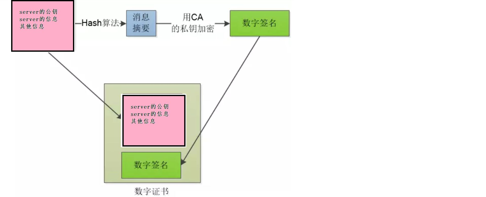
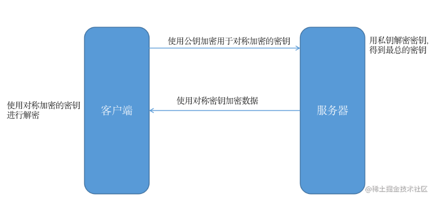
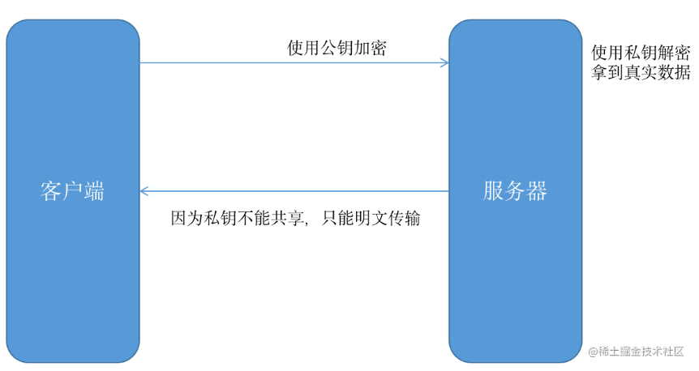
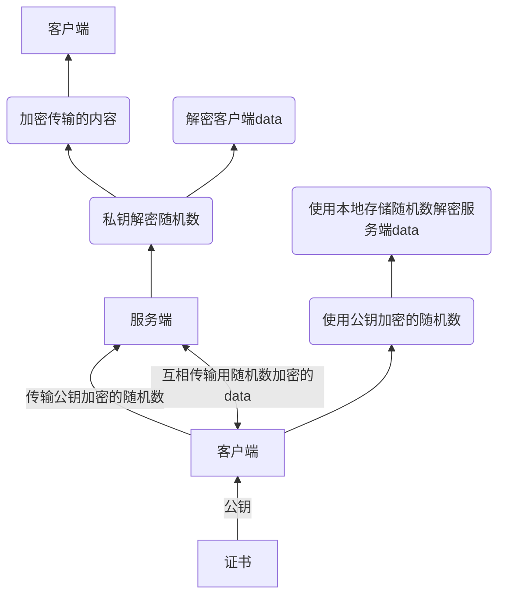
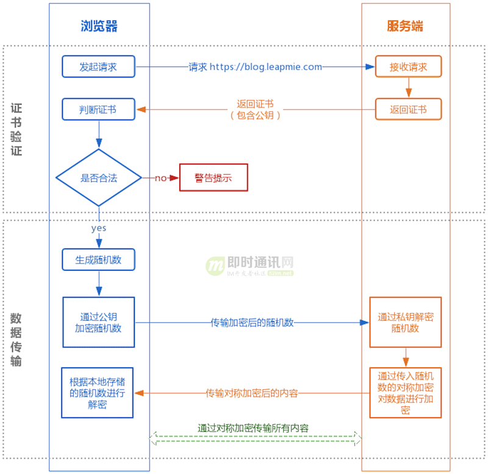

1.HTTPS是什么？
HTTP + 加密 + 认证 + 完整性保护 = HTTPS

## 1-1.HTTPS 是身披 SSL 外壳的 HTTP
通常，HTTP 直接和 TCP 通信。HTTPS 并非是应用层的一种新协议。只是 HTTP 通信接口部分用 SSL（Secure Socket Layer）和 TLS（Transport Layer Security）协议代替而已。 

当使用 SSL 时，则演变成先和 SSL 通信，再由 SSL 和 TCP 通信了。简言之，所谓 HTTPS，其实就是身披 SSL 协议这层外壳的 HTTP。

在采用 SSL 后，HTTP 就拥有了 HTTPS 的加密、证书和完整性保护这些功能。 SSL 是独立于 HTTP 的协议，所以不光是 HTTP 协议，其他运行在应用层的 SMTP 和 Telnet 等协议均可配合 SSL 协议使用。可以说 SSL 是当今世界上应用最为广泛的网络安全技术。

### 1-2.Http与Https的区别
- HTTP:应用层，HTTPS的安全传输机制工作在传输层
- HTTP 无法加密，而HTTPS 对传输的数据进行加密,HTTP 是不安全的，而 HTTPS 是安全的
- HTTP无需证书，而HTTPS 需要CA机构wosign的颁发的SSL证书
- HTTP 标准端口是80 ，而 HTTPS 的标准端口是443

<br />


### 1-3.SSL的基本概念
SSL/TLS协议提供的服务主要有：

- 认证用户和服务器，确保数据发送到正确的客户机和服务器；
- 加密数据以防止数据中途被窃取；
- 维护数据的完整性，确保数据在传输过程中不被改变。

SSL（Secure Socket Layer，安全套接字层）/TLS(Transport Layer Security，传输层安全协议)

TLS 是以SSL 为原型开发的协议，有时会统一称该协议为 SSL。*当前主流的版本是SSL3.0 和 TLS1.0

SSL位于应用层和传输层之间，所以可以为任何基于TCP等可靠连接的应用层协议提供安全性保证，用于Web浏览器和服务器之间的身份认证和加密数据传输.

SSL{SSL记录层：位于可靠的传输之上（比如TCP），提供压缩，认证，加密等功能

SSL握手层：位于ssl记录层之上，提供数据传输前的身份验证，协商算法，交换密钥等功能。}

（2）SSL/TLS握手阶段（建立通信连接）

（1）浏览器发出加密通信的请求（ClientHello）



参考：
https://zhuanlan.zhihu.com/p/418178630

## 2. HTTPS 是使用什么加密方式
基本思路：
客户端先向服务器端索要公钥，然后用公钥加密随机数生成密文，同时用密文加密data，服务端通过私钥对随机数进行解密，然后解密消息

如果是服务端传给客户端，通过客户端传入的随机数构造对称加密算法

公钥放在数字证书中，证书可信，公钥即可信

1. 在传输数据阶段依然使用对称加密
2. 但是 对称加密的密钥  我们采用非对称加密来传输。
```
证书验证阶段：
1）浏览器发起 HTTPS 请求；
2）服务端返回 HTTPS 证书；
3）客户端验证证书是否合法，如果不合法则提示告警。

数据传输阶段：
1）当证书验证合法后，在本地生成随机数；
2）通过公钥加密随机数，并把加密后的随机数传输到服务端；
3）服务端通过私钥对随机数进行解密；
4）服务端通过客户端传入的随机数构造对称加密算法，对返回结果内容进行加密后传输。
```

## 总结:HTTPS 是使用什么加密方式-HTTPS 在内容传输的加密上使用的是对称加密，非对称加密只作用在证书验证阶段
基本思路：
客户端先向服务器端索要公钥，然后用公钥加密信息，服务器收到密文后，用自己的私钥解密

公钥放在数字证书中，证书可信，公钥即可信

1. 在传输数据阶段依然使用对称加密
2. 但是 对称加密的密钥  我们采用非对称加密来传输。
```
证书验证阶段：
1）浏览器发起 HTTPS 请求；
2）服务端返回 HTTPS 证书；
3）客户端验证证书是否合法，如果不合法则提示告警。

数据传输阶段：
1）当证书验证合法后，在本地生成随机数；
2）通过公钥加密随机数，并把加密后的随机数传输到服务端；
3）服务端通过私钥对随机数进行解密；
4）服务端通过客户端传入的随机数构造对称加密算法，对返回结果内容进行加密后传输。
```

为什么数据传输是用对称加密？
```
首先：非对称加密的加解密效率是非常低的，而 http 的应用场景中通常端与端之间存在大量的交互，非对称加密的效率是无法接受的。

另外：在 HTTPS 的场景中只有服务端保存了私钥，一对公私钥只能实现单向的加解密，所以 HTTPS 中内容传输加密采取的是对称加密，而不是非对称加密。
```

如下图所示：（实际流程复杂的多，这里为了便于理解只演示核心流程）



<br />

为什么数据传输是用对称加密？
```
首先：非对称加密的加解密效率是非常低的，而 http 的应用场景中通常端与端之间存在大量的交互，非对称加密的效率是无法接受的。

另外：在 HTTPS 的场景中只有服务端保存了私钥，一对公私钥只能实现单向的加解密，所以 HTTPS 中内容传输加密采取的是对称加密，而不是非对称加密。
```

## 2.加密方法
### 2-1.对称加密:加密和解密使用的密钥是一样的
具体实现:
```
在每次发送真实数据之前，客户端先生成一把密钥，然后先把密钥传输给服务端。之后客户端给服务端发送真实数据的时候，会用这把密钥对数据进行加密，服务端收到加密数据之后，用刚才收到的密钥进行解密。
```

这种加密方式运用在客户端与服务器数据传输安全吗，显然是不安全的，因为密钥也需要被传输，而且是明文传输。
优点
- 加密算法与解密算法想同。
- 加密算法的优点：加密解密的效率很高；
- 加密算法的缺点：容易被劫持，使用时间稍长就会被中间劫持，根据数据规率找破解出加密算法。
- 解决方案：可以每次通信都动态协商一个加密算法，但还是有可能被劫持掉。


<br />

## 2-2.非对称加密
非对称加密算法需要两个密钥：
- 公开密钥（publickey:简称公钥）
- 私有密钥（privatekey:简称私钥）

通过加密算法—RSA算法，得到一对密钥（就是两串字符），`公钥用于对数据加密 ，私钥用于对数据解密。`因为加密和解密的方式不同，因此很难被破解。就算公钥被劫持，但客户端使用公钥加密的数据只能用私钥解密。因为加密和解密使用的是两个不同的密钥，所以这种算法叫作非对称加密算法。

公钥与私钥是一对，如果用公钥对数据进行加密，只有用对应的私钥才能解密。

非对称加密算法实现机密信息交换的基本过程是：
```
例子:传输双方比如是甲乙双方，甲方有配对的公、私密钥一对，且公钥负责加密，私钥负责解对应的公钥加的密。乙方同理。(注意：在https是不会把私钥给浏览器的,这并不安全)

甲方生成一对密钥并将公钥公开，需要向甲方发送信息的其他角色(乙方)使用该密钥(甲方的公钥)对机密信息进行加密后再发送给甲方；甲方再用自己私钥对加密后的信息进行解密。

甲方想要回复乙方时正好相反，使用乙方的公钥对数据进行加密，同理，乙方使用自己的私钥来进行解密。
```

### 在服务器和客户端中使用
服务器生成一对公钥和私钥；将公钥传给客户端，客户端用公钥进行加密，服务端使用私钥解密。

- 优点：安全性高，不容易被破解。
- 缺点：解密效率比较低。
- 对称加密算法和非对称加密算法结合起来：
    * 将客户端与服务端动态协商对称算法过程用非对称算法加密起来；
    * 使用协商的对称加密算法对数据通信过程进行加密，这样既保证了安全，也提高了效率。

- 存在的问题：若中间黑客劫持了服务器发送给客户端的公钥，然后将自己的公钥发送给客户端，因为客户端不知道服务端的身份，所以就出现数据被劫持。若客户端能够知道服务无端身份，就不怕劫持了，所以又引进了：签名证书。

比如现在浏览器有公钥（可公开），服务器有私钥（不公开），数据传输如下：


### 单纯使用非对称加密造成的问题
问题所在： 单纯使用非对称加密:服务端给客户端发数据时就不能进行加密,只能加密：客户端-->服务端
```
客户端可以使用公钥进行加密服务端使用私钥解密，但是服务端给客户端发数据时就不能进行加密了，因为客户端只有公钥，服务端只有私钥，
如果要加密，服务端只能把私钥也传给客户端，客户端才能解密，这样显然没什么意义了。
```

## 2.https的加密方式:HTTPS 的实现原理




既然对称和非对称加密都不安全，那 HTTPS 是使用什么加密方式呢？

<br />

### 2-1.还没解决另外一个DNS劫持问题:让服务器像浏览器证明 “我就是我”
使用了对称和非对称加密相结合后数据可以被安全的传输了，现在数据是安全了，但是并不能保证我们访问的站点安全。也就是黑客可以通过 DNS 劫持，把用户要访问的站点直接换成其他站点。那这个问题如何解决呢？

答案是添加数字证书，就是让服务器像浏览器证明 “我就是我”。而且对称加密的密钥也被存放在数字证书里面。

这样以来，即使 DNS 被劫持了，但是假的服务器并不能提供对应的数据证书（不能伪造），自然就建立不了连接。
```

服务器用明文的方式给客户端发送自己的公钥，客户端收到公钥之后，会生成一把密钥(对称加密用的)，然后用服务器的公钥对这把密钥进行加密，之后再把密钥传输给服务器，服务器收到之后进行解密，最后服务器就可以安全得到这把密钥了，而客户端也有同样一把密钥，他们就可以进行对称加密了。


但是，非对称加密的方式也并非万无一失，在此举个例子：

服务器以明文的方式给客户端传输公钥的时候，中间人截取了这把属于服务器的公钥，并且把中间人自己的公钥冒充服务器的公钥传输给了客户端。

之后客户端就会用中间人的公钥来加密自己生成的密钥。然后把被加密的密钥传输给服务器，这个时候中间人又把密钥给截取了，中间人用自己的私钥对这把被加密的密钥进行解密，解密后中间人就可以获得这把密钥了。

最后中间人再对这把密钥用刚才服务器的公钥进行加密，再发给服务器。

毫无疑问，在这个过程中，中间人获取了对称加密中的密钥，在之后服务器和客户端的对称加密传输中，这些加密的数据对中间人来说，和明文没啥区别。

所以后面引入了，数字证书和数字签名。
```

## 3.数字证书和数字签名
非对称性加密之所以不安全，是应为客户端不知道，这把公钥是不是服务器的。
如上所说，为了解决公钥来源的不安全性，引入第三方 数字证书认证中心（CA）

- 签名证书：进行身份验证；并且传送公钥信息，公司生成一对密钥之后，拿到权威机构处生成一个签名证书，证书包含：公钥信息，权威机构信息，公司机构信息，有效时间等。
- SSl加密过程：在通信的时候，连接建立之后，服务器先向客户端传送证书，客户端通过证书的信息进行验证：①若身份验证不通过，则可以直接断开连接，若身份验证通过，然后用证书中的公钥加密对称算法的协商过程，最终利用协商好的对称加密算法对数据通信进行加密。

服务器可以向CA来申请数字证书
```
因此，我们需要找到一种策略来证明这把公钥就是服务器的，而不是别人冒充的,就像身份证一样，唯一标识我们服务器的公钥，解决这个问题的方式就是使用数字证书，具体是这样的.

互联网世界中充当公理的机构来签发这个证书，它就是CA机构，它是如今互联网世界正常运作的前提，而CA机构颁发的“身份证”就是数字证书：

网站在使用HTTPS前，需要向CA机构申领一份数字证书，数字证书里含有证书持有者信息、公钥信息等。服务器把证书传输给浏览器，浏览器从证书里获取公钥就行了，证书就如身份证，证明“该公钥对应该网站”。而这里又有一个显而易见的问题，“证书本身的传输过程中，如何防止被篡改”？即如何证明证书本身的真实性？身份证运用了一些防伪技术，而数字证书怎么防伪呢？

我们把证书原本的内容生成一份“签名”，比对证书内容和签名是否一致就能判别是否被篡改。这就是数字证书的“防伪技术”，这里的“签名”就叫数字签名：
数字签名的制作过程：
CA机构拥有非对称加密的私钥和公钥。

CA机构对证书明文数据T进行hash。

对hash后的值用私钥加密，得到数字签名S。

明文和数字签名共同组成了数字证书，这样一份数字证书就可以颁发给网站了。
```

### 3-1.浏览器验证过程：
```
拿到证书，得到明文T，签名S。

用CA机构的公钥对S解密（由于是浏览器信任的机构，所以浏览器保有它的公钥。详情见下文），得到S’。

用证书里指明的hash算法对明文T进行hash得到T’。

显然通过以上步骤，T’应当等于S‘，除非明文或签名被篡改。所以此时比较S’是否等于T’，等于则表明证书可信。

这样的加密和验证方式的双重保险之下，基本就能保证我们的连接以及数据交互的安全，拥有这样证书和签名的网站我们访问起来有一把小锁的标识，说明我们的访问是安全的。
```


小红：拿着公钥key1和其他信息去CA申请数字证书
```
CA：

（CA公钥公开，私钥特别保护，CA拿到信息之后，使用单向hash算法，比如常见的MD5，对信息进行加密，加密后称为摘要，CA私钥对摘要进行加密变成数字签名，数字签名和各种信息合在一起成为数字证书）

小红：把证书发给小灰

小灰：验证证书真假（ 各大浏览器和操作系统已经维护了所有权威证书机构的名称和公钥 ），去看是哪个机构，然后从本地拿到机构的公钥解密数字签名，然后按照相同的规则小灰把其他的信息（不是摘要）也生成一信息摘要，摘要一致，证书有效，然后从解码的信息中得到小红的公钥key1

A1:公钥，123:其他信息(时间 host各种需要的信息) ，C2:CA私钥

A1（123）---> CA C2(MD5(A1+123))+A1+123+MD5 最后对比MD5(A1+123)是否一致

小灰：然后自己生成的公钥key2，使用小红的公钥加密key2，发给小红，小红用自己的私钥解开得到key2，然后进行通信

```

### 数字证书无法篡改的原因？

1.拿到证书，如果伪造证书，但是你没有CA的密钥C2

2.如果直接使用原数据，可以解密后看数据，证书里面是有host的，如果你的网站的host和证书不一致，也不行
