### 1-3.用了 HTTPS 会被抓包吗？
HTTPS 的数据是加密的，常规下抓包工具代理请求后抓到的包内容是加密状态，无法直接查看。

为什么charles等抓包工具看到的也是明文的呢？
```
浏览器是属于应用层之上的应用吧，所以浏览器控制台的输出都是已经经过tls解密过的。
为什么charles等抓包工具看到的也是明文的呢？是不是也是因为charles是应用层之上的应用呢？不尽然如此！charles在抓包过程中是起到了中间代理的作用，浏览器=====》Charles======》服务器，charles相对于浏览器来说，是服务端，相对于服务端来时，是客户端。charles在抓取https的包时，是需要浏览器先安装并信任自己的证书的（相当于服务器的证书）
```

```
但是，正如前文所说，浏览器只会提示安全风险，如果用户授权仍然可以继续访问网站，完成请求。因此，只要客户端是我们自己的终端，我们授权的情况下，便可以组建中间人网络，而抓包工具便是作为中间人的代理。通常 HTTPS 抓包工具的使用方法是会生成一个证书，用户需要手动把证书安装到客户端中，然后终端发起的所有请求通过该证书完成与抓包工具的交互，然后抓包工具再转发请求到服务器，最后把服务器返回的结果在控制台输出后再返回给终端，从而完成整个请求的闭环。
```
既然 HTTPS 不能防抓包，那 HTTPS 有什么意义？
```
HTTPS 可以防止用户在不知情的情况下通信链路被监听，对于主动授信的抓包操作是不提供防护的，因为这个场景用户是已经对风险知情。要防止被抓包，需要采用应用级的安全防护，例如采用私有的对称加密，同时做好移动端的防反编译加固，防止本地算法被破解。
```

## 1.为什么需要 CA 认证机构颁发证书？
HTTP 协议被认为不安全是因为传输过程容易被监听者勾线监听、伪造服务器，而 HTTPS 协议主要解决的便是网络传输的安全性问题。

首先我们假设不存在认证机构，任何人都可以制作证书，这带来的安全风险便是经典的“中间人攻击”问题。

```
1）本地请求被劫持（如DNS劫持等），所有请求均发送到中间人的服务器；
2）中间人服务器返回中间人自己的证书；
3）客户端创建随机数，通过中间人证书的公钥对随机数加密后传送给中间人，然后凭随机数构造对称加密对传输内容进行加密传输；
4）中间人因为拥有客户端的随机数，可以通过对称加密算法进行内容解密；
5）中间人以客户端的请求内容再向正规网站发起请求；
6）因为中间人与服务器的通信过程是合法的，正规网站通过建立的安全通道返回加密后的数据；
7）中间人凭借与正规网站建立的对称加密算法对内容进行解密；
8）中间人通过与客户端建立的对称加密算法对正规内容返回的数据进行加密传输；
9）客户端通过与中间人建立的对称加密算法对返回结果数据进行解密。
由于缺少对证书的验证，所以客户端虽然发起的是 HTTPS 请求，但客户端完全不知道自己的网络已被拦截，传输内容被中间人全部窃取。
```
### 1-1.证书包含什么信息？
```
1）颁发机构信息；
2）公钥；
3）公司信息；
4）域名；
5）有效期；
6）指纹；
```

### 1-2.浏览器如何验证证书的合法性？
浏览器发起 HTTPS 请求时，服务器会返回网站的 SSL 证书，浏览器需要对证书做以下验证：
1）验证域名、有效期等信息是否正确：证书上都有包含这些信息，比较容易完成验证；

2）判断证书来源是否合法：每份签发证书都可以根据验证链查找到对应的根证书，操作系统、浏览器会在本地存储权威机构的根证书，利用本地根证书可以对对应机构签发证书完成来源验证

3）判断证书是否被篡改：需要与 CA 服务器进行校验；

4）判断证书是否已吊销：通过CRL（Certificate Revocation List 证书注销列表）和 OCSP（Online Certificate Status Protocol 在线证书状态协议）实现，其中 OCSP 可用于第3步中以减少与 CA 服务器的交互，提高验证效率。

以上任意一步都满足的情况下浏览器才认为证书是合法的

### 1-3.既然证书是公开的，如果要发起中间人攻击，我在官网上下载一份证书作为我的服务器证书，那客户端肯定会认同这个证书是合法的，如何避免这种证书冒用的情况？
其实答案很简单的问题：
```
其实这就是非加密对称中公私钥的用处，虽然中间人可以得到证书，但私钥是无法获取的，一份公钥是不可能推算出其对应的私钥，中间人即使拿到证书也无法伪装成合法服务端，因为无法对客户端传入的加密数据进行解密。
```

### 1-2.本地随机数被窃取怎么办？
```
证书验证是采用非对称加密实现，但是传输过程是采用对称加密，而其中对称加密算法中重要的随机数是由本地生成并且存储于本地的，HTTPS 如何保证随机数不会被窃取？

其实 HTTPS 并不包含对随机数的安全保证，HTTPS 保证的只是传输过程安全，而随机数存储于本地，本地的安全属于另一安全范畴
```

## 0.https的详细握手过程
https在七层协议里面属于应用层，基于tcp协议
```
https握手先经过tcp的三次握手，tcp链接建立好之后，才进入https的对称密钥协商过程，对称密钥协商好之后，就开始正常的收发数据流程。
```

### 0-1.wireshark抓网络数据包来解释https的整个详细的握手过程
```
fiddler 和charles主要是用于抓取应用层协议https/http等上层的应用数据，都是建立链接成功后的数据，而wireshark是可以抓取所有协议的数据包（直接读取网卡数据）,我们的目的是抓取https建立链接成功前的过程，所以我们选择wireshark
```
```
执行：
curl https://www.baidu.com

为什么是用curl， 而不是在浏览器打开https://www.baidu.com

curl是只发送一个请求，如果是用浏览器打开百度，那百度页面里面的各种资源也会发送请求，容易造成很多不必要的数据包
```

### 0-1.ack消息属于tcp协议里面的确认报文
解释说明：tcp三次握手:比如ack，seq,mss,win都代表什么意思
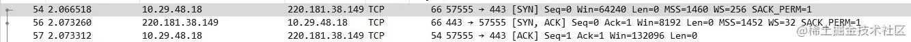

### 0-2.步骤2.客户端发送client_hello
```
客户端发送client_hello，包含以下内容（请自行对照上图） 1. 包含TLS版本信息 2. 随机数（用于后续的密钥协商）random_C 3. 加密套件候选列表 4. 压缩算法候选列表 5. 扩展字段 6. 其他
```
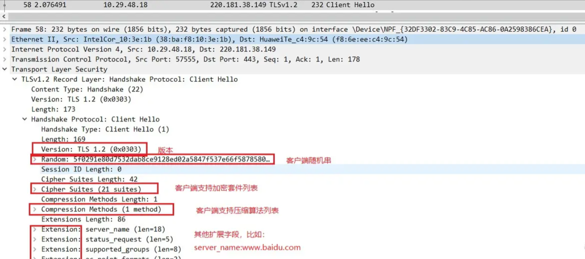

### 0-3.步骤3：服务端发送server_hello
```
服务端收到客户端的client_hello之后，发送server_hello，并返回协商的信息结果
1. 选择使用的TLS协议版本 version
2. 选择的加密套件 cipher suite
3. 选择的压缩算法 compression method
4. 随机数 random_S
5. 其他
```
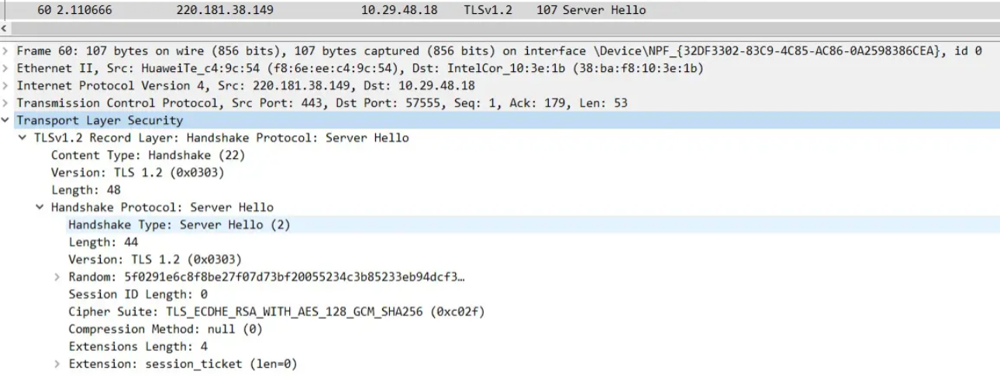

### 0-4.服务端发送证书.
```
服务端发送完server_hello后，紧接着开始发送自己的证书从图可知：因包含证书的报文长度是3761，所以此报文在tcp这块做了分段，分了3个报文把证书发送完了
```
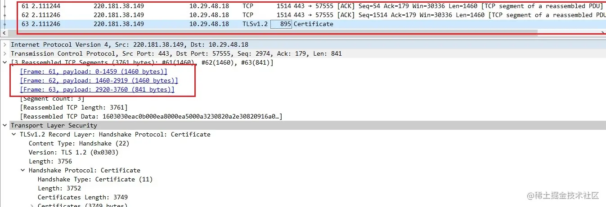
### 0-5.服务端发送Server Key Exchange
```
解释说明:对于使用DHE/ECDHE非对称密钥协商算法的SSL握手，将发送该类型握手。RSA算法不会进行该握手流程（DH、ECDH也不会发送server key exchange）,也就是说此报文不一定要发送，视加密算法而定。SSL中的RSA、DHE、ECDHE、ECDH流程与区别可以参考此篇文章
https://blog.csdn.net/mrpre/article/details/78025940
```
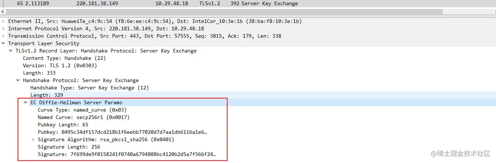
### 0-6.服务端发送Server Hello Done
```
通知客户端 server_hello 信息发送结束
```
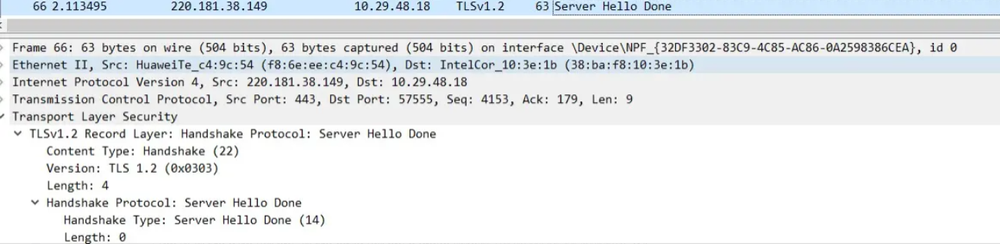
### 0-7.客户端发送
client_key_exchange+change_cipher_spec+encrypted_handshake_message
```
1. client_key_exchange，合法性验证通过之后，向服务器发送自己的公钥参数，这里客户端实际上已经计算出了密钥
2. change_cipher_spec，客户端通知服务器后续的通信都采用协商的通信密钥和加密算法进行加密通信
3. encrypted_handshake_message，主要是用来测试密钥的有效性和一致性
```
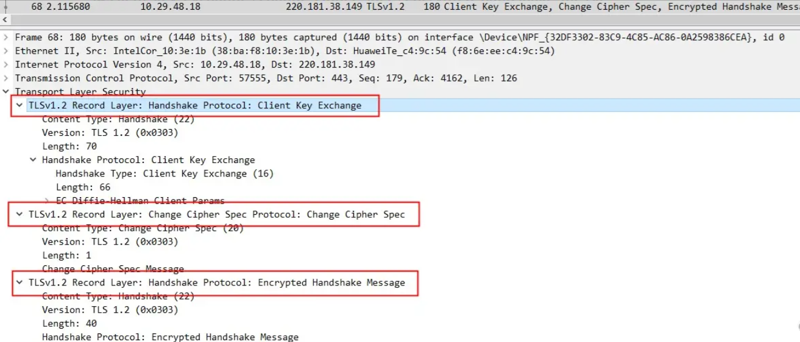
### 0-8.服务端发送New Session Ticket
```
服务器给客户端一个会话，用处就是在一段时间之内（超时时间到来之前），双方都以协商的密钥进行通信。
```
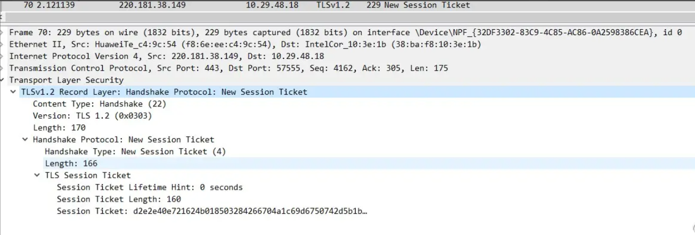
### 0-9.服务端发送change_cipher_spec
```
服务端解密客户端发送的参数，然后按照同样的算法计算出协商密钥，并通过客户端发送的encrypted_handshake_message验证有效性，验证通过，发送该报文，告知客户端，以后可以拿协商的密钥来通信了
```
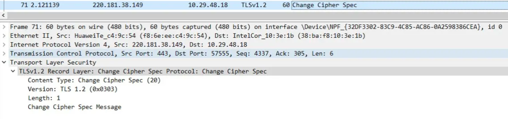
### 0-10.服务端发送encrypted_handshake_message
```
目的同样是测试密钥的有效性，客户端发送该报文是为了验证服务端能正常解密，客户端能正常加密，相反：服务端发送该报文是为了验证客户端能正常解密，服务端能正常加密
```
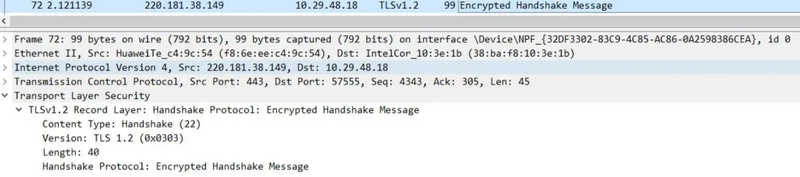
### 0-11.完成密钥协商，开始发送数据
```
数据同样是分段发送的
```
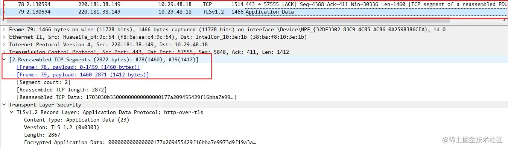

### 0-12.完成数据发送，4次tcp挥手
```
红框的意思是：客户端或服务器发送的，意味着加密通信因为某些原因需要中断，警告对方不要再发送敏感的数据,服务端数据发送完成也会有此数据包，可不关注
```

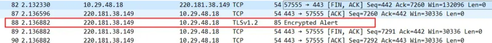

<br />

### 0-13.总结
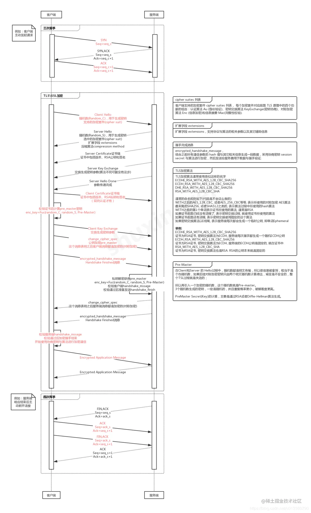
