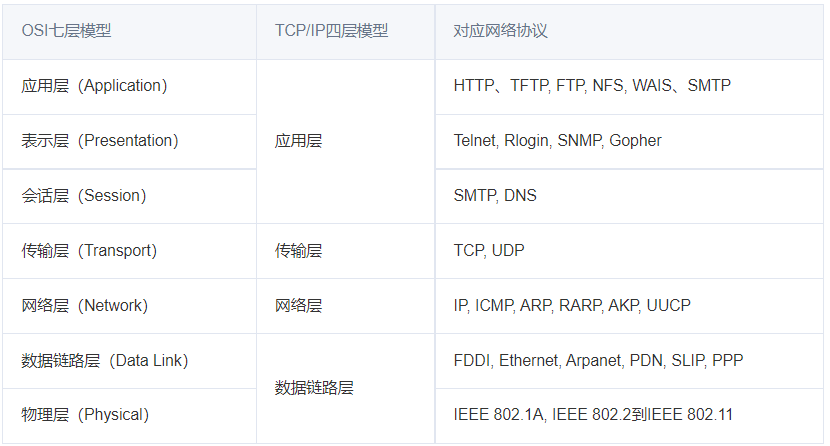
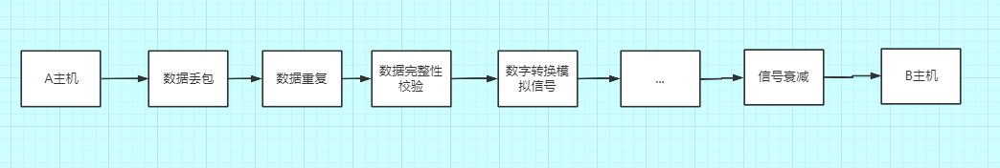
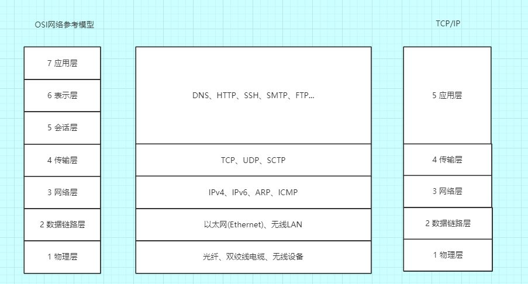
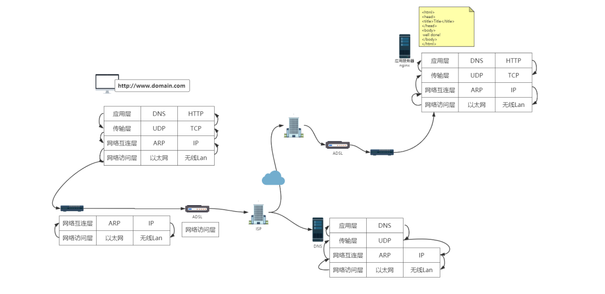

osi和tcpip不一样，一个是理论模型一个是实际应用模型
## osi 7个分层
数据通过一个网络模型来进行数据传输的，这个网络模型叫做：OSI 模型

```
共同点:
  OSI参考模型和TCP/IP参考模型都采用了层次结构的概念
  都能够提供面向连接和无连接两种通信服务机制
不同点:
  1.OSI采用的七层模型，而TCP/IP是四层结构
  2.OSI模型是在协议开发前设计的，具有通用性。TCP/IP是先有协议集然后建立模型，不适用于非TCP/IP网络
  3.TCP/IP参考模型的网络接口层并不是真正的一层；OSI参考模型的缺点是层次过多，划分意义不大但增加了复杂性
  4.OSI参考模型虽然被看好，由于没把握好时机，技术不成熟，实现困难；相反，TCP/IP参考模型虽然有许多不尽人意的地方，但还是比较成功的
```

### 应用层、表示层、会话层 合并为TCP/IP的应用层
1. 应用层
2. 表示层
3. 会话层
```
1.会话层：通过传输层（端口号：传输端口与接受端口）建立数据传送的通路。主要在你的系统之间发起会话或者接收会话请求（设备之间需要互相认识可以是IP也可以使MAC地址或者主机名）
2.表示层：主要是对接收的数据进行解释 加密与解密压缩与解压缩等（也就是把计算机能够识别的东西转换成人能识别的东西，图片声音等）
3.应用层：主要是终端应用，比如说是FTP（各种文件下载），web浏览器，QQ（可以理解成我们在电脑上可以直接看到的东西就是终端应用）
```

4. 传输层
```
udp和tcp都是传输层的协议，作用就是在数据包里加入端口号，进行点对点通信。
```
5. 网络层
```
主要从下层接受到的数据进行IP地址（192.168.0.1）的封装与解封装。在这一层工作的设备是路由器。把这一次的数据叫做数据包
```

### 数据链路层、物理层合并为 TCP/IP数据链路层
6. 数据链路层
```
主要将物理层接受的数据进行MAC地址（网卡地址）的封装与解除封装。常把这一层的数据叫做帧。在这一层工作的设备叫做交换机，数据通过交换机来传输。
物理层把各个电脑连接起来了，互相之间发送0 1电路信号，那是不是得知道这些0 1信号代表啥意思？数据链路层就是翻译这个的。
```
7. 物理层
```

物理层:电脑之间联网。比如插根网线、连接wifi、光缆等等方式。我们就理解成物理层负责怎么把电脑连接起来，形成一个网络，就完事了。它传输的是计算机最底层的0 1信号，学过计算机或者电子的应该都清楚0 1信号。
```


## http基于 TCP/IP协议
TCP/IP是一组协议的代名词，它还包括许多协议，组成了TCP/IP协议簇。TCP/IP协议簇分为四层
- TCP位于协议簇的第二层：传输层(对应OSI的第四层:传输层)。
```
在传输层有两个性质不同的协议：TCP（Transmission Control Protocol，传输控制协议）和 UDP（User Data Protocol，用户数据报 协议）。
```
- IP位于协议簇的第三层：网络层(对应OSI的第三层:网络层)


TCP/IP是一组用于实现网络互连的通信协议。
数据包： 每个分层中，都会对所发送的数据附加一个首部，在这个首部中包含了该层必要的信息，如发送的目标地址以及协议相关信息

重要的TCP/IP协议族协议:
- IP(Internet Protocol)：网际协议；用于在源地址和和目的地址之间传输数据包。
- ICMP(Internet Control Message Protocol)：网络控制消息协议；用于在IP网络中发送控制消息，供通信过程中的各种问题反馈。
- TCP(Transmission Control Protocol)：传输控制协议；是一种面向连接的,可靠的，基于字节流传输的通信协议。
- UDP(User Datagram Protocol)：用户数据报协议；是一个面向数据报的传输层协议，传输不可靠，比如流媒体、DNS等。
- ECHO(Echo Protocol)：回声协议；一个简单的调试和检测工具。
- DHCP(Dynamic Host Configration Protocol)：动态主机配置协议；用于局域网自动分配IP地址和主机配置的协议。
- DNS（Domain Name System）：域名解析协议；用于域名转换成IP地址。
- HTTP(Hypertext Transfer Protocol)：超文本传输协议；现在广为流行的WEB网络的基础。
- HTTPS(Secure Hypertext Transfer Protocol)：安全超文本传输协议。
- FTP(File Transfer Protocol)：文件传输协议；用来进行文件传输的标准协议。
- TFTP(Trivial File Transfer Protocol)：小文件传输协议；简化的FTP，一般用来通过网络引导计算机过程中传输引导文件等小文件。
- SNMP(Simple Network Management Protocol)：网络管理协议；是用于在IP网络管理网络节点的一种标准协议。
- DHCP(Dynamic Host Configuration Protocol)：动态主机配置协议；它是在TCP/IP网络上使客户机获得配置信息的协议。
- POP(Post Office Protocol)：邮局协议；用来通过客户端访问电子邮件的服务，现在的版本是POP3，加密版POP3S。
- SSH(Secure Shell)：安全远程连接；用来远程登录会话和其他网络服务提供安全性的协议，有效防止远程管理过程中的信息泄露问题。
- SMTP(Simple Mail Transfer Protocol)：简单邮件传输协议；互联网上发送电子邮件的事实标准。
- ARP(Address Resolution Protocol)：地址解析协议；基本功能为透过目标设备的IP地址，查询目标设备的MAC地址。
- PPP(Point to Point Protocol)：点对点协议；用来通过拨号或专线方式建立点对点连接发送数据。
- SLIP(Serial Line Internet Protocol)：串行线路网际协议；用以使用户通过电话线和调制解调器接入Internet

### TCP/IP 协议分4层：
- 1.应用层
```
在TCP/IP模型最上层的是应用层（Application layer），它包含所有高层的协议：文件传输协议FTP、电子邮件传输协议SMTP、域名系统服务DNS、网络新闻传输协议NNTP和HTTP协议等

  应用层决定了向用户提供应用服务时通信的活动。
  应用层负责处理特定的应用程序细节。 
　TCP/IP 协议族内预存了各类通用的应用服务。比如，FTP（File Transfer Protocol，文件传输协议）和 DNS（Domain Name System，域 名系统）服务就是其中两类。 HTTP 协议也处于该层

DNS服务是和http协议在应用层的协议，dns提供域名到ip地址之间的解析服务
用户通常通过使用主机名或域名来访问对方的计算机，而不是直接通过IP地址访问。所有需要dns协议提供通过域名查找ip地址，或逆向从ip地址查找域名服务。
```

<br/>

- 2.传输层
```
传输层对上层应用层，提供处于网络连接中的两台计算机之间的数据 传输。
在传输层有两个性质不同的协议：TCP（Transmission Control Protocol，传输控制协议）和 UDP（User Data Protocol，用户数据报 协议）。

    主要为两台主机上的应用程序提供端到端的通信。在TCP/IP协议族中，有两个互不相同的传输协议：TCP（传输控制协议）和UDP（用户数据报协议）。
 　 TCP为两台主机提供高可靠性的数据通信。它所做的工作包括把应用程序交给它的数据分成合适的小块交给下面的网络层，确认接收到的分组，设置发送最后确认分组的超时时钟等。由于运输层提供了高可靠性的端到端的通信，因此应用层可以忽略所有这些细节。为了提供可靠的服务，TCP采用了超时重传、发送和接收端到端的确认分组等机制。

　　UDP则为应用层提供一种非常简单的服务。它只是把称作数据报的分组从一台主机发送到另一台主机，但并不保证该数据报能到达另一端。一个数据报是指从发送方传输到接收方的一个信息单元（例如，发送方指定的一定字节数的信息）。UDP协议任何必需的可靠性必须由应用层来提供。
```

- 3.网络层
```
网络层用来处理在网络上流动的数据包。数据包是网络传输的最小数 据单位。该层规定了通过怎样的路径（所谓的传输路线）到达对方计 算机，并把数据包传送给对方。

与对方计算机之间通过多台计算机或网络设备进行传输时，网络层所 起的作用就是在众多的选项内选择一条传输路线。

也称作互联网层（在第一个图中为网际层），处理分组在网络中的活动，例如分组的选路。在TCP/IP协议族中，网络层协议包括IP协议（网际协议），ICMP协议（Internet互联网控制报文协议），以及IGMP协议（Internet组管理协议）

IP是一种网络层协议，提供的是一种不可靠的服务，它只是尽可能快地把分组从源结点送到目的结点，但是并不提供任何可靠性保证。同时被TCP和UDP使用。TCP和UDP的每组数据都通过端系统和每个中间路由器中的IP层在互联网中进行传输。

ICMP是IP协议的附属协议。IP层用它来与其他主机或路由器交换错误报文和其他重要信息。

IGMP是Internet组管理协议。它用来把一个UDP数据报多播到多个主机。
```

- 4.数据链路层
```
用来处理连接网络的硬件部分。包括控制操作系统、硬件的设备驱 动、NIC（Network Interface Card，网络适配器，即网卡），及光纤等 物理可见部分（还包括连接器等一切传输媒介）。硬件上的范畴均在 链路层的作用范围之内
```
```
也称作数据链路层或网络接口层（在第一个图中为网络接口层和硬件层），通常包括操作系统中的设备驱动程序和计算机中对应的网络接口卡。它们一起处理与电缆（或其他任何传输媒介）的物理接口细节。ARP（地址解析协议）和RARP（逆地址解析协议）是某些网络接口（如以太网和令牌环网）使用的特殊协议，用来转换IP层和网络接口层使用的地址。
```

<br />

### 1-2.http
HTTP协议由两部分程序实现：一个客户机程序和一个服务器程序，它们运行在不同的端系统中，通过交换HTTP报文进行会话。 HTTP定义了这些报文的格式，以及客户机和服务器是如何进行报文交换的
保证计算机正确快速地传输超文本文档，还确定传输文档中的哪一部分

<br />

### 1-3.HTTP与FTP的异同点
- 同:
  - 是应用层协议；运行在TCP上，即都使用TCP（而不是UDP）作为其支撑的运输层协议。 
- 异：
  - HTTP是超文本传输协议，是面向网页的；FTP是文件传输协议，是面向文件的。 
  - HTTP协议默认端口：80号端口。FTP协议默认端口：21号端口
  - FTP的控制信息是带外（out-of-band）传送的，而HTTP的控制信息是带内（in-band）传送的
  - FTP服务器必须在整个会话期间保留用户的状态（state）信息，而HTTP是无状态的。
  - FTP的控制连接是持久连接，数据连接是非持久连接；而HTTP既可以使用非持久连接，也可以使用持久连接，默认方式下，HTTP使用持久连接。 

<br />

### 1-4.http 持久链接
```
如果每个请求响应对，都是经一个单独的TCP连接发送，该应用程序被称为使用非持久连接；如果所有的请求及相应的响应都经相同的TCP连接发送，则该应用程序被称为 使用持久连接。 

  HTTP既可以使用非持久连接，也可以使用持久连接，默认方式下，HTTP使用持久连接。
  HTTP1.1，服务端和客户端都默认开启持久化连接，即使你在头部没看到connection:keep-alive，如果你有看到，那是为了兼容HTTP1.0

  tcp连接何时关闭？

如果连接是keep-alive的，那么tcp连接不会主动断开，除非客户端或服务端至少有一端声明了connection:close。
其实服务端可以为keep-alive设定tcp最长保持时间，返回头部类似这样：
Connection: Keep-Alive
Keep-Alive: max=5, timeout=120

如果没有设置，则使用默认值，nginx为75s
```

<br />

# HTTP 协议_TCP/UDP 协议_IP 协议
```
HTTP 协议:超文本传输协议，对应于应用层，用于如何封装数据.

TCP/UDP 协议:传输控制协议，对应于传输层，主要解决数据在网络中的传输。

IP 协议:对应于网络层，同样解决数据在网络中的传输。

传输数据的时候只使用 TCP/IP 协议(传输层)，如果没有应用层来识别数据内容，传输后的协议都是无用的。
```

**应用层协议很多 FTP,HTTP,TELNET等，可以自己定义应用层协议。**<br>
```
通常称与人类直接打交道的协议，叫应用层（Application）协议，或者业务层协议。三个协议：
1.浏览网页
  web 使用 HTTP 作传输层协议，以封装 HTTP 文本信息，然后使用 TCP/IP 做传输层协议，将数据发送到网络上。
2.下载文件
浏览器是借助FTP协议与文件下载服务器传输数据
3.发送邮件
电子邮件客户端是借助SMTP协议与邮件服务器沟通交流

通俗地说，应用层协议，如同人类的小秘书兼翻译，用服务器可以听得懂的语言与服务器沟通。
HTTP、FTP、SMTP三个小翻译，能把老王的需求翻译成由“0”、“1”组成的小串串，简称应用数据块。
```

## 3.TCP/IP协议就是为了解决哪些问题:TCP/IP 通信传输流
利用 TCP/IP 协议族进行网络通信时，会通过分层顺序与对方进行通 信。发送端从应用层往下走，接收端则往应用层往上走。
实例：
```
我们用 HTTP 举例来说明，服务端：
1.首先作为发送端的客户端在应用层 （HTTP 协议）发出一个想看某个 Web 页面的 HTTP 请求。
2.接着，为了传输方便，在传输层（TCP 协议）把从应用层处收到的数 据（HTTP 请求报文）进行分割，
3.并在各个报文上打上标记序号及端口号后转发给网络层
4.在网络层（IP 协议），增加作为通信目的地的 MAC 地址后转发给链 路层。这样一来，发往网络的通信请求就准备齐全了。

服务端：
接收端的服务器在链路层接收到数据，按序往上层发送，一直到应用 层。当传输到应用层，才能算真正接收到由客户端发送过来的 HTTP 请求。
```
解析：
发送端在层与层之间传输数据时，每经过一层时必定会被打上一个该 层所属的首部信息。反之，接收端在层与层传输数据时，每经过一层 时会把对应的首部消去。
这种把数据信息包装起来的做法称为封装（encapsulate）

### 3-1.负责传输的 IP 协议: 网络层
```
按层次分，IP（Internet Protocol）网际协议位于网络层。Internet Protocol 这个名称可能听起来有点夸张，但事实正是如此，因为几乎 所有使用网络的系统都会用到 IP 协议。TCP/IP 协议族中的 IP 指的就 是网际协议，协议名称中占据了一半位置，其重要性可见一斑。可能 有人会把“IP”和“IP 地址”搞混，“IP”其实是一种协议的名称。
```
IP 协议的作用是把各种数据包传送给对方。而要保证确实传送到对方 那里，则需要满足各类条件。其中两个重要的条件是 IP 地址和 MAC 地址。
IP 地址指明了节点被分配到的地址，MAC 地址是指网卡所属的固定 地址。IP 地址可以和 MAC 地址进行配对。IP 地址可变换，但 MAC 地址基本上不会更改。
##使用 ARP 协议凭借 MAC 地址进行通信。
```
IP 间的通信依赖 MAC 地址。在网络上，通信的双方在同一局域网 （LAN）内的情况是很少的，通常是经过多台计算机和网络设备中转 才能连接到对方。而在进行中转时，会利用下一站中转设备的 MAC 地址来搜索下一个中转目标。这时，会采用 ARP 协议（Address Resolution Protocol）。ARP 是一种用以解析地址的协议，根据通信方 的 IP 地址就可以反查出对应的 MAC 地址。
```

### 3-2.TCP:TCP位于传输层，提供可靠的字节流服务
在Internet中所有的传输都是通过TCP/IP进行的。HTTP协议作为TCP/IP模型中应用层的协议也不例外。
HTTP协议通常承载于TCP协议之上，有时也承载于TLS或SSL协议层之上，这个时候，就成了我们常说的HTTPS。如下图所示：
```
在TCP/IP的模型图中 , HTTP协议位于最上层的应用层 , 它是互联网上应用最为广泛的一种网络协议 , 所有 www 文件都必须遵守这个协议 .

 HTTP 是一个由请求和响应组成的 , 标准的客户端/服务端模型(B/S结构) . HTTP 协议永远是由客户端发起请求 , 服务端给与响应 ,
```

```
1.应用数据块如何在浩瀚的互联网准确无误找到目的地？
  IP协议:在应用数据块的外层写上目的地IP地址，使得应用数据块可以找到目的地，这样就解决问题1。
2.服务器回应数据块如何在浩瀚的互联网准确无误地返回？
  IP协议还会在应用数据块的外层写上源IP地址，使得服务器回应数据块返回源主机，这样就解决问题2。
3.应用数据块在到达目的地之前丢失了，如何处理？
4.服务器回应数据块旅途中丢失了，如何处理？
```

IP协议解决1和2问题点基于
* 底层物理网络的连通性是IP能否正常工作的前提
* IP路由表在全球路由器里完成了同步

**即使有了这两个前提条件，也不能100%保证IP报文能够到达目的地！**<br/>
```
信号传输过程失真造成丢包、网络发生拥堵而丢包

我们还需要一个协议，这个协议需要有以下特质：
1.当丢包发生时，能够自动修复丢包，而无需人的手动干预
2.能够智能感知网络的拥堵情况，网络空闲时，尽最大速率发包；网络拥堵时，降低速率发包，不给互联网添堵
```
## 满足这个特质的协议，它的名字叫TCP协议。
TCP协议也不是什么大神，不过是一个任劳任怨的流量调度员。说到底它就有一个本事：
**确认机制！**
凭着这个看家本领，TCP可以保证应用数据的可靠传输。
TCP会对发出的数据包（以下简称包裹）进行编号，如同快递的快递单号一样。对方TCP收到包裹，会回复一个确认消息，确认收到了该编号的包裹了
```
有同学会说，确认机制可以理解，TCP发数据就发数据，但为何TCP发数据之前需要连接？

在互联网上可以找到各种各样的解释，而我的观点是：

双方通过TCP连接，分享彼此的应用数据块第一个字节的原点序号。

如果TCP没有提前分享，接收方不知道接收的数据是否是第一个包。

如果不是第一个包，接收方的TCP却将该数据包提交给应用程序，应用程序压根无法理解。


应用程序以为是第一个包，其实并不是，应用程序的小翻译（HTTP/FTP/SMTP）瞬间懵逼，风雨中瑟瑟发抖。。。

为何无法理解?
分享了原点序列号，即使第二个、第三个数据包先到达目的地，而第一个数据包姗姗来迟的情况，接收方的TCP可以耐心等待第一个数据包的到来，然后按序将数据包提交给应用程序。这样应用程序的小翻译就会秒懂。。。


有了TCP协议的帮助，即使老王的网线拔掉了一段时间，稍后再插入，恢复了网络连通性，老王中断的文件下载任务可以继续工作，而无需老王重新下载。
```

TCP位于传输层，提供可靠的字节流服务。
所谓的字节流服务：为方便传输，将大块数据分割成以报文段 为单位的数据包进行管理。
可靠的传输服务：能够把数据准确可靠传给对方。
总结：
tcp协议为方便传输，将大块数据分割成以报文段 为单位的数据包进行管理,而且tcp协议能够确认数据最终能否送到对方
### 确保数据达到目标：tcp采用三次握手策略
tcp发送后向对方确认是否成功送达：
```
SYN
ACK
```

## UDP协议 和 DNS协议
UDP有点像街头的邮筒，应用程序的数据包扔进邮筒就好了，就耐心地等待数据包到达目的地。但扔进邮筒之前，需要写好以下信息：
```
1.收件人的地址（目的IP）
2.收件人的姓名（目的端口号）
3.寄件人地址（源IP）
4.寄件人姓名（源端口号）

IP司机会瞬间地将邮筒里的信件，运往世界各个角落。

比较奢侈的是，一个IP司机运一件信件。
```
我们使用浏览器、邮件客户端却一直和UDP协议直接打交道。要下载文件，首先要域名解析获得服务器的IP地址，而完成域名解析任务的是DNS协议。

**DNS协议**<br/>
DNS协议将自己的域名解析请求报文扔到UDP邮筒里，被IP司机运输到域名服务器家中，服务器返回域名解析应答，同样通过UDP邮筒邮寄服务。


## 05_五章_与http协作的web服务器
### 通信数据转发程序：代理，网关，隧道
```
http通信时候，除客户端和服务器以外，还有一些用于通信数据转发的应用程序，例如代理，网关，隧道。
```
代理:中间人
网关：可以由http转化为其他通信
隧道：确保安全通信，不会解析http请求，隧道在双方断开连接中断


## 确认访问用户身份的认证
session 管理及cookie应用：使用cookie来管理session,弥补http协议中不存在的状态管理功能
```
1.客户端：发送密码登录

2.服务端向用户发送sesstion

然后通过验证session Id 判定对方身份
```

<br/>

## 1.现在有一个需求：一个数据包从 A 主机传送到 B 主机
在发送过程中都会发生什么?

```
数据传输过程中会发生数据丢包，当数据丢包后，往往会进行数据重传，数据重传多次的话，还有可能会发生数据重复，或者之前数据丢失的包并没有真正丢失，只是在网络中产生了一个延迟，这样也会发生数据的重复问题。

通过网络设备进行数据转发的时候，数据在经过设备的时候都有可能被人串改，或者本身设备有一些问题导致数据的一些错误，所以要进行数据完整性的校验，包括数据传输介质也可能是多样的，比如内网直接通过网线去传输，公网的话通常就要通过光纤去传输，所以要实现不同介质之间信号的转换，数字转换模拟信号，距离比较远的话，还会存在一个信号衰减的问题。
```
## 2.为了简化网络的复杂度，网络通信的不同方面被分解为多层次结构，每一层只与紧挨着的上层或者下层进行交互，将网络分层，这样就可以修改甚至替换某一层的软件，只要层与层之间的接口保持不变，就不会影响到其他层。
* OSI(Open System Interconnection Reference Model)：开放系统互联参考模型
* TCP/IP 协议族

左边是 OSI 网络参考模型分为了 7 层，右边是 TCP/IP 协议族分为了 5 层，TCP/TP 协议族把表示层与会话层合并到了应用层里，中间就是不同层次之间的协议。


## 一个 HTTP 请求的分层解析流程

**通过一个 HTTP 请求看一下不同层次之间是如何工作的：**<br>
```
我们的服务器上部署了一个静态页面(图片又上角黄色的部分)，通过 Nginx 部署在我们的公网上面，现在我们通过浏览器来进行访问，在浏览器中输入域名，点下回车之后它们是如何工作的呢？
```
第一步，获取域名：
```
浏览器先会去解析域名，因为在客户端 C 与服务端 S 进行数据交互的时候，它是不认域名的，认的是 ip 地址，所以浏览器先会解析域名，然后去看下浏览器中有没有域名对应的 DNS 的相关信息的缓存，有的话我们就能从中拿到服务端 S 的 ip 地址，没有的话，会去本地的 host 文件里看有没有配置，没有配置的话，会发起一个 DNS 的请求，获取服务器的 ip 地址(DNS 也是一台服务器，也有自己的 ip 地址，通常是配置在操作系统上的)。
```
## 获取服务器 IP 地址过程：
```
  应用层------>传输层
这时应用层会构造一个 DNS 请求报文，然后应用层会调用传输层的一个接口，因为 DNS 使用 UDP 来进行数据的传输，所以应用层会调用传输层的 UDP 相关的一个协议，实现数据的传输。

说白了就是应用层会调用传输层的 API,传输层会在 DNS 请求报文的基础上加一个 UDP 的请求头。

  传输层---->网络层---->数据链路层
然后传输层会把数据交给网络层，网络层同样的会在 UDP 的请求报文的基础上再加一个 IP 的请求头，网络层再把 IP 请求报文交给数据链路层，

  数据链路层----->然后通过物理层传出去，通常传到路由器上面
数据链路层会实现一个二层的寻址，这时它会把自己的 make 头加上去，并且会把对应的请求报文应该要去交给下一个机器的 make 地址也加上去(会通过网络层的 ARP 协议去找到，ARP 会发送 ARP 的请求去看下 IP 地址对应的 make 地址是多少，拿到之后会交给数据链路层)，然后通过物理层传出去，通常传到路由器上面。
```
<font color='red'>路由器返回域名对应的IP地址(拿到后层层往上传到应用层)</font>
```
路由器是一个三层的设备，最开始会通过物理层来进行连接，之后物理层把数据交给数据链路层，链路层会看下 make 地址是不是给我的，是给我的就解析，不是就丢弃，解析完后，数据报文在往上面去传输到网络层，网络层会去看下这个数据应该传到下一个路由器的地址是多少，这个时候它会通过运营商的网络接口传到运营商的路由器上面，

运营商这边就比较复杂，运营商会有自己的 DNS 服务器，如果电脑配置的是运营商的 DNS 的话，会直接去运营商的 DNS 服务器上去找对应的域名，
这个时候就会拿到对应的 ip 地址，然后开始一个层层的原路返回，直到应用层拿到了返回的报文，也就是拿到了域名对应的 IP 地址。
```

## 这时应用层就会进行 HTTP 请求报文的发送，这时 HTTP 会干什么呢？

```
  应用层------>传输层
同样的它会去调用传输层的协议,因为 HTTP 是基于 TCP 协议来实现的，所以在调用传输协议的时候，传的是 TCP 的一些参数，

  传输层---->网络层---->数据链路层--->然后通过物理层传出去，通常传到路由器进行传输
TCP 会调网络层的 IP 协议，IP 协议会加 IP 头，然后数据链路层会加上 make 头，和刚才 UDP 协议是一样的，会通过物理层和路由器进行数据的传输，

这一次携带的是 IP 地址，所以不用访问运营商的 DNS 服务器，而是运营商根据 IP 地址把数据报文传输给目标服务器的运营商，运营商之前有专线进行连接，所以数据到达了服务器的网络环境下，仍然逐层解析，物理层发往数据链路层，链路层判断数据是不是给自己的，是的话就进行解析，链路层发往网络层，判断网络的 IP 地址是不是自己，是的话进行解析，发往传输层，解析 TCP 的端口比如 80，传输层会把请求报文交给应用层应用程序，如果部署的是 Nginx 服务器的话，默认去找 80 端口对应的应用程序，应用层解析报文，构造一个 HTTP 的响应报文，逐层返回到客户端 C。
```