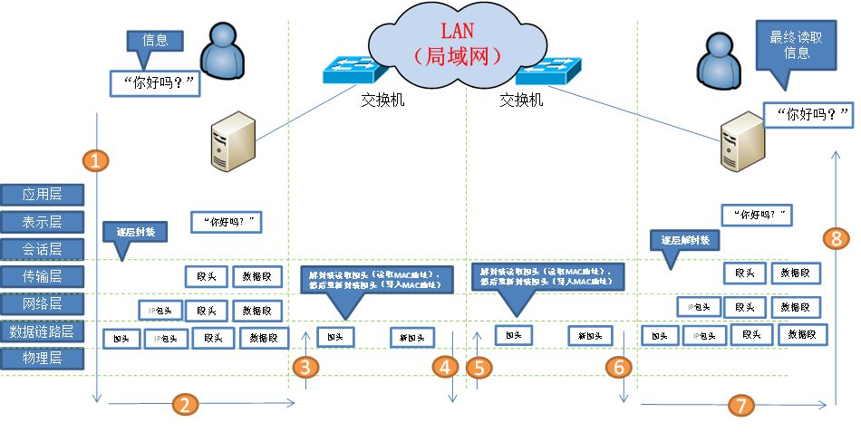
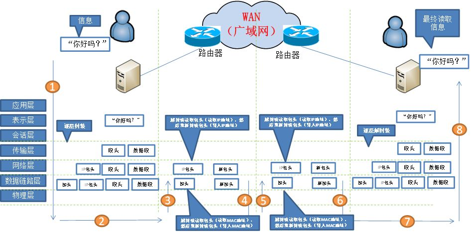

2个主机之间的通信，对于2台主机来说，肯定是都需要跨越7层的，而平常说的只需要去到2层或者3层，其实是对于中间系统而言的，就是说中间的交换机、路由器而言；

## 局域网例子
```
例如图1的假设两端的通信实体在一个局域网内，其实传输的数据包去到交换机时，交换机拆开二层帧头，再查自身的MAC地址表， 发现表里面有对应的MAC地址，然后对应的对口是哪个，接着就把帧发送到该端口转发出去，它的任务就完成了。根本不需要到达网络层的意思是，根本都不需要拆卡3层的IP包头来读取里面的信息。

通过转发，最好到达B主机，然后从1层拆到7层，B用户的主机最终就读取到信息了。
```


## 广域网例子
```
由于A、B两通信实体跨域广域网，所以光靠MAC地址表，肯定是查不到的，这时候路由器会把IP包头也拆开，读取目的IP地址，再查路由表，就知道往哪个端口发出去了。然后层层转发，就可以达到目的地了，接下来就和图1的一样了。
```


