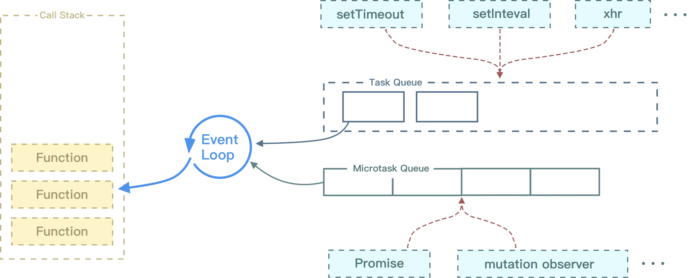

## 概念

### 1-1.概念2：宿主
JS运行的环境:浏览器/Node。

### 1-2.概念3：执行栈
是一个存储函数调用的栈结构，遵循先进后出的原则。
```javaScript
function foo() {
  throw new Error('error')
  console.log("test")
}
function bar() {
  foo()
}
bar()

以上代码会报错：
VM100:2 Uncaught Error: error
    at foo (<anonymous>:2:9)
    at bar (<anonymous>:5:3)
    at <anonymous>:7:1

当开始执行 JS 代码时，首先会执行一个 main 函数，然后执行我们的代码。根据先进后出的原则，后执行的函数会先弹出栈，在图中我们也可以发现，foo 函数后执行，当执行完毕后就从栈中弹出了。
```


## JS到底是怎么运行的呢？

> JS引擎常驻于内存中，等待宿主将JS代码或函数传递给它。
> 也就是等待宿主环境分配宏观任务，反复等待 - 执行即为事件循环。

### 1-1.JS是单线程如何执行异步任务
Node环境中，只有JS 线程。在浏览器环境中，有JS 引擎线程和渲染线程，且两个线程互斥。

JS是单线程的，那么单线程的JS是怎么完成非阻塞的完成异任务的呢？

js是单线程语言，浏览器只分配给js一个主线程，用来执行任务（函数），但一次只能执行一个任务，这些任务形成一个任务队列排队等候执行，但前端的某些任务是非常耗时的，比如网络请求，定时器和事件监听，如果让他们和别的任务一样，都老老实实的排队等待执行的话，执行效率会非常的低，甚至导致页面的假死。

所以，浏览器为这些耗时任务开辟了另外的线程，主要包括http请求线程，浏览器定时触发器，浏览器事件触发线程，这些任务是异步的。


那么问题来了，这些异步任务完成后，主线程怎么知道呢？
浏览器提供一些异步的WebAPI例如DOM操作，setTimeout，XHR等，JS通过事件循环机制（event loop）调用这些API的回调。答案就是回调函数，整个程序是事件驱动的，每个事件都会绑定相应的回调函数，举个例子，有段代码设置了一个定时器:

```js
setTimeout(function(){
    console.log(time is out);
}，1000）;
```

执行这段代码的时候，浏览器异步执行计时操作，当1000ms到了后，会触发定时事件，这个时候，就会把回调函数放到任务队列里。整个程序就是通过这样的一个个事件驱动起来的。
所以说，js是一直是单线程的，浏览器才是实现异步的那个家伙。

* 同步和异步任务分别进入不同的执行"场所"，同步的进入主线程，异步的进入Event Table并注册函数。

* 当指定的事情完成时，Event Table会将这个函数移入Event Queue。

* 主线程内的任务执行完毕为空，会去Event Queue读取对应的函数，进入主线程执行。

* 上述过程会不断重复，也就是常说的Event Loop(事件循环)。


## 浏览器event loop,宏任务是由宿主(Node、浏览器)发起的，而微任务由JavaScript自身发起
浏览器为了解决单线程的异步执行问题，引入了事件循环队列，任务又分为微任务和宏任务，微任务的优先级比宏任务高，只要微任务队列里面有任务，宏任务队列永远得不到执行。
```
类型                宏          微

谁先运行	        后运行	    先运行

会触发新一轮Tick吗	会	        不会
```

1. 首先执行同步代码，这属于宏任务

2. 当执行完所有`同步代码`后，执行栈为空，执行过程中如果遇到微任务，就将它添加到微任务的任务队列中;微任务的执行要先于宏任务，立即执行当前微任务队列中的所有微任务（依次执行）
```js
宏任务（发起者:宿主Node、浏览器）:
    1.script 
    2.setTimeout / setInterval 
    3.setImmediate(node.js) 
    4.I/O 和UI rendering 。

这里很多人会有个误区，认为微任务快于宏任务，其实是错误的。因为宏任务中包括了 script ，浏览器会先执行一个宏任务，接下来有异步代码的话才会先执行微任务。

微任务：（发起者: JS引擎）
    1. Promise:new Promise().then 的回调,promise构造函数是同步执行:new Promise中传入的执行器函数是同步函数,在ES5之后，JavaScript引入了Promise，这样，不需要浏览器，JavaScript引擎自身也能够发起异步任务了。
    首先Promise构造函数会立即执行，而Promise.then()内部的代码在当次事件循环的结尾立即执行(微任务)。

    2. MutaionObserver
    3. Object.observe（已废弃；Proxy 对象替代）
    4. process.nextTick（Node.js）
```

3. 当前宏任务执行完毕，开始检查渲染，然后GUI线程接管渲染:如果宿主为浏览器，可能会渲染页面；

4. 然后开始下一轮 Event Loop，开始下一轮tick，执行宏任务中的异步代码（setTimeout等回调）。

解析：
```
初始执行的代码也是宏任务。最外层的上下文也是一个宏任务

是存在多个宏任务的, 然而每一次 loop 的时候只会并且先执行"最前面"的宏任务, 然后执行当前 loop 下所有的微任务, 所有微任务完毕之后, 进入下一次 loop, 执行接下来的宏任务, 重复上述过程。
所以也不能说先宏后微，执行完任务队列头的宏任务后就开始执行微任务队列中的微任务，直到微任务队列为空。
```


### 经典案例
```js
for (var i=1; i<=5; i++) { 
    setTimeout( function timer() {
        console.log(i); //输出6 6 6 6 6 6
    }, i*1000 );
}
因为：根据setTimeout定义的操作在函数调用栈清空之后才会执行的特点，for循环里定义了5个setTimeout操作。而当这些操作开始执行时，for循环的i值，已经先一步变成了6。因此输出结果总为6。
```
### 解决：
而我们知道在函数中闭包判定的准则，即执行时是否在内部定义的函数中访问了上层作用域的变量。因此我们需要包裹一层自执行函数为闭包的形成提供条件。
因此，我们只需要2个操作就可以完成题目需求，一是使用自执行函数提供闭包条件，二是传入i值并保存在闭包中。

//而我们想要让输出结果依次执行，我们就必须借助闭包的特性，每次循环时，将i值保存在一个闭包中，当setTimeout中定义的操作执行时，则访问对应闭包保存的i值即可。
```js
for (var i=1; i<=5; i++) { 
    (function(i) {
        setTimeout( function timer() {
            console.log(i);
        }, i*1000 );
    })(i)
}
```
### 解析
```
这道题涉及了异步、作用域、闭包

 settimeout是异步执行，10ms后往任务队列里面添加一个任务，只有主线上的全部执行完，才会执行任务队列里的任务，当主线执行完成后，i是4，所以此时再去执行任务队列里的任务时，i全部是4了。对于打印4次是：

 每一次for循环的时候，settimeout都执行一次，但是里面的函数没有被执行，而是被放到了任务队列里面，等待执行，for循环了4次，就放了4次，当主线程执行完成后，才进入任务队列里面执行。

（注意：for循环从开始到结束的过程，需要维持几微秒或几毫秒。)

 当我把var 变成let 时

 for(let i=0;i<=3;i++){ setTimeout(function() {  console.log(i)  }, 10);}

 打印出的是：0,1,2,3

 当解决变量作用域，

 因为for循环头部的let不仅将i绑定到for循环快中，事实上它将其重新绑定到循环体的每一次迭代中，确保上一次迭代结束的值重新被赋值。setTimeout里面的function()属于一个新的域，通过 var 定义的变量是无法传入到这个函数执行域中的，通过使用 let 来声明块变量，这时候变量就能作用于这个块，所以 function就能使用 i 这个变量了；这个匿名函数的参数作用域 和 for参数的作用域 不一样，是利用了这一点来完成的。这个匿名函数的作用域有点类似类的属性，是可以被内层方法使用的。
```

<br />

## 拓展：应用场景 - Vue中的vm.$nextTick
vm.$nextTick 接受一个回调函数作为参数，用于将回调延迟到下次DOM更新周期之后执行。
```
这个API就是基于事件循环实现的。
“下次DOM更新周期”的意思就是下次微任务执行时更新DOM，而vm.$nextTick就是将回调函数添加到微任务中（在特殊情况下会降级为宏任务）。

因为微任务优先级太高，Vue 2.4版本之后，提供了强制使用宏任务的方法。
```

>vm.$nextTick优先使用Promise，创建微任务。
>如果不支持Promise或者强制开启宏任务，那么，会按照如下顺序发起宏任务：
>优先检测是否支持原生 setImmediate（这是一个高版本 IE 和 Edge 才支持的特性）
>如果不支持，再去检测是否支持原生的MessageChannel
>如果也不支持的话就会降级为 setTimeout。
